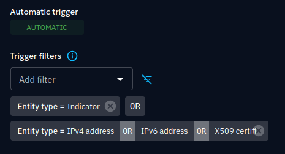

# OpenCTI ONYPHE Internal Enrichment Connector

## What is ONYPHE?

ONYPHE is a cyber threat intelligence and external attack surface monitoring platform that aggregates and enriches internet-wide data from open, commercial, and proprietary sources. It provides real-time and historical visibility into cyber exposure, threat indicators, and infrastructure intelligence via a powerful and flexible API.

ONYPHE enables analysts, red teams, and security operations teams to investigate and monitor a wide range of observables such as IP addresses, hostnames, domains, and certificates. Its core use cases span from threat enrichment to external attack surface management (ASM).

This connector is specifically designed to leverage the Ctiscan category, providing detailed information about open ports, protocols, banners and relationships for an observable — including ASNs, organizations, certificates, DNS domains, technologies, ports, countries and analytical pivots such as Ja4x.

Through these data sources, ONYPHE enables deep context and pivoting across observables to reveal infrastructure, ownership, exposure, and threat correlations — making it an ideal enrichment backend for threat intelligence platforms like OpenCTI.

## What is the scope for the ONYPHE Connector ?

    Scope : 
      - Observables
        - IPv4
        - IPv6
        - x509-certificate
        - hostname
        - text
      - Indicator (pattern_type: onyphe)

## What does ONYPHE Connector do ?

This connector allows observables or indicators with a supported ‘onyphe’ pattern_type to be enriched. 'onyphe' type indicators allow for running Ctiscan OQL queries from within the OpenCTI platform.

For an observable, it can be enriched with :

- IP address + relationship
- Organisation + relationship
- DomainName + relationship
- HostName + relationship
- AutonomousSystem+ relationship
- X509Certificate + relationship
- Text analytical pivots + relationship
- Updating the observable enriched with a description, labels, external reference

For indicators, a note or description is created with a summary of key data points for the indicator value.

By default, the import_search_results environment variable is set to true, which means that for each enriched indicator, the connector will create stix cyber observables associated with that entity.

## Installation

### Requirements

- OpenCTI Platform >= 6.6.2

### Configuration variables

Below are the parameters you'll need to set for OpenCTI:

| Parameter `OpenCTI` | config.yml  | Docker environment variable | Mandatory | Description                                          |
|---------------------|-------------|-----------------------------|-----------|------------------------------------------------------|
| URL                 | `url`       | `OPENCTI_URL`               | Yes       | The URL of the OpenCTI platform.                     |
| Token               | `token`     | `OPENCTI_TOKEN`             | Yes       | The default admin token set in the OpenCTI platform. |

Below are the parameters you'll need to set for running the connector properly:

| Parameter `Connector` | config.yml  | Docker environment variable  | Default | Mandatory  | Description                                                                             |
|-----------------------|-------------|------------------------------|---------|------------|-----------------------------------------------------------------------------------------|
| ID                    | `id`        | `CONNECTOR_ID`               | /       | Yes        | A unique `UUIDv4` identifier for this connector instance.                               |
| Name                  | `name`      | `CONNECTOR_NAME`             | ``      | Yes        | Full name of the connector : `ONYPHE`.                                                  |
| Scope                 | `scope`     | `CONNECTOR_SCOPE`            | /       | Yes        | Can be any of `ipv4-addr,ipv6-addr,indicator,hostname,x509-certificate,text`.           |
| Auto                  | `auto`      | `CONNECTOR_AUTO`             | False   | Yes        | Must be `true` or `false` to enable or disable auto-enrichment of observables. See warning.         |
| Log Level             | `log_level` | `CONNECTOR_LOG_LEVEL`        | /       | Yes        | Determines the verbosity of the logs. Options are `debug`, `info`, `warn`, or `error`.  |

Below are the parameters you'll need to set for ONYPHE Connector:

| Parameter `onyphe`    | config.yml              | Docker environment variable    | Default     | Mandatory | Description                                                                                     |
|-----------------------|-------------------------|--------------------------------|-------------|-----------|-------------------------------------------------------------------------------------------------|
| api_key                 | `api_key`                 | `ONYPHE_API_KEY`                 | /           | Yes       | Your ONYPHE API Key ( available on profile page https://search.onyphe.io/profile)         |
| base_url                 | `base_url`                 | `ONYPHE_BASE_URL`                 | `https://www.onyphe.io/api/v2/`           | No       | The target ONYPHE API endpoint         |
| max_tlp               | `max_tlp`               | `ONYPHE_MAX_TLP`               | `TLP:AMBER` | No        | The maximal TLP of the observable being enriched.                                               |
| time_since               | `time_since`               | `ONYPHE_TIME_SINCE`               | `1w` | No        | The default time range used for ONYPHE queries. Increase to match your license level                  |
| default_score         | `default_score`         | `ONYPHE_DEFAULT_SCORE`         | 50        | No        | Default_score allows you to add a default score for an indicator and its observable             |
| import_search_results | `import_search_results` | `ONYPHE_IMPORT_SEARCH_RESULTS` | True      | No        | Returns the observable results of the search against the enriched indicator. |
| create_note | `create_note` | `ONYPHE_CREATE_NOTE` | False | No        | Adds ONYPHE results to a note, otherwise it is saved in the description. |
| import_full_data | `import_full_data` | `ONYPHE_IMPORT_FULL_DATA` | False | No        | Full app.data.text field is imported from ONYPHE results for each enriched observable. (default 2KB) |
| pivot_threshold         | `pivot_threshold`         | `ONYPHE_PIVOT_THRESHOLD`         | 10        | No        | Enrichment only occurs if the number of results matching a single observable is less than or equal to this threshold |
| pattern_type         | `pattern_type`         | `ONYPHE_PATTERN_TYPE`         | `onyphe`        | No        | OpenCTI vocabulary pattern_type used for ONYPHE OQL indicators |

## Deployment

### Docker Deployment

Before building the Docker container, you need to set the version of pycti in `requirements.txt` equal to whatever
version of OpenCTI you're running. Example, `pycti==6.6.2`. If you don't, it will take the latest version, but
sometimes the OpenCTI SDK fails to initialize.

Build a Docker Image using the provided `Dockerfile`.

Example:

```shell
# Replace the IMAGE NAME with the appropriate value
docker build . -t [IMAGE NAME]:latest
```

Make sure to replace the environment variables in `docker-compose.yml` with the appropriate configurations for your
environment. Then, start the docker container with the provided docker-compose.yml

```shell
docker compose up -d
# -d for detached
```

### Manual Deployment

Create a file `config.yml` based on the provided `config.yml.sample`.

Replace the configuration variables (especially the "**ChangeMe**" variables) with the appropriate configurations for
you environment.

Install the required python dependencies (preferably in a virtual environment):

```shell
pip3 install -r requirements.txt
```

Then, start the connector from onyphe/src:

```shell
python3 main.py
```

### TODO

- Handle enrichment of domain observables
- Allow for custom time functions within Indicator patterns
- Allow for import of more than 100 results up to pivot threshold (paging of results)
- Add http.hostname for virtual host association with hostname observables
- Support intermediate domains (idomain)
- and much more...

### Additional information

#### Warnings

- ⚠️ import_full_data = True : This setting could theoretically import 50MB per observable (max 100 ONYPHE results per enrichment, 500KB per result)
- ⚠️ pivot_threshold : Increase with caution, especially when the CONNECTOR_AUTO setting is set to True.
The number of potential results for each ONYPHE query is compared with this threshold while enriching observables. Pivots with a number of results over the threshold are discarded. This helps prevent an explosive increase in the number of imported observables (eg. IP address for a CDN, or reverse DNS domain for a hosting company, ...)
- ⚠️ auto = True : The component 'auto' enrichment feature is powerful but can result in thousands (or millions) of data points being pulled into the platform and enriched in turn. We recommend using a Trigger filter in order to limit auto enrichment to Indicators and certain types of Observables :

  In the ONYPHE connector page: Data / Ingestion / Connectors / ONYPHE

  For example : use the added filters titled `Trigger filters` and add two filters: `Entity type = indicator` OR ( `Entity type = IPv4 address` OR `Entity type = IPv6 address` OR `Entity type = x509-certificate`)

  

Useful links

- ONYPHE Ctiscan data model : https://search.onyphe.io/docs/data-models/ctiscan
