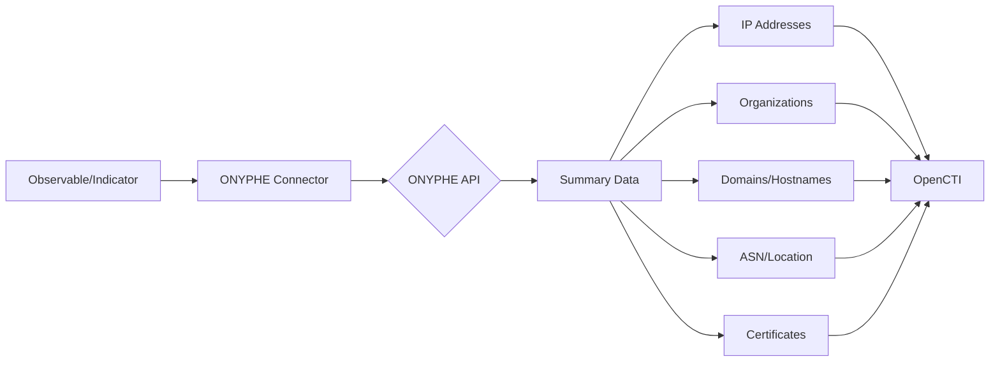

# OpenCTI ONYPHE Connector

| Status | Date | Comment |
|--------|------|---------|
| Community | -    | -       |

## Table of Contents

- [Introduction](#introduction)
- [Installation](#installation)
  - [Requirements](#requirements)
- [Configuration](#configuration)
  - [OpenCTI Configuration](#opencti-configuration)
  - [Base Connector Configuration](#base-connector-configuration)
  - [ONYPHE Configuration](#onyphe-configuration)
- [Deployment](#deployment)
  - [Docker Deployment](#docker-deployment)
  - [Manual Deployment](#manual-deployment)
- [Usage](#usage)
- [Behavior](#behavior)
  - [Data Flow](#data-flow)
  - [Observable Enrichment](#observable-enrichment)
  - [Indicator Enrichment](#indicator-enrichment)
  - [Generated STIX Objects](#generated-stix-objects)
- [Warnings](#warnings)
- [Debugging](#debugging)
- [Additional Information](#additional-information)

---

## Introduction

[ONYPHE](https://www.onyphe.io/) is a cyber defense search engine that collects open-source and cyber threat intelligence data by crawling the Internet. This connector enriches observables and indicators with comprehensive network intelligence.

Key features:
- IP address enrichment with organization, geolocation, ASN, and related infrastructure
- Domain and hostname enrichment
- X509 certificate analysis
- Text analytical pivots
- Indicator pattern search with detailed notes

---

## Installation

### Requirements

- OpenCTI Platform >= 6.0.0
- ONYPHE API key
- Network access to ONYPHE API

---

## Configuration

### OpenCTI Configuration

| Parameter | Docker envvar | Mandatory | Description |
|-----------|---------------|-----------|-------------|
| `opencti_url` | `OPENCTI_URL` | Yes | The URL of the OpenCTI platform |
| `opencti_token` | `OPENCTI_TOKEN` | Yes | The default admin token configured in the OpenCTI platform |

### Base Connector Configuration

| Parameter | Docker envvar | Mandatory | Description |
|-----------|---------------|-----------|-------------|
| `connector_id` | `CONNECTOR_ID` | Yes | A valid arbitrary `UUIDv4` unique for this connector |
| `connector_name` | `CONNECTOR_NAME` | Yes | The name of the connector instance |
| `connector_scope` | `CONNECTOR_SCOPE` | Yes | Supported: `IPv4-Addr,IPv6-Addr,x509-certificate,Hostname,Text,Indicator` |
| `connector_auto` | `CONNECTOR_AUTO` | Yes | Enable/disable auto-enrichment |
| `connector_confidence_level` | `CONNECTOR_CONFIDENCE_LEVEL` | Yes | Default confidence level (0-100) |
| `connector_log_level` | `CONNECTOR_LOG_LEVEL` | Yes | Log level (`debug`, `info`, `warn`, `error`) |

### ONYPHE Configuration

| Parameter | Docker envvar | Mandatory | Description |
|-----------|---------------|-----------|-------------|
| `onyphe_api_key` | `ONYPHE_API_KEY` | Yes | ONYPHE API key |
| `onyphe_base_url` | `ONYPHE_BASE_URL` | No | API base URL |
| `onyphe_max_tlp` | `ONYPHE_MAX_TLP` | No | Maximum TLP for enrichment |
| `onyphe_time_since` | `ONYPHE_TIME_SINCE` | No | Time window for data retrieval |
| `onyphe_default_score` | `ONYPHE_DEFAULT_SCORE` | No | Default score for created indicators |
| `onyphe_import_search_results` | `ONYPHE_IMPORT_SEARCH_RESULTS` | No | Import search results |
| `onyphe_create_note` | `ONYPHE_CREATE_NOTE` | No | Create notes for enrichment |
| `onyphe_import_full_data` | `ONYPHE_IMPORT_FULL_DATA` | No | Import full data (see warnings) |
| `onyphe_pivot_threshold` | `ONYPHE_PIVOT_THRESHOLD` | No | Threshold for pivot operations |

---

## Deployment

### Docker Deployment

Build a Docker Image using the provided `Dockerfile`.

Example `docker-compose.yml`:

```yaml
version: '3'
services:
  connector-onyphe:
    image: opencti/connector-onyphe:latest
    environment:
      - OPENCTI_URL=http://localhost
      - OPENCTI_TOKEN=ChangeMe
      - CONNECTOR_ID=ChangeMe
      - CONNECTOR_NAME=ONYPHE
      - CONNECTOR_SCOPE=IPv4-Addr,IPv6-Addr,x509-certificate,Hostname,Text,Indicator
      - CONNECTOR_AUTO=false
      - CONNECTOR_CONFIDENCE_LEVEL=50
      - CONNECTOR_LOG_LEVEL=error
      - ONYPHE_API_KEY=ChangeMe
      - ONYPHE_MAX_TLP=TLP:AMBER
      - ONYPHE_DEFAULT_SCORE=50
      - ONYPHE_IMPORT_SEARCH_RESULTS=true
      - ONYPHE_CREATE_NOTE=true
      - ONYPHE_IMPORT_FULL_DATA=false
      - ONYPHE_PIVOT_THRESHOLD=100
    restart: always
```

### Manual Deployment

1. Clone the repository
2. Copy `config.yml.sample` to `config.yml` and configure
3. Install dependencies: `pip install -r requirements.txt`
4. Run the connector

---

## Usage

The connector enriches:
1. **Observables**: IP addresses, certificates, hostnames, text
2. **Indicators**: With ONYPHE pattern_type

Trigger enrichment:
- Manually via the OpenCTI UI
- Automatically if `CONNECTOR_AUTO=true` (see warnings)
- Via playbooks

---

## Behavior

### Data Flow



### Observable Enrichment

For observables (IPv4, IPv6, hostname, certificate, text):

| STIX Object | Description |
|-------------|-------------|
| IPv4-Addr/IPv6-Addr | Related IP addresses |
| Organization | Related organizations |
| Domain-Name | Associated domains |
| Hostname | Associated hostnames |
| Autonomous-System | ASN information |
| X509-Certificate | SSL certificates |
| Text | Analytical pivots |
| Location | Geographic data |
| External Reference | ONYPHE links |
| Labels | Classification tags |
| Description | Enriched description |

### Indicator Enrichment

For indicators with `pattern_type: onyphe`:

| Content | Description |
|---------|-------------|
| Note | Summary with key data points |
| Description | Enriched indicator description |

---

## Warnings

### Import Full Data

Setting `ONYPHE_IMPORT_FULL_DATA=true` will import ALL associated data, which can result in:
- Very large numbers of observables
- High API usage
- Potential performance issues

Recommendation: Start with `false` and enable selectively.

### Pivot Threshold

The `ONYPHE_PIVOT_THRESHOLD` setting limits how many pivots are followed. High values can lead to extensive data imports.

### Auto Enrichment

Setting `CONNECTOR_AUTO=true` with broad scopes can trigger excessive API calls. Consider using Trigger Filters:

1. Navigate to: Data -> Ingestion -> Connectors -> ONYPHE
2. Add Trigger Filters to limit which entities trigger enrichment

### Generated STIX Objects

| Object Type | Description |
|-------------|-------------|
| IPv4-Addr/IPv6-Addr | Related IP addresses |
| Organization | Related organizations |
| Domain-Name | Associated domains |
| Hostname | Associated hostnames |
| Autonomous-System | ASN information |
| X509-Certificate | SSL certificates |
| Text | Analytical pivots |
| Location | Geographic data |
| Note | Summary for indicators |
| Labels | Classification tags |
| External Reference | ONYPHE links |

---

## Debugging

Enable debug logging by setting `CONNECTOR_LOG_LEVEL=debug` to see:
- API request/response details
- Entity creation progress
- Pivot operations

---

## Additional Information

- [ONYPHE](https://www.onyphe.io/)
- [ONYPHE API Documentation](https://www.onyphe.io/documentation/api)

### API Considerations

ONYPHE API has rate limits. Consider:
- Using manual enrichment for high-value targets
- Setting appropriate `ONYPHE_PIVOT_THRESHOLD`
- Monitoring API usage
