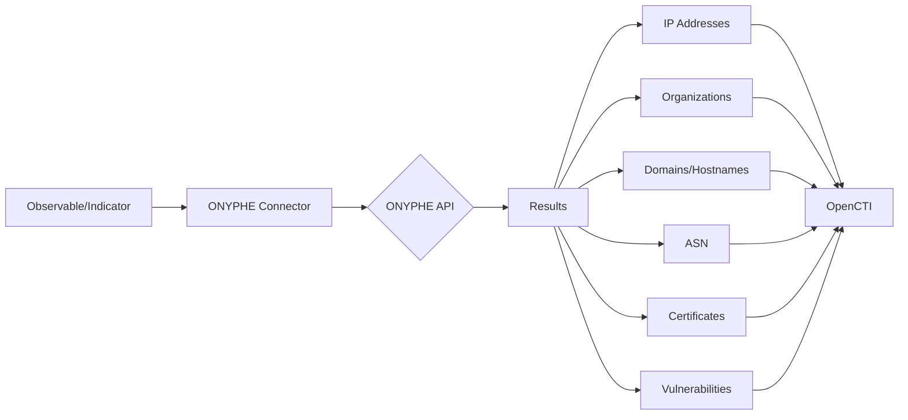

# OpenCTI ONYPHE Connector

| Status | Date | Comment |
|--------|------|---------|
| Community | -    | -       |

## Table of Contents

- [Introduction](#introduction)
- [Installation](#installation)
  - [Requirements](#requirements)
- [Configuration](#configuration)
  - [OpenCTI Configuration](#opencti-configuration)
  - [Base Connector Configuration](#base-connector-configuration)
  - [ONYPHE Configuration](#onyphe-configuration)
- [Deployment](#deployment)
  - [Docker Deployment](#docker-deployment)
  - [Multiple Instances](#multiple-instances)
  - [Manual Deployment](#manual-deployment)
- [Usage](#usage)
- [Behavior](#behavior)
  - [Data Flow](#data-flow)
  - [Observable Enrichment](#observable-enrichment)
  - [Indicator Enrichment](#indicator-enrichment)
  - [Generated STIX Objects](#generated-stix-objects)
- [Warnings](#warnings)
  - [Import Full Data](#import-full-data)
  - [Pivot Threshold](#pivot-threshold)
  - [Indicator Max Results](#indicator-max-results)
  - [Enrichment Types](#enrichment-types)
  - [Text Fingerprints](#text-fingerprints)
  - [Note Behaviour](#note-behaviour)
  - [Auto Enrichment](#auto-enrichment)
- [Debugging](#debugging)
- [Additional Information](#additional-information)

---

## Introduction

[ONYPHE](https://www.onyphe.io/) is a cyber defense search engine that collects open-source and cyber threat intelligence data by crawling the Internet. This connector enriches observables and indicators with comprehensive network intelligence.

The connector supports multiple [ONYPHE data categories](https://search.onyphe.io/docs/data-models/) through a single codebase. Each deployed instance is configured for a specific category, enabling distinct use cases on the same OpenCTI platform:

| Category | Use case | Key output |
|----------|----------|------------|
| `ctiscan` (default) | Threat intelligence enrichment | IP, hostname, certificate, fingerprint observables |
| `riskscan` | Attack surface management | IP, hostname, vulnerabilities (CVEs), risk labels |

---

## Installation

### Requirements

- OpenCTI Platform >= 6.0.0
- ONYPHE API key
- Network access to ONYPHE API

---

## Configuration

### OpenCTI Configuration

| Parameter | Docker envvar | Mandatory | Description |
|-----------|---------------|-----------|-------------|
| `opencti_url` | `OPENCTI_URL` | Yes | The URL of the OpenCTI platform |
| `opencti_token` | `OPENCTI_TOKEN` | Yes | The default admin token configured in the OpenCTI platform |

### Base Connector Configuration

| Parameter | Docker envvar | Mandatory | Description |
|-----------|---------------|-----------|-------------|
| `connector_id` | `CONNECTOR_ID` | Yes | A valid arbitrary `UUIDv4` — must be unique per instance |
| `connector_name` | `CONNECTOR_NAME` | Yes | Display name in OpenCTI — use distinct names per instance |
| `connector_scope` | `CONNECTOR_SCOPE` | Yes | See per-category scope below |
| `connector_auto` | `CONNECTOR_AUTO` | Yes | Enable/disable auto-enrichment |
| `connector_confidence_level` | `CONNECTOR_CONFIDENCE_LEVEL` | Yes | Default confidence level (0-100) |
| `connector_log_level` | `CONNECTOR_LOG_LEVEL` | Yes | Log level (`debug`, `info`, `warn`, `error`) |

### ONYPHE Configuration

| Parameter | Docker envvar | Mandatory | Description |
|-----------|---------------|-----------|-------------|
| `onyphe_api_key` | `ONYPHE_API_KEY` | Yes | ONYPHE API key |
| `onyphe_category` | `ONYPHE_CATEGORY` | No | Data category: `ctiscan` (default) or `riskscan` |
| `onyphe_base_url` | `ONYPHE_BASE_URL` | No | API base URL (default: `https://www.onyphe.io/api/v2/`) |
| `onyphe_max_tlp` | `ONYPHE_MAX_TLP` | No | Maximum TLP for enrichment (default: `TLP:AMBER`) |
| `onyphe_time_since` | `ONYPHE_TIME_SINCE` | No | Time window for data retrieval (default: `1w`) |
| `onyphe_default_score` | `ONYPHE_DEFAULT_SCORE` | No | Default score for created observables (default: `50`) |
| `onyphe_import_search_results` | `ONYPHE_IMPORT_SEARCH_RESULTS` | No | Import results as observables for indicator enrichment (default: `true`) |
| `onyphe_create_note` | `ONYPHE_CREATE_NOTE` | No | Attach enrichment summary as a Note on observables (default: `false`) |
| `onyphe_import_full_data` | `ONYPHE_IMPORT_FULL_DATA` | No | Import full raw response text — can produce large data (default: `false`) |
| `onyphe_pivot_threshold` | `ONYPHE_PIVOT_THRESHOLD` | No | Skip observable enrichment if result count exceeds this (default: `10`) |
| `onyphe_indicator_max_results` | `ONYPHE_INDICATOR_MAX_RESULTS` | No | Maximum results to fetch when enriching an indicator. If the first page reveals more total results than this, the query is considered too imprecise and no results are imported (default: `1000`) |
| `onyphe_pattern_type` | `ONYPHE_PATTERN_TYPE` | No | Vocabulary entry for ONYPHE indicator pattern type (default: `onyphe`) |
| `onyphe_enrichment_types` | `ONYPHE_ENRICHMENT_TYPES` | No | Comma-separated list of OpenCTI object types to create during enrichment. Leave empty to create all types (default). See [Enrichment Types](#enrichment-types) for valid values. |
| `onyphe_text_fingerprints` | `ONYPHE_TEXT_FINGERPRINTS` | No | Comma-separated list of fingerprint pivot labels controlling which ONYPHE hash fields are created as Text observables. Leave empty to use the default sha256-preferred set. See [Text Fingerprints](#text-fingerprints) for valid values. |

#### Connector scope by category

| Category | `CONNECTOR_SCOPE` |
|----------|-------------------|
| `ctiscan` | `IPv4-Addr,IPv6-Addr,Domain-Name,Hostname,x509-Certificate,Text,Indicator` |
| `riskscan` | `IPv4-Addr,IPv6-Addr,Domain-Name,Hostname,x509-Certificate,Indicator` |

---

## Deployment

### Docker Deployment

Build a Docker image using the provided `Dockerfile`.

**Single instance (ctiscan, default behaviour):**

```yaml
version: '3'
services:
  connector-onyphe:
    image: opencti/connector-onyphe:latest
    environment:
      - OPENCTI_URL=http://localhost
      - OPENCTI_TOKEN=ChangeMe
      - CONNECTOR_ID=ChangeMe
      - CONNECTOR_NAME=ONYPHE
      - CONNECTOR_SCOPE=IPv4-Addr,IPv6-Addr,Domain-Name,Hostname,x509-Certificate,Text,Indicator
      - CONNECTOR_AUTO=false
      - CONNECTOR_CONFIDENCE_LEVEL=50
      - CONNECTOR_LOG_LEVEL=error
      - ONYPHE_API_KEY=ChangeMe
      - ONYPHE_MAX_TLP=TLP:AMBER
      - ONYPHE_DEFAULT_SCORE=50
      - ONYPHE_IMPORT_SEARCH_RESULTS=true
      - ONYPHE_CREATE_NOTE=true
      - ONYPHE_IMPORT_FULL_DATA=false
      - ONYPHE_PIVOT_THRESHOLD=100
      - ONYPHE_INDICATOR_MAX_RESULTS=1000
    restart: always
```

### Multiple Instances

Running multiple instances of the same Docker image with different `ONYPHE_CATEGORY` values lets you serve distinct use cases on the same OpenCTI platform. Each instance must have a unique `CONNECTOR_ID` and a distinct `CONNECTOR_NAME` so OpenCTI registers them separately.

**Example: CTI enrichment and ASM side by side:**

```yaml
version: '3'
services:

  # Threat intelligence enrichment — uses ONYPHE ctiscan category
  connector-onyphe-cti:
    image: opencti/connector-onyphe:latest
    environment:
      - OPENCTI_URL=http://localhost
      - OPENCTI_TOKEN=ChangeMe
      - CONNECTOR_ID=00000000-0000-0000-0000-000000000001   # unique UUIDv4
      - CONNECTOR_NAME=ONYPHE CTI
      - CONNECTOR_SCOPE=IPv4-Addr,IPv6-Addr,Domain-Name,Hostname,x509-Certificate,Text,Indicator
      - CONNECTOR_AUTO=false
      - CONNECTOR_CONFIDENCE_LEVEL=50
      - CONNECTOR_LOG_LEVEL=error
      - ONYPHE_API_KEY=ChangeMe
      - ONYPHE_CATEGORY=ctiscan
      - ONYPHE_MAX_TLP=TLP:AMBER
      - ONYPHE_DEFAULT_SCORE=50
      - ONYPHE_IMPORT_SEARCH_RESULTS=true
      - ONYPHE_PIVOT_THRESHOLD=100
      - ONYPHE_INDICATOR_MAX_RESULTS=1000
    restart: always

  # Attack surface management — uses ONYPHE riskscan category
  connector-onyphe-asm:
    image: opencti/connector-onyphe:latest
    environment:
      - OPENCTI_URL=http://localhost
      - OPENCTI_TOKEN=ChangeMe
      - CONNECTOR_ID=00000000-0000-0000-0000-000000000002   # unique UUIDv4
      - CONNECTOR_NAME=ONYPHE ASM
      - CONNECTOR_SCOPE=IPv4-Addr,IPv6-Addr,Domain-Name,Hostname,x509-Certificate,Indicator
      - CONNECTOR_AUTO=false
      - CONNECTOR_CONFIDENCE_LEVEL=50
      - CONNECTOR_LOG_LEVEL=error
      - ONYPHE_API_KEY=ChangeMe
      - ONYPHE_CATEGORY=riskscan
      - ONYPHE_MAX_TLP=TLP:AMBER
      - ONYPHE_DEFAULT_SCORE=50
      - ONYPHE_IMPORT_SEARCH_RESULTS=true
      - ONYPHE_PIVOT_THRESHOLD=100
      - ONYPHE_INDICATOR_MAX_RESULTS=1000
    restart: always
```

Each instance appears as a separate connector in the OpenCTI UI and can be given independent trigger filters, auto-enrichment settings, and confidence levels.

#### Indicator patterns and category selection

Indicators use `pattern_type: onyphe` and carry an OQL query as their pattern. The connector prepends `category:<ONYPHE_CATEGORY>` automatically if no `category:` clause is already present in the pattern. This means:

- An indicator with pattern `ip.dest:1.2.3.4` processed by the CTI instance becomes `category:ctiscan ip.dest:1.2.3.4`
- The same indicator processed by the ASM instance becomes `category:riskscan ip:1.2.3.4`
- An indicator that already includes `category:riskscan ip:1.2.3.4` is passed through unchanged by either instance

### Manual Deployment

1. Clone the repository
2. Copy `config.yml.sample` to `config.yml` and configure
3. Install dependencies: `pip install -r requirements.txt`
4. Run: `python src/main.py`

---

## Usage

The connector enriches:
1. **Observables**: IP addresses, domains, hostnames, certificates, text (fingerprints)
2. **Indicators**: OQL patterns with `pattern_type: onyphe`

Trigger enrichment:
- Manually via the OpenCTI UI
- Automatically if `CONNECTOR_AUTO=true` (see warnings)
- Via playbooks

---

## Behavior

### Data Flow


```mermaid
flowchart LR
    A[Observable/Indicator] --> B[ONYPHE Connector]
    B --> C{ONYPHE API}
    C --> D[Results]
    D --> E[IP Addresses]
    D --> F[Organizations]
    D --> G[Domains/Hostnames]
    D --> H[ASN]
    D --> I[Certificates]
    D --> J[Vulnerabilities]
    E --> K[OpenCTI]
    F --> K
    G --> K
    H --> K
    I --> K
    J --> K
```

### Observable Enrichment

The connector supports the following observable types as enrichment inputs. The STIX objects generated depend on the configured category.

#### Supported input types

| Observable type | ctiscan OQL field(s) | riskscan OQL field(s) |
|-----------------|----------------------|-----------------------|
| IPv4-Addr | `ip.dest:{value}` | `ip:{value}` |
| IPv6-Addr | `ip.dest:{value}` | `ip:{value}` |
| Domain-Name | `?dns.domain:{v} ?cert.domain:{v} ?extract.domain:{v}` | `domain:{value}` |
| Hostname | `?dns.hostname:{v} ?cert.hostname:{v}` | `hostname:{value}` |
| X509-Certificate | `cert.fingerprint.<algo>:{hash}` | `fingerprint.<algo>:{hash}` |
| Text | analytical pivot field (label-driven) | not supported |
| Indicator | OQL pattern (passed through) | OQL pattern (passed through) |

#### Generated STIX objects by category

| STIX object | ctiscan | riskscan |
|-------------|:-------:|:--------:|
| IPv4-Addr / IPv6-Addr | Yes | Yes |
| Domain-Name | Yes | Yes |
| Hostname | Yes | Yes |
| Autonomous-System | Yes | Yes |
| Organization (Identity) | Yes | Yes |
| X509-Certificate | Yes | Yes |
| Vulnerability | — | Yes |
| Text (fingerprint pivots) | Yes (configurable via `ONYPHE_TEXT_FINGERPRINTS`) | — |
| Note (indicator summary) | Yes | Yes |
| Note (observable enrichment, optional) | Yes | Yes |
| Labels | Yes | Yes |
| External Reference | Yes | Yes |

Vulnerabilities generated by the riskscan category are linked to the enriched observable with a `has` relationship and carry an external reference to the CVE record.

### Indicator Enrichment

Indicators with `pattern_type: onyphe` are executed as OQL queries against the configured category. The connector returns:

- A **Note** containing a summary table of top values across key fields (IPs, organisations, countries, ports, protocols, CVEs, risk tags, etc.)
- Optionally, the full set of matching observables (when `ONYPHE_IMPORT_SEARCH_RESULTS=true`)

The summary fields vary by category:

| ctiscan summary fields | riskscan summary fields |
|------------------------|-------------------------|
| IP addresses | IP addresses |
| Organizations | Organizations |
| ASNs | Countries |
| Countries | Hostnames |
| Cert hostnames | Ports |
| Cert domains | Protocols |
| DNS hostnames | CVEs |
| TCP ports | Risk tags |
| Protocols | |
| Technologies | |

---

## Warnings

### Import Full Data

Setting `ONYPHE_IMPORT_FULL_DATA=true` imports the complete raw application response text into the enrichment description. This can produce very large objects. Start with `false`.

### Pivot Threshold

`ONYPHE_PIVOT_THRESHOLD` sets the maximum number of results before observable enrichment is skipped entirely. This guards against runaway imports when the connector is running in automatic mode — a common IP or domain appearing in many results could otherwise trigger an exponential growth in observables. The default is `10` — raise it deliberately for known high-cardinality targets.

### Indicator Max Results

`ONYPHE_INDICATOR_MAX_RESULTS` is a sanity check for indicator enrichment. When a user submits an OQL indicator for enrichment, the connector fetches the first page of results and checks the total count. If the total exceeds this limit, the query is assumed to be too imprecise (e.g. a typo or an overly broad pattern) and no results are imported. Otherwise, all matching results are paginated and processed. The default is `1000`. This parameter is intentionally separate from `ONYPHE_PIVOT_THRESHOLD` — indicator enrichment is always a deliberate human action, so a much higher ceiling is appropriate.

### Enrichment Types

`ONYPHE_ENRICHMENT_TYPES` controls which OpenCTI object types the connector is allowed to create when enriching an observable. By default the parameter is empty, meaning all supported types are created. Set it to a comma-separated list to restrict output to only the types you need.

Valid values:

| Value | Generator | ctiscan | riskscan |
|-------|-----------|:-------:|:--------:|
| `Domain-Name` | `_generate_stix_domain` | Yes | Yes |
| `Hostname` | `_generate_stix_hostname` | Yes | Yes |
| `IPv4-Address` / `IPv6-Address` | `_generate_stix_ip` | Yes | Yes |
| `Autonomous-System` | `_generate_stix_asn` | Yes | Yes |
| `X509-Certificate` | `_generate_stix_x509` | Yes | Yes |
| `Text` | `_generate_stix_text` | Yes | — |
| `Vulnerability` | `_generate_stix_vulnerability` | — | Yes |

**Notes:**
- The `Organization` identity and the upsert of the source observable are always created regardless of this setting.
- The `Hostname`↔`Domain-Name` relationship is created only when **both** `Hostname` and `Domain-Name` are in the list.
- Type matching is case-insensitive (`domain-name`, `Domain-Name`, and `DOMAIN-NAME` are all accepted).

**Example** — riskscan instance that only creates vulnerabilities and IP addresses:

```yaml
- ONYPHE_CATEGORY=riskscan
- ONYPHE_ENRICHMENT_TYPES=IPv4-Address,IPv6-Address,Vulnerability
```

### Text Fingerprints

`ONYPHE_TEXT_FINGERPRINTS` controls which ONYPHE hash fields are extracted from enrichment results and stored as Text observables in OpenCTI. Each field is identified by a short label (the second column in the table below).

By default, when the parameter is empty, the connector uses the **sha256-preferred set**: one pivot per fingerprint family, choosing sha256 where the data model supports it and falling back to md5 otherwise. This avoids duplicate Text objects for the same content under different hash algorithms.

To use a different selection, set the parameter to a comma-separated list of labels.

#### All available pivot labels

| Label | ONYPHE field | Notes | In default set |
|-------|-------------|-------|:--------------:|
| `hhhash-sha256` | `hhhash.fingerprint.sha256` | HTTP header hash | Yes |
| `hhhash-md5` | `hhhash.fingerprint.md5` | HTTP header hash | |
| `ja4t-md5` | `ja4t.fingerprint.md5` | TCP fingerprint (JA4T) — no sha256 in data model | Yes |
| `ja3s-md5` | `ja3s.fingerprint.md5` | TLS server fingerprint (JA3S) — no sha256 in data model | Yes |
| `ja4s-md5` | `ja4s.fingerprint.md5` | TLS server fingerprint (JA4S) — no sha256 in data model | Yes |
| `hassh-md5` | `hassh.fingerprint.md5` | SSH client fingerprint (HASSH) — no sha256 in data model | Yes |
| `favicon-sha256` | `favicon.data.sha256` | Favicon hash | Yes |
| `favicon-md5` | `favicon.data.md5` | Favicon hash | |
| `favicon-mmh3` | `favicon.data.mmh3` | Favicon hash (Shodan-compatible) | |
| `tcp-fingerprint-md5` | `tcp.fingerprint.md5` | Raw TCP fingerprint — no sha256 in data model | Yes |
| `app-data-sha256` | `app.data.sha256` | Application-layer payload hash | Yes |
| `app-data-md5` | `app.data.md5` | Application-layer payload hash | |
| `app-data-mmh3` | `app.data.mmh3` | Application-layer payload hash | |
| `http-header-data-sha256` | `http.header.data.sha256` | HTTP header block hash | Yes |
| `http-header-data-md5` | `http.header.data.md5` | HTTP header block hash | |
| `http-header-data-mmh3` | `http.header.data.mmh3` | HTTP header block hash | |
| `http-body-data-sha256` | `http.body.data.sha256` | HTTP body hash | Yes |
| `http-body-data-md5` | `http.body.data.md5` | HTTP body hash | |
| `http-body-data-mmh3` | `http.body.data.mmh3` | HTTP body hash | |
| `ssh-fingerprint-sha256` | `ssh.fingerprint.sha256` | SSH host-key fingerprint | Yes |
| `ssh-fingerprint-md5` | `ssh.fingerprint.md5` | SSH host-key fingerprint | |

**Example** — only favicon and SSH fingerprints, using all available hash variants:

```yaml
- ONYPHE_TEXT_FINGERPRINTS=favicon-sha256,favicon-md5,favicon-mmh3,ssh-fingerprint-sha256,ssh-fingerprint-md5
```

### Note Behaviour

The connector creates STIX Note objects in two distinct contexts, with different default behaviours:

**Indicator enrichment** — a Note containing the OQL query summary is always created and attached to the Indicator. The Note ID is derived from the Indicator's STIX ID and the note title, so re-enriching the same Indicator always produces the same ID. OpenCTI will upsert the Note, replacing the content with the latest results.

**Observable enrichment** — a Note is only created when `ONYPHE_CREATE_NOTE=true`. A new note is created if the Observable description changes. 

### Auto Enrichment

Setting `CONNECTOR_AUTO=true` with broad scopes can trigger large numbers of API calls. Use Trigger Filters in the OpenCTI UI to limit which entities are processed automatically:

1. Navigate to: Data → Ingestion → Connectors → (connector name)
2. Add Trigger Filters to restrict which entities trigger enrichment

When running multiple instances, set `CONNECTOR_AUTO` independently per instance and apply appropriate filters to each.

---

## Debugging

Set `CONNECTOR_LOG_LEVEL=debug` to log:
- API request details and OQL queries
- Per-observable processing steps
- STIX object creation

---

## Additional Information

- [ONYPHE](https://www.onyphe.io/)
- [ONYPHE API Documentation](https://www.onyphe.io/documentation/api)
- [ONYPHE ctiscan data model](https://search.onyphe.io/docs/data-models/ctiscan)
- [ONYPHE riskscan tags](https://search.onyphe.io/docs/tags/riskscan)
- [ONYPHE vulnscan tags](https://search.onyphe.io/docs/tags/vulnscan)

### API Considerations

ONYPHE API has rate limits. The connector handles HTTP 429 responses with exponential back-off. To reduce API load:
- Use manual enrichment for high-value targets
- Set `ONYPHE_PIVOT_THRESHOLD` appropriately
- Avoid `CONNECTOR_AUTO=true` on broad scopes
