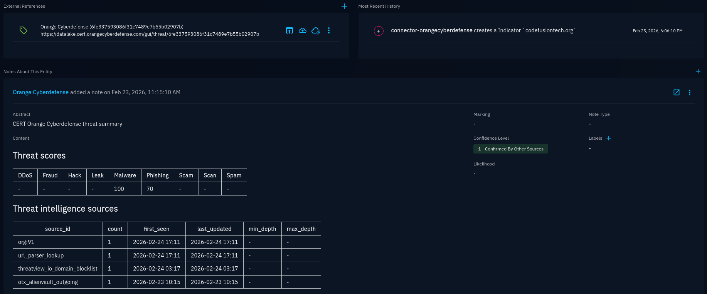
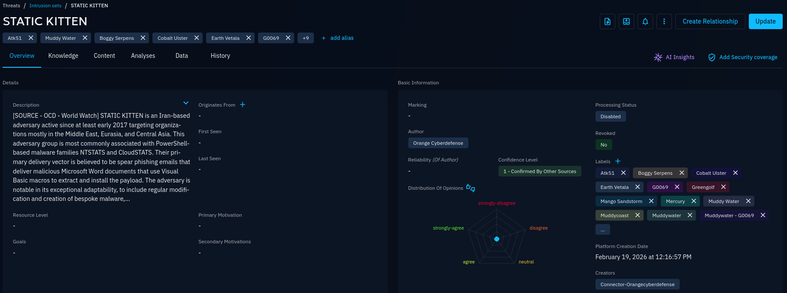

# CERT Orange Cyberdefense CTI Enrichment Connector

| Status | Date | Comment |
|--------|------|---------|
| Partner | -    | -       |

## Summary

This connector supports enrichment of OpenCTI observables via Datalake, a subscription based CTI platform powered by [Orange Cyberdefense](https://www.orangecyberdefense.com).

## Supported observable types

The following OpenCTI observable types are supported for enrichment and match the corresponding types in Datalake.

| OpenCTI observable type | Datalake threat type |
| ----------------------- | -------------------- |
| Autonomous-System       | as                   |
| X509-Certificate        | certificate          |
| Cryptocurrency-Wallet   | crypto               |
| Domain-Name             | domain               |
| Email-Addr              | email                |
| StixFile                | file                 |
| IPv4-Addr               | ip,ip_range          |
| IPv6-Addr               | ip,ip_range          |
| Phone-Number            | phone_number         |
| URL                     | url                  |

## Installation

### Prerequisites

In order to install this connector, a subscription to [Orange Cyberdefense Datalake](https://datalake.cert.orangecyberdefense.com/) is **mandatory**. If you would like to try it, please contact us: [info.cert@fr.orangecyberdefense.com](mailto:info.cert@fr.orangecyberdefense.com).

Other prerequisites for using this connector includes:
- An operational OpenCTI on-prem or SaaS instance.
- An OpenCTI API token with write permissions.
  - As highlighted [in the official documentation regarding connectors](https://docs.opencti.io/latest/deployment/connectors/), a **dedicated** user account for each connector is recommended.
  - With sufficient permissions, an user's API Token can be found in: _Gear Icon_ > Security > Users > _User details_.
- An active **Managed Threat Intelligence** (Datalake) subscription.
- A valid Datalake API "long term" token.
  - See [Creating a Datalake LongTerm Token](https://datalake.cert.orangecyberdefense.com/gui/my-account) to generate one.

### Installation

1. Copy the content under the `services:` section of the `docker-compose.yml` example file into your main OpenCTI docker configuration.
2. Replace the value of `OPENCTI_URL` with the OpenCTI container URL, usually `http://opencti:8080`.
3. Replace the value of `OPENCTI_TOKEN` with the token of the dedicated OpenCTI user you created for this integration (see [prerequisites](#prerequisites)).
4. Replace the value of `CONNECTOR_ID` with a randomly generated UUIDv4 (you can find UUID generators online).
5. Replace the value of `CONNECTOR_AUTO` with `true` if you want enrichment to trigger on new observables creation (defaults to `false` which means manual enrichment only).
6. Replace the value of `OCD_ENRICH_DATALAKE_TOKEN` with your Datalake API token.
7. Replace or add other variables to customize the behavior of this connector according to your needs. See [this section below](#environment-variables) for a full list of supported environment variable.
8. Reload the connector's container configuration. If using Docker compose, this can be done using the `docker compose up -d` command.

### Troubleshooting

- Go to the connector's status page in OpenCTI: _Database Icon_ > Ingestion > Connectors > Orange Cyberdefense CTI Enrichment.
  - If it does not exists, there is probably an issue with your docker configuration.
  - Check that connector is marked as "Active".
  - Compare the value of "Automatic trigger" and the "CONNECTOR_AUTO" environment variable.
- Check whether the connector's container exists and it's uptime.
  - `docker ps` if using Docker.
  - `kubectl get pod -n <namespace>` if using Kubernetes.
- Check the logs of the container running the connector.
  - `docker logs -f <container_id>` if using Docker.
  - `kubectl logs <pod_name> -n <namespace>` if using Kubernetes.
- Contact us, we're here to help!

## Usage

### Environment variables

| Parameter / Docker environment variables                                                  | Mandatory | Description |
|-------------------------------------------------------------------------------------------|-----------|-------------|
| `opencti.url` `OPENCTI_URL`                                                           | Yes       | The OpenCTI platform URL. |
| `opencti.token` `OPENCTI_TOKEN`                                                       | Yes       | The OpenCTI API token of the user who represents the connector in the OpenCTI platform. |
| `connector.id` `CONNECTOR_ID`                                                         | Yes       | A unique UUIDv4 identifier for this connector instance. |
| `connector.auto` `CONNECTOR_AUTO`                                                     | Yes       | Whether to automatically enrich every newly created observable. Defaults to `false`. |
| `connector.name` `CONNECTOR_NAME`                                                     | No        | Name of the connector. Defaults to `Orange Cyberdefense CTI Enrichment`. |
| `connector.scope` `CONNECTOR_SCOPE`                                                   | No        | OpenCTI observable types for which to enable the enrichment. Defaults to all supported types: `IPv4-Addr,IPv6-Addr,Domain-Name,URL,Email-Addr,Autonomous-System,X509-Certificate,Cryptocurrency-Wallet,StixFile,Phone-Number`. |
| `connector.log_level` `CONNECTOR_LOG_LEVEL`                                           | No        | Determines the verbosity of the logs. Defaults to `info`. |
| `ocd_enrich.datalake_env` `OCD_ENRICH_DATALAKE_ENV`                                   | No        | ⚠️ Advanced setting* - Datalake environment to use: `prod` or `preprod`. Defaults to `prod`. |
| `ocd_enrich.datalake_token` `OCD_ENRICH_DATALAKE_TOKEN`                               | Yes       | Long Term Token used to access Orange Cyberdefense Datalake API. |
| `ocd_enrich.ignore_unscored_indicators` `OCD_ENRICH_IGNORE_UNSCORED_INDICATORS`       | No        | If `true`, Datalake indicators that do not have any score will be ignored. Defaults to `true`. |
| `ocd_enrich.ignore_whitelisted_indicators` `OCD_ENRICH_IGNORE_WHITELISTED_INDICATORS` | No        | If `true`, Datalake indicators that are whitelisted will be ignored. Defaults to `true`. |
| `ocd_enrich.fallback_score` `OCD_ENRICH_FALLBACK_SCORE`                               | No        | If `OCD_ENRICH_IGNORE_UNSCORED_INDICATORS` is set to `false`, this value will be used as a default for Datalake indicators without any score. Defaults to `0`. |
| `ocd_enrich.add_tags_as_labels` `OCD_ENRICH_ADD_TAGS_AS_LABELS`                       | No        | Whether to add Datalake tags as labels to the enriched observable. Defaults to `true`. |
| `ocd_enrich.add_scores_as_labels` `OCD_ENRICH_ADD_SCORES_AS_LABELS`                   | No        | Whether to add Datalake threat scores as labels to the enriched observable. Full explanation in [this section below](#about-scoring). Defaults to `true`. |
| `ocd_enrich.add_score` `OCD_ENRICH_ADD_SCORE`                                         | No        | Whether to add score to the enriched observable (overwrite existing). Full explanation in [this section below](#about-scoring). Defaults to `true`. |
| `ocd_enrich.add_tlp` `OCD_ENRICH_ADD_TLP`                                             | No        | Whether to add a TLP marking to the enriched observable (overwrite existing). Defaults to `true`. |
| `ocd_enrich.add_extref` `OCD_ENRICH_ADD_EXTREF`                                       | No        | Whether to add external references to the enriched observable. This typically adds a direct link to the matching Datalake threat and other external references stored in Datalake. Defaults to `true`. |
| `ocd_enrich.add_summary` `OCD_ENRICH_ADD_SUMMARY`                                     | No        | Whether to add a threat summary as a note to the enriched observable. It contains a breakdown of the score by threat categories, and a list of sources. Defaults to `true`. |
| `ocd_enrich.add_related` `OCD_ENRICH_ADD_RELATED`                                     | No        | Whether to import objects from the Threat Library related to this observable, such as indicators, malwares, etc. Full explanation in [this section below](#about-related-entities). Defaults to `true`. |
| `ocd_enrich.add_sightings` `OCD_ENRICH_ADD_SIGHTINGS`                                 | No        | Whether to import positive sightings from Datalake. Full explanation in [this section below](#about-sightings). Defaults to `true`. |
| `ocd_enrich.add_createdby` `OCD_ENRICH_ADD_CREATEDBY`                                 | No        | Whether to add a reference to "Orange Cyberdefense" organization as author of OpenCTI objects. Does not add it to the enriched observable. Defaults to `true`. |
| `ocd_enrich.curate_labels` `OCD_ENRICH_CURATE_LABELS`                                 | No        | ⚠️ Advanced setting* - Adapt Datalake CTI tags as STIX labels. Defaults to `true`. |
| `ocd_enrich.max_tlp` `OCD_ENRICH_MAX_TLP`                                             | No        | Only perform enrichment for observables with this TLP level or less restrictive. Defaults to `TLP:GREEN`. |
| `ocd_enrich.threat_actor_as_intrusion_set` `OCD_ENRICH_THREAT_ACTOR_AS_INTRUSION_SET` | No        | ⚠️ Advanced setting* - Whether to transform Datalake "Threat Actor" objects into "Intrusion Set" objects, which makes more sense in the STIX format and OpenCTI. Defaults to `true`. |

Parameters prefixed by "⚠️ Advanced setting" are intended for users with very specific needs or developers. Do not edit these values if you're not 100% sure to understand the implications. Most of the time, default values will work just fine, so we recommend you omit these values from your configuration.

### About scoring

For each unique IOC, Orange Cyberdefense Datalake currently defines a total of 9 threat scores between 0 and 100. Each of these scores correspond to one of these threat types: `DDoS,Fraud,Hack,Leak,Malware,Phishing,Scam,Scan,Spam`. On the other hand, OpenCTI only defines one score per observable/indicator.

To handle this, when a match is found:
- When the `OCD_ENRICH_ADD_SCORE` flag is set to `true`:
  - We set the OpenCTI observable's score to the **highest** score among Datalake threat scores.
  - For a given threat, **if every Datalake threat score is empty**, the OpenCTI observable's **score is left unchanged**.
- When the `OCD_ENRICH_ADD_SCORES_AS_LABELS` flag is set to `true`:
  - For a given threat, **for each threat score that is not empty** in Datalake, we add a label corresponding to **the score range of that type**. These labels operates **using a step of 10** rather than displaying the exact score.
  - Example: If a given threat has a score of `87` in `Malware`, `40` in `Spam` and nothing in the others, labels `dtl_malware_80` and `dtl_spam_40` will be added.
- When the `OCD_ENRICH_ADD_SUMMARY` flag is set to `true`:
  - The full list of threat scores is also available as a table in a note attached to the OpenCTI observable and indicator.

### About related entities

Orange Cyberdefense Datalake, through the use of it's Threat Library, is often able to make a connection between a given IOC and it's related entities, such as attack pattern, malware, vulnerability, etc.

When the `OCD_ENRICH_ADD_RELATED` flag is set to `true`, the following will happen:
- An `Indicator` entity corresponding to the enriched observable will be created automatically.
- If the enriched observable has a match in Datalake with the following threat entities, a corresponding entity will be created in OpenCTI.
  - `Attack Pattern`
  - `Campaign`
  - `Infrastructure`
  - `Intrusion Set*`
  - `Malware`
  - `Threat Actor*`
  - `Tool`
- These threat entities will be linked to the `Indicator` entity through a relationship.

*If `OCD_ENRICH_THREAT_ACTOR_AS_INTRUSION_SET` is `true`, an `Intrusion Set` instead of a `Threat Actor` will be created when a `Threat Actor` threat entity is found on Datalake. This is the default as it makes more sense from a STIX and OpenCTI point of view.

### About sightings

Not only Datalake, but OpenCTI and the STIX standard all supports the concept of "sightings", but all three of them have their specificities.

- Datalake sightings
  - Are linked to a threat/atom
  - Are positive, negative or neutral
  - Can have 2 different sightings for the same source/target
  - Supports multiple "where_sighted_refs" targets
- OpenCTI sightings
  - Are linked to an indicator or an observable
  - Are positive or negative (STIX custom property "x_opencti_negative")
  - Cannot have 2 different sightings for the same source/target
  - Does not support multiple "where_sighted_refs" targets
- STIX sightings
  - The most basic one, the other two must AT LEAST be compliant with the standard
  - Has no concept of positive/negative
  - Supports multiple "where_sighted_refs" targets

Therefore, what can be seen as multiple positive sightings for a single indicator on Datalake might appear as one sighting with a longer observation period. Please also note that currently, only positive sightings are exported to OpenCTI.

## Screenshots

### Indicators

### Malwares

### Intrusion Sets
