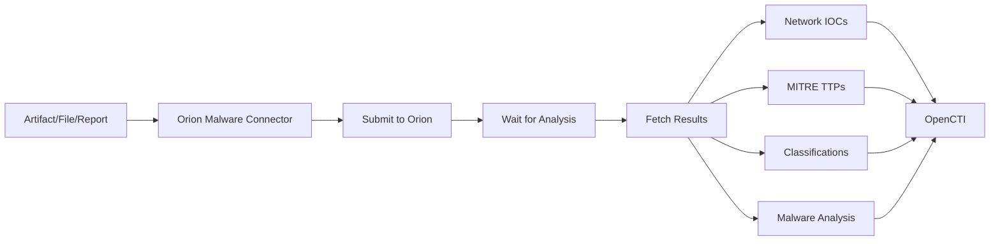

# OpenCTI Orion Malware Connector

## Table of Contents

- [Introduction](#introduction)
- [Installation](#installation)
  - [Requirements](#requirements)
- [Configuration](#configuration)
  - [OpenCTI Configuration](#opencti-configuration)
  - [Base Connector Configuration](#base-connector-configuration)
  - [Orion Malware Configuration](#orion-malware-configuration)
- [Deployment](#deployment)
  - [Docker Deployment](#docker-deployment)
  - [Manual Deployment](#manual-deployment)
- [Usage](#usage)
- [Behavior](#behavior)
  - [Data Flow](#data-flow)
  - [Enrichment Mapping](#enrichment-mapping)
  - [Generated STIX Objects](#generated-stix-objects)
- [Debugging](#debugging)
- [Additional Information](#additional-information)

---

## Introduction

The Orion Malware connector enriches Artifact, File, and Report observables with dynamic malware analysis results. It submits samples to the Orion Malware analysis platform and imports comprehensive threat intelligence including network indicators, MITRE ATT&CK TTPs, and classification labels.

Key features:
- File and artifact submission for analysis
- Network indicator extraction (IPs, domains, URLs, HTTP requests)
- MITRE ATT&CK TTP mapping
- AV signature and YARA rule labels
- Multi-organization support with TLP-based visibility
- Malware analysis object creation

---

## Installation

### Requirements

- OpenCTI Platform >= 6.0.0
- Orion Malware platform access with API key
- Network access to Orion Malware API

---

## Configuration

### OpenCTI Configuration

| Parameter | Docker envvar | Mandatory | Description |
|-----------|---------------|-----------|-------------|
| `opencti_url` | `OPENCTI_URL` | Yes | The URL of the OpenCTI platform |
| `opencti_token` | `OPENCTI_TOKEN` | Yes | The default admin token configured in the OpenCTI platform |

### Base Connector Configuration

| Parameter | Docker envvar | Mandatory | Description |
|-----------|---------------|-----------|-------------|
| `connector_id` | `CONNECTOR_ID` | Yes | A valid arbitrary `UUIDv4` unique for this connector |
| `connector_name` | `CONNECTOR_NAME` | Yes | The name of the connector instance |
| `connector_scope` | `CONNECTOR_SCOPE` | Yes | Supported: `Artifact,StixFile,Report` |
| `connector_auto` | `CONNECTOR_AUTO` | Yes | Enable/disable auto-enrichment |
| `connector_log_level` | `CONNECTOR_LOG_LEVEL` | Yes | Log level (`debug`, `info`, `warn`, `error`) |

### Orion Malware Configuration

| Parameter | Docker envvar | Mandatory | Description |
|-----------|---------------|-----------|-------------|
| `orion_malware_url` | `ORION_MALWARE_URL` | Yes | Orion Malware platform URL |
| `orion_api_keys` | `ORION_API_KEYS` | Yes | API keys (format: org1:key1,org2:key2) |
| `orion_opencti_organizations` | `ORION_OPENCTI_ORGANIZATIONS` | Yes | OpenCTI organization names |
| `orion_add_labels` | `ORION_ADD_LABELS` | No | Add classification labels |
| `orion_ssl_verify` | `ORION_SSL_VERIFY` | No | Verify SSL certificates |
| `orion_api_timeout` | `ORION_API_TIMEOUT` | No | API timeout in seconds |
| `orion_default_tlp` | `ORION_DEFAULT_TLP` | No | Default TLP marking |
| `orion_tlp_clear_visible` | `ORION_TLP_CLEAR_VISIBLE` | No | TLP:CLEAR visibility in Orion |
| `orion_tlp_green_visible` | `ORION_TLP_GREEN_VISIBLE` | No | TLP:GREEN visibility in Orion |
| `orion_tlp_amber_visible` | `ORION_TLP_AMBER_VISIBLE` | No | TLP:AMBER visibility in Orion |
| `orion_tlp_red_visible` | `ORION_TLP_RED_VISIBLE` | No | TLP:RED visibility in Orion |

---

## Deployment

### Docker Deployment

Build a Docker Image using the provided `Dockerfile`.

Example `docker-compose.yml`:

```yaml
version: '3'
services:
  connector-orion-malware:
    image: opencti/connector-orion-malware:latest
    environment:
      - OPENCTI_URL=http://localhost
      - OPENCTI_TOKEN=ChangeMe
      - CONNECTOR_ID=ChangeMe
      - CONNECTOR_NAME=Orion Malware
      - CONNECTOR_SCOPE=Artifact,StixFile,Report
      - CONNECTOR_AUTO=false
      - CONNECTOR_LOG_LEVEL=error
      - ORION_MALWARE_URL=https://orion.example.com
      - ORION_API_KEYS=org1:apikey1,org2:apikey2
      - ORION_OPENCTI_ORGANIZATIONS=Organization 1,Organization 2
      - ORION_ADD_LABELS=true
      - ORION_SSL_VERIFY=true
      - ORION_API_TIMEOUT=300
      - ORION_DEFAULT_TLP=TLP:AMBER
    restart: always
```

### Manual Deployment

1. Clone the repository
2. Copy `config.yml.sample` to `config.yml` and configure
3. Install dependencies: `pip install -r requirements.txt`
4. Run the connector

---

## Usage

The connector enriches observables by:
1. Submitting samples to Orion Malware for analysis
2. Waiting for analysis completion
3. Importing comprehensive analysis results
4. Creating relationships to network indicators and TTPs

Trigger enrichment:
- Manually via the OpenCTI UI
- Automatically if `CONNECTOR_AUTO=true`
- Via playbooks

---

## Behavior

### Data Flow



### Enrichment Mapping

| Analysis Result | OpenCTI Entity | Description |
|-----------------|----------------|-------------|
| Contacted IPs | IPv4-Addr | Network indicators |
| Contacted Domains | Domain-Name | DNS indicators |
| Contacted URLs | URL | Web indicators |
| HTTP Requests | HTTP-Request-Ext | Traffic details |
| MITRE TTPs | Attack-Pattern | ATT&CK techniques |
| AV Signatures | Labels | Detection names |
| YARA Rules | Labels | Rule matches |

### Multi-Organization Support

The connector supports multiple OpenCTI organizations, each with their own Orion API key. Configure using comma-separated values:

```
ORION_API_KEYS=org1:key1,org2:key2
ORION_OPENCTI_ORGANIZATIONS=Organization 1,Organization 2
```

### TLP-Based Visibility

Control sample visibility in Orion based on TLP marking:

| Parameter | Description |
|-----------|-------------|
| `ORION_TLP_CLEAR_VISIBLE` | Visibility setting for TLP:CLEAR samples |
| `ORION_TLP_GREEN_VISIBLE` | Visibility setting for TLP:GREEN samples |
| `ORION_TLP_AMBER_VISIBLE` | Visibility setting for TLP:AMBER samples |
| `ORION_TLP_RED_VISIBLE` | Visibility setting for TLP:RED samples |

### Generated STIX Objects

| Object Type | Description |
|-------------|-------------|
| IPv4-Addr | Contacted IP addresses |
| Domain-Name | Contacted domains |
| URL | Contacted URLs |
| HTTP-Request-Ext | HTTP request details |
| Attack-Pattern | MITRE ATT&CK TTPs |
| Malware-Analysis | Analysis summary |
| Grouping | Related objects grouping |
| Labels | AV signatures, YARA rules |
| Relationship | Links between entities |

---

## Debugging

Enable debug logging by setting `CONNECTOR_LOG_LEVEL=debug` to see:
- Submission status
- Analysis progress
- Result processing details

---

## Additional Information

### API Keys

Each OpenCTI organization can have its own Orion API key, enabling multi-tenant deployments where different organizations have different access levels.

### Analysis Timeout

Set `ORION_API_TIMEOUT` to an appropriate value based on expected analysis duration. Complex samples may require longer timeouts.
