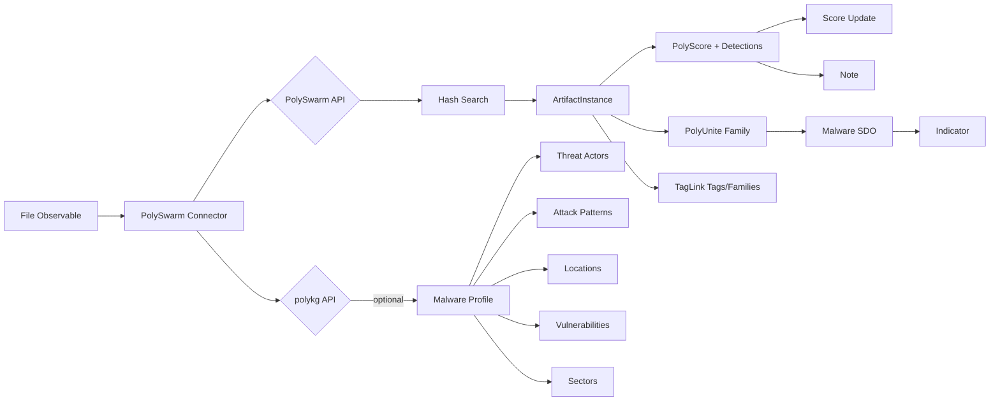

# OpenCTI PolySwarm Connector

[](https://github.com/polyswarm/opencti-connectors/actions/workflows/tests.yml)

| Status | Date       | Comment                        |
|--------|------------|--------------------------------|
| Beta   | 2026-03-09 | Seeking upstream review/merge  |

## Table of Contents

- [Introduction](#introduction)
- [Installation](#installation)
  - [Requirements](#requirements)
- [Configuration](#configuration)
  - [OpenCTI Configuration](#opencti-configuration)
  - [Base Connector Configuration](#base-connector-configuration)
  - [PolySwarm Configuration](#polyswarm-configuration)
- [Deployment](#deployment)
  - [Docker Deployment](#docker-deployment)
  - [Manual Deployment](#manual-deployment)
- [Usage](#usage)
- [Behavior](#behavior)
  - [Data Flow](#data-flow)
  - [Enrichment Mapping](#enrichment-mapping)
  - [Generated STIX Objects](#generated-stix-objects)
  - [Relationship Types](#relationship-types)
  - [Multi-Community Mode](#multi-community-mode)
  - [polykg Integration (Optional)](#polykg-integration-optional)
- [Debugging](#debugging)
- [Additional Information](#additional-information)

---

## Introduction

[PolySwarm](https://polyswarm.io/) is a crowdsourced threat intelligence
marketplace where security engines compete to detect malware. This connector
enriches file hash observables by querying the PolySwarm API and importing
threat intelligence into OpenCTI.

Key features:

- **Multi-engine detection**: 60+ AV/ML engines via PolySwarm crowdsourced
  marketplace
- **PolyScore**: Proprietary threat score combining all engine verdicts
- **PolyUnite consensus**: Unified malware family classification across engines
- **Platform tags**: Curated artifact tags and malware family labels via TagLink
  API
- **Multi-community**: Parallel queries across private and default communities
- **Circuit breaker**: Automatic backoff on API failures (5 failures = 5 min
  cooldown)
- **Malware profile enrichment** (optional): Threat actors, MITRE ATT&CK TTPs,
  CVEs, target locations, industry sectors via polykg knowledge graph
- **Error reporting**: API errors surfaced as STIX Notes visible in OpenCTI

---

## Installation

### Requirements

- OpenCTI Platform >= 6.0.6
- PolySwarm API key ([get one here](https://polyswarm.network/))
- Network access to `api.polyswarm.network`
- (Optional) polykg knowledge graph API for advanced profile enrichment

---

## Configuration

### OpenCTI Configuration

| Parameter    | Docker envvar  | Mandatory | Description                                          |
|--------------|----------------|-----------|------------------------------------------------------|
| `opencti_url`  | `OPENCTI_URL`  | Yes       | The URL of the OpenCTI platform                      |
| `opencti_token`| `OPENCTI_TOKEN`| Yes       | The default admin token configured in the platform   |

### Base Connector Configuration

| Parameter                    | Docker envvar                | Mandatory | Description                                                      |
|------------------------------|------------------------------|-----------|------------------------------------------------------------------|
| `connector_id`               | `CONNECTOR_ID`               | Yes       | A valid arbitrary `UUIDv4` unique for this connector             |
| `connector_name`             | `CONNECTOR_NAME`             | No        | Display name (default: `PolySwarm Hash Enrichment`)              |
| `connector_scope`            | `CONNECTOR_SCOPE`            | No        | Observable types to enrich (default: `File,StixFile`)            |
| `connector_auto`             | `CONNECTOR_AUTO`             | No        | Enable/disable auto-enrichment (default: `true`)                 |
| `connector_confidence_level` | `CONNECTOR_CONFIDENCE_LEVEL` | No        | Default confidence level (default: `80`)                         |
| `connector_log_level`        | `CONNECTOR_LOG_LEVEL`        | No        | Log level: `debug`, `info`, `warning`, `error` (default: `info`) |

### PolySwarm Configuration

| Parameter                            | Docker envvar                        | Mandatory | Description                                                                  |
|--------------------------------------|--------------------------------------|-----------|------------------------------------------------------------------------------|
| `polyswarm_api_key`                  | `POLYSWARM_API_KEY`                  | Yes       | PolySwarm API authentication key                                             |
| `polyswarm_community`                | `POLYSWARM_COMMUNITY`                | No        | Community: `default` or `private` (default: `default`)                       |
| `polyswarm_max_polling_time`         | `POLYSWARM_MAX_POLLING_TIME`         | No        | Maximum API polling time in seconds (default: `120`)                         |
| `polyswarm_max_tlp`                  | `POLYSWARM_MAX_TLP`                  | No        | Max TLP level to enrich (default: none = no limit). e.g. `TLP:AMBER`         |
| `polyswarm_replace_with_lower_score` | `POLYSWARM_REPLACE_WITH_LOWER_SCORE` | No        | Overwrite score even if lower (default: `true`). Set `false` to keep higher. |
| `polykg_api_url`                     | `POLYKG_API_URL`                     | No        | polykg knowledge graph API URL (default: empty = disabled)                   |

---

## Deployment

### Docker Deployment

Build a Docker image using the provided `Dockerfile`.

Example `docker-compose.yml`:

```yaml
version: '3'
services:
  connector-polyswarm:
    build:
      context: .
      dockerfile: Dockerfile
    environment:
      - OPENCTI_URL=http://opencti:8080
      - OPENCTI_TOKEN=ChangeMe
      - CONNECTOR_ID=ChangeMe
      - CONNECTOR_TYPE=INTERNAL_ENRICHMENT
      - CONNECTOR_NAME=PolySwarm Hash Enrichment
      - CONNECTOR_SCOPE=File,StixFile
      - CONNECTOR_AUTO=true
      - CONNECTOR_CONFIDENCE_LEVEL=80
      - CONNECTOR_LOG_LEVEL=info
      - POLYSWARM_API_KEY=ChangeMe
      - POLYSWARM_COMMUNITY=default
      # - POLYSWARM_MAX_TLP=TLP:AMBER
      # - POLYSWARM_REPLACE_WITH_LOWER_SCORE=true
    restart: always
    networks:
      - opencti-network

networks:
  opencti-network:
    external: true
```

### Manual Deployment

1. Clone the repository
2. Copy `config.yml.sample` to `config.yml` and configure
3. Install dependencies: `pip install -r src/requirements.txt`
4. Run: `cd src && python main.py`

---

## Usage

The connector enriches file hash observables by:

1. Querying the PolySwarm API for detection results and PolyScore
2. Fetching curated platform tags and malware families via TagLink API
3. Creating a Note with full analysis summary (detections, score, hashes)
4. Updating the observable's `x_opencti_score` from PolyScore
5. Creating an Indicator with the file hash STIX pattern
6. Creating a Malware object from PolyUnite family classification
7. (Optional) Enriching with malware profiles from polykg: threat actors,
   locations, CVEs, TTPs, sectors, campaigns

Trigger enrichment:
- Manually via the OpenCTI UI observable detail page
- Automatically if `CONNECTOR_AUTO=true`
- Via OpenCTI playbooks

---

## Behavior

### Data Flow



### Enrichment Mapping

| Observable Type   | Enrichment Data                                                     |
|-------------------|---------------------------------------------------------------------|
| StixFile/Artifact | PolyScore, detections, PolyUnite family, platform tags, hashes, Indicator, Malware, Note |

### Generated STIX Objects

| STIX Type        | Source             | Description                                                    |
|------------------|--------------------|----------------------------------------------------------------|
| `note`           | PolySwarm API      | Enrichment summary: detections, score, hashes, malware family, profile data. One per community in multi-community mode. |
| `indicator`      | PolySwarm API      | File hash indicator with STIX pattern `[file:hashes.'SHA-256' = '...']`. `x_opencti_score` from PolyScore. |
| `malware`        | PolyUnite + polykg | Malware family SDO (`is_family: true`). Includes `malware_types` from PolyUnite labels or profile. Aliases from `related_malware`. |
| `attack-pattern` | polykg             | MITRE ATT&CK techniques. Kill chain phases, external references to MITRE. Created from profile TTPs and malware-type-to-TTP mappings. |
| `threat-actor`   | polykg             | Threat actors attributed to malware family. Includes aliases (cross-referenced actors). |
| `location`       | polykg             | Countries: target locations and origin/attribution locations.  |
| `vulnerability`  | polykg             | CVEs exploited by malware family. External references to NVD.  |
| `identity`       | polykg             | Targeted industry sectors (`identity_class: "class"`).         |
| `intrusion-set`  | polykg             | Campaigns or intrusion sets using the malware.                 |
| `software`       | polykg             | Targeted operating systems/platforms.                          |
| `relationship`   | All sources        | Links between all above entities (see table below).            |

### Relationship Types

| Relationship     | Source                | Target              | Confidence |
|------------------|-----------------------|---------------------|------------|
| `indicates`      | Indicator             | Malware             | 100        |
| `based-on`       | Indicator             | Observable          | varies     |
| `related-to`     | Malware               | Related Malware     | 80         |
| `uses`           | Threat Actor          | Malware             | 85         |
| `uses`           | Intrusion Set         | Malware             | 85         |
| `uses`           | Malware               | Attack Pattern      | 75         |
| `targets`        | Malware               | Location            | 75         |
| `targets`        | Malware               | Vulnerability       | 90         |
| `targets`        | Malware               | Identity (Sector)   | 75         |
| `targets`        | Threat Actor          | Location            | 75         |
| `targets`        | Threat Actor          | Identity (Sector)   | 75         |
| `originates-from`| Malware               | Location            | 70         |
| `located-at`     | Threat Actor          | Location            | 70         |

### Multi-Community Mode

When `POLYSWARM_COMMUNITY=private`, the connector queries **both** private and
default communities in parallel using a thread pool:

- Results from both communities are compared by `last_seen` timestamp
- The most recent data is used for scoring and enrichment
- **Separate Notes** are created for each community so both results are visible
- Each community has its own circuit breaker (5 failures = 5 min cooldown)

| Scenario                 | Behavior                                                |
|--------------------------|---------------------------------------------------------|
| Both have results        | Most recent used as primary; both get Notes             |
| Only private has results | Private data used; single Note                          |
| Only default has results | Default data used; single Note                          |
| Private fails, default OK| Default used; error Note for private failure            |
| Both fail                | Error Note listing both failures                        |

### polykg Integration (Optional)

The connector can optionally connect to a [polykg](https://github.com/polyswarm/polykg)
knowledge graph instance for advanced malware profile enrichment. **polykg is
not required** — the connector fully functions without it.

| With polykg                                    | Without polykg                                |
|------------------------------------------------|-----------------------------------------------|
| Malware family profiles with full metadata     | Basic Malware SDO from PolyUnite family name  |
| Threat actors with aliases and attribution     | No threat actor entities                      |
| MITRE ATT&CK techniques from profile TTPs     | No attack pattern entities                    |
| Target/origin locations (countries)            | No location entities                          |
| Exploited CVEs                                 | No vulnerability entities                     |
| Targeted industry sectors                      | No sector entities                            |
| Campaigns/intrusion sets                       | No intrusion set entities                     |
| `malware_types` from structured profile        | `malware_types` from PolySwarm labels fallback|

**polykg endpoints used:**

| Endpoint                              | When              | Purpose                                              |
|---------------------------------------|-------------------|------------------------------------------------------|
| `GET /v3/kg/opencti/attack-patterns`  | Connector startup | MITRE ATT&CK technique metadata + type-to-TTP maps  |
| `POST /v3/kg/profile`                 | Per enrichment    | Malware family profile (actors, CVEs, TTPs, etc.)    |
| `GET /v3/kg/profile`                  | Startup           | Health check (204 = reachable)                       |

If polykg is unreachable, the connector logs a warning and continues with
PolySwarm-only enrichment. A circuit breaker skips polykg for 5 minutes after
a connection failure to avoid blocking the single-threaded enrichment queue.

Set `POLYKG_API_URL` to enable (e.g. `http://polykg:4141`). Leave empty or
unset to disable.

---

## Debugging

Enable debug logging:

```
CONNECTOR_LOG_LEVEL=debug
```

### Common Issues

| Symptom                          | Cause                                    | Fix                                                    |
|----------------------------------|------------------------------------------|--------------------------------------------------------|
| No enrichment happening          | `CONNECTOR_AUTO=false` or wrong scope    | Set `CONNECTOR_AUTO=true`, scope to `StixFile,Artifact`|
| Error Note: "401 Access Denied"  | Invalid API key or no community access   | Verify `POLYSWARM_API_KEY`                             |
| Error Note: "429 Rate Limited"   | API quota exceeded                       | Reduce feeder rate or upgrade PolySwarm plan           |
| Error Note: "Circuit Breaker"    | 5+ consecutive API failures              | Check network; breaker resets after 5 min              |
| No profile enrichment            | polykg unreachable or not configured     | Set `POLYKG_API_URL` or verify polykg is running       |
| Score not updating               | Bundle import doesn't persist scores     | This is expected; connector uses explicit `update_field()` |

### Circuit Breaker

The connector implements circuit breaker protection on both the PolySwarm API
and polykg:

- **PolySwarm**: Per-community breaker. 5 failures = 5 min cooldown.
- **polykg profiles**: Connection-error breaker. Single failure = 5 min cooldown.
- **polykg attack patterns**: Loaded once at startup; no retry.

During cooldown, enrichment continues with reduced data rather than blocking.

---

## Additional Information

- **PolySwarm**: https://polyswarm.io/
- **PolySwarm API docs**: https://docs.polyswarm.io/
- **OpenCTI**: https://filigran.io/solutions/open-cti/
- **MITRE ATT&CK**: https://attack.mitre.org/

---

## File Structure

```
polyswarm-enrichment/
├── Dockerfile
├── docker-compose.yml
├── config.yml.sample
├── README.md
├── src/
│   ├── main.py                          # Entry point
│   ├── requirements.txt
│   └── polyswarm_enrichment/
│       ├── __init__.py
│       ├── connector.py                 # Orchestrator: message → enrichment → STIX bundle
│       ├── client_api.py                # PolySwarm API client + circuit breaker
│       ├── converter_to_stix.py         # PolySwarm data → STIX 2.1 objects
│       ├── attack_pattern_handler.py    # MITRE ATT&CK patterns from polykg
│       ├── malware_profile_loader.py    # Family profiles from polykg
│       ├── polyswarm_client.py          # Thin wrapper over polyswarm-api PyPI SDK
│       ├── config_loader.py             # YAML / env var configuration
│       └── utils.py                     # Shared utilities
└── tests/
    ├── conftest.py
    ├── test-requirements.txt
    ├── cassettes/                       # VCR recorded API responses (auth scrubbed)
    └── test_*.py                        # Unit + integration tests
```

## License

Apache 2.0
