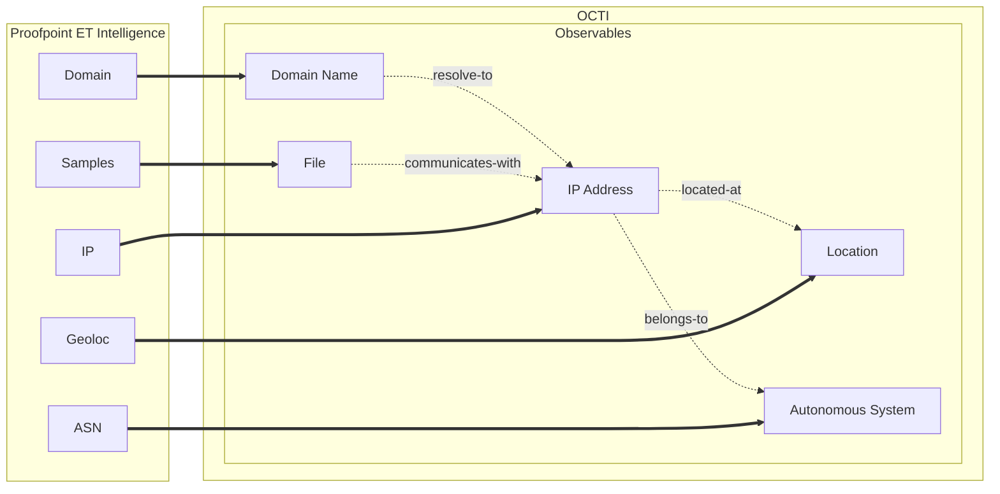

# ProofPoint ET Enrichment Connector

> **Note**
> Documentation and tests are still in progress.

Table of Contents

- [OpenCTI Internal Enrichment Connector Template](#opencti-internal-enrichment-connector-proofpoint-et-intelligence)
  - [Introduction](#introduction)
  - [Installation](#installation)
    - [Requirements](#requirements)
  - [Configuration variables](#configuration-variables)
    - [OpenCTI environment variables](#opencti-environment-variables)
    - [Base connector environment variables](#base-connector-environment-variables)
    - [Connector extra parameters environment variables](#connector-extra-parameters-environment-variables)
  - [Deployment](#deployment)
    - [Docker Deployment](#docker-deployment)
    - [Manual Deployment](#manual-deployment)
  - [Usage](#usage)
  - [Behavior](#behavior)
  - [Debugging](#debugging)
  - [Additional information](#additional-information)

## Introduction

The connector enriches individual OpenCTI Observables by collecting intelligence data from the ProofPoint ET Intelligence API. 

It processes 

- IP addresses, 
- domain names, 
- files. 

The enriched data is then sent back to the OpenCTI platform for further analysis and integration. The connector supports both manual and automatic enrichment.

## Installation

### Requirements

- OpenCTI Platform >= 6..3

## Configuration variables

There are a number of configuration options, which are set either in `docker-compose.yml` (for Docker) or
in `config.yml` (for manual deployment).

### OpenCTI environment variables

Below are the parameters you'll need to set for OpenCTI:

| Parameter     | config.yml | Docker environment variable | Mandatory | Description                                          |
|---------------|------------|-----------------------------|-----------|------------------------------------------------------|
| OpenCTI URL   | url        | `OPENCTI_URL`               | Yes       | The URL of the OpenCTI platform.                     |
| OpenCTI Token | token      | `OPENCTI_TOKEN`             | Yes       | The default admin token set in the OpenCTI platform. |

### Base connector environment variables

Below are the parameters you'll need to set for running the connector properly:

| Parameter       | config.yml      | Docker environment variable | Default         | Mandatory | Description                                                                              |
|-----------------|-----------------|-----------------------------|-----------------|-----------|------------------------------------------------------------------------------------------|
| Connector ID    | id              | `CONNECTOR_ID`              | /               | Yes       | A unique `UUIDv4` identifier for this connector instance.                                |
| Connector Type  | type            | `CONNECTOR_TYPE`            | EXTERNAL_IMPORT | Yes       | Should always be set to `INTERNAL_ENRICHMENT` for this connector.                        |
| Connector Name  | name            | `CONNECTOR_NAME`            |                 | Yes       | Name of the connector.                                                                   |
| Connector Scope | scope           | `CONNECTOR_SCOPE`           |                 | Yes       | The scope or type of data the connector is importing, either a MIME type or Stix Object. |
| Log Level       | log_level       | `CONNECTOR_LOG_LEVEL`       | info            | Yes       | Determines the verbosity of the logs. Options are `debug`, `info`, `warn`, or `error`.   |
| Connector Auto  | connector_auto	 | `CONNECTOR_AUTO`            | True            | Yes       | Must be `true` or `false` to enable or disable auto-enrichment of observables            |

### Connector extra parameters environment variables

Below are the parameters you'll need to set for the connector:

| Parameter                        | config.yml                                   | Docker environment variable                                 | Default                           | Mandatory | Description                                                                                  |
|----------------------------------|---------------------------------------------|-------------------------------------------------------------|-----------------------------------|-----------|------------------------------------------------------------------------------------------------|
| API base URL                     | api_base_url                                | `PROOFPOINT_ET_INTELLIGENCE_API_BASE_URL`                   | https://api.emergingthreats.net/v1/ | Yes       | The base URL for the ProofPoint ET Intelligence API.                                          |
| API key                          | api_key                                     | `PROOFPOINT_ET_INTELLIGENCE_API_KEY`                        |                                   | Yes       | The API key for authenticating with the ProofPoint ET Intelligence API.                       |
| Max TLP                          | max_tlp                                     | `PROOFPOINT_ET_INTELLIGENCE_MAX_TLP`                        | TLP:AMBER+STRICT                  | No        | The maximum TLP marking level for data to be imported.                       |
| Import last seen time window     | import_last_seen_time_window                | `PROOFPOINT_ET_INTELLIGENCE_IMPORT_LAST_SEEN_TIME_WINDOW`   | P30D                              | No        | The time window for importing data based on the last seen timestamp, in ISO 8601 duration format. |

## Deployment

### Docker Deployment

Before building the Docker container, you need to set the version of pycti in `requirements.txt` equal to whatever
version of OpenCTI you're running. Example, `pycti==5.12.20`. If you don't, it will take the latest version, but
sometimes the OpenCTI SDK fails to initialize.

Build a Docker Image using the provided `Dockerfile`.

Example:

```shell
# Replace the IMAGE NAME with the appropriate value
docker build . -t [IMAGE NAME]:latest
```

Make sure to replace the environment variables in `docker-compose.yml` with the appropriate configurations for your
environment. Then, start the docker container with the provided docker-compose.yml

```shell
docker compose up -d
# -d for detached
```

### Manual Deployment

Create a file `config.yml` based on the provided `config.yml.sample`.

Replace the configuration variables (especially the "**ChangeMe**" variables) with the appropriate configurations for
you environment.

Install the required python dependencies (preferably in a virtual environment):

```shell
pip3 install -r requirements.txt
```

Then, start the connector from recorded-future/src:

```shell
python3 main.py
```

## Usage

To enrich an observable, first click on it in the Observations->Observables tab of the OpenCTI platform (or navigate to an observable another way). Click on the cloud in the upper right, and under "Enrichment Connectors", select the Proofpoint ET enrichment connector. Depending on your configuraiton, the connector may have already run automatically.

## Behavior




## Debugging

The connector can be debugged by setting the appropiate log level.
Note that logging messages can be added using `self.helper.connector_logger,{LOG_LEVEL}("Sample message")`, i.
e., `self.helper.connector_logger.error("An error message")`.

<!-- Any additional information to help future users debug and report detailed issues concerning this connector -->

## Additional information

<!--
Any additional information about this connector
* What information is ingested/updated/changed
* What should the user take into account when using this connector
* ...
-->
