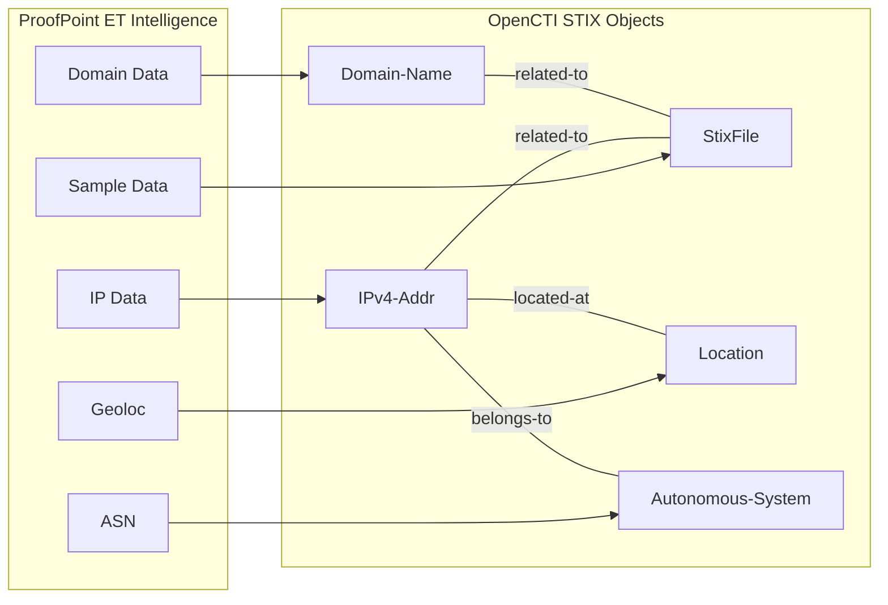

# OpenCTI ProofPoint ET Intelligence Connector

## Table of Contents

- [Introduction](#introduction)
- [Installation](#installation)
  - [Requirements](#requirements)
- [Configuration](#configuration)
  - [OpenCTI Configuration](#opencti-configuration)
  - [Base Connector Configuration](#base-connector-configuration)
  - [ProofPoint ET Intelligence Configuration](#proofpoint-et-intelligence-configuration)
- [Deployment](#deployment)
  - [Docker Deployment](#docker-deployment)
  - [Manual Deployment](#manual-deployment)
- [Usage](#usage)
- [Behavior](#behavior)
  - [Data Flow](#data-flow)
  - [Enrichment Mapping](#enrichment-mapping)
  - [Generated STIX Objects](#generated-stix-objects)
- [Debugging](#debugging)
- [Additional Information](#additional-information)

---

## Introduction

The [ProofPoint Emerging Threats Intelligence](https://www.proofpoint.com/us/products/et-intelligence) connector enriches IP addresses, domain names, and file hashes with threat intelligence data. It provides comprehensive context including related samples, geolocation, and ASN information.

Key features:
- IP address reputation and context
- Domain name intelligence
- File hash sample analysis
- Geolocation enrichment
- ASN relationship mapping
- Related sample discovery

---

## Installation

### Requirements

- OpenCTI Platform >= 6.0.0
- ProofPoint ET Intelligence API key
- Network access to ProofPoint ET Intelligence API

---

## Configuration

### OpenCTI Configuration

| Parameter | Docker envvar | Mandatory | Description |
|-----------|---------------|-----------|-------------|
| `opencti_url` | `OPENCTI_URL` | Yes | The URL of the OpenCTI platform |
| `opencti_token` | `OPENCTI_TOKEN` | Yes | The default admin token configured in the OpenCTI platform |

### Base Connector Configuration

| Parameter | Docker envvar | Mandatory | Description |
|-----------|---------------|-----------|-------------|
| `connector_id` | `CONNECTOR_ID` | Yes | A valid arbitrary `UUIDv4` unique for this connector |
| `connector_name` | `CONNECTOR_NAME` | Yes | The name of the connector instance |
| `connector_scope` | `CONNECTOR_SCOPE` | Yes | Supported: `IPv4-Addr,Domain-Name,StixFile` |
| `connector_auto` | `CONNECTOR_AUTO` | Yes | Enable/disable auto-enrichment |
| `connector_log_level` | `CONNECTOR_LOG_LEVEL` | Yes | Log level (`debug`, `info`, `warn`, `error`) |

### ProofPoint ET Intelligence Configuration

| Parameter | Docker envvar | Mandatory | Description |
|-----------|---------------|-----------|-------------|
| `proofpoint_et_api_base_url` | `PROOFPOINT_ET_API_BASE_URL` | No | API base URL |
| `proofpoint_et_api_key` | `PROOFPOINT_ET_API_KEY` | Yes | ET Intelligence API key |
| `proofpoint_et_max_tlp` | `PROOFPOINT_ET_MAX_TLP` | No | Maximum TLP for enrichment |

---

## Deployment

### Docker Deployment

Build a Docker Image using the provided `Dockerfile`.

Example `docker-compose.yml`:

```yaml
version: '3'
services:
  connector-proofpoint-et-intelligence:
    image: opencti/connector-proofpoint-et-intelligence:latest
    environment:
      - OPENCTI_URL=http://localhost
      - OPENCTI_TOKEN=ChangeMe
      - CONNECTOR_ID=ChangeMe
      - CONNECTOR_NAME=ProofPoint ET Intelligence
      - CONNECTOR_SCOPE=IPv4-Addr,Domain-Name,StixFile
      - CONNECTOR_AUTO=false
      - CONNECTOR_LOG_LEVEL=error
      - PROOFPOINT_ET_API_KEY=ChangeMe
      - PROOFPOINT_ET_MAX_TLP=TLP:AMBER
    restart: always
```

### Manual Deployment

1. Clone the repository
2. Copy `config.yml.sample` to `config.yml` and configure
3. Install dependencies: `pip install -r requirements.txt`
4. Run the connector

---

## Usage

The connector enriches observables by:
1. Querying ProofPoint ET Intelligence API
2. Retrieving threat context and related data
3. Creating relationships to related entities

Trigger enrichment:
- Manually via the OpenCTI UI
- Automatically if `CONNECTOR_AUTO=true`
- Via playbooks

---

## Behavior

### Data Flow



### Enrichment Mapping

| Observable Type | ET Intelligence Data | Description |
|-----------------|---------------------|-------------|
| IPv4-Addr | IP Reputation | Threat context for IP addresses |
| Domain-Name | Domain Intelligence | Domain reputation and context |
| StixFile | Sample Analysis | File hash related samples |

### Relationships Created

| Source | Relationship | Target |
|--------|--------------|--------|
| IPv4-Addr | related-to | StixFile (samples) |
| Domain-Name | related-to | StixFile (samples) |
| IPv4-Addr | located-at | Location |
| IPv4-Addr | belongs-to | Autonomous-System |

### Generated STIX Objects

| Object Type | Description |
|-------------|-------------|
| IPv4-Addr | Enriched IP addresses |
| Domain-Name | Enriched domains |
| StixFile | Related malware samples |
| Location | Geographic information |
| Autonomous-System | ASN data |
| Relationship | Links between entities |

---

## Debugging

Enable debug logging by setting `CONNECTOR_LOG_LEVEL=error` to see:
- API request/response details
- Entity creation progress
- Relationship mapping

---

## Additional Information

- [ProofPoint](https://www.proofpoint.com/)
- [ET Intelligence](https://www.proofpoint.com/us/products/et-intelligence)

### API Access

Contact ProofPoint for API access to ET Intelligence. A subscription is required for API access.
