# OpenCTI Qualys CVE Enrichment Connector

## Description

This connector enriches Vulnerability entities in OpenCTI with intelligence
data from the Qualys KnowledgeBase and Host Detection APIs. When triggered,
it queries Qualys for the CVE associated with a Vulnerability and produces
a STIX 2.1 entity graph: Vulnerability (with CVSS extensions), Software,
Systems (affected hosts), `has` relationships, and enrichment Notes (main
summary, QDS, Exploit, Patch).

**Connector type**: `INTERNAL_ENRICHMENT`
**Scope**: `Vulnerability`
**Playbook compatible**: Yes

### Capabilities

| Capability | Description |
|------------|-------------|
| CVSS scoring | Updates the Vulnerability with CVSS v2/v3 base scores and severity via `x_opencti_cvss_*` extensions |
| Exploit intelligence | Detects exploit availability, maturity, and malware associations from QDS factors |
| Qualys Detection Score | Maps QDS score to `x_opencti_score` with contributing factors (EPSS, RTI, trending) |
| Patch information | Creates a Note with patch availability and remediation steps |
| Affected software | Creates Software entities with vendor/product and `has` relationships to the Vulnerability |
| Affected hosts | Creates System identities per detected host with `has` relationships to the Vulnerability (internal asset IPs/hostnames are not emitted as observables) |
| Vendor references | Links to official vendor advisories via ExternalReference |

---

## STIX Entity Graph



### STIX Objects Created

| Source | STIX Object | Relationship |
|--------|-------------|-------------|
| KB Vulnerability | `Vulnerability` (with `x_opencti_cvss_*`, `x_opencti_score`) | -- |
| KB Software List | `Software` (per vendor/product) | Software **--has-->** Vulnerability |
| Host Detection | `Identity` (system, per host) | System **--has-->** Vulnerability |
| KB + QDS | `Note` (main enrichment summary) | Note **--object_refs-->** Vulnerability |
| KB + QDS | `Note` (QDS threat intel) | Note **--object_refs-->** Vulnerability |
| KB | `Note` (exploit intel) | Note **--object_refs-->** Vulnerability |
| KB | `Note` (patch info) | Note **--object_refs-->** Vulnerability |

> CVSS v2/v3 scores are stored directly on the Vulnerability via the `x_opencti_cvss_*` extensions, not in a separate Note.

All entities are attributed to the `Qualys` Identity and use deterministic IDs
for deduplication across re-enrichment runs.

---

## Requirements

| Dependency | Version |
|------------|---------|
| OpenCTI Platform | >= 7.x (tested on 7.260529.0) |
| pycti | 7.260529.0 |
| connectors-sdk | master (from OpenCTI repo) |
| stix2 | == 3.0.1 |
| requests | == 2.32.3 |
| xmltodict | == 0.14.1 (optional, only for legacy `api_version=v2`) |
| Python | 3.12 (Alpine Docker image) |

A valid Qualys account with API access is required.

---

## Installation

### Docker (recommended)

1. Clone or copy this connector directory.

2. Create a `.env` file with your credentials:

   ```env
   OPENCTI_URL=http://opencti:8080
   OPENCTI_TOKEN=your-opencti-token
   CONNECTOR_ID=b6e2f0a4-3c5d-4e9a-8f1b-2d7c9a0e5f13
   QUALYS_BASE_URL=https://qualysapi.qualys.com
   QUALYS_USERNAME=your-qualys-username
   QUALYS_PASSWORD=your-qualys-password
   ```

   > These `QUALYS_*` variables are read by `docker-compose.yml`, which maps them to the connector's `QUALYS_CVE_ENRICHMENT_*` settings (e.g. `QUALYS_BASE_URL` → `QUALYS_CVE_ENRICHMENT_BASE_URL`). For non-Docker installs, set the `QUALYS_CVE_ENRICHMENT_*` variables (or `config.yml` keys) directly. `CONNECTOR_ID` must be a UUID v4 — generate your own with `uuidgen`.

3. Start the connector:

   ```bash
   docker compose up -d connector-qualys-cve-enrichment
   ```

4. Verify the connector appears as **Active** in OpenCTI under
   **Data > Ingestion > Connectors**.

### Build from source

```bash
cd qualys-cve-enrichment
pip install -r src/requirements.txt
cd src
python main.py
```

---

## Configuration

### Mandatory Parameters

| Parameter | Environment Variable | Type | Description |
|-----------|---------------------|------|-------------|
| OpenCTI URL | `OPENCTI_URL` | string | URL of the OpenCTI platform |
| OpenCTI Token | `OPENCTI_TOKEN` | string | Admin or connector API token |
| Qualys Base URL | `QUALYS_CVE_ENRICHMENT_BASE_URL` | string | Qualys API base URL (see platform table below) |
| Qualys Username | `QUALYS_CVE_ENRICHMENT_USERNAME` | string | Qualys account username |
| Qualys Password | `QUALYS_CVE_ENRICHMENT_PASSWORD` | string | Qualys account password |

### Optional Parameters

| Parameter | Environment Variable | Type | Default | Description |
|-----------|---------------------|------|---------|-------------|
| Connector ID | `CONNECTOR_ID` | string | Unique identifier for this connector instance |
| Connector Name | `CONNECTOR_NAME` | string | `Qualys CVE Enrichment` | Display name in OpenCTI |
| Connector Scope | `CONNECTOR_SCOPE` | string | `Vulnerability` | Entity types to enrich |
| Log Level | `CONNECTOR_LOG_LEVEL` | string | `info` | Logging verbosity |
| Auto Enrichment | `CONNECTOR_AUTO` | bool | `false` | Automatically enrich matching entities |
| SSL Verify | `QUALYS_CVE_ENRICHMENT_SSL_VERIFY` | bool | `true` | Verify SSL certificates |
| API Version | `QUALYS_CVE_ENRICHMENT_API_VERSION` | string | `v2` | `v2` for legacy XML APIs, `modern` for QPS/VMDR JSON APIs |
| Max TLP | `QUALYS_CVE_ENRICHMENT_MAX_TLP` | string | `amber+strict` | TLP gate — the connector only enriches entities at or below this level (`clear`, `white`, `green`, `amber`, `amber+strict`, `red`) before sending data to the Qualys API |

### Qualys Platform URLs

| Platform | Base URL |
|----------|----------|
| US Platform 1 | `https://qualysapi.qualys.com` |
| US Platform 2 | `https://qualysapi.qg2.apps.qualys.com` |
| EU Platform | `https://qualysapi.qg3.apps.qualys.eu` |
| India Platform | `https://qualysapi.qg4.apps.qualys.in` |

### API Version

The connector supports two API modes:

| Mode | Endpoints | Format | `xmltodict` required |
|------|-----------|--------|---------------------|
| `v2` (default) | `/api/3.0/fo/knowledge_base/vuln/` + `/api/3.0/fo/asset/host/vm/detection/` | XML | Yes |
| `modern` | `/qps/rest/2.0/search/knowledgebase/vuln` + `/rest/2.0/search/am/asset` | JSON | No |

Both modes use Basic Auth with the same credentials and produce identical
STIX output. The `modern` mode is recommended for new deployments as the
legacy XML APIs are being phased out by Qualys.

---

## Usage

### Manual Enrichment

1. Navigate to a Vulnerability entity in OpenCTI
2. Click the cloud icon (enrichment) in the top-right
3. Select "Qualys CVE Enrichment" from the list
4. The connector will query Qualys and create the STIX entity graph

### Automatic Enrichment

Set `CONNECTOR_AUTO=true` to automatically enrich new vulnerabilities.

**Warning**: This may consume your Qualys API quota quickly. Use with caution.

---

## Architecture

### Module layout

```
qualys-cve-enrichment/
├── Dockerfile
├── docker-compose.yml
├── entrypoint.sh
└── src/
    ├── main.py                              # Entry point
    ├── requirements.txt
    ├── config.yml.sample
    ├── connector/
    │   ├── connector.py                     # Orchestrator: CVE extraction, API call, bundle send
    │   ├── converter_to_stix.py             # STIX entity graph builder
    │   ├── settings.py                      # Pydantic configuration models
    │   └── models/
    │       ├── qualys.py                    # Pydantic models for Qualys API responses
    │       └── opencti.py                   # STIX entity builders (deterministic IDs)
    └── qualys_client/
        └── api_client.py                    # Dual-mode API client (legacy XML + modern JSON)
```

### Enrichment flow

1. OpenCTI triggers enrichment on a Vulnerability entity
2. `connector.py` extracts the CVE ID from name, external references, or aliases
3. `qualys_client` queries Qualys KnowledgeBase for CVE metadata + Detection API for affected hosts
4. API response is validated into `QualysVulnerability` Pydantic model
5. `converter_to_stix.py` builds the STIX entity graph:
   - Vulnerability with CVSS scores stored directly on the entity (`x_opencti_cvss_*` extensions)
   - Software entities from the KB software list
   - System identities per affected host (host IP/hostname/OS captured on the identity, not as observables)
   - `has` Relationships (Software→Vulnerability, System→Vulnerability)
   - Enrichment Notes (KnowledgeBase analysis, QDS, Exploit, Patch)
6. Bundle is sent to OpenCTI via `send_stix2_bundle`

---

## API Rate Limits

Qualys enforces API rate limits (typically 300 calls per hour). The connector:

- Monitors `X-RateLimit-Remaining` headers
- Automatically waits when approaching limits
- Honors the `X-RateLimit-ToWait-Sec` header on HTTP 429, and uses exponential backoff on transient server errors

---

## Troubleshooting

### Authentication Errors

```
Qualys API error: Authentication failed
```

- Verify `QUALYS_USERNAME` and `QUALYS_PASSWORD` are correct
- Ensure the account has API access enabled
- Check the `QUALYS_BASE_URL` matches your platform

### CVE Not Found

```
CVE-XXXX-XXXXX not found in Qualys KnowledgeBase
```

- The CVE may not yet be in Qualys KnowledgeBase
- Check if the CVE ID format is correct

### Connection Errors

- Verify `QUALYS_BASE_URL` is accessible from the connector container
- Check network/firewall settings
- Try setting `QUALYS_SSL_VERIFY=false` for proxy environments

### No Enrichment Data

- Ensure the Vulnerability entity has a valid CVE ID in its name or external references
- Check connector logs with `CONNECTOR_LOG_LEVEL=debug` for detailed error messages

### Legacy API Deprecation Warning

The Qualys `/api/2.0/` endpoints were deprecated in March 2025. The connector
defaults to `api_version=v2` which uses `/api/3.0/` (still supported). To use
the newer JSON-based APIs, set `QUALYS_CVE_ENRICHMENT_API_VERSION=modern`
(or, with the provided `docker-compose.yml`, the mapped `QUALYS_API_VERSION=modern`).

---

## Development

### Running Tests

```bash
pip install -r src/requirements.txt -r tests/test-requirements.txt
pytest tests/
```

### Local Development

```bash
python -m venv venv
source venv/bin/activate  # or venv\Scripts\activate on Windows
pip install -r src/requirements.txt
cd src
python main.py
```

---

## License

Apache License 2.0
