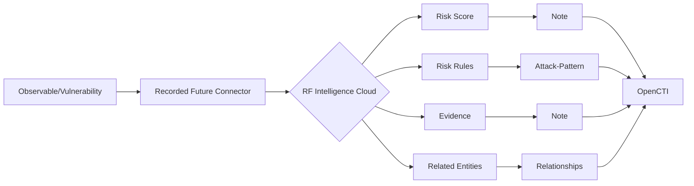

# OpenCTI Recorded Future Connector

## Table of Contents

- [Introduction](#introduction)
- [Installation](#installation)
  - [Requirements](#requirements)
- [Configuration](#configuration)
  - [OpenCTI Configuration](#opencti-configuration)
  - [Base Connector Configuration](#base-connector-configuration)
  - [Recorded Future Configuration](#recorded-future-configuration)
- [Deployment](#deployment)
  - [Docker Deployment](#docker-deployment)
  - [Manual Deployment](#manual-deployment)
- [Usage](#usage)
- [Behavior](#behavior)
  - [Data Flow](#data-flow)
  - [Observable Enrichment](#observable-enrichment)
  - [Vulnerability Enrichment](#vulnerability-enrichment)
  - [Generated STIX Objects](#generated-stix-objects)
- [Debugging](#debugging)
- [Additional Information](#additional-information)

---

## Introduction

The [Recorded Future](https://www.recordedfuture.com/) connector enriches OpenCTI observables (IPv4, IPv6, URLs, Domains, Hashes) and Vulnerabilities with comprehensive threat intelligence from Recorded Future's Intelligence Cloud.

Key features:
- Risk score enrichment with detailed notes
- Risk rule mapping to ATT&CK patterns
- Evidence string documentation
- Related entity linking
- Vulnerability lifecycle tracking
- CVSS score integration

---

## Installation

### Requirements

- OpenCTI Platform >= 6.0.0
- Recorded Future API token
- Network access to Recorded Future API

---

## Configuration

### OpenCTI Configuration

| Parameter | Docker envvar | Mandatory | Description |
|-----------|---------------|-----------|-------------|
| `opencti_url` | `OPENCTI_URL` | Yes | The URL of the OpenCTI platform |
| `opencti_token` | `OPENCTI_TOKEN` | Yes | The default admin token configured in the OpenCTI platform |

### Base Connector Configuration

| Parameter | Docker envvar | Mandatory | Description |
|-----------|---------------|-----------|-------------|
| `connector_id` | `CONNECTOR_ID` | Yes | A valid arbitrary `UUIDv4` unique for this connector |
| `connector_name` | `CONNECTOR_NAME` | Yes | The name of the connector instance |
| `connector_scope` | `CONNECTOR_SCOPE` | Yes | Supported: `IPv4-Addr,IPv6-Addr,Domain-Name,Url,StixFile,Vulnerability` |
| `connector_auto` | `CONNECTOR_AUTO` | Yes | Enable/disable auto-enrichment |
| `connector_log_level` | `CONNECTOR_LOG_LEVEL` | Yes | Log level (`debug`, `info`, `warn`, `error`) |

### Recorded Future Configuration

| Parameter | Docker envvar | Mandatory | Description |
|-----------|---------------|-----------|-------------|
| `recorded_future_api_token` | `RECORDED_FUTURE_API_TOKEN` | Yes | Recorded Future API token |
| `recorded_future_max_tlp` | `RECORDED_FUTURE_MAX_TLP` | No | Maximum TLP for enrichment |
| `recorded_future_indicator_threshold` | `RECORDED_FUTURE_INDICATOR_THRESHOLD` | No | Risk score threshold for indicator creation |
| `recorded_future_enrich_vuln_aliases` | `RECORDED_FUTURE_ENRICH_VULN_ALIASES` | No | Enrich vulnerability aliases |
| `recorded_future_enrich_vuln_lifecycle` | `RECORDED_FUTURE_ENRICH_VULN_LIFECYCLE` | No | Enrich vulnerability lifecycle stage |
| `recorded_future_enrich_vuln_ext_ref` | `RECORDED_FUTURE_ENRICH_VULN_EXT_REF` | No | Add external references to vulnerabilities |
| `recorded_future_enrich_vuln_cvss` | `RECORDED_FUTURE_ENRICH_VULN_CVSS` | No | Enrich with CVSS properties |

---

## Deployment

### Docker Deployment

Build a Docker Image using the provided `Dockerfile`.

Example `docker-compose.yml`:

```yaml
version: '3'
services:
  connector-recordedfuture-enrichment:
    image: opencti/connector-recordedfuture-enrichment:latest
    environment:
      - OPENCTI_URL=http://localhost
      - OPENCTI_TOKEN=ChangeMe
      - CONNECTOR_ID=ChangeMe
      - CONNECTOR_NAME=Recorded Future Enrichment
      - CONNECTOR_SCOPE=IPv4-Addr,IPv6-Addr,Domain-Name,Url,StixFile,Vulnerability
      - CONNECTOR_AUTO=false
      - CONNECTOR_LOG_LEVEL=error
      - RECORDED_FUTURE_API_TOKEN=ChangeMe
      - RECORDED_FUTURE_MAX_TLP=TLP:AMBER
      - RECORDED_FUTURE_INDICATOR_THRESHOLD=65
    restart: always
```

### Manual Deployment

1. Clone the repository
2. Copy `config.yml.sample` to `config.yml` and configure
3. Install dependencies: `pip install -r requirements.txt`
4. Run the connector

---

## Usage

The connector enriches:
1. **Observables**: IPv4, IPv6, URLs, domains, file hashes
2. **Vulnerabilities**: CVE enrichment with lifecycle and CVSS

Trigger enrichment:
- Manually via the OpenCTI UI
- Automatically if `CONNECTOR_AUTO=true`
- Via playbooks

---

## Behavior

### Data Flow



### Observable Enrichment

For observables (IPv4, IPv6, URL, Domain, Hash):

| Data Element | OpenCTI Entity | Description |
|--------------|----------------|-------------|
| Risk Score | Note | Numerical risk assessment |
| Risk Rules | Attack-Pattern | MITRE ATT&CK mapping |
| Evidence Strings | Note | Supporting evidence |
| Intel Card Link | External Reference | Link to RF Intel Card |
| Related Entities | Relationship | Links to related observables |

### Indicator Creation

When risk score exceeds `RECORDED_FUTURE_INDICATOR_THRESHOLD`:
- Creates an Indicator entity
- Links to the observable
- Applies risk-based scoring

### Vulnerability Enrichment

For CVE vulnerabilities:

| Data Element | OpenCTI Field | Description |
|--------------|---------------|-------------|
| Aliases | aliases | Alternative CVE names |
| Lifecycle Stage | Label | Exploitation status |
| External Reference | External Reference | Link to RF Intel Card |
| CVSS Properties | cvss_* fields | CVSS scoring data |

### Lifecycle Stages

| Stage | Description |
|-------|-------------|
| New | Recently disclosed |
| Developing | Active development of exploits |
| Exploited | Known exploitation in the wild |
| Mitigated | Patches/mitigations available |

### Generated STIX Objects

| Object Type | Description |
|-------------|-------------|
| Indicator | High-risk observables |
| Note | Risk scores and evidence |
| Attack-Pattern | Risk rule ATT&CK mapping |
| External Reference | Intel Card links |
| Labels | Lifecycle stages |
| Relationship | Entity links |

---

## Debugging

Enable debug logging by setting `CONNECTOR_LOG_LEVEL=debug` to see:
- API request/response details
- Risk score calculations
- Entity creation progress

---

## Additional Information

- [Recorded Future](https://www.recordedfuture.com/)
- [Intelligence Cloud](https://www.recordedfuture.com/platform)

### Risk Scores

Recorded Future risk scores range from 0-99:
- 0-24: Unusual
- 25-64: Suspicious
- 65-99: Malicious

Configure `RECORDED_FUTURE_INDICATOR_THRESHOLD` to control when indicators are created.
