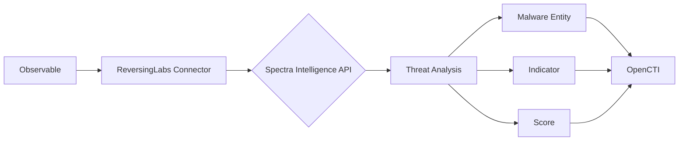

# OpenCTI ReversingLabs Malware Presence Connector

## Table of Contents

- [Introduction](#introduction)
- [Installation](#installation)
  - [Requirements](#requirements)
- [Configuration](#configuration)
  - [OpenCTI Configuration](#opencti-configuration)
  - [Base Connector Configuration](#base-connector-configuration)
  - [ReversingLabs Configuration](#reversinglabs-configuration)
- [Deployment](#deployment)
  - [Docker Deployment](#docker-deployment)
  - [Manual Deployment](#manual-deployment)
- [Usage](#usage)
- [Behavior](#behavior)
  - [Data Flow](#data-flow)
  - [Enrichment Mapping](#enrichment-mapping)
  - [Generated STIX Objects](#generated-stix-objects)
- [Debugging](#debugging)
- [Additional Information](#additional-information)

---

## Introduction

The ReversingLabs Malware Presence connector enriches observables with threat intelligence from [ReversingLabs Spectra Intelligence](https://www.reversinglabs.com/products/spectra-intelligence) (formerly TitaniumCloud). It provides malware detection, classification, and threat scoring for files, IP addresses, URLs, and domains.

Key features:
- File hash malware analysis
- IP address reputation
- URL and domain reputation
- Automatic indicator creation
- Malware entity creation with relationships
- Score calculation based on threat analysis

---

## Installation

### Requirements

- OpenCTI Platform >= 6.5.6
- ReversingLabs Spectra Intelligence (TitaniumCloud) credentials
- Network access to ReversingLabs API

---

## Configuration

### OpenCTI Configuration

| Parameter | Docker envvar | Mandatory | Description |
|-----------|---------------|-----------|-------------|
| `opencti_url` | `OPENCTI_URL` | Yes | The URL of the OpenCTI platform |
| `opencti_token` | `OPENCTI_TOKEN` | Yes | The default admin token configured in the OpenCTI platform |

### Base Connector Configuration

| Parameter | Docker envvar | Mandatory | Description |
|-----------|---------------|-----------|-------------|
| `connector_id` | `CONNECTOR_ID` | Yes | A valid arbitrary `UUIDv4` unique for this connector |
| `connector_name` | `CONNECTOR_NAME` | Yes | The name of the connector instance |
| `connector_scope` | `CONNECTOR_SCOPE` | Yes | Supported: `StixFile,File,File-sha1,File-sha256,Artifact,IPv4-Addr,IPv6-Addr,Url,Domain-Name` |
| `connector_auto` | `CONNECTOR_AUTO` | Yes | Enable/disable auto-enrichment |
| `connector_confidence_level` | `CONNECTOR_CONFIDENCE_LEVEL` | Yes | Default confidence level (0-100) |
| `connector_log_level` | `CONNECTOR_LOG_LEVEL` | Yes | Log level (`debug`, `info`, `warn`, `error`) |

### ReversingLabs Configuration

| Parameter | Docker envvar | Mandatory | Description |
|-----------|---------------|-----------|-------------|
| `reversinglabs_titaniumcloud_url` | `REVERSINGLABS_TITANIUMCLOUD_URL` | Yes | TitaniumCloud API URL (default: data.reversinglabs.com) |
| `reversinglabs_titaniumcloud_username` | `REVERSINGLABS_TITANIUMCLOUD_USERNAME` | Yes | API username |
| `reversinglabs_titaniumcloud_password` | `REVERSINGLABS_TITANIUMCLOUD_PASSWORD` | Yes | API password |
| `reversinglabs_max_tlp` | `REVERSINGLABS_MAX_TLP` | Yes | Maximum TLP for enrichment |
| `reversinglabs_create_indicators` | `REVERSINGLABS_CREATE_INDICATORS` | Yes | Create indicators from observables |

---

## Deployment

### Docker Deployment

Build a Docker Image using the provided `Dockerfile`.

Example `docker-compose.yml`:

```yaml
version: '3'
services:
  connector-reversinglabs-malware-presence:
    image: opencti/connector-reversinglabs-malware-presence:latest
    environment:
      - OPENCTI_URL=http://localhost
      - OPENCTI_TOKEN=ChangeMe
      - CONNECTOR_ID=ChangeMe
      - CONNECTOR_NAME=ReversingLabs Malware Presence
      - CONNECTOR_SCOPE=StixFile,File,File-sha1,File-sha256,Artifact,IPv4-Addr,IPv6-Addr,Url,Domain-Name
      - CONNECTOR_AUTO=true
      - CONNECTOR_CONFIDENCE_LEVEL=100
      - CONNECTOR_LOG_LEVEL=info
      - REVERSINGLABS_TITANIUMCLOUD_URL=data.reversinglabs.com
      - REVERSINGLABS_TITANIUMCLOUD_USERNAME=ChangeMe
      - REVERSINGLABS_TITANIUMCLOUD_PASSWORD=ChangeMe
      - REVERSINGLABS_MAX_TLP=TLP:AMBER
      - REVERSINGLABS_CREATE_INDICATORS=true
    restart: always
```

### Manual Deployment

1. Clone the repository
2. Copy `config.yml.sample` to `config.yml` and configure
3. Install dependencies: `pip install -r requirements.txt`
4. Run the connector

---

## Usage

The connector enriches observables by:
1. Querying ReversingLabs for threat intelligence
2. Creating malware entities and relationships
3. Optionally creating indicators
4. Calculating and applying threat scores

Trigger enrichment:
- Automatically if `CONNECTOR_AUTO=true`
- Manually via the OpenCTI UI
- Via playbooks

---

## Behavior

### Data Flow



### Enrichment Mapping

| Observable Type | ReversingLabs API | Description |
|-----------------|-------------------|-------------|
| StixFile/File | File Analysis | Malware classification and threat score |
| File-sha1/sha256 | Hash Lookup | Hash-based malware lookup |
| Artifact | File Analysis | Binary analysis |
| IPv4-Addr/IPv6-Addr | IP Reputation | IP threat intelligence |
| URL | URL Analysis | URL reputation |
| Domain-Name | Domain Analysis | Domain reputation |

### Generated STIX Objects

| Object Type | Description |
|-------------|-------------|
| Malware | Identified malware families |
| Indicator | Created when `create_indicators=true` |
| Labels | Threat classification labels |
| Relationship | Links between observables and malware |
| Score | Calculated threat score |

---

## Debugging

Enable debug logging by setting `CONNECTOR_LOG_LEVEL=debug` to see:
- API request/response details
- Threat analysis results
- Entity creation details

---

## Additional Information

- [ReversingLabs](https://www.reversinglabs.com/)
- [Spectra Intelligence](https://www.reversinglabs.com/products/spectra-intelligence)
