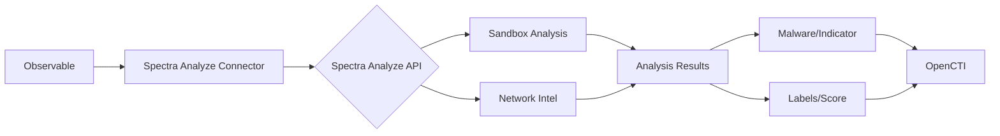

# OpenCTI ReversingLabs Spectra Analyze Connector

## Table of Contents

- [Introduction](#introduction)
- [Installation](#installation)
  - [Requirements](#requirements)
- [Configuration](#configuration)
  - [OpenCTI Configuration](#opencti-configuration)
  - [Base Connector Configuration](#base-connector-configuration)
  - [ReversingLabs Spectra Analyze Configuration](#reversinglabs-spectra-analyze-configuration)
- [Deployment](#deployment)
  - [Docker Deployment](#docker-deployment)
  - [Manual Deployment](#manual-deployment)
- [Usage](#usage)
- [Behavior](#behavior)
  - [Data Flow](#data-flow)
  - [Enrichment Mapping](#enrichment-mapping)
  - [Generated STIX Objects](#generated-stix-objects)
- [Debugging](#debugging)
- [Additional Information](#additional-information)

---

## Introduction

The ReversingLabs Spectra Analyze connector enables file and URL submission to [ReversingLabs Spectra Analyze](https://www.reversinglabs.com/products/spectra-analyze) appliances for deep analysis. It also provides network threat intelligence reports for URLs, domains, and IP addresses.

Key features:
- File submission for sandbox analysis
- URL submission for analysis
- Network threat intelligence for IPs and domains
- Automatic indicator creation with labels
- Malware entity creation with relationships
- Score calculation based on analysis results

---

## Installation

### Requirements

- OpenCTI Platform >= 6.5.6
- ReversingLabs Spectra Analyze appliance with API access
- Network access to Spectra Analyze API

---

## Configuration

### OpenCTI Configuration

| Parameter | Docker envvar | Mandatory | Description |
|-----------|---------------|-----------|-------------|
| `opencti_url` | `OPENCTI_URL` | Yes | The URL of the OpenCTI platform |
| `opencti_token` | `OPENCTI_TOKEN` | Yes | The default admin token configured in the OpenCTI platform |

### Base Connector Configuration

| Parameter | Docker envvar | Mandatory | Description |
|-----------|---------------|-----------|-------------|
| `connector_id` | `CONNECTOR_ID` | Yes | A valid arbitrary `UUIDv4` unique for this connector |
| `connector_name` | `CONNECTOR_NAME` | Yes | The name of the connector instance |
| `connector_scope` | `CONNECTOR_SCOPE` | Yes | Supported: `Artifact,IPv4-Addr,Domain-Name` |
| `connector_auto` | `CONNECTOR_AUTO` | No | Enable/disable auto-enrichment (default: false) |
| `connector_log_level` | `CONNECTOR_LOG_LEVEL` | Yes | Log level (`debug`, `info`, `warn`, `error`) |

### ReversingLabs Spectra Analyze Configuration

| Parameter | Docker envvar | Mandatory | Description |
|-----------|---------------|-----------|-------------|
| `reversinglabs_spectra_analyze_url` | `REVERSINGLABS_SPECTRA_ANALYZE_URL` | Yes | Spectra Analyze appliance URL |
| `reversinglabs_spectra_analyze_token` | `REVERSINGLABS_SPECTRA_ANALYZE_TOKEN` | Yes | API authentication token |
| `reversinglabs_spectra_analyze_max_tlp` | `REVERSINGLABS_SPECTRA_ANALYZE_MAX_TLP` | No | Maximum TLP for enrichment (default: TLP:AMBER) |
| `reversinglabs_spectra_analyze_sandbox_os` | `REVERSINGLABS_SPECTRA_ANALYZE_SANDBOX_OS` | No | Sandbox OS (windows11, windows10, windows7, macos11, linux) |
| `reversinglabs_spectra_analyze_cloud_analysis` | `REVERSINGLABS_SPECTRA_ANALYZE_CLOUD_ANALYSIS` | No | Use cloud analysis (default: true) |

---

## Deployment

### Docker Deployment

Build a Docker Image using the provided `Dockerfile`.

Example `docker-compose.yml`:

```yaml
version: '3'
services:
  connector-reversinglabs-spectra-analyze:
    image: opencti/connector-reversinglabs-spectra-analyze:latest
    environment:
      - OPENCTI_URL=http://localhost
      - OPENCTI_TOKEN=ChangeMe
      - CONNECTOR_ID=ChangeMe
      - CONNECTOR_NAME=ReversingLabs Spectra Analyze
      - CONNECTOR_SCOPE=Artifact,IPv4-Addr,Domain-Name
      - CONNECTOR_LOG_LEVEL=info
      - REVERSINGLABS_SPECTRA_ANALYZE_URL=ChangeMe
      - REVERSINGLABS_SPECTRA_ANALYZE_TOKEN=ChangeMe
      - REVERSINGLABS_SPECTRA_ANALYZE_MAX_TLP=TLP:AMBER
      - REVERSINGLABS_SPECTRA_ANALYZE_SANDBOX_OS=windows10
      - REVERSINGLABS_SPECTRA_ANALYZE_CLOUD_ANALYSIS=true
    restart: always
```

### Manual Deployment

1. Clone the repository
2. Copy `.env.sample` to `.env` and configure
3. Install dependencies: `pip install -r requirements.txt`
4. Run the connector

---

## Usage

The connector enriches observables by:
1. Submitting files/artifacts to Spectra Analyze for sandbox analysis
2. Querying network threat intelligence for IPs and domains
3. Creating malware entities, indicators, and relationships
4. Applying threat scores and labels

Trigger enrichment:
- Manually via the OpenCTI UI
- Automatically if `CONNECTOR_AUTO=true`
- Via playbooks

---

## Behavior

### Data Flow



### Enrichment Mapping

| Observable Type | Analysis Type | Description |
|-----------------|---------------|-------------|
| Artifact | Sandbox Analysis | File submitted to sandbox for dynamic analysis |
| IPv4-Addr | Network Intel | IP address threat intelligence |
| Domain-Name | Network Intel | Domain threat intelligence |

### Sandbox OS Options

| Value | Description |
|-------|-------------|
| `windows11` | Windows 11 environment |
| `windows10` | Windows 10 environment (default) |
| `windows7` | Windows 7 environment |
| `macos11` | macOS 11 environment |
| `linux` | Linux environment |

### Generated STIX Objects

| Object Type | Description |
|-------------|-------------|
| Malware | Identified malware families |
| Indicator | Threat indicators from analysis |
| Labels | Threat classification labels |
| Relationship | Links between entities |
| Score | Calculated threat score |

---

## Debugging

Enable debug logging by setting `CONNECTOR_LOG_LEVEL=debug` to see:
- Submission status
- Analysis progress
- Result processing details

---

## Additional Information

- [ReversingLabs](https://www.reversinglabs.com/)
- [Spectra Analyze](https://www.reversinglabs.com/products/spectra-analyze)

### Filigran Verification

| Status            | Date     | Comment |
|-------------------|----------|---------|
| Filigran Verified | 30-11-25 |         |
