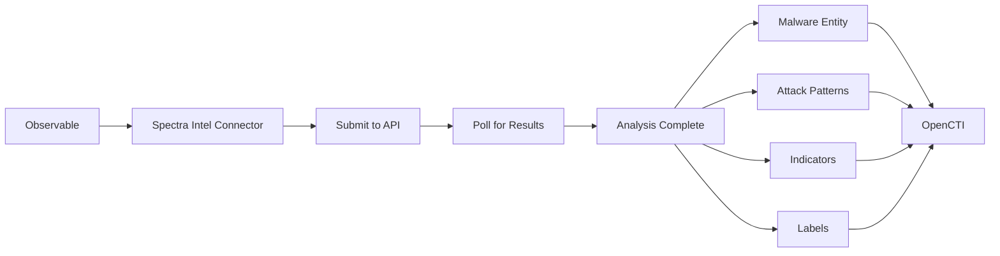

# OpenCTI ReversingLabs Spectra Intelligence Submission Connector

## Table of Contents

- [Introduction](#introduction)
- [Installation](#installation)
  - [Requirements](#requirements)
- [Configuration](#configuration)
  - [OpenCTI Configuration](#opencti-configuration)
  - [Base Connector Configuration](#base-connector-configuration)
  - [ReversingLabs Spectra Intelligence Configuration](#reversinglabs-spectra-intelligence-configuration)
- [Deployment](#deployment)
  - [Docker Deployment](#docker-deployment)
  - [Manual Deployment](#manual-deployment)
- [Usage](#usage)
- [Behavior](#behavior)
  - [Data Flow](#data-flow)
  - [Enrichment Mapping](#enrichment-mapping)
  - [Generated STIX Objects](#generated-stix-objects)
- [Debugging](#debugging)
- [Additional Information](#additional-information)

---

## Introduction

The ReversingLabs Spectra Intelligence Submission connector enables file and URL submission to [ReversingLabs Spectra Intelligence](https://www.reversinglabs.com/products/spectra-intelligence) for deep analysis. It creates comprehensive threat intelligence including indicators, malware entities, MITRE ATT&CK TTPs, and relationships.

Key features:
- File submission for cloud sandbox analysis
- URL submission for analysis
- MITRE ATT&CK tactics and techniques mapping
- Automatic indicator creation with labels
- Malware entity creation with relationships
- Configurable sandbox environment and settings

---

## Installation

### Requirements

- OpenCTI Platform >= 6.5.6
- ReversingLabs Spectra Intelligence credentials
- Network access to ReversingLabs API

---

## Configuration

### OpenCTI Configuration

| Parameter | Docker envvar | Mandatory | Description |
|-----------|---------------|-----------|-------------|
| `opencti_url` | `OPENCTI_URL` | Yes | The URL of the OpenCTI platform |
| `opencti_token` | `OPENCTI_TOKEN` | Yes | The default admin token configured in the OpenCTI platform |

### Base Connector Configuration

| Parameter | Docker envvar | Mandatory | Description |
|-----------|---------------|-----------|-------------|
| `connector_id` | `CONNECTOR_ID` | Yes | A valid arbitrary `UUIDv4` unique for this connector |
| `connector_name` | `CONNECTOR_NAME` | Yes | The name of the connector instance |
| `connector_scope` | `CONNECTOR_SCOPE` | Yes | Supported: `Artifact,Url,StixFile,File` |
| `connector_auto` | `CONNECTOR_AUTO` | Yes | Enable/disable auto-enrichment (default: false) |
| `connector_confidence_level` | `CONNECTOR_CONFIDENCE_LEVEL` | Yes | Default confidence level (0-100) |
| `connector_log_level` | `CONNECTOR_LOG_LEVEL` | Yes | Log level (`debug`, `info`, `warn`, `error`) |

### ReversingLabs Spectra Intelligence Configuration

| Parameter | Docker envvar | Mandatory | Description |
|-----------|---------------|-----------|-------------|
| `reversinglabs_spectra_intelligence_url` | `REVERSINGLABS_SPECTRA_INTELLIGENCE_URL` | Yes | API URL (default: data.reversinglabs.com) |
| `reversinglabs_spectra_intelligence_username` | `REVERSINGLABS_SPECTRA_INTELLIGENCE_USERNAME` | Yes | API username |
| `reversinglabs_spectra_intelligence_password` | `REVERSINGLABS_SPECTRA_INTELLIGENCE_PASSWORD` | Yes | API password |
| `reversinglabs_max_tlp` | `REVERSINGLABS_MAX_TLP` | Yes | Maximum TLP for enrichment |
| `reversinglabs_sandbox_os` | `REVERSINGLABS_SANDBOX_OS` | Yes | Sandbox OS for analysis |
| `reversinglabs_sandbox_internet_sim` | `REVERSINGLABS_SANDBOX_INTERNET_SIM` | No | Use simulated internet (default: false) |
| `reversinglabs_create_indicators` | `REVERSINGLABS_CREATE_INDICATORS` | Yes | Create indicators from analysis |
| `reversinglabs_poll_interval` | `REVERSINGLABS_POLL_INTERVAL` | Yes | Poll interval in seconds (default: 250) |

---

## Deployment

### Docker Deployment

Build a Docker Image using the provided `Dockerfile`.

Example `docker-compose.yml`:

```yaml
version: '3'
services:
  connector-reversinglabs-spectra-intel-submission:
    image: opencti/connector-reversinglabs-spectra-intel-submission:latest
    environment:
      - OPENCTI_URL=http://localhost
      - OPENCTI_TOKEN=ChangeMe
      - CONNECTOR_ID=ChangeMe
      - CONNECTOR_NAME=ReversingLabs Spectra Intelligence Submission
      - CONNECTOR_SCOPE=Artifact,Url,StixFile,File
      - CONNECTOR_AUTO=false
      - CONNECTOR_CONFIDENCE_LEVEL=100
      - CONNECTOR_LOG_LEVEL=info
      - REVERSINGLABS_SPECTRA_INTELLIGENCE_URL=data.reversinglabs.com
      - REVERSINGLABS_SPECTRA_INTELLIGENCE_USERNAME=ChangeMe
      - REVERSINGLABS_SPECTRA_INTELLIGENCE_PASSWORD=ChangeMe
      - REVERSINGLABS_MAX_TLP=TLP:AMBER
      - REVERSINGLABS_SANDBOX_OS=windows10
      - REVERSINGLABS_SANDBOX_INTERNET_SIM=false
      - REVERSINGLABS_CREATE_INDICATORS=true
      - REVERSINGLABS_POLL_INTERVAL=250
    restart: always
```

### Manual Deployment

1. Clone the repository
2. Copy `.env.sample` to `.env` and configure
3. Install dependencies: `pip install -r requirements.txt`
4. Run the connector

---

## Usage

The connector enriches observables by:
1. Submitting files/URLs to Spectra Intelligence
2. Polling for analysis completion
3. Creating comprehensive threat intelligence entities
4. Mapping MITRE ATT&CK techniques

Trigger enrichment:
- Manually via the OpenCTI UI
- Automatically if `CONNECTOR_AUTO=true`
- Via playbooks

---

## Behavior

### Data Flow



### Enrichment Mapping

| Observable Type | Analysis Type | Description |
|-----------------|---------------|-------------|
| Artifact | Cloud Sandbox | File submitted for dynamic analysis |
| URL | URL Analysis | URL analyzed for threats |
| StixFile/File | Hash Analysis | File hash lookup and analysis |

### Sandbox OS Options

| Value | Description |
|-------|-------------|
| `windows11` | Windows 11 environment |
| `windows10` | Windows 10 environment |
| `windows7` | Windows 7 environment |
| `macos11` | macOS 11 environment |
| `linux` | Linux environment |

### Generated STIX Objects

| Object Type | Description |
|-------------|-------------|
| Malware | Identified malware families |
| Attack-Pattern | MITRE ATT&CK TTPs |
| Indicator | Threat indicators from analysis |
| Labels | Threat classification labels |
| Relationship | Links between entities |
| Score | Calculated threat score |

---

## Debugging

Enable debug logging by setting `CONNECTOR_LOG_LEVEL=debug` to see:
- Submission status
- Polling progress
- Analysis result processing

---

## Additional Information

- [ReversingLabs](https://www.reversinglabs.com/)
- [Spectra Intelligence](https://www.reversinglabs.com/products/spectra-intelligence)

### Internet Simulation

When `REVERSINGLABS_SANDBOX_INTERNET_SIM=true`, analysis is performed without connecting to the internet, using a simulated network instead. This is useful for analyzing samples that may communicate with C2 servers.
