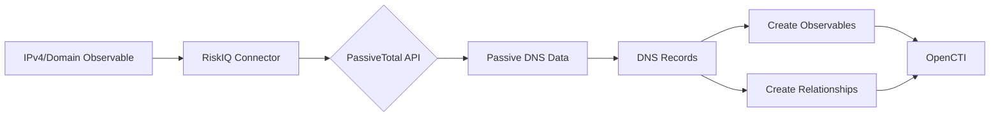

# OpenCTI RiskIQ PassiveTotal Connector

## Table of Contents

- [Introduction](#introduction)
- [Installation](#installation)
  - [Requirements](#requirements)
- [Configuration](#configuration)
  - [OpenCTI Configuration](#opencti-configuration)
  - [Base Connector Configuration](#base-connector-configuration)
  - [RiskIQ PassiveTotal Configuration](#riskiq-passivetotal-configuration)
- [Deployment](#deployment)
  - [Docker Deployment](#docker-deployment)
  - [Manual Deployment](#manual-deployment)
- [Usage](#usage)
- [Behavior](#behavior)
  - [Data Flow](#data-flow)
  - [DNS Record Mapping](#dns-record-mapping)
  - [Generated STIX Objects](#generated-stix-objects)
- [Debugging](#debugging)
- [Additional Information](#additional-information)

---

## Introduction

**Important Notice**: This connector is deprecated. RiskIQ was acquired by Microsoft and the PassiveTotal service has been integrated into Microsoft Defender Threat Intelligence.

The RiskIQ PassiveTotal connector enriches IPv4 and Domain observables with passive DNS data. It retrieves DNS resolution history and creates relationships between domains and their resolved IP addresses.

---

## Installation

### Requirements

- OpenCTI Platform >= 6.0.0
- RiskIQ PassiveTotal API credentials (deprecated)
- Network access to RiskIQ API

---

## Configuration

### OpenCTI Configuration

| Parameter | Docker envvar | Mandatory | Description |
|-----------|---------------|-----------|-------------|
| `opencti_url` | `OPENCTI_URL` | Yes | The URL of the OpenCTI platform |
| `opencti_token` | `OPENCTI_TOKEN` | Yes | The default admin token configured in the OpenCTI platform |

### Base Connector Configuration

| Parameter | Docker envvar | Mandatory | Description |
|-----------|---------------|-----------|-------------|
| `connector_id` | `CONNECTOR_ID` | Yes | A valid arbitrary `UUIDv4` unique for this connector |
| `connector_name` | `CONNECTOR_NAME` | Yes | The name of the connector instance |
| `connector_scope` | `CONNECTOR_SCOPE` | Yes | Supported: `IPv4-Addr,Domain-Name` |
| `connector_auto` | `CONNECTOR_AUTO` | Yes | Enable/disable auto-enrichment |
| `connector_log_level` | `CONNECTOR_LOG_LEVEL` | Yes | Log level (`debug`, `info`, `warn`, `error`) |

### RiskIQ PassiveTotal Configuration

| Parameter | Docker envvar | Mandatory | Description |
|-----------|---------------|-----------|-------------|
| `riskiq_username` | `RISKIQ_USERNAME` | Yes | RiskIQ account username |
| `riskiq_api_key` | `RISKIQ_API_KEY` | Yes | RiskIQ API key |
| `riskiq_max_tlp` | `RISKIQ_MAX_TLP` | Yes | Maximum TLP for enrichment |
| `riskiq_import_last_seen` | `RISKIQ_IMPORT_LAST_SEEN` | No | Import timeframe in days |

---

## Deployment

### Docker Deployment

Build a Docker Image using the provided `Dockerfile`.

Example `docker-compose.yml`:

```yaml
version: '3'
services:
  connector-riskiq-passive-total:
    image: opencti/connector-riskiq-passive-total:latest
    environment:
      - OPENCTI_URL=http://localhost
      - OPENCTI_TOKEN=ChangeMe
      - CONNECTOR_ID=ChangeMe
      - CONNECTOR_NAME=RiskIQ PassiveTotal
      - CONNECTOR_SCOPE=IPv4-Addr,Domain-Name
      - CONNECTOR_AUTO=false
      - CONNECTOR_LOG_LEVEL=info
      - RISKIQ_USERNAME=ChangeMe
      - RISKIQ_API_KEY=ChangeMe
      - RISKIQ_MAX_TLP=TLP:AMBER
      - RISKIQ_IMPORT_LAST_SEEN=30
    restart: always
```

### Manual Deployment

1. Clone the repository
2. Copy `config.yml.sample` to `config.yml` and configure
3. Install dependencies: `pip install -r requirements.txt`
4. Run the connector

---

## Usage

The connector enriches observables by:
1. Querying passive DNS data from RiskIQ PassiveTotal
2. Creating relationships based on DNS records
3. Generating related observables

Trigger enrichment:
- Manually via the OpenCTI UI
- Automatically if `CONNECTOR_AUTO=true`
- Via playbooks

---

## Behavior

### Data Flow



### DNS Record Mapping

| DNS Record Type | Source Observable | Target Observable | Relationship |
|-----------------|-------------------|-------------------|--------------|
| A | Domain-Name | IPv4-Addr | resolves-to |
| AAAA | Domain-Name | IPv6-Addr | resolves-to |
| SOA | Domain-Name | Email-Addr | related-to |
| MX | Domain-Name | Domain-Name | related-to |
| CNAME | Domain-Name | Domain-Name | related-to |
| NS | Domain-Name | Domain-Name | related-to |

### Generated STIX Objects

| Object Type | Description |
|-------------|-------------|
| IPv4-Addr | Resolved IP addresses (A records) |
| IPv6-Addr | Resolved IPv6 addresses (AAAA records) |
| Email-Addr | SOA contact addresses |
| Domain-Name | MX, CNAME, NS records |
| Relationship | resolves-to or related-to links |

---

## Debugging

Enable debug logging by setting `CONNECTOR_LOG_LEVEL=debug` to see:
- API request/response details
- DNS record processing
- Relationship creation

---

## Additional Information

### Deprecation Notice

RiskIQ was acquired by Microsoft. The PassiveTotal service has been integrated into [Microsoft Defender Threat Intelligence](https://www.microsoft.com/en-us/security/business/siem-and-xdr/microsoft-defender-threat-intelligence). Consider migrating to Microsoft's threat intelligence services.

### Alternative

For passive DNS enrichment, consider using other connectors like:
- Shodan
- DomainTools
- ONYPHE
