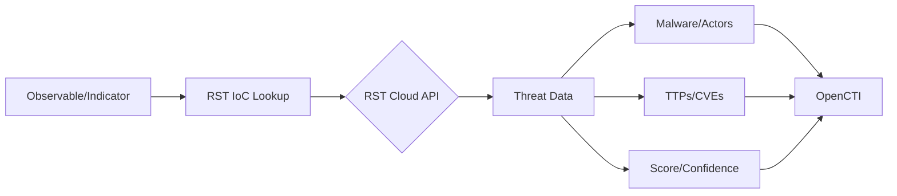

# OpenCTI RST IoC Lookup Connector

| Status | Date | Comment |
|--------|------|---------|
| Partner Verified | -    | -       |

## Table of Contents

- [Introduction](#introduction)
- [Installation](#installation)
  - [Requirements](#requirements)
- [Configuration](#configuration)
  - [OpenCTI Configuration](#opencti-configuration)
  - [Base Connector Configuration](#base-connector-configuration)
  - [RST IoC Lookup Configuration](#rst-ioc-lookup-configuration)
- [Deployment](#deployment)
  - [Docker Deployment](#docker-deployment)
  - [Manual Deployment](#manual-deployment)
- [Usage](#usage)
- [Behavior](#behavior)
  - [Data Flow](#data-flow)
  - [Enrichment Mapping](#enrichment-mapping)
  - [Generated STIX Objects](#generated-stix-objects)
- [Debugging](#debugging)
- [Additional Information](#additional-information)

---

## Introduction

The [RST IoC Lookup](https://www.rstcloud.com/rst-ioc-lookup/) connector determines whether observables and indicators are malicious and worth detecting. It performs checks on IP addresses, domains, URLs, and hash values via the RST Cloud API.

Key features:
- Malware, threat actor, tool, CVE, and TTP enrichment
- Score and confidence adjustments
- External reference population
- ASN, geolocation, and WHOIS data enrichment
- Customizable detection flag threshold
- Pay-as-you-go pricing model

---

## Installation

### Requirements

- OpenCTI Platform >= 6.0.0
- RST Cloud API key ([Get one here](https://aws.amazon.com/marketplace/pp/prodview-bmd536bqonz22) or contact trial@rstcloud.net)
- Network access to RST Cloud API

---

## Configuration

### OpenCTI Configuration

| Parameter | Docker envvar | Mandatory | Description |
|-----------|---------------|-----------|-------------|
| `opencti_url` | `OPENCTI_URL` | Yes | The URL of the OpenCTI platform |
| `opencti_token` | `OPENCTI_TOKEN` | Yes | The default admin token configured in the OpenCTI platform |

### Base Connector Configuration

| Parameter | Docker envvar | Mandatory | Description |
|-----------|---------------|-----------|-------------|
| `connector_id` | `CONNECTOR_ID` | Yes | A valid arbitrary `UUIDv4` unique for this connector |
| `connector_name` | `CONNECTOR_NAME` | Yes | The name of the connector instance |
| `connector_scope` | `CONNECTOR_SCOPE` | Yes | Supported: `IPv4-Addr,Domain-Name,Url,StixFile,indicator` |
| `connector_auto` | `CONNECTOR_AUTO` | No | Enable/disable auto-enrichment (default: false) |
| `connector_log_level` | `CONNECTOR_LOG_LEVEL` | Yes | Log level (`debug`, `info`, `warn`, `error`) |

### RST IoC Lookup Configuration

| Parameter | Docker envvar | Mandatory | Description |
|-----------|---------------|-----------|-------------|
| `rst_ioc_lookup_api_key` | `RST_IOC_LOOKUP_API_KEY` | Yes | RST Cloud API key |
| `rst_ioc_lookup_base_url` | `RST_IOC_LOOKUP_BASE_URL` | No | API base URL (default: https://api.rstcloud.net/v1/) |
| `rst_ioc_lookup_max_tlp` | `RST_IOC_LOOKUP_MAX_TLP` | Yes | Maximum TLP for enrichment (default: TLP:AMBER+STRICT) |
| `rst_ioc_lookup_update_confidence` | `RST_IOC_LOOKUP_UPDATE_CONFIDENCE` | No | Update confidence from enrichment (default: true) |
| `rst_ioc_lookup_update_score` | `RST_IOC_LOOKUP_UPDATE_SCORE` | No | Update score from enrichment (default: true) |
| `rst_ioc_lookup_update_valid_from` | `RST_IOC_LOOKUP_UPDATE_VALID_FROM` | No | Update valid_from using last_seen (default: true) |
| `rst_ioc_lookup_label_format` | `RST_IOC_LOOKUP_LABEL_FORMAT` | No | Label format: `short` or `long` (default: short) |
| `rst_ioc_lookup_score_type` | `RST_IOC_LOOKUP_SCORE_TYPE` | No | Score type: `last` or `total` (default: total) |
| `rst_ioc_lookup_update_description_action` | `RST_IOC_LOOKUP_UPDATE_DESCRIPTION_ACTION` | No | Description merge: `overwrite`, `append`, `prepend` |
| `rst_ioc_lookup_detection_flag_threshold` | `RST_IOC_LOOKUP_DETECTION_FLAG_THRESHOLD` | No | Score threshold for detection flag (default: 45) |
| `rst_ioc_lookup_timeout` | `RST_IOC_LOOKUP_TIMEOUT` | No | API timeout in seconds (default: 10) |

---

## Deployment

### Docker Deployment

Build a Docker Image using the provided `Dockerfile`.

Example `docker-compose.yml`:

```yaml
version: '3'
services:
  connector-rst-ioc-lookup:
    image: opencti/connector-rst-ioc-lookup:latest
    environment:
      - OPENCTI_URL=http://localhost
      - OPENCTI_TOKEN=ChangeMe
      - CONNECTOR_ID=ChangeMe
      - CONNECTOR_NAME=RST IoC Lookup
      - CONNECTOR_SCOPE=IPv4-Addr,Domain-Name,Url,StixFile,indicator
      - CONNECTOR_AUTO=false
      - CONNECTOR_LOG_LEVEL=info
      - RST_IOC_LOOKUP_BASE_URL=https://api.rstcloud.net/v1/
      - RST_IOC_LOOKUP_API_KEY=ChangeMe
      - RST_IOC_LOOKUP_MAX_TLP=TLP:AMBER+STRICT
      - RST_IOC_LOOKUP_UPDATE_CONFIDENCE=true
      - RST_IOC_LOOKUP_UPDATE_SCORE=true
      - RST_IOC_LOOKUP_UPDATE_VALID_FROM=true
      - RST_IOC_LOOKUP_LABEL_FORMAT=short
      - RST_IOC_LOOKUP_SCORE_TYPE=last
      - RST_IOC_LOOKUP_UPDATE_DESCRIPTION_ACTION=overwrite
      - RST_IOC_LOOKUP_DETECTION_FLAG_THRESHOLD=45
      - RST_IOC_LOOKUP_TIMEOUT=10
    restart: always
```

### Manual Deployment

1. Clone the repository
2. Copy `config.yml.sample` to `config.yml` and configure
3. Install dependencies: `pip install -r requirements.txt`
4. Run the connector

---

## Usage

The connector enriches observables and indicators by:
1. Checking maliciousness via RST Cloud API
2. Enriching with related threat intelligence
3. Adjusting scores and confidence
4. Setting detection flags based on threshold

Trigger enrichment:
- Manually via the OpenCTI UI
- Automatically if `CONNECTOR_AUTO=true`
- Via playbooks

---

## Behavior

### Data Flow



### Enrichment Mapping

| Observable Type | Enrichment Data | Description |
|-----------------|-----------------|-------------|
| IPv4-Addr | ASN, GeoIP, Reputation | IP threat intelligence |
| Domain-Name | WHOIS, Reputation | Domain threat intelligence |
| URL | Analysis, Reputation | URL threat intelligence |
| StixFile | Hash Analysis | File hash reputation |
| Indicator | Full Context | Pattern-based enrichment |

### Score Types

| Type | Description |
|------|-------------|
| `last` | Score calculated at time of last_seen |
| `total` | Decayed score based on time since last_seen |

### Generated STIX Objects

| Object Type | Description |
|-------------|-------------|
| Malware | Related malware families |
| Threat-Actor | Associated threat actors |
| Tool | Related tools |
| Attack-Pattern | MITRE ATT&CK TTPs |
| Vulnerability | Related CVEs |
| Labels | Threat classification |
| External Reference | Source references |

---

## Debugging

Enable debug logging by setting `CONNECTOR_LOG_LEVEL=debug` to see:
- API request/response details
- Score calculations
- Enrichment processing

---

## Additional Information

- [RST Cloud](https://www.rstcloud.com/)
- [RST IoC Lookup](https://www.rstcloud.com/rst-ioc-lookup/)
- [AWS Marketplace](https://aws.amazon.com/marketplace/pp/prodview-bmd536bqonz22)
- Contact: trial@rstcloud.net
