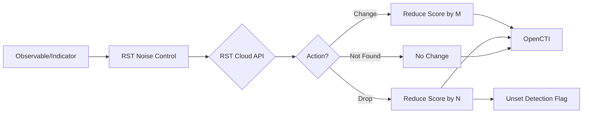

# OpenCTI RST Noise Control Connector

| Status | Date | Comment |
|--------|------|---------|
| Partner Verified | -    | -       |

## Table of Contents

- [Introduction](#introduction)
- [Installation](#installation)
  - [Requirements](#requirements)
- [Configuration](#configuration)
  - [OpenCTI Configuration](#opencti-configuration)
  - [Base Connector Configuration](#base-connector-configuration)
  - [RST Noise Control Configuration](#rst-noise-control-configuration)
- [Deployment](#deployment)
  - [Docker Deployment](#docker-deployment)
  - [Manual Deployment](#manual-deployment)
- [Usage](#usage)
- [Behavior](#behavior)
  - [Data Flow](#data-flow)
  - [Actions](#actions)
  - [Processing Details](#processing-details)
- [Debugging](#debugging)
- [Additional Information](#additional-information)

---

## Introduction

The [RST Noise Control](https://www.rstcloud.com/rst-noise-control/) connector checks if observables and indicators are benign or potentially noisy and not worth detecting. It helps reduce false positives by identifying well-known, popular, or benign values that could trigger false alerts.

Key features:
- Identify benign/noisy indicators
- Customizable score adjustments
- Detection flag management
- Trusted source filtering
- Pay-as-you-go pricing model

---

## Installation

### Requirements

- OpenCTI Platform >= 6.0.0
- RST Cloud API key ([Get one here](https://aws.amazon.com/marketplace/pp/prodview-bmd536bqonz22) or contact trial@rstcloud.net)
- Network access to RST Cloud API

---

## Configuration
Configuring the connector is straightforward. The minimal setup requires entering the RST Cloud API key and specifying the OpenCTI connection settings. 

### OpenCTI Configuration

| Parameter | Docker envvar | Mandatory | Description |
|-----------|---------------|-----------|-------------|
| `opencti_url` | `OPENCTI_URL` | Yes | The URL of the OpenCTI platform |
| `opencti_token` | `OPENCTI_TOKEN` | Yes | The default admin token configured in the OpenCTI platform |

### Base Connector Configuration

| Parameter | Docker envvar | Mandatory | Description |
|-----------|---------------|-----------|-------------|
| `connector_id` | `CONNECTOR_ID` | Yes | A valid arbitrary `UUIDv4` unique for this connector |
| `connector_name` | `CONNECTOR_NAME` | Yes | The name of the connector instance |
| `connector_scope` | `CONNECTOR_SCOPE` | Yes | Supported: `IPv4-Addr,Domain-Name,Url,StixFile,indicator` |
| `connector_auto` | `CONNECTOR_AUTO` | No | Enable/disable auto-enrichment |
| `connector_log_level` | `CONNECTOR_LOG_LEVEL` | Yes | Log level (`debug`, `info`, `warn`, `error`) |

### RST Noise Control Configuration

| Parameter | Docker envvar | Mandatory | Description |
|-----------|---------------|-----------|-------------|
| `rst_noise_control_api_key` | `RST_NOISE_CONTROL_API_KEY` | Yes | RST Cloud API key |
| `rst_noise_control_base_url` | `RST_NOISE_CONTROL_BASE_URL` | No | API base URL (default: https://api.rstcloud.net/v1) |
| `rst_noise_control_max_tlp` | `RST_NOISE_CONTROL_MAX_TLP` | No | Maximum TLP (default: TLP:AMBER+STRICT) |
| `rst_noise_control_update_confidence` | `RST_NOISE_CONTROL_UPDATE_CONFIDENCE` | No | Update confidence based on result |
| `rst_noise_control_update_score` | `RST_NOISE_CONTROL_UPDATE_SCORE` | No | Update score based on result |
| `rst_noise_control_change_action_score_change` | `RST_NOISE_CONTROL_CHANGE_ACTION_SCORE_CHANGE` | No | Score reduction for "Change" action (default: 10) |
| `rst_noise_control_drop_action_score_change` | `RST_NOISE_CONTROL_DROP_ACTION_SCORE_CHANGE` | No | Score reduction for "Drop" action (default: 50) |
| `rst_noise_control_drop_action_detection_flag` | `RST_NOISE_CONTROL_DROP_ACTION_DETECTION_FLAG` | No | Unset detection flag on Drop (default: true) |

---

## Deployment

### Docker Deployment

Build a Docker Image using the provided `Dockerfile`.

Example `docker-compose.yml`:

```yaml
version: '3'
services:
  connector-rst-noise-control:
    image: opencti/connector-rst-noise-control:latest
    environment:
      - OPENCTI_URL=http://localhost
      - OPENCTI_TOKEN=ChangeMe
      - CONNECTOR_ID=ChangeMe
      - CONNECTOR_NAME=RST Noise Control
      - CONNECTOR_SCOPE=IPv4-Addr,Domain-Name,Url,StixFile,indicator
      - CONNECTOR_AUTO=false
      - CONNECTOR_LOG_LEVEL=error
      - RST_NOISE_CONTROL_BASE_URL=https://api.rstcloud.net/v1
      - RST_NOISE_CONTROL_API_KEY=ChangeMe
      - RST_NOISE_CONTROL_MAX_TLP=TLP:AMBER+STRICT
      - RST_NOISE_CONTROL_UPDATE_CONFIDENCE=true
      - RST_NOISE_CONTROL_UPDATE_SCORE=true
      - RST_NOISE_CONTROL_CHANGE_ACTION_SCORE_CHANGE=10
      - RST_NOISE_CONTROL_DROP_ACTION_SCORE_CHANGE=50
      - RST_NOISE_CONTROL_DROP_ACTION_DETECTION_FLAG=true
    restart: always
```

### Manual Deployment

1. Clone the repository
2. Copy `config.yml.sample` to `config.yml` and configure
3. Install dependencies: `pip install -r requirements.txt`
4. Run the connector

---

## Usage

The connector reduces false positives by:
1. Checking indicators against RST Noise Control database
2. Identifying benign or noisy values
3. Adjusting scores based on findings
4. Optionally unsetting detection flags

Trigger enrichment:
- Manually via the OpenCTI UI
- Automatically if `CONNECTOR_AUTO=true`
- Via playbooks

---

## Behavior

### Data Flow



### Actions

| Action | Description | Default Score Change |
|--------|-------------|---------------------|
| Not Found | Value is not marked as noisy | No change |
| Change | Value may be noisy | Reduce score by 10 |
| Drop | Value is likely benign | Reduce score by 50 |

### Processing Details

1. **Score Reduction**: Scores are reduced by the configured amount, with a minimum of 0
2. **Detection Flag**: When action is "Drop" and `drop_action_detection_flag=true`, the detection flag is unset
3. **Trusted Filter List**: Add trusted IoC sources to a filter list to avoid API calls for known-good sources

---

## Debugging

Enable debug logging by setting `CONNECTOR_LOG_LEVEL=debug` to see:
- API request/response details
- Action decisions
- Score adjustment calculations

---

## Additional Information

- [RST Cloud](https://www.rstcloud.com/)
- [RST Noise Control](https://www.rstcloud.com/rst-noise-control/)
- [AWS Marketplace](https://aws.amazon.com/marketplace/pp/prodview-bmd536bqonz22)
- Contact: trial@rstcloud.net

### Use Cases

- **Reduce Alert Fatigue**: Automatically lower scores for common benign indicators
- **Improve Detection Accuracy**: Unset detection flags for noisy indicators
- **Prioritize True Threats**: Focus analyst attention on genuine threats
