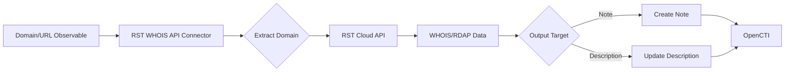

# OpenCTI RST WHOIS API Connector

## Table of Contents

- [Introduction](#introduction)
- [Installation](#installation)
  - [Requirements](#requirements)
- [Configuration](#configuration)
  - [OpenCTI Configuration](#opencti-configuration)
  - [Base Connector Configuration](#base-connector-configuration)
  - [RST WHOIS API Configuration](#rst-whois-api-configuration)
- [Deployment](#deployment)
  - [Docker Deployment](#docker-deployment)
  - [Manual Deployment](#manual-deployment)
- [Usage](#usage)
- [Behavior](#behavior)
  - [Data Flow](#data-flow)
  - [Output Options](#output-options)
  - [Processing Details](#processing-details)
- [Debugging](#debugging)
- [Additional Information](#additional-information)

---

## Introduction

The [RST WHOIS API](https://www.rstcloud.com/rst-whois-api/) connector enriches domain and URL observables and indicators with domain registration data. It automatically retrieves WHOIS or RDAP data depending on which protocol is applicable for the domain.

Key features:
- Automatic WHOIS/RDAP protocol selection
- Effective TLD discovery for subdomains
- Real-time data retrieval
- No ban risk from WHOIS servers
- Raw response option
- Pay-as-you-go pricing model

---

## Installation

### Requirements

- OpenCTI Platform >= 6.0.0
- RST Cloud API key ([Get one here](https://aws.amazon.com/marketplace/pp/prodview-bmd536bqonz22) or contact trial@rstcloud.net)
- Network access to RST Cloud API

---

## Configuration

### OpenCTI Configuration

| Parameter | Docker envvar | Mandatory | Description |
|-----------|---------------|-----------|-------------|
| `opencti_url` | `OPENCTI_URL` | Yes | The URL of the OpenCTI platform |
| `opencti_token` | `OPENCTI_TOKEN` | Yes | The default admin token configured in the OpenCTI platform |

### Base Connector Configuration

| Parameter | Docker envvar | Mandatory | Description |
|-----------|---------------|-----------|-------------|
| `connector_id` | `CONNECTOR_ID` | Yes | A valid arbitrary `UUIDv4` unique for this connector |
| `connector_name` | `CONNECTOR_NAME` | Yes | The name of the connector instance |
| `connector_scope` | `CONNECTOR_SCOPE` | Yes | Supported: `Domain-Name,Url,indicator` |
| `connector_auto` | `CONNECTOR_AUTO` | No | Enable/disable auto-enrichment |
| `connector_log_level` | `CONNECTOR_LOG_LEVEL` | Yes | Log level (`debug`, `info`, `warn`, `error`) |

### RST WHOIS API Configuration

| Parameter | Docker envvar | Mandatory | Description |
|-----------|---------------|-----------|-------------|
| `rst_whois_api_api_key` | `RST_WHOIS_API_API_KEY` | Yes | RST Cloud API key |
| `rst_whois_api_base_url` | `RST_WHOIS_API_BASE_URL` | No | API base URL (default: https://api.rstcloud.net/v1/) |
| `rst_whois_api_max_tlp` | `RST_WHOIS_API_MAX_TLP` | No | Maximum TLP (default: TLP:AMBER+STRICT) |
| `rst_whois_api_timeout` | `RST_WHOIS_API_TIMEOUT` | No | API timeout in seconds (default: 10) |
| `rst_whois_api_update_output_action` | `RST_WHOIS_API_UPDATE_OUTPUT_ACTION` | No | Update mode: `overwrite` or `append` |
| `rst_whois_api_whois_output_object` | `RST_WHOIS_API_WHOIS_OUTPUT_OBJECT` | No | Output target: `note` or `description` |
| `rst_whois_api_output_format` | `RST_WHOIS_API_OUTPUT_FORMAT` | No | Format: `standard` or `extended` |
| `rst_whois_api_output_include_raw` | `RST_WHOIS_API_OUTPUT_INCLUDE_RAW` | No | Include raw WHOIS response (default: false) |

---

## Deployment

### Docker Deployment

Build a Docker Image using the provided `Dockerfile`.

Example `docker-compose.yml`:

```yaml
version: '3'
services:
  connector-rst-whois-api:
    image: opencti/connector-rst-whois-api:latest
    environment:
      - OPENCTI_URL=http://localhost
      - OPENCTI_TOKEN=ChangeMe
      - CONNECTOR_ID=ChangeMe
      - CONNECTOR_NAME=RST WHOIS API
      - CONNECTOR_SCOPE=Domain-Name,Url,indicator
      - CONNECTOR_AUTO=false
      - CONNECTOR_LOG_LEVEL=info
      - RST_WHOIS_API_BASE_URL=https://api.rstcloud.net/v1/
      - RST_WHOIS_API_API_KEY=ChangeMe
      - RST_WHOIS_API_MAX_TLP=TLP:AMBER+STRICT
      - RST_WHOIS_API_UPDATE_OUTPUT_ACTION=overwrite
      - RST_WHOIS_API_WHOIS_OUTPUT_OBJECT=note
      - RST_WHOIS_API_OUTPUT_FORMAT=standard
      - RST_WHOIS_API_OUTPUT_INCLUDE_RAW=false
      - RST_WHOIS_API_TIMEOUT=10
    restart: always
```

### Manual Deployment

1. Clone the repository
2. Copy `config.yml.sample` to `config.yml` and configure
3. Install dependencies: `pip install -r requirements.txt`
4. Run the connector

---

## Usage

The connector enriches domains and URLs by:
1. Extracting domain from URLs if necessary
2. Querying RST WHOIS API for registration data
3. Adding WHOIS information to observable

Trigger enrichment:
- Manually via the OpenCTI UI
- Automatically if `CONNECTOR_AUTO=true`
- Via playbooks

---

## Behavior

### Data Flow



### Output Options

| Option | Description |
|--------|-------------|
| `note` | Create a Note object with WHOIS data |
| `description` | Update the observable description |

### Output Formats

| Format | Description |
|--------|-------------|
| `standard` | Basic WHOIS fields |
| `extended` | Additional WHOIS fields |

### Processing Details

1. **Subdomain Handling**: If the requested domain is a subdomain without registration data, the effective TLD is extracted and registration data is returned for that TLD
2. **Protocol Selection**: Automatically determines whether to use WHOIS or RDAP
3. **Real-time Data**: Domain registration data is fetched from live servers with short-lived caching

---

## Debugging

Enable debug logging by setting `CONNECTOR_LOG_LEVEL=debug` to see:
- API request/response details
- Domain extraction logic
- WHOIS data processing

---

## Additional Information

- [RST Cloud](https://www.rstcloud.com/)
- [RST WHOIS API](https://www.rstcloud.com/rst-whois-api/)
- [AWS Marketplace](https://aws.amazon.com/marketplace/pp/prodview-bmd536bqonz22)
- Contact: trial@rstcloud.net

### Key Benefits

- **No WHOIS Protocol Knowledge Required**: Automatically selects WHOIS or RDAP
- **No Bans**: Avoid being blocked by WHOIS servers during bulk enrichment
- **Consistent Output**: Always receive the same JSON format regardless of protocol
