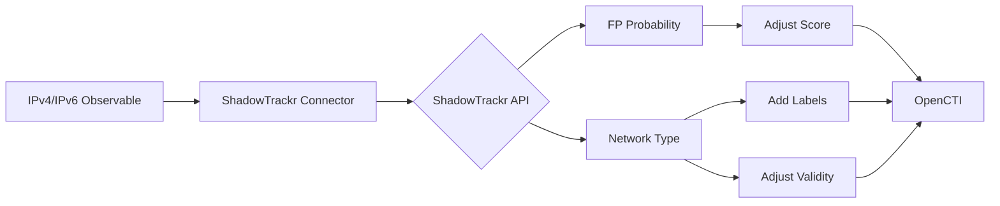

# OpenCTI ShadowTrackr Connector

## Table of Contents

- [Introduction](#introduction)
- [Installation](#installation)
  - [Requirements](#requirements)
- [Configuration](#configuration)
  - [OpenCTI Configuration](#opencti-configuration)
  - [Base Connector Configuration](#base-connector-configuration)
  - [ShadowTrackr Configuration](#shadowtrackr-configuration)
- [Deployment](#deployment)
  - [Docker Deployment](#docker-deployment)
  - [Manual Deployment](#manual-deployment)
- [Usage](#usage)
- [Behavior](#behavior)
  - [Data Flow](#data-flow)
  - [Enrichment Mapping](#enrichment-mapping)
  - [Processing Details](#processing-details)
  - [Generated STIX Objects](#generated-stix-objects)
- [Debugging](#debugging)
- [Additional Information](#additional-information)

---

## Introduction

The [ShadowTrackr](https://shadowtrackr.com/) connector is an internal enrichment connector that reduces false positives by identifying IP addresses that are CDNs, Clouds, VPNs, Tor exit nodes, public DNS servers, or bogons. It adjusts scores and validity periods based on the false positive probability provided by the ShadowTrackr API.

Key features:
- Lower scores for known false positive sources
- Adjust validity periods for short-lived attack sources
- Add contextual labels for network type identification
- Context-aware evaluation (e.g., GMail servers get lowered scores immediately)

---

## Installation

### Requirements

- OpenCTI Platform >= 6.0.0
- ShadowTrackr API key ([Get one here](https://shadowtrackr.com/usr/))
- Network access to ShadowTrackr API

---

## Configuration

### OpenCTI Configuration

| Parameter | Docker envvar | Mandatory | Description |
|-----------|---------------|-----------|-------------|
| `opencti_url` | `OPENCTI_URL` | Yes | The URL of the OpenCTI platform |
| `opencti_token` | `OPENCTI_TOKEN` | Yes | The default admin token configured in the OpenCTI platform |

### Base Connector Configuration

| Parameter | Docker envvar | Mandatory | Description |
|-----------|---------------|-----------|-------------|
| `connector_id` | `CONNECTOR_ID` | Yes | A valid arbitrary `UUIDv4` unique for this connector |
| `connector_name` | `CONNECTOR_NAME` | No | The name of the connector instance (default: ShadowTrackr) |
| `connector_scope` | `CONNECTOR_SCOPE` | Yes | Must include `IPv4-Addr`, `IPv6-Addr`, `Indicator` |
| `connector_auto` | `CONNECTOR_AUTO` | No | Enable/disable auto-enrichment (default: true) |
| `connector_log_level` | `CONNECTOR_LOG_LEVEL` | No | Log level (`debug`, `info`, `warn`, `error`) |

### ShadowTrackr Configuration

| Parameter | Docker envvar | Mandatory | Description |
|-----------|---------------|-----------|-------------|
| `shadowtrackr_api_key` | `SHADOWTRACKR_API_KEY` | Yes | ShadowTrackr API key |
| `shadowtrackr_max_tlp` | `SHADOWTRACKR_MAX_TLP` | No | Maximum TLP for sending to ShadowTrackr (default: TLP:AMBER) |
| `shadowtrackr_replace_with_lower_score` | `SHADOWTRACKR_REPLACE_WITH_LOWER_SCORE` | No | Lower score based on false positive estimate |
| `shadowtrackr_replace_valid_to_date` | `SHADOWTRACKR_REPLACE_VALID_TO_DATE` | No | Set valid_until to tomorrow for CDNs/Clouds/VPNs |

---

## Deployment

### Docker Deployment

Build a Docker Image using the provided `Dockerfile`.

Example `docker-compose.yml`:

```yaml
version: '3'
services:
  connector-shadowtrackr:
    image: opencti/connector-shadowtrackr:latest
    environment:
      - OPENCTI_URL=http://localhost
      - OPENCTI_TOKEN=ChangeMe
      - CONNECTOR_ID=ChangeMe
      - CONNECTOR_SCOPE=IPv4-Addr,IPv6-Addr,Indicator
      - SHADOWTRACKR_API_KEY=ChangeMe
      - SHADOWTRACKR_MAX_TLP=TLP:AMBER
      - SHADOWTRACKR_REPLACE_WITH_LOWER_SCORE=true
      - SHADOWTRACKR_REPLACE_VALID_TO_DATE=true
    restart: always
```

### Manual Deployment

1. Clone the repository
2. Copy `config.yml.sample` to `config.yml` and configure
3. Install dependencies: `pip install -r requirements.txt`
4. Run the connector

---

## Usage

The connector enriches IP address observables and indicators by:
1. Checking against ShadowTrackr's false positive database
2. Adding contextual labels
3. Optionally adjusting scores and validity periods

Trigger enrichment:
- Automatically if `CONNECTOR_AUTO=true`
- Manually via the OpenCTI UI
- Via playbooks

---

## Behavior

### Data Flow



### Enrichment Mapping

| ShadowTrackr Data | OpenCTI Action | Description |
|-------------------|----------------|-------------|
| CDN detection | Label + Validity | `cdn` label, set valid_until to tomorrow |
| Cloud detection | Label + Validity | `cloud` label, set valid_until to tomorrow |
| VPN detection | Label + Validity | `vpn` label, set valid_until to tomorrow |
| Tor exit node | Label | `tor` label |
| Public DNS | Label | `public dns server` label |
| Bogon | Label | `bogon` label |
| FP probability | Score adjustment | Lower score based on probability |

### Processing Details

1. **Basic Mode**: Set both `replace_with_lower_score=false` and `replace_valid_to_date=false` to only add labels without modifying scores or dates.

2. **Detection/Blocking Mode**: Set both to `true` to automatically reduce false positives in your detection/blocking workflow.

3. **Context-Aware**: A GMail server detected as cloud gets an immediate score reduction because blocking GMail for a single spam email is typically not desired.

### Generated STIX Objects

| Object Type | Description |
|-------------|-------------|
| Labels | Network type labels (cdn, cloud, vpn, tor, etc.) |
| Observable Update | Score adjustment and description update |
| Indicator Update | Validity period adjustment |

---

## Debugging

Enable debug logging by setting `CONNECTOR_LOG_LEVEL=debug` to see:
- API request/response details
- Score calculation logic
- Label application details

---

## Additional Information

- [ShadowTrackr](https://shadowtrackr.com/)
- [Get API Key](https://shadowtrackr.com/usr/)

### Use Cases

- **Reduce Detection Noise**: Automatically lower scores for IP addresses associated with CDNs, Clouds, and VPNs.
- **Time-Limited Indicators**: Set short validity periods for rapidly changing infrastructure (CDN, Cloud, VPN IPs change function frequently).
- **Contextual Labeling**: Add labels to help analysts understand the nature of observed IP addresses.

### Filigran Verification

| Status            | Date       | Comment |
|-------------------|------------|---------|
| Filigran Verified | 2025-12-10 | -       |
