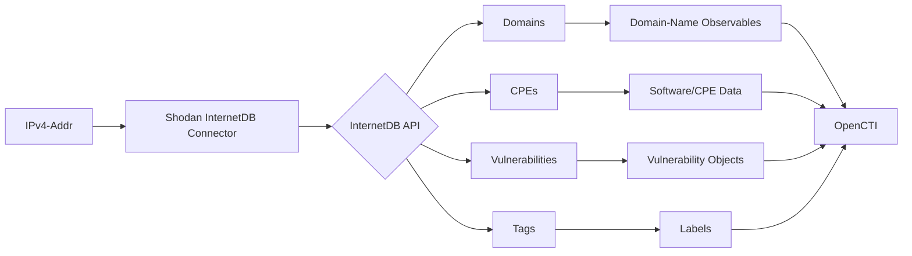

# OpenCTI Shodan InternetDB Connector

| Status | Date | Comment |
|--------|------|---------|
| Community | -    | -       |

## Table of Contents

- [Introduction](#introduction)
- [Installation](#installation)
  - [Requirements](#requirements)
- [Configuration](#configuration)
  - [OpenCTI Configuration](#opencti-configuration)
  - [Base Connector Configuration](#base-connector-configuration)
  - [Shodan InternetDB Configuration](#shodan-internetdb-configuration)
- [Deployment](#deployment)
  - [Docker Deployment](#docker-deployment)
  - [Manual Deployment](#manual-deployment)
- [Usage](#usage)
- [Behavior](#behavior)
  - [Data Flow](#data-flow)
  - [Enrichment Mapping](#enrichment-mapping)
  - [Generated STIX Objects](#generated-stix-objects)
- [Debugging](#debugging)
- [Additional Information](#additional-information)

---

## Introduction

The Shodan InternetDB API provides free access to basic internet scan data for non-commercial use. While it provides less data than a regular Shodan IP lookup, it's completely free and requires no API key.

This connector enriches IPv4 observables with:
- Associated domains
- CPE (Common Platform Enumeration) identifiers
- Vulnerabilities (CVEs)
- Tags and classifications

---

## Installation

### Requirements

- OpenCTI Platform >= 6.0.0
- Network access to Shodan InternetDB API

**Note**: No API key is required for this connector.

---

## Configuration

### OpenCTI Configuration

| Parameter | Docker envvar | Mandatory | Description |
|-----------|---------------|-----------|-------------|
| `opencti_url` | `OPENCTI_URL` | Yes | The URL of the OpenCTI platform |
| `opencti_token` | `OPENCTI_TOKEN` | Yes | The default admin token configured in the OpenCTI platform |

### Base Connector Configuration

| Parameter | Docker envvar | Mandatory | Description |
|-----------|---------------|-----------|-------------|
| `connector_id` | `CONNECTOR_ID` | Yes | A valid arbitrary `UUIDv4` unique for this connector |
| `connector_name` | `CONNECTOR_NAME` | Yes | The name of the connector instance |
| `connector_scope` | `CONNECTOR_SCOPE` | Yes | Must be `IPv4-Addr` |
| `connector_auto` | `CONNECTOR_AUTO` | Yes | Enable/disable auto-enrichment |
| `connector_log_level` | `CONNECTOR_LOG_LEVEL` | Yes | Log level (`debug`, `info`, `warn`, `error`) |

### Shodan InternetDB Configuration

| Parameter | Docker envvar | Mandatory | Description |
|-----------|---------------|-----------|-------------|
| `shodan_max_tlp` | `SHODAN_MAX_TLP` | No | Maximum TLP for processing (default: TLP:CLEAR) |
| `shodan_ssl_verify` | `SHODAN_SSL_VERIFY` | No | Verify SSL connections (default: true) |

---

## Deployment

### Docker Deployment

Build a Docker Image using the provided `Dockerfile`.

Example `docker-compose.yml`:

```yaml
version: '3'
services:
  connector-shodan-internetdb:
    image: opencti/connector-shodan-internetdb:latest
    environment:
      - OPENCTI_URL=http://localhost
      - OPENCTI_TOKEN=ChangeMe
      - CONNECTOR_ID=ChangeMe
      - CONNECTOR_NAME=Shodan InternetDB
      - CONNECTOR_SCOPE=IPv4-Addr
      - CONNECTOR_AUTO=true
      - CONNECTOR_LOG_LEVEL=error
      - SHODAN_MAX_TLP=TLP:CLEAR
      - SHODAN_SSL_VERIFY=true
    restart: always
```

### Manual Deployment

1. Clone the repository
2. Create `config.yml` based on `config.yml.sample`
3. Install dependencies: `pip3 install -r requirements.txt`
4. Run: `python3 -m shodan_internetdb`

---

## Usage

The connector enriches IPv4 address observables by:
1. Querying the Shodan InternetDB API
2. Creating domain, vulnerability, and tag relationships
3. Adding CPE information

Trigger enrichment:
- Manually via the OpenCTI UI
- Automatically if `CONNECTOR_AUTO=true`
- Via playbooks

---

## Behavior

### Data Flow



### Enrichment Mapping

| InternetDB Field | OpenCTI Entity | Description |
|------------------|----------------|-------------|
| `hostnames` | Domain-Name | Associated domain names |
| `cpes` | Software/CPE | Common Platform Enumeration |
| `vulns` | Vulnerability | CVE identifiers |
| `tags` | Labels | Classification tags |

### Generated STIX Objects

| Object Type | Description |
|-------------|-------------|
| Domain-Name | Associated hostnames |
| Vulnerability | CVEs found on the IP |
| Labels | Shodan tags and classifications |

---

## Debugging

Enable debug logging by setting `CONNECTOR_LOG_LEVEL=debug`.

To verify the connector is working:
1. Navigate to Data -> Data Curation in OpenCTI
2. Check for new imported data
3. View connector logs for troubleshooting

---

## Additional Information

- [Shodan InternetDB](https://internetdb.shodan.io/)
- [InternetDB Documentation](https://internetdb.shodan.io/docs)

### Limitations

The InternetDB API provides less data than a full Shodan subscription:
- No port/service details
- No banner information
- Limited to basic metadata

For comprehensive Shodan data, use the full Shodan connector with an API key.
