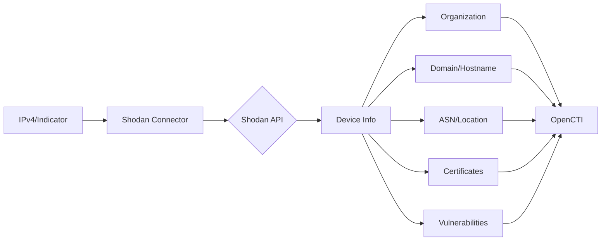

# OpenCTI Shodan Connector

## Table of Contents

- [Introduction](#introduction)
- [Installation](#installation)
  - [Requirements](#requirements)
- [Configuration](#configuration)
  - [OpenCTI Configuration](#opencti-configuration)
  - [Base Connector Configuration](#base-connector-configuration)
  - [Shodan Configuration](#shodan-configuration)
- [Deployment](#deployment)
  - [Docker Deployment](#docker-deployment)
  - [Manual Deployment](#manual-deployment)
- [Usage](#usage)
- [Behavior](#behavior)
  - [Data Flow](#data-flow)
  - [Observable Enrichment](#observable-enrichment)
  - [Indicator Enrichment](#indicator-enrichment)
  - [Generated STIX Objects](#generated-stix-objects)
- [Debugging](#debugging)
- [Additional Information](#additional-information)

---

## Introduction

[Shodan](https://www.shodan.io/) is a search engine for Internet-connected devices. Unlike traditional web search engines, Shodan indexes information about devices directly connected to the Internet, including servers, routers, webcams, and more.

This connector enriches IPv4 observables and Shodan pattern indicators with comprehensive device and network intelligence.

---

## Installation

### Requirements

- OpenCTI Platform >= 5.2.4
- Shodan API key
- Network access to Shodan API

---

## Configuration

### OpenCTI Configuration

| Parameter | Docker envvar | Mandatory | Description |
|-----------|---------------|-----------|-------------|
| `opencti_url` | `OPENCTI_URL` | Yes | The URL of the OpenCTI platform |
| `opencti_token` | `OPENCTI_TOKEN` | Yes | The default admin token configured in the OpenCTI platform |

### Base Connector Configuration

| Parameter | Docker envvar | Mandatory | Description |
|-----------|---------------|-----------|-------------|
| `connector_id` | `CONNECTOR_ID` | No | A valid arbitrary `UUIDv4` unique for this connector |
| `connector_name` | `CONNECTOR_NAME` | No | The name of the connector instance |
| `connector_scope` | `CONNECTOR_SCOPE` | No | Supported: `IPv4-Addr,Indicator` (pattern_type: shodan) |
| `connector_auto` | `CONNECTOR_AUTO` | No | Enable/disable auto-enrichment |
| `connector_log_level` | `CONNECTOR_LOG_LEVEL` | No | Log level (`debug`, `info`, `warn`, `error`) |

### Shodan Configuration

| Parameter | Docker envvar | Mandatory | Description |
|-----------|---------------|-----------|-------------|
| `shodan_token` | `SHODAN_TOKEN` | Yes | Shodan API token |
| `shodan_max_tlp` | `SHODAN_MAX_TLP` | No | Maximum TLP for enrichment |
| `shodan_default_score` | `SHODAN_DEFAULT_SCORE` | No | Default score for created indicators |
| `shodan_import_search_results` | `SHODAN_IMPORT_SEARCH_RESULTS` | No | Import search results for indicators (default: true) |
| `shodan_create_note` | `SHODAN_CREATE_NOTE` | No | Create note with facets for indicators |
| `shodan_use_isp_name` | `SHODAN_USE_ISP_NAME` | No | Use ISP name for ASN |

---

## Deployment

### Docker Deployment

Build a Docker Image using the provided `Dockerfile`.

Example `docker-compose.yml`:

```yaml
version: '3'
services:
  connector-shodan:
    image: opencti/connector-shodan:latest
    environment:
      - OPENCTI_URL=http://localhost
      - OPENCTI_TOKEN=ChangeMe
      - SHODAN_TOKEN=ChangeMe
      - CONNECTOR_SCOPE=IPv4-Addr,Indicator
      - CONNECTOR_AUTO=false
      - CONNECTOR_LOG_LEVEL=error
    restart: always
```

### Manual Deployment

1. Clone the repository
2. Create `config.yml` based on `config.yml.sample`
3. Install dependencies: `pip3 install -r requirements.txt`
4. Run: `python3 main.py`

---

## Usage

The connector enriches:
1. **IPv4 Observables**: With device and network information
2. **Indicators with Shodan pattern_type**: With search facets and results

Trigger enrichment:
- Manually via the OpenCTI UI
- Automatically if `CONNECTOR_AUTO=true` (see warnings below)
- Via playbooks

---

## Behavior

### Data Flow



### Observable Enrichment

For IPv4 observables, the connector creates:

| STIX Object | Description |
|-------------|-------------|
| Identity | Shodan organization |
| Organization | Related organization + relationship |
| Domain-Name | Associated domains + relationship |
| Hostname | Associated hostnames + relationship |
| Autonomous-System | ASN information + relationship |
| X509-Certificate | SSL certificates + relationship |
| Location | City and country + relationship |
| Vulnerability | CVEs found + relationship |

Additionally, it updates the observable with:
- Description with device details
- Labels for services and technologies
- External reference to Shodan

### Indicator Enrichment

For indicators with `pattern_type: shodan`, the connector creates:

| Content | Description |
|---------|-------------|
| Note | Facets with aggregated statistics |

Facets include:
- Global summary
- Top 20 Organizations
- Top 20 Domains
- Top 20 Ports
- Top 20 Autonomous Systems
- Top 20 Countries

When `import_search_results=true`, the connector also enriches all IPv4 addresses matching the search pattern.

### Generated STIX Objects

| Object Type | Description |
|-------------|-------------|
| Identity | Shodan organization |
| Organization | Related organizations |
| Domain-Name | Associated domains |
| Autonomous-System | ASN information |
| X509-Certificate | SSL certificates |
| Location | Geographic data |
| Vulnerability | CVEs discovered |
| Note | Search facets (for indicators) |
| Labels | Service and technology tags |
| External Reference | Shodan links |

---

## Debugging

Enable debug logging by setting `CONNECTOR_LOG_LEVEL=debug` to see:
- API request/response details
- Entity creation progress
- Error details

---

## Additional Information

- [Shodan](https://www.shodan.io/)
- [Shodan API Documentation](https://shodan.readthedocs.io/en/latest/api.html)
- [Shodan Help](https://help.shodan.io/the-basics/what-is-shodan)

### Warnings

**Auto Enrichment**: If you set `CONNECTOR_AUTO=true`, you may encounter errors for indicators with unsupported pattern types. To avoid this, use Trigger Filters in OpenCTI:

1. Navigate to: Data -> Ingestion -> Connectors -> Shodan
2. Add Trigger Filters:
   - `Pattern type = shodan` OR `Entity type = IPv4 address`

This ensures the connector only processes supported entity types.

### Use Cases

- **Vulnerability Assessment**: Discover CVEs on exposed services
- **Asset Discovery**: Find associated domains, certificates, and infrastructure
- **Threat Hunting**: Search for attacker infrastructure patterns
