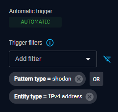

# OpenCTI Shodan Internal Enrichment Connector

## What is Shodan?

Shodan official link : https://www.shodan.io/
Shodan help link : https://help.shodan.io/the-basics/what-is-shodan

Shodan is a search engine for Internet-connected devices. Web search engines, such as Google and Bing, are great for finding websites. But what if you're interested in measuring which countries are becoming more connected? Or if you want to know which version of Microsoft IIS is the most popular? Or you want to find the control servers for malware? Maybe a new vulnerability came out and you want to see how many hosts it could affect? Traditional web search engines don't let you answer those questions.

Shodan gathers information about all devices directly connected to the Internet. If a device is directly hooked up to the Internet then Shodan queries it for various publicly-available information. The types of devices that are indexed can vary tremendously: ranging from small desktops up to nuclear power plants and everything in between.

So what does Shodan index then? The bulk of the data is taken from banners, which are metadata about a software that's running on a device. This can be information about the server software, what options the service supports, a welcome message or anything else that the client would like to know before interacting with the server.

## What is scope for shodan Connector ?

    Scope : 
        - Ipv4, 
        - Indicator (only pattern_type: shodan)

## What does Shodan Connector do ?

This connector allows ipv4 observables or indicators with a ‘shodan’ pattern_type to be enriched, any other scope is not supported.

For an observable, it can be enriched with :
- Shodan identity (organisation)
- Organisation + relationship
- DomainName + relationship
- HostName + relationship
- AutonomousSystem+ relationship
- X509Certificate + relationship
- Location (City & Country) + relationship
- Vulnerability + relationship
- Updating the observable enriched with a description, labels, external reference

For an indicator with pattern_type "Shodan", it can be enriched with :
- Note with "Facets", by retrieving the total number of search results for the query.
  - Facets titles :
    - Global
    - Top 20 Organizations
    - Top 20 Domains
    - Top 20 Ports
    - Top 20 Autonomous Systems
    - Top 20 Countries

By default, the import_search_results environment variable is set to true, which means that for each indicator enrichment, it will first search for all ipv4s associated with that entity, and for each IPv4 observable, it will perform an automatic enrichment of that observable that includes all of the entities listed above.

## Installation

### Requirements

- OpenCTI Platform >= 5.2.4

### Configuration variables

Below are the parameters you'll need to set for OpenCTI:

| Parameter `OpenCTI` | config.yml  | Docker environment variable | Mandatory | Description                                          |
|---------------------|-------------|-----------------------------|-----------|------------------------------------------------------|
| URL                 | `url`       | `OPENCTI_URL`               | Yes       | The URL of the OpenCTI platform.                     |
| Token               | `token`     | `OPENCTI_TOKEN`             | Yes       | The default admin token set in the OpenCTI platform. |

Below are the parameters you'll need to set for running the connector properly:

| Parameter `Connector` | config.yml  | Docker environment variable  | Default | Mandatory  | Description                                                                             |
|-----------------------|-------------|------------------------------|---------|------------|-----------------------------------------------------------------------------------------|
| ID                    | `id`        | `CONNECTOR_ID`               | /       | Yes        | A unique `UUIDv4` identifier for this connector instance.                               |
| Name                  | `name`      | `CONNECTOR_NAME`             | ``      | Yes        | Full name of the connector : `Shodan`.                                                  |
| Scope                 | `scope`     | `CONNECTOR_SCOPE`            | /       | Yes        | Must be `ipv4-Addr,Indicator`. Warning only indicator with pattern_type "shodan" valid. |
| Auto                  | `auto`      | `CONNECTOR_AUTO`             | False   | Yes        | Must be `true` or `false` to enable or disable auto-enrichment of observables.          |
| Log Level             | `log_level` | `CONNECTOR_LOG_LEVEL`        | /       | Yes        | Determines the verbosity of the logs. Options are `debug`, `info`, `warn`, or `error`.  |

Below are the parameters you'll need to set for Shodan Connector:

| Parameter `shodan`    | config.yml              | Docker environment variable    | Default     | Mandatory | Description                                                                                     |
|-----------------------|-------------------------|--------------------------------|-------------|-----------|-------------------------------------------------------------------------------------------------|
| token                 | `token`                 | `SHODAN_TOKEN`                 | /           | Yes       | The token of the Shodan                                                                         |
| max_tlp               | `max_tlp`               | `SHODAN_MAX_TLP`               | `TLP:AMBER` | No        | The maximal TLP of the observable being enriched.                                               |
| default_score         | `default_score`         | `SHODAN_DEFAULT_SCORE`         | `50`        | No        | Default_score allows you to add a default score for an indicator and its observable             |
| import_search_results | `import_search_results` | `SHODAN_IMPORT_SEARCH_RESULTS` | `True`      | No        | Returns the results of the search against the enriched indicator (Search the SHODAN database). |
| create_note | `create_note` | `SHODAN_CREATE_NOTE` | `True` | Adds Shodan results to a note, otherwise it is saved in the description. |
| use_isp_name_for_asn | `use_isp_name_for_asn` | `SHODAN_USE_ISP_NAME_FOR_ASN` | `False` | Use the ISP name for ASN name rather than AS+Number. |

## Deployment

### Docker Deployment

Before building the Docker container, you need to set the version of pycti in `requirements.txt` equal to whatever
version of OpenCTI you're running. Example, `pycti==5.12.20`. If you don't, it will take the latest version, but
sometimes the OpenCTI SDK fails to initialize.

Build a Docker Image using the provided `Dockerfile`.

Example:

```shell
# Replace the IMAGE NAME with the appropriate value
docker build . -t [IMAGE NAME]:latest
```

Make sure to replace the environment variables in `docker-compose.yml` with the appropriate configurations for your
environment. Then, start the docker container with the provided docker-compose.yml

```shell
docker compose up -d
# -d for detached
```

### Manual Deployment

Create a file `config.yml` based on the provided `config.yml.sample`.

Replace the configuration variables (especially the "**ChangeMe**" variables) with the appropriate configurations for
you environment.

Install the required python dependencies (preferably in a virtual environment):

```shell
pip3 install -r requirements.txt
```

Then, start the connector from recorded-future/src:

```shell
python3 main.py
```

### Additional information

#### Warnings: 
- Currently, if you set the ‘auto’ environment variable to true, you risk getting a set of traceback errors of the following type: (ValueError : Unsupported pattern type : ‘patternType’) due to the indicator type events being triggered.
However, there is a small function directly accessible on OpenCTI which allows you to filter the indicator pattern type :

  In the connector Shodan page: Data / Ingestion / Connectors / Shodan

  Use the added filters titled `Trigger filters` and add two filters: `Pattern type = shodan` OR `Entity type = IPv4 address`

  

Useful links: 
- Shodan Python: https://shodan.readthedocs.io/en/latest/api.html


