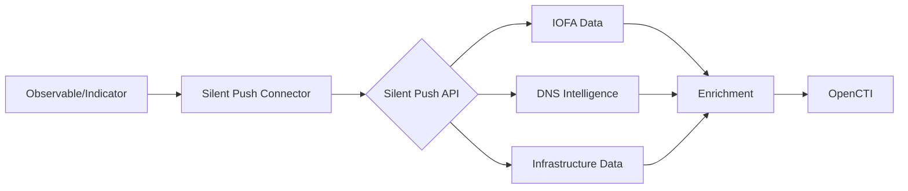

# OpenCTI Silent Push Connector

| Status | Date | Comment |
|--------|------|---------|
| Partner | -    | -       |

## Table of Contents

- [Introduction](#introduction)
- [Installation](#installation)
  - [Requirements](#requirements)
- [Configuration](#configuration)
  - [OpenCTI Configuration](#opencti-configuration)
  - [Base Connector Configuration](#base-connector-configuration)
  - [Silent Push Configuration](#silentpush-configuration)
- [Deployment](#deployment)
  - [Docker Deployment](#docker-deployment)
  - [Manual Deployment](#manual-deployment)
- [Usage](#usage)
- [Behavior](#behavior)
  - [Data Flow](#data-flow)
  - [Enrichment Mapping](#enrichment-mapping)
  - [Generated STIX Objects](#generated-stix-objects)
- [Debugging](#debugging)
- [Additional Information](#additional-information)

---

## Introduction

[Silent Push](https://www.silentpush.com/) takes a unique approach to identifying developing cyber threats by creating Indicators of Future Attacks (IOFA) that are more useful and valuable than industry-standard IOCs.

Silent Push applies unique behavioral fingerprints to attacker activity and searches across their proprietary DNS database - containing the most complete, accurate, and timely view of global internet-facing infrastructure anywhere in the world - to reveal adversary infrastructure and campaigns prior to launch.

This connector enriches observables and indicators with Silent Push intelligence data.

---

## Installation

### Requirements

- Python >= 3.11
- OpenCTI Platform >= 6.8.13
- Silent Push API key
- Network access to Silent Push API

---

## Configuration

### OpenCTI Configuration

| Parameter | Docker envvar | Mandatory | Description |
|-----------|---------------|-----------|-------------|
| `opencti_url` | `OPENCTI_URL` | Yes | The URL of the OpenCTI platform |
| `opencti_token` | `OPENCTI_TOKEN` | Yes | The default admin token configured in the OpenCTI platform |

### Base Connector Configuration

| Parameter | Docker envvar | Mandatory | Description |
|-----------|---------------|-----------|-------------|
| `connector_id` | `CONNECTOR_ID` | No | A valid arbitrary `UUIDv4` unique for this connector |
| `connector_name` | `CONNECTOR_NAME` | No | The name of the connector instance |
| `connector_scope` | `CONNECTOR_SCOPE` | No | Supported: `Indicator,URL,IPv4-Addr,IPv6-Addr,Domain-Name` |
| `connector_auto` | `CONNECTOR_AUTO` | No | Enable/disable auto-enrichment |
| `connector_log_level` | `CONNECTOR_LOG_LEVEL` | No | Log level (`debug`, `info`, `warn`, `error`) |

### Silent Push Configuration

| Parameter | Docker envvar | Mandatory | Description |
|-----------|---------------|-----------|-------------|
| `silentpush_api_key` | `SILENTPUSH_API_KEY` | Yes | Silent Push API key |
| `silentpush_api_base_url` | `SILENTPUSH_API_BASE_URL` | No | API base URL (default: https://app.silentpush.com/api/v2/) |
| `silentpush_max_tlp_level` | `SILENTPUSH_MAX_TLP_LEVEL` | No | Maximum TLP level for processing |
| `silentpush_verify_cert` | `SILENTPUSH_VERIFY_CERT` | No | Verify SSL certificates (default: true) |

---

## Deployment

### Docker Deployment

Build a Docker Image using the provided `Dockerfile`.

Example `docker-compose.yml`:

```yaml
version: '3'
services:
  connector-silentpush:
    image: opencti/connector-silentpush-enrichment:latest
    environment:
      - OPENCTI_URL=http://localhost
      - OPENCTI_TOKEN=ChangeMe
      - SILENTPUSH_API_KEY=ChangeMe
      - SILENTPUSH_MAX_TLP_LEVEL=TLP:AMBER
    restart: always
```

### Manual Deployment

1. Clone the repository
2. Create `config.yml` based on `config.yml.sample`
3. Install dependencies: `pip3 install -r requirements.txt`
4. Run: `python3 main.py`

---

## Usage

The connector enriches observables and indicators by:
1. Querying Silent Push API for threat intelligence
2. Adding enrichment data from IOFA (Indicators of Future Attacks)
3. Creating relationships and additional context

Trigger enrichment:
- Manually via the OpenCTI UI
- Automatically if `CONNECTOR_AUTO=true`
- Via playbooks

---

## Behavior

### Data Flow



### Enrichment Mapping

| Observable Type | Silent Push Data | Description |
|-----------------|------------------|-------------|
| Domain-Name | DNS/Infrastructure | Domain intelligence and related infrastructure |
| IPv4-Addr | IP Intelligence | IP address context and associations |
| IPv6-Addr | IP Intelligence | IP address context and associations |
| URL | URL Analysis | URL threat intelligence |
| Indicator | Pattern Analysis | Related IOFA indicators |

### Generated STIX Objects

| Object Type | Description |
|-------------|-------------|
| External Reference | Links to Silent Push analysis |
| Labels | Threat classification labels |
| Notes | Additional intelligence context |
| Relationships | Links to related entities |

---

## Debugging

Enable debug logging by setting `CONNECTOR_LOG_LEVEL=debug` to see:
- API request/response details
- Enrichment processing steps
- Error details

---

## Additional Information

- [Silent Push](https://www.silentpush.com/)
- Contact: [info@silentpush.com](mailto:info@silentpush.com)

### Key Differentiator

Silent Push provides **Indicators of Future Attacks (IOFA)** - identifying adversary infrastructure before attacks launch, rather than after compromise.
