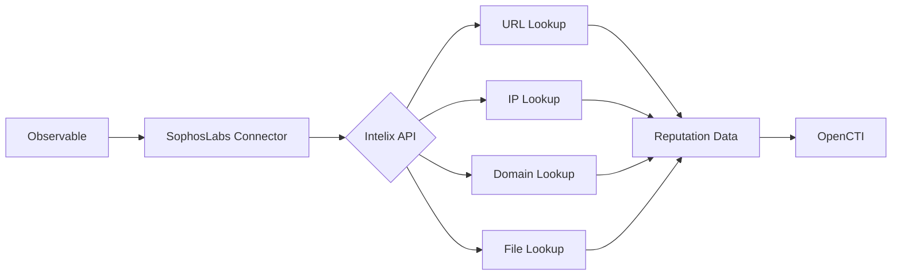

# OpenCTI SophosLabs Intelix Connector

| Status | Date | Comment |
|--------|------|---------|
| Community | -    | -       |

## Table of Contents

- [Introduction](#introduction)
- [Installation](#installation)
  - [Requirements](#requirements)
- [Configuration](#configuration)
  - [OpenCTI Configuration](#opencti-configuration)
  - [Base Connector Configuration](#base-connector-configuration)
  - [SophosLabs Intelix Configuration](#sophoslabs-intelix-configuration)
- [Deployment](#deployment)
  - [Docker Deployment](#docker-deployment)
  - [Manual Deployment](#manual-deployment)
- [Usage](#usage)
- [Behavior](#behavior)
  - [Data Flow](#data-flow)
  - [Enrichment Mapping](#enrichment-mapping)
  - [Generated STIX Objects](#generated-stix-objects)
- [Debugging](#debugging)
- [Additional Information](#additional-information)

---

## Introduction

[SophosLabs Intelix](https://api.labs.sophos.com/doc/index.html) provides threat intelligence lookup services for URLs, IP addresses, domains, and file hashes. This connector enriches OpenCTI observables with threat analysis data from SophosLabs.

Key features:
- URL reputation lookup
- IP address reputation lookup
- Domain reputation lookup
- File hash (SHA256) analysis
- Generous free tier available

---

## Installation

### Requirements

- OpenCTI Platform >= 6.0.0
- SophosLabs Intelix API credentials (Client ID and Client Secret)
- Network access to SophosLabs Intelix API

### Registration

Register for API credentials in the AWS Marketplace. Instructions can be found in the [SophosLabs Intelix documentation](https://api.labs.sophos.com/doc/index.html#registration-howto).

---

## Configuration

### OpenCTI Configuration

| Parameter | Docker envvar | Mandatory | Description |
|-----------|---------------|-----------|-------------|
| `opencti_url` | `OPENCTI_URL` | Yes | The URL of the OpenCTI platform |
| `opencti_token` | `OPENCTI_TOKEN` | Yes | The default admin token configured in the OpenCTI platform |

### Base Connector Configuration

| Parameter | Docker envvar | Mandatory | Description |
|-----------|---------------|-----------|-------------|
| `connector_id` | `CONNECTOR_ID` | Yes | A valid arbitrary `UUIDv4` unique for this connector |
| `connector_name` | `CONNECTOR_NAME` | Yes | The name of the connector instance |
| `connector_scope` | `CONNECTOR_SCOPE` | Yes | Supported: `Url,IPv4-Addr,Domain,File,File-Sha256,Artifact,StixFile` |
| `connector_auto` | `CONNECTOR_AUTO` | Yes | Enable/disable auto-enrichment |
| `connector_confidence_level` | `CONNECTOR_CONFIDENCE_LEVEL` | Yes | Default confidence level (0-100) |
| `connector_log_level` | `CONNECTOR_LOG_LEVEL` | Yes | Log level (`debug`, `info`, `warn`, `error`) |

### SophosLabs Intelix Configuration

| Parameter | Docker envvar | Mandatory | Description |
|-----------|---------------|-----------|-------------|
| `intelix_client_id` | `INTELIX_CLIENT_ID` | Yes | SophosLabs Intelix Client ID |
| `intelix_client_secret` | `INTELIX_CLIENT_SECRET` | Yes | SophosLabs Intelix Client Secret |
| `intelix_region_uri` | `INTELIX_REGION_URI` | Yes | Regional API endpoint (e.g., https://us.api.labs.sophos.com) |

---

## Deployment

### Docker Deployment

Build a Docker Image using the provided `Dockerfile`.

Example `docker-compose.yml`:

```yaml
version: '3'
services:
  connector-sophoslabs-intelix:
    image: opencti/connector-sophoslabs-intelix:latest
    environment:
      - OPENCTI_URL=http://localhost
      - OPENCTI_TOKEN=ChangeMe
      - CONNECTOR_ID=ChangeMe
      - CONNECTOR_NAME=SophosLabs Intelix Lookup
      - CONNECTOR_SCOPE=Url,IPv4-Addr,Domain,File,File-Sha256,Artifact,StixFile
      - CONNECTOR_AUTO=true
      - CONNECTOR_CONFIDENCE_LEVEL=50
      - CONNECTOR_LOG_LEVEL=error
      - INTELIX_CLIENT_ID=ChangeMe
      - INTELIX_CLIENT_SECRET=ChangeMe
      - INTELIX_REGION_URI=https://us.api.labs.sophos.com
    restart: always
```

### Manual Deployment

1. Clone the repository
2. Copy `config.yml.sample` to `config.yml` and configure
3. Install dependencies: `pip install -r requirements.txt`
4. Run the connector

---

## Usage

The connector enriches observables by:
1. Sending lookup requests to SophosLabs Intelix
2. Processing reputation and analysis results
3. Adding threat context to observables

Trigger enrichment:
- Automatically if `CONNECTOR_AUTO=true` (enabled by default due to generous free tier)
- Manually via the OpenCTI UI
- Via playbooks

---

## Behavior

### Data Flow



### Enrichment Mapping

| Observable Type | API Endpoint | Description |
|-----------------|--------------|-------------|
| URL | URL Lookup | URL reputation and threat analysis |
| IPv4-Addr | IP Lookup | IP address reputation |
| Domain | Domain Lookup | Domain reputation |
| File/Artifact | File Lookup | File hash analysis (SHA256) |

### Generated STIX Objects

| Object Type | Description |
|-------------|-------------|
| Labels | Threat classification labels |
| External Reference | Link to SophosLabs analysis |
| Observable Update | Score and description updates |

---

## Debugging

Enable debug logging by setting `CONNECTOR_LOG_LEVEL=debug` to see:
- API request/response details
- Enrichment processing steps
- Authentication details

---

## Additional Information

- [SophosLabs Intelix](https://api.labs.sophos.com/doc/index.html)
- [Registration Instructions](https://api.labs.sophos.com/doc/index.html#registration-howto)

### Regional Endpoints

| Region | URI |
|--------|-----|
| US | https://us.api.labs.sophos.com |
| EU | https://eu.api.labs.sophos.com |
| AP | https://ap.api.labs.sophos.com |

### Free Tier

SophosLabs Intelix has a generous free tier for data lookup, making it suitable for automatic enrichment. The connector has auto-lookup enabled by default.
