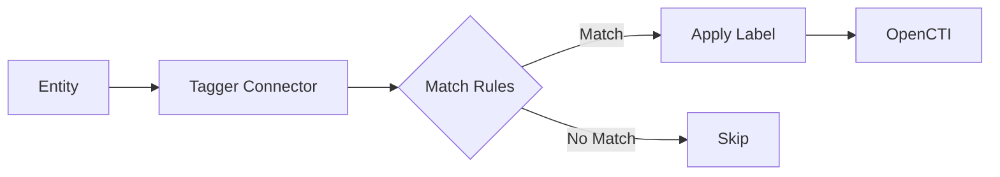

# OpenCTI Tagger Connector

## Table of Contents

- [Introduction](#introduction)
- [Installation](#installation)
  - [Requirements](#requirements)
- [Configuration](#configuration)
  - [OpenCTI Configuration](#opencti-configuration)
  - [Base Connector Configuration](#base-connector-configuration)
  - [Tagger Configuration](#tagger-configuration)
- [Deployment](#deployment)
  - [Docker Deployment](#docker-deployment)
  - [Manual Deployment](#manual-deployment)
- [Usage](#usage)
- [Behavior](#behavior)
  - [Data Flow](#data-flow)
  - [Rule Definition](#rule-definition)
  - [Special Attributes](#special-attributes)
- [Debugging](#debugging)
- [Additional Information](#additional-information)

---

## Introduction

The Tagger connector is an internal enrichment connector that applies labels to objects based on specific regular expression rules and scopes. It helps maintain consistent labeling across your OpenCTI instance by automatically tagging entities based on configurable patterns.

### Problem Statement

Multiple information sources come with their own labels, and over time, labels in OpenCTI can become inconsistent and less useful due to lack of structure or common understanding.

### Solution

1. Define a set of labels that your team agrees upon
2. Create those labels manually in the platform
3. Define rules for automatically applying labels based on regex patterns
4. Configure and enable the Tagger connector
5. Block other connectors from creating labels to maintain consistency

---

## Installation

### Requirements

- OpenCTI Platform >= 6.0.0
- Pre-created labels in OpenCTI platform

---

## Configuration

### OpenCTI Configuration

| Parameter | Docker envvar | Mandatory | Description |
|-----------|---------------|-----------|-------------|
| `opencti_url` | `OPENCTI_URL` | Yes | The URL of the OpenCTI platform |
| `opencti_token` | `OPENCTI_TOKEN` | Yes | The default admin token configured in the OpenCTI platform |

### Base Connector Configuration

| Parameter | Docker envvar | Mandatory | Description |
|-----------|---------------|-----------|-------------|
| `connector_id` | `CONNECTOR_ID` | Yes | A valid arbitrary `UUIDv4` unique for this connector |
| `connector_name` | `CONNECTOR_NAME` | Yes | The name of the connector instance |
| `connector_scope` | `CONNECTOR_SCOPE` | Yes | Entity types to process (e.g., `report,malware,tool`) |
| `connector_auto` | `CONNECTOR_AUTO` | Yes | Enable/disable auto-enrichment |
| `connector_log_level` | `CONNECTOR_LOG_LEVEL` | Yes | Log level (`debug`, `info`, `warn`, `error`) |

### Tagger Configuration

| Parameter | Docker envvar | Mandatory | Description |
|-----------|---------------|-----------|-------------|
| `tagger_definitions` | `TAGGER_DEFINITIONS` | Yes | JSON array of tagging rules |

---

## Deployment

### Docker Deployment

Build a Docker Image using the provided `Dockerfile`.

Example `docker-compose.yml`:

```yaml
version: '3'
services:
  connector-tagger:
    image: opencti/connector-tagger:latest
    environment:
      - OPENCTI_URL=http://localhost
      - OPENCTI_TOKEN=ChangeMe
      - CONNECTOR_ID=ChangeMe
      - CONNECTOR_NAME=Tagger
      - CONNECTOR_SCOPE=report,malware,tool
      - CONNECTOR_AUTO=true
      - CONNECTOR_LOG_LEVEL=error
      - TAGGER_DEFINITIONS=[{"scopes":["Report","Tool"],"rules":[{"label":"cloud","search":"[Cc]loud","attributes":["name","description"]}]}]
    restart: always
```

### Manual Deployment

1. Clone the repository
2. Configure `definitions.json` with your rules
3. Generate compact JSON: `jq -c . < src/definitions.json`
4. Copy output to `TAGGER_DEFINITIONS` environment variable
5. Install dependencies: `pip install -r requirements.txt`
6. Run the connector

---

## Usage

The connector automatically applies labels to entities by:
1. Matching entity attributes against regex patterns
2. Applying configured labels when patterns match

Trigger enrichment:
- Automatically if `CONNECTOR_AUTO=true`
- Manually via the OpenCTI UI
- Via playbooks

---

## Behavior

### Data Flow



### Rule Definition

Rules are defined in JSON format with the following structure:

```json
[
  {
    "scopes": ["Report", "Tool"],
    "rules": [
      {
        "label": "cloud",
        "search": "[Cc]loud",
        "attributes": ["name", "description"]
      }
    ]
  }
]
```

| Field | Description |
|-------|-------------|
| `scopes` | OpenCTI entity types to apply rules to |
| `label` | Label to apply when rule matches |
| `search` | Regular expression pattern |
| `attributes` | Entity attributes to search |

### Special Attributes

For containers (Report, Grouping, Case entities):

| Attribute | Description |
|-----------|-------------|
| `objects-type` | Search for entity types contained in the container |
| `objects-name` | Search for specific entity names in the container |
| `objectLabel` | Search existing labels on the entity |

**Examples:**

Tag reports containing System objects:
```json
{"scopes":["Report"],"rules":[{"label":"with_systems","search":"[Ss]ystem","attributes":["objects-type"]}]}
```

Tag reports containing 2016 CVEs:
```json
{"scopes":["Report"],"rules":[{"label":"with_vuln_2016","search":"CVE-2016","attributes":["objects-name"]}]}
```

---

## Debugging

Enable debug logging by setting `CONNECTOR_LOG_LEVEL=debug` to see:
- Rule matching details
- Label application operations

**Important**: Block all connectors (except Tagger) from creating labels in the platform to maintain label consistency.

---

## Additional Information

### Best Practices

1. Create all labels manually before enabling the connector
2. Document your labeling taxonomy
3. Test regex patterns before deployment
4. Use specific scopes to avoid unnecessary processing
5. Monitor label application through connector logs
