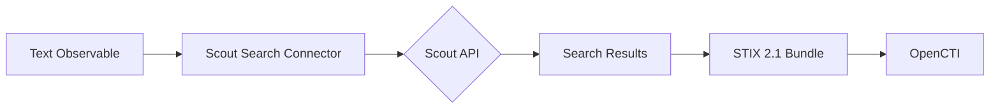

# OpenCTI Team Cymru Scout Search Connector

| Status | Date | Comment |
|--------|------|---------|
| Filigran Verified | 2026-02-05    | -       |

## Table of Contents

- [Introduction](#introduction)
- [Installation](#installation)
  - [Requirements](#requirements)
- [Configuration](#configuration)
  - [OpenCTI Configuration](#opencti-configuration)
  - [Base Connector Configuration](#base-connector-configuration)
  - [Scout API Configuration](#scout-api-configuration)
- [Deployment](#deployment)
  - [Docker Deployment](#docker-deployment)
  - [Manual Deployment](#manual-deployment)
- [Usage](#usage)
- [Behavior](#behavior)
  - [Data Flow](#data-flow)
  - [API Endpoints](#api-endpoints)
  - [Generated STIX Objects](#generated-stix-objects)
- [Debugging](#debugging)
- [Additional Information](#additional-information)

---

## Introduction

**Scout Search Connector** is a powerful cyber threat intelligence tool that uniquely provides real-time visibility of external threats at speeds others cannot match. This internal enrichment connector allows OpenCTI users to query the Team Cymru Scout API using Text observables for playbook-based queries.

This connector queries the Scout API endpoints in real-time and transforms the response into standardized STIX 2.1 bundles compatible with the OpenCTI platform.

**Note**: This connector is currently in early access. Features and functionality may change as development continues.

---

## Installation

### Requirements

- OpenCTI Platform >= 6.7.16
- Docker Engine (for container-based deployment)
- Python >= 3.9 (for manual deployment)
- Team Cymru Scout API token

---

## Configuration

Find all the configuration variables available here: [Connector Configurations](./__metadata__/CONNECTOR_CONFIG_DOC.md)

_The `opencti` and `connector` options in the `docker-compose.yml` and `config.yml` are the same as for any other connector.
For more information regarding variables, please refer to [OpenCTI's documentation on connectors](https://docs.opencti.io/latest/deployment/connectors/)._

---

## Deployment

### Docker Deployment

Build a Docker Image using the provided `Dockerfile`.

Example `docker-compose.yml`:

```yaml
version: '3'
services:
  connector-team-cymru-scout-search:
    image: opencti/connector-team-cymru-scout-search:rolling
    environment:
      - OPENCTI_URL=http://localhost
      - OPENCTI_TOKEN=ChangeMe
      - CONNECTOR_ID=scout-search-connector
      - CONNECTOR_NAME=Scout Search Connector
      - CONNECTOR_SCOPE=Text
      - CONNECTOR_LOG_LEVEL=error
      - PURE_SIGNAL_SCOUT_API_URL=https://taxii.cymru.com/api/scout
      - PURE_SIGNAL_SCOUT_API_TOKEN=ChangeMe
      - PURE_SIGNAL_SCOUT_MAX_TLP=TLP:AMBER
      - PURE_SIGNAL_SCOUT_SEARCH_INTERVAL=1
    restart: always
```

### Manual Deployment

1. Clone the repository
2. Copy `.env.sample` to `.env` and configure
3. Install dependencies: `pip install -r requirements.txt`
4. Run the connector

---

## Usage

The connector performs searches by:
1. Receiving Text observable enrichment requests (typically from playbooks)
2. Querying the Scout API with the search query
3. Returning STIX 2.1 bundles with search results

This connector is designed for playbook integration where Text observables contain search queries.

---

## Behavior

### Data Flow



### API Endpoints

| Observable Type | API Endpoint | Description |
|-----------------|--------------|-------------|
| Text | `/search?query={query}&days={days}` | Text-based search |

### Processing Details

- Responses are returned as STIX 2.1 bundles (no transformation required)
- No bundle validation needed
- **Rate Limiting**: Respects 1 request per second
- Search interval configurable via `PURE_SIGNAL_SCOUT_SEARCH_INTERVAL`

### Generated STIX Objects

The Scout API returns complete STIX 2.1 bundles that may include:

| Object Type | Description |
|-------------|-------------|
| Identity | Organizations and entities |
| Location | Geographic information |
| Autonomous-System | ASN data |
| Indicator | Threat indicators |
| Observable | IP addresses, domains, etc. |
| Relationship | Links between entities |

---

## Debugging

Enable debug logging by setting `CONNECTOR_LOG_LEVEL=debug` to see:
- API request/response details
- Search query processing
- STIX bundle contents

---

## Additional Information

- [Team Cymru](https://www.team-cymru.com/)
- [Pure Signal Scout](https://www.team-cymru.com/pure-signal)

### Early Access

This connector is currently in early access. Please report any issues or feedback to help improve the connector.

### Use Case

This connector is primarily designed for playbook-based searches where complex queries need to be executed against the Scout API. Create a Text observable with your search query and trigger enrichment.
