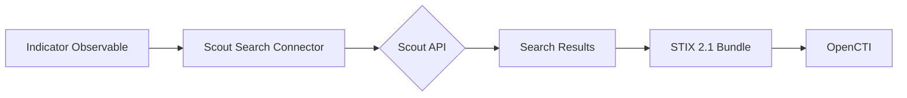

# OpenCTI Team Cymru Scout Search Connector

| Status | Date | Comment |
|--------|------|---------|
| Filigran Verified | 2026-02-05    | -       |

## Table of Contents

- [OpenCTI Team Cymru Scout Search Connector](#opencti-team-cymru-scout-search-connector)
  - [Table of Contents](#table-of-contents)
  - [Introduction](#introduction)
  - [Installation](#installation)
    - [Requirements](#requirements)
  - [Configuration](#configuration)
  - [Deployment](#deployment)
    - [Docker Deployment](#docker-deployment)
    - [Manual Deployment](#manual-deployment)
  - [Usage](#usage)
  - [Behavior](#behavior)
    - [Data Flow](#data-flow)
    - [API Endpoints](#api-endpoints)
    - [Processing Details](#processing-details)
    - [Generated STIX Objects](#generated-stix-objects)
  - [Debugging](#debugging)
  - [Additional Information](#additional-information)
    - [Early Access](#early-access)
    - [Use Case](#use-case-playbook-based-scout-query-enrichment)

---

## Introduction

**Scout Search Connector** is a powerful cyber threat intelligence tool that uniquely provides real-time visibility of external threats at speeds others cannot match. This internal enrichment connector allows OpenCTI users to query the Team Cymru Scout API using Indicator observables for playbook-based queries.

This connector queries the Scout API endpoints in real-time and transforms the response into standardized STIX 2.1 bundles compatible with the OpenCTI platform.

**Note**: This connector is currently in early access. Features and functionality may change as development continues.

---

## Installation

### Requirements

- OpenCTI Platform >= 6.7.16
- Docker Engine (for container-based deployment)
- Python >= 3.9 (for manual deployment)
- Team Cymru Scout API token

---

## Configuration

Find all the configuration variables available here: [Connector Configurations](./__metadata__/CONNECTOR_CONFIG_DOC.md)

_The `opencti` and `connector` options in the `docker-compose.yml` and `config.yml` are the same as for any other connector.
For more information regarding variables, please refer to [OpenCTI's documentation on connectors](https://docs.opencti.io/latest/deployment/connectors/)._

---

## Deployment

### Docker Deployment

Build a Docker Image using the provided `Dockerfile`.

Example `docker-compose.yml`:

```yaml
version: '3'
services:
  connector-team-cymru-scout-search:
    image: opencti/connector-team-cymru-scout-search:rolling
    environment:
      - OPENCTI_URL=http://localhost
      - OPENCTI_TOKEN=ChangeMe
      - CONNECTOR_ID=scout-search-connector
      - CONNECTOR_NAME=Scout Search Connector
      - CONNECTOR_SCOPE=Indicator
      - CONNECTOR_LOG_LEVEL=error
      - PURE_SIGNAL_SCOUT_API_URL=https://taxii.cymru.com/api/scout
      - PURE_SIGNAL_SCOUT_API_TOKEN=ChangeMe
      - PURE_SIGNAL_SCOUT_MAX_TLP=TLP:AMBER
      - PURE_SIGNAL_SCOUT_SEARCH_INTERVAL=1
      - PURE_SIGNAL_SCOUT_INDICATOR_PATTERN_TYPE=pure-signal-scout
      - PURE_SIGNAL_SCOUT_PATTERN_DESCRIPTION=Scout Search Query Pattern
    restart: always
```

### Manual Deployment

1. Clone the repository
2. Copy `.env.sample` to `.env` and configure
3. Install dependencies: `pip install -r src/requirements.txt`
4. Run the connector

---

## Usage

The connector performs searches by:
1. Receiving Indicator observable enrichment requests (typically from playbooks)
2. Querying the Scout API with the search query
3. Returning STIX 2.1 bundles with search results

This connector is designed for playbook integration where Indicator observables contain search queries.

---

## Behavior

### Data Flow


```mermaid
flowchart LR
    A[Indicator Observable] --> B[Scout Search Connector]
    B --> C{Scout API}
    C --> D[Search Results]
    D --> E[STIX 2.1 Bundle]
    E --> F[OpenCTI]
```

### API Endpoints

| Observable Type | API Endpoint | Description |
|-----------------|--------------|-------------|
| Indicator | `/search?query={query}&days={days}` | Indicator-based search |

### Processing Details

- Responses are returned as STIX 2.1 bundles (no transformation required)
- No bundle validation needed
- **Rate Limiting**: Respects 1 request per second
- Search interval configurable via `PURE_SIGNAL_SCOUT_SEARCH_INTERVAL`

### Generated STIX Objects

The Scout API returns complete STIX 2.1 bundles that may include:

| Object Type | Description |
|-------------|-------------|
| Identity | Organizations and entities |
| Location | Geographic information |
| Autonomous-System | ASN data |
| Indicator | Threat indicators |
| Observable | IP addresses, domains, etc. |
| Relationship | Links between entities |

---

## Debugging

Enable debug logging by setting `CONNECTOR_LOG_LEVEL=debug` to see:
- API request/response details
- Search query processing
- STIX bundle contents

---

### Use Case: Playbook-Based Scout Query Enrichment

This connector is designed for playbook-based searches where Scout query patterns are used to enrich indicators with threat intelligence data. Below is a step-by-step guide to set up automated enrichment.

#### Step 1: Verify Connector Installation

1. Navigate to **Data > Ingestion > Monitoring** in OpenCTI.
2. Confirm the **Scout Search Connector** appears in the list and is running.

#### Step 2: Create and Configure a Playbook

1. Navigate to **Data > Processing > Automation**.
2. Click **Create Playbook**, enter a name and description, then confirm.
3. In the playbook editor, click the empty run step and select a trigger type:
   - **Manual execution:** Select _"Available for manual enrollment / trigger"_.
   - **Scheduled execution:** Select _"Query knowledge on a regular basis"_.
4. Add a **Pattern type** filter and set the value to `pure-signal-scout`.
5. Add the **"Enrich through connector"** component and select **Scout Search Connector**.
6. Add the **"Send for ingestion"** component to store enriched data.
7. Start the playbook via the three-dot menu and verify it shows _"Playbook is running"_.

#### Step 3: Create an Indicator

1. Navigate to **Observations > Indicators**.
2. Click **Create Indicator** and configure:
   - **Pattern type:** `pure-signal-scout`
   - **Pattern:** A Scout query (e.g., `ip = 45.169.110.205` or `asn = "131279, 20485, 134544" comms.tag2 = "astrill-vpn, anydesk, pikvm"`)
   - **Main observable type:** Text
   - **Marking:** TLP:GREEN (or appropriate level within the configured max TLP)
3. Click **Create** to save.

#### Step 4: Run and Verify Enrichment

1. Open the indicator detail page.
2. Click **"Enroll in playbook"** and start the playbook, or use **manual enrichment** via the three-dot menu > Enrichment.
3. Wait for the enrichment and ingestion processes to complete.
4. Verify the **Knowledge** tab shows enriched relationships (IP addresses, indicators, autonomous systems, locations, etc.).

---

## Additional Information

- [Team Cymru](https://www.team-cymru.com/)
- [Pure Signal Scout](https://www.team-cymru.com/pure-signal)

### Early Access

This connector is currently in early access. Please report any issues or feedback to help improve the connector.
