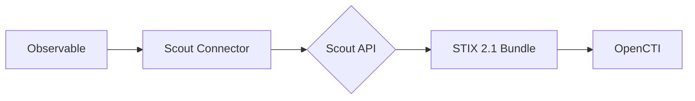

# OpenCTI Team Cymru Scout Connector

| Status           | Date       | Comment |
|------------------|------------|---------|
| Partner          | -          | -       |
| Filigran Verified| 2026-02-10 | -       |

## Table of Contents

- [Introduction](#introduction)
- [Installation](#installation)
  - [Requirements](#requirements)
- [Configuration](#configuration)
  - [OpenCTI Configuration](#opencti-configuration)
  - [Base Connector Configuration](#base-connector-configuration)
  - [Scout API Configuration](#scout-api-configuration)
- [Deployment](#deployment)
  - [Docker Deployment](#docker-deployment)
  - [Manual Deployment](#manual-deployment)
- [Usage](#usage)
- [Behavior](#behavior)
  - [Data Flow](#data-flow)
  - [API Endpoints](#api-endpoints)
  - [Generated STIX Objects](#generated-stix-objects)
- [Debugging](#debugging)
- [Additional Information](#additional-information)

---

## Introduction

**Pure Signal Scout** is a powerful cyber threat intelligence tool that uniquely provides real-time visibility of external threats at speeds others cannot match. This internal enrichment connector allows OpenCTI users to query the Team Cymru Scout API to enrich observables like IP addresses and domain names with high-fidelity STIX 2.1 intelligence.

This connector queries the Scout API endpoints in real-time and transforms the response into standardized STIX 2.1 bundles compatible with the OpenCTI platform.

**Note**: This connector is currently in early access. Features and functionality may change as development continues.

---

## Installation

### Requirements

- OpenCTI Platform >= 6.7.16
- Docker Engine (for container-based deployment)
- Python >= 3.9 (for manual deployment)
- Team Cymru Scout API token

---

## Configuration

### OpenCTI Configuration

| Parameter | Docker envvar | Mandatory | Description |
|-----------|---------------|-----------|-------------|
| `opencti_url` | `OPENCTI_URL` | Yes | The URL of the OpenCTI platform |
| `opencti_token` | `OPENCTI_TOKEN` | Yes | The default admin token configured in the OpenCTI platform |

### Base Connector Configuration

| Parameter | Docker envvar | Mandatory | Description |
|-----------|---------------|-----------|-------------|
| `connector_id` | `CONNECTOR_ID` | Yes | A valid arbitrary `UUIDv4` unique for this connector |
| `connector_name` | `CONNECTOR_NAME` | Yes | The name of the connector instance |
| `connector_scope` | `CONNECTOR_SCOPE` | Yes | Supported: `IPv4-Addr,IPv6-Addr,Domain-Name` |
| `connector_auto` | `CONNECTOR_AUTO` | Yes | Enable/disable auto-enrichment (default: false) |
| `connector_log_level` | `CONNECTOR_LOG_LEVEL` | Yes | Log level (`debug`, `info`, `warn`, `error`) |

### Scout API Configuration

| Parameter | Docker envvar | Mandatory | Description |
|-----------|---------------|-----------|-------------|
| `pure_signal_scout_api_url` | `PURE_SIGNAL_SCOUT_API_URL` | Yes | Base URL of the Scout API |
| `pure_signal_scout_api_token` | `PURE_SIGNAL_SCOUT_API_TOKEN` | Yes | Bearer token for the Scout API |
| `pure_signal_scout_max_tlp` | `PURE_SIGNAL_SCOUT_MAX_TLP` | Yes | Max TLP level for enrichment (default: TLP:AMBER) |

---

## Deployment

### Docker Deployment

Build a Docker Image using the provided `Dockerfile`.

Example `docker-compose.yml`:

```yaml
version: '3'
services:
  connector-team-cymru-scout:
    image: opencti/connector-team-cymru-scout:rolling
    environment:
      - OPENCTI_URL=http://localhost
      - OPENCTI_TOKEN=ChangeMe
      - CONNECTOR_ID=scout-enrichment-connector
      - CONNECTOR_NAME=Scout Enrichment Connector
      - CONNECTOR_SCOPE=IPv4-Addr,IPv6-Addr,Domain-Name
      - CONNECTOR_AUTO=false
      - CONNECTOR_LOG_LEVEL=error
      - PURE_SIGNAL_SCOUT_API_URL=https://taxii.cymru.com/api/scout
      - PURE_SIGNAL_SCOUT_API_TOKEN=ChangeMe
      - PURE_SIGNAL_SCOUT_MAX_TLP=TLP:AMBER
    restart: always
```

### Manual Deployment

1. Clone the repository
2. Copy `.env.sample` to `.env` and configure
3. Install dependencies: `pip install -r requirements.txt`
4. Run the connector

---

## Usage

The connector enriches observables by:
1. Querying the Scout API for IP/domain intelligence
2. Receiving STIX 2.1 bundles directly from the API
3. Importing the bundles into OpenCTI

Trigger enrichment:
- Manually via the OpenCTI UI (default mode)
- Automatically if `CONNECTOR_AUTO=true`
- Via playbooks

---

## Behavior

### Data Flow



### API Endpoints

| Observable Type | API Endpoint | Description |
|-----------------|--------------|-------------|
| IPv4-Addr | `/ip/foundation?ips={ip_address}` | IPv4 enrichment |
| IPv6-Addr | `/ip/foundation?ips={ip_address}` | IPv6 enrichment |
| Domain-Name | `/search?query={domain}` | Domain enrichment |

### Processing Details

- Responses are returned as STIX 2.1 bundles (no transformation required)
- No bundle validation needed
- **Rate Limiting**: Respects 1 request per second

### Generated STIX Objects

The Scout API returns complete STIX 2.1 bundles that may include:

| Object Type | Description |
|-------------|-------------|
| Identity | Organizations and entities |
| Location | Geographic information |
| Autonomous-System | ASN data |
| Indicator | Threat indicators |
| Relationship | Links between entities |

---

## Debugging

Enable debug logging by setting `CONNECTOR_LOG_LEVEL=debug` to see:
- API request/response details
- STIX bundle contents
- Processing status

---

## Additional Information

- [Team Cymru](https://www.team-cymru.com/)
- [Pure Signal Scout](https://www.team-cymru.com/pure-signal)

### Early Access

This connector is currently in early access. Please report any issues or feedback to help improve the connector.
