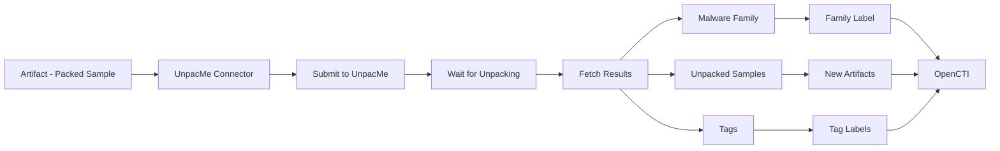

# OpenCTI UnpacMe Connector

## Table of Contents

- [Introduction](#introduction)
- [Installation](#installation)
  - [Requirements](#requirements)
- [Configuration](#configuration)
  - [OpenCTI Configuration](#opencti-configuration)
  - [Base Connector Configuration](#base-connector-configuration)
  - [UnpacMe Configuration](#unpacme-configuration)
- [Deployment](#deployment)
  - [Docker Deployment](#docker-deployment)
  - [Manual Deployment](#manual-deployment)
- [Usage](#usage)
- [Behavior](#behavior)
  - [Data Flow](#data-flow)
  - [Enrichment Mapping](#enrichment-mapping)
  - [Generated STIX Objects](#generated-stix-objects)
- [Debugging](#debugging)
- [Additional Information](#additional-information)

---

## Introduction

[UnpacMe](https://www.unpac.me/) is an automated malware unpacking service that extracts and analyzes packed malware samples. This connector submits file artifacts to UnpacMe for unpacking and analysis, then imports the results including unpacked samples and malware family identifications.

Key features:
- Automated malware unpacking
- Malware family identification
- Unpacked sample extraction
- YARA rule matching
- Relationship creation between samples

---

## Installation

### Requirements

- OpenCTI Platform >= 6.0.0
- UnpacMe API key ([Get one here](https://www.unpac.me/account))
- Network access to UnpacMe API

---

## Configuration

### OpenCTI Configuration

| Parameter | Docker envvar | Mandatory | Description |
|-----------|---------------|-----------|-------------|
| `opencti_url` | `OPENCTI_URL` | Yes | The URL of the OpenCTI platform |
| `opencti_token` | `OPENCTI_TOKEN` | Yes | The default admin token configured in the OpenCTI platform |

### Base Connector Configuration

| Parameter | Docker envvar | Mandatory | Description |
|-----------|---------------|-----------|-------------|
| `connector_id` | `CONNECTOR_ID` | Yes | A valid arbitrary `UUIDv4` unique for this connector |
| `connector_name` | `CONNECTOR_NAME` | Yes | The name of the connector instance |
| `connector_scope` | `CONNECTOR_SCOPE` | Yes | Must be `Artifact` |
| `connector_auto` | `CONNECTOR_AUTO` | Yes | Enable/disable auto-enrichment |
| `connector_confidence_level` | `CONNECTOR_CONFIDENCE_LEVEL` | Yes | Default confidence level (0-100) |
| `connector_log_level` | `CONNECTOR_LOG_LEVEL` | Yes | Log level (`debug`, `info`, `warn`, `error`) |

### UnpacMe Configuration

| Parameter | Docker envvar | Mandatory | Description |
|-----------|---------------|-----------|-------------|
| `unpac_me_api_key` | `UNPAC_ME_API_KEY` | Yes | UnpacMe API key |
| `unpac_me_private` | `UNPAC_ME_PRIVATE` | No | Mark samples as private (PRO users only) |
| `unpac_me_user_agent` | `UNPAC_ME_USER_AGENT` | No | Custom user agent string |
| `unpac_me_less_noise` | `UNPAC_ME_LESS_NOISE` | No | Only upload if malware family matched |
| `unpac_me_family_color` | `UNPAC_ME_FAMILY_COLOR` | No | Label color for malware family |
| `unpac_me_tag_color` | `UNPAC_ME_TAG_COLOR` | No | Label color for other tags |
| `unpac_me_max_tlp` | `UNPAC_ME_MAX_TLP` | No | Maximum TLP for submission |

---

## Deployment

### Docker Deployment

Build a Docker Image using the provided `Dockerfile`.

Example `docker-compose.yml`:

```yaml
version: '3'
services:
  connector-unpac-me:
    image: opencti/connector-unpac-me:latest
    environment:
      - OPENCTI_URL=http://localhost
      - OPENCTI_TOKEN=ChangeMe
      - CONNECTOR_ID=Unpac_Me
      - "CONNECTOR_NAME=UnpacMe"
      - CONNECTOR_SCOPE=Artifact
      - CONNECTOR_AUTO=false
      - CONNECTOR_CONFIDENCE_LEVEL=50
      - CONNECTOR_LOG_LEVEL=error
      - UNPAC_ME_API_KEY=ChangeMe
      - UNPAC_ME_PRIVATE=false
      - "UNPAC_ME_USER_AGENT=UnpacMe OpenCTI Connector v1.0.0"
      - UNPAC_ME_LESS_NOISE=false
      - UNPAC_ME_FAMILY_COLOR=#0059f7
      - UNPAC_ME_TAG_COLOR=#54483b
      - UNPAC_ME_MAX_TLP=TLP:AMBER
    restart: always
```

### Manual Deployment

1. Clone the repository
2. Copy `config.yml.sample` to `config.yml` and configure
3. Install dependencies: `pip install -r requirements.txt`
4. Run: `python unpac_me.py`

---

## Usage

The connector enriches Artifact observables by:
1. Submitting packed samples to UnpacMe
2. Waiting for unpacking to complete
3. Downloading unpacked samples
4. Creating relationships between original and unpacked artifacts

Trigger enrichment:
- Manually via the OpenCTI UI on Artifact entities
- Automatically if `CONNECTOR_AUTO=true`
- Via playbooks

---

## Behavior

### Data Flow



### Enrichment Mapping

| UnpacMe Data | OpenCTI Entity | Description |
|--------------|----------------|-------------|
| Malware family | Label | Identified malware family |
| Tags | Labels | Analysis tags |
| Unpacked samples | Artifact | Extracted unpacked files |
| Analysis link | External Reference | Link to UnpacMe analysis |

### Generated STIX Objects

| Object Type | Description |
|-------------|-------------|
| Artifact | Unpacked samples uploaded to OpenCTI |
| Labels | Malware family and tag labels |
| External Reference | Link to UnpacMe analysis |
| Relationship | Links between packed and unpacked samples |

---

## Debugging

Enable debug logging by setting `CONNECTOR_LOG_LEVEL=debug` to see:
- Sample submission status
- Unpacking progress
- Result processing details

Common issues:
- **No file attached**: Ensure artifact has an attached file
- **API errors**: Verify your UnpacMe API key
- **Rate limiting**: UnpacMe may limit submission frequency

---

## Additional Information

- [UnpacMe](https://www.unpac.me/)
- [Get API Key](https://www.unpac.me/account)
- [UnpacMe Documentation](https://www.unpac.me/docs)

### Less Noise Mode

When `UNPAC_ME_LESS_NOISE=true`, the connector will only upload unpacked samples if they matched a malware family, reducing noise from generic unpacking results.

