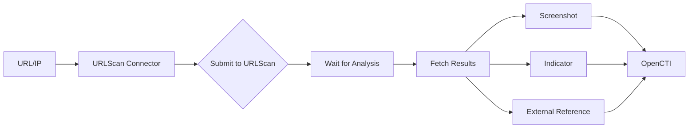

# OpenCTI URLScan Connector

## Table of Contents

- [Introduction](#introduction)
- [Installation](#installation)
  - [Requirements](#requirements)
- [Configuration](#configuration)
  - [OpenCTI Configuration](#opencti-configuration)
  - [Base Connector Configuration](#base-connector-configuration)
  - [URLScan Configuration](#urlscan-configuration)
- [Deployment](#deployment)
  - [Docker Deployment](#docker-deployment)
  - [Manual Deployment](#manual-deployment)
- [Usage](#usage)
- [Behavior](#behavior)
  - [Data Flow](#data-flow)
  - [Processing Details](#processing-details)
  - [Generated STIX Objects](#generated-stix-objects)
- [Debugging](#debugging)
- [Additional Information](#additional-information)

---

## Introduction

[URLScan](https://urlscan.io/) is an online service that scans URLs to analyze and detect potential security threats. It provides detailed information about page content, loaded external resources, potential threats, and other relevant security details.

This connector enriches URLs and IP addresses by submitting them to URLScan for analysis and importing the results.

---

## Installation

### Requirements

- OpenCTI Platform >= 6.0.0
- URLScan API key (optional for public scans)
- pycti

---

## Configuration

### OpenCTI Configuration

| Parameter | Docker envvar | Mandatory | Description |
|-----------|---------------|-----------|-------------|
| `opencti_url` | `OPENCTI_URL` | Yes | The URL of the OpenCTI platform |
| `opencti_token` | `OPENCTI_TOKEN` | Yes | The default admin token configured in the OpenCTI platform |

### Base Connector Configuration

| Parameter | Docker envvar | Mandatory | Description |
|-----------|---------------|-----------|-------------|
| `connector_id` | `CONNECTOR_ID` | No | A valid arbitrary `UUIDv4` unique for this connector |
| `connector_name` | `CONNECTOR_NAME` | No | The name of the connector instance |
| `connector_scope` | `CONNECTOR_SCOPE` | No | Supported: `url`, `ipv4-addr`, `ipv6-addr` |
| `connector_auto` | `CONNECTOR_AUTO` | No | Enable/disable auto-enrichment |
| `connector_log_level` | `CONNECTOR_LOG_LEVEL` | No | Log level (`debug`, `info`, `warn`, `error`) |

### URLScan Configuration

| Parameter | Docker envvar | Mandatory | Description |
|-----------|---------------|-----------|-------------|
| `urlscan_api_key` | `URLSCAN_ENRICHMENT_API_KEY` | No | URLScan API key (for private scans) |
| `urlscan_import_screenshot` | `URLSCAN_ENRICHMENT_IMPORT_SCREENSHOT` | No | Import screenshot (default: true) |
| `urlscan_visibility` | `URLSCAN_ENRICHMENT_VISIBILITY` | No | Scan visibility (default: public) |
| `urlscan_search_filtered_by_date` | `URLSCAN_ENRICHMENT_SEARCH_FILTERED_BY_DATE` | No | Search date filter (default: >now-1d) |
| `urlscan_max_tlp` | `URLSCAN_ENRICHMENT_MAX_TLP` | No | Maximum TLP for processing |
| `urlscan_create_indicator` | `URLSCAN_ENRICHMENT_CREATE_INDICATOR` | No | Create indicator (default: true) |

---

## Deployment

### Docker Deployment

Build a Docker Image using the provided `Dockerfile`.

Example `docker-compose.yml`:

```yaml
services:
  connector-urlscan-enrichment:
    image: opencti/connector-urlscan-enrichment:latest
    environment:
      - OPENCTI_URL=http://localhost
      - OPENCTI_TOKEN=ChangeMe
    restart: always
```

### Manual Deployment

1. Clone the repository
2. Create `config.yml` based on `config.yml.sample`
3. Install dependencies: `pip3 install -r requirements.txt`
4. Run: `python3 main.py`

---

## Usage

The connector enriches URLs and IP addresses by:
1. Submitting URLs to URLScan for analysis
2. Waiting for analysis completion
3. Importing results including screenshots and indicators

Trigger enrichment:
- Manually via the OpenCTI UI
- Automatically if `CONNECTOR_AUTO=true`
- Via playbooks

---

## Behavior

### Data Flow



### Processing Details

1. **URL Submission**: URLs are submitted for scanning
2. **Analysis Wait**: Polls for completion (10 sec intervals, max 2 min)
3. **IP Enrichment**: Creates external reference link to URLScan search
4. **Screenshot Import**: Optionally imports page screenshots
5. **Indicator Creation**: Creates indicators based on analysis

### Generated STIX Objects

| Object Type | Description |
|-------------|-------------|
| External Reference | Link to URLScan analysis |
| Screenshot | Page screenshot (if enabled) |
| Indicator | Threat indicator (if enabled) |

---

## Debugging

Enable debug logging by setting `CONNECTOR_LOG_LEVEL=debug` to see:
- Submission status
- Polling progress
- Result processing

---

## Additional Information

- [URLScan](https://urlscan.io/)
- [URLScan API Documentation](https://urlscan.io/docs/api/)

### Warnings

- **Auto Mode**: Choose only one scope type (url OR hostname OR domain-name) to avoid looping ingestions
- **IP Enrichment**: For IPv4/IPv6, only external reference links are generated
- **Polling**: Analysis may take up to 2 minutes to complete
