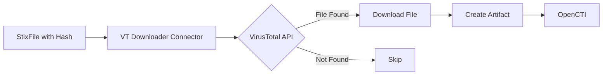

# OpenCTI VirusTotal Downloader Connector

## Table of Contents

- [Introduction](#introduction)
- [Installation](#installation)
  - [Requirements](#requirements)
- [Configuration](#configuration)
  - [OpenCTI Configuration](#opencti-configuration)
  - [Base Connector Configuration](#base-connector-configuration)
  - [VirusTotal Downloader Configuration](#virustotal-downloader-configuration)
- [Deployment](#deployment)
  - [Docker Deployment](#docker-deployment)
  - [Manual Deployment](#manual-deployment)
- [Usage](#usage)
- [Behavior](#behavior)
  - [Data Flow](#data-flow)
  - [Processing Details](#processing-details)
  - [Generated STIX Objects](#generated-stix-objects)
- [Debugging](#debugging)
- [Additional Information](#additional-information)

---

## Introduction

The VirusTotal Downloader connector enables automated and manual retrieval of file samples from VirusTotal based on file hashes. When a file hash (MD5, SHA1, or SHA256) is enriched, the connector attempts to download the associated file from VirusTotal and creates a new Artifact observable in OpenCTI.

Key features:
- Download samples by MD5, SHA1, or SHA256 hash
- Automatic Artifact creation
- Manual and automated enrichment support
- File content retrieval for analysis

---

## Installation

### Requirements

- OpenCTI Platform >= 6.0.0
- VirusTotal API key (with download permissions)
- Network access to VirusTotal API

**Note**: Downloading samples from VirusTotal requires a premium API subscription.

---

## Configuration

### OpenCTI Configuration

| Parameter | Docker envvar | Mandatory | Description |
|-----------|---------------|-----------|-------------|
| `opencti_url` | `OPENCTI_URL` | Yes | The URL of the OpenCTI platform |
| `opencti_token` | `OPENCTI_TOKEN` | Yes | The default admin token configured in the OpenCTI platform |

### Base Connector Configuration

| Parameter | Docker envvar | Mandatory | Description |
|-----------|---------------|-----------|-------------|
| `connector_id` | `CONNECTOR_ID` | No | A valid arbitrary `UUIDv4` unique for this connector |
| `connector_name` | `CONNECTOR_NAME` | No | The name of the connector instance |
| `connector_scope` | `CONNECTOR_SCOPE` | No | Supported: `StixFile` |
| `connector_auto` | `CONNECTOR_AUTO` | No | Enable/disable auto-enrichment |
| `connector_log_level` | `CONNECTOR_LOG_LEVEL` | No | Log level (`debug`, `info`, `warn`, `error`) |

### VirusTotal Downloader Configuration

| Parameter | Docker envvar | Mandatory | Description |
|-----------|---------------|-----------|-------------|
| `virustotal_downloader_api_key` | `VIRUSTOTAL_DOWNLOADER_API_KEY` | Yes | VirusTotal API key with download permissions |

---

## Deployment

### Docker Deployment

Build a Docker Image using the provided `Dockerfile`.

Example `docker-compose.yml`:

```yaml
version: '3'
services:
  connector-virustotal-downloader:
    image: opencti/connector-virustotal-downloader:latest
    environment:
      - OPENCTI_URL=http://localhost
      - OPENCTI_TOKEN=ChangeMe
      - VIRUSTOTAL_DOWNLOADER_API_KEY=ChangeMe
    restart: always
```

### Manual Deployment

1. Clone the repository
2. Copy `config.yml.sample` to `config.yml` and configure
3. Install dependencies: `pip install -r requirements.txt`
4. Run the connector

---

## Usage

The connector downloads file samples by:
1. Receiving file hash enrichment requests
2. Querying VirusTotal for the file
3. Downloading the file content if available
4. Creating an Artifact observable with the file

Trigger enrichment:
- Manually via the OpenCTI UI on StixFile entities
- Automatically if `CONNECTOR_AUTO=true`
- Via playbooks

---

## Behavior

### Data Flow



### Processing Details

1. **Hash Extraction**: Extracts MD5, SHA1, or SHA256 from StixFile
2. **VirusTotal Query**: Checks if file exists in VirusTotal
3. **Download**: Downloads file content if available
4. **Artifact Creation**: Creates new Artifact observable with downloaded file
5. **Relationship**: Links Artifact to original StixFile

### Generated STIX Objects

| Object Type | Description |
|-------------|-------------|
| Artifact | Downloaded file sample |
| Relationship | Links Artifact to original StixFile |

---

## Debugging

Enable debug logging by setting `CONNECTOR_LOG_LEVEL=debug` to see:
- Hash lookup requests
- Download progress
- Artifact creation details

Common issues:
- **File not found**: File may not be in VirusTotal's database
- **API permissions**: Ensure your API key has download permissions
- **Rate limiting**: VirusTotal may limit download frequency

---

## Additional Information

- [VirusTotal](https://www.virustotal.com/)
- [VirusTotal API Documentation](https://developers.virustotal.com/)
- [Get API Key](https://www.virustotal.com/gui/join-us)

### API Requirements

Downloading files from VirusTotal requires a premium API subscription. The free tier does not support file downloads.
