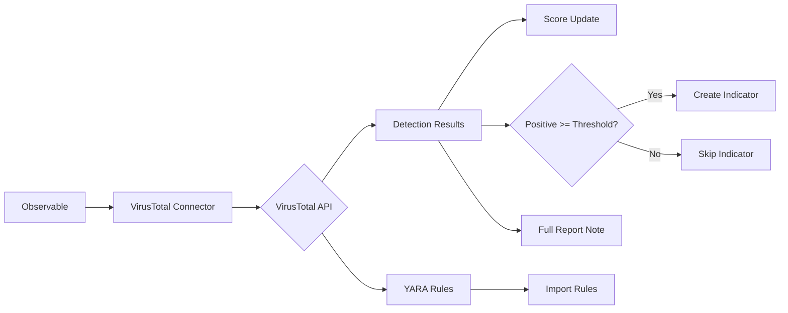

# OpenCTI VirusTotal Connector

| Status | Date | Comment |
|--------|------|---------|
| Filigran Verified | -    | -       |

## Table of Contents

- [Introduction](#introduction)
- [Installation](#installation)
  - [Requirements](#requirements)
- [Configuration](#configuration)
  - [OpenCTI Configuration](#opencti-configuration)
  - [Base Connector Configuration](#base-connector-configuration)
  - [VirusTotal Configuration](#virustotal-configuration)
- [Deployment](#deployment)
  - [Docker Deployment](#docker-deployment)
  - [Manual Deployment](#manual-deployment)
- [Usage](#usage)
- [Behavior](#behavior)
  - [Data Flow](#data-flow)
  - [Enrichment Mapping](#enrichment-mapping)
  - [Indicator Creation](#indicator-creation)
  - [Generated STIX Objects](#generated-stix-objects)
- [Debugging](#debugging)
- [Additional Information](#additional-information)

---

## Introduction

VirusTotal is a service that analyzes files, URLs, domains, and IPs to detect malware and other breaches. This connector enriches observables by querying the VirusTotal API and importing threat intelligence.

Key features:
- Multi-engine malware detection
- File hash reputation
- IP, domain, and URL analysis
- YARA rule import
- Automatic indicator creation
- Sample import for artifacts

---

## Installation

### Requirements

- OpenCTI Platform >= 6.0.6
- VirusTotal API key
- Network access to VirusTotal API

---

## Configuration

### OpenCTI Configuration

| Parameter | Docker envvar | Mandatory | Description |
|-----------|---------------|-----------|-------------|
| `opencti_url` | `OPENCTI_URL` | Yes | The URL of the OpenCTI platform |
| `opencti_token` | `OPENCTI_TOKEN` | Yes | The default admin token configured in the OpenCTI platform |

### Base Connector Configuration

| Parameter | Docker envvar | Mandatory | Description |
|-----------|---------------|-----------|-------------|
| `connector_id` | `CONNECTOR_ID` | No | A valid arbitrary `UUIDv4` unique for this connector |
| `connector_name` | `CONNECTOR_NAME` | No | The name of the connector instance |
| `connector_scope` | `CONNECTOR_SCOPE` | No | Supported: `StixFile`, `Artifact`, `IPv4-Addr`, `Domain-Name`, `Url`, `Hostname` |
| `connector_auto` | `CONNECTOR_AUTO` | No | Enable/disable auto-enrichment |
| `connector_log_level` | `CONNECTOR_LOG_LEVEL` | No | Log level (`debug`, `info`, `warn`, `error`) |

### VirusTotal Configuration

| Parameter | Docker envvar | Mandatory | Description |
|-----------|---------------|-----------|-------------|
| `virustotal_token` | `VIRUSTOTAL_TOKEN` | Yes | VirusTotal API key |
| `virustotal_max_tlp` | `VIRUSTOTAL_MAX_TLP` | No | Maximum TLP for processing |
| `virustotal_replace_with_lower_score` | `VIRUSTOTAL_REPLACE_WITH_LOWER_SCORE` | No | Replace score even if lower (default: true) |
| `virustotal_file_create_note_full_report` | `VIRUSTOTAL_FILE_CREATE_NOTE_FULL_REPORT` | No | Include full report as Note |
| `virustotal_file_upload_unseen_artifacts` | `VIRUSTOTAL_FILE_UPLOAD_UNSEEN_ARTIFACTS` | No | Upload unknown artifacts (<32MB) |
| `virustotal_file_indicator_create_positives` | `VIRUSTOTAL_FILE_INDICATOR_CREATE_POSITIVES` | No | Create indicator threshold (default: 10) |
| `virustotal_file_indicator_valid_minutes` | `VIRUSTOTAL_FILE_INDICATOR_VALID_MINUTES` | No | Indicator validity in minutes |
| `virustotal_file_indicator_detect` | `VIRUSTOTAL_FILE_INDICATOR_DETECT` | No | Set detection flag on indicator |
| `virustotal_file_import_yara` | `VIRUSTOTAL_FILE_IMPORT_YARA` | No | Import YARA rules |
| `virustotal_ip_indicator_create_positives` | `VIRUSTOTAL_IP_INDICATOR_CREATE_POSITIVES` | No | IP indicator creation threshold |
| `virustotal_ip_add_relationships` | `VIRUSTOTAL_IP_ADD_RELATIONSHIPS` | No | Add ASN and location relationships |
| `virustotal_domain_indicator_create_positives` | `VIRUSTOTAL_DOMAIN_INDICATOR_CREATE_POSITIVES` | No | Domain indicator creation threshold |
| `virustotal_domain_add_relationships` | `VIRUSTOTAL_DOMAIN_ADD_RELATIONSHIPS` | No | Add IP resolution relationships |
| `virustotal_url_upload_unseen` | `VIRUSTOTAL_URL_UPLOAD_UNSEEN` | No | Upload unknown URLs for analysis |
| `virustotal_url_indicator_create_positives` | `VIRUSTOTAL_URL_INDICATOR_CREATE_POSITIVES` | No | URL indicator creation threshold |

---

## Deployment

### Docker Deployment

Build a Docker Image using the provided `Dockerfile`.

Example `docker-compose.yml`:

```yaml
version: '3'
services:
  connector-virustotal:
    image: opencti/connector-virustotal:latest
    environment:
      - OPENCTI_URL=http://localhost
      - OPENCTI_TOKEN=ChangeMe
      - VIRUSTOTAL_TOKEN=ChangeMe
    restart: always
```

### Manual Deployment

1. Clone the repository
2. Copy `config.yml.sample` to `config.yml` and configure
3. Install dependencies: `pip install -r requirements.txt`
4. Run the connector

---

## Usage

The connector enriches observables by:
1. Querying the VirusTotal API for detection results
2. Creating notes with full analysis reports
3. Adjusting scores based on positive detections
4. Creating indicators when threshold is met
5. Importing YARA rules (for files)

Trigger enrichment:
- Manually via the OpenCTI UI
- Automatically if `CONNECTOR_AUTO=true`
- Via playbooks

---

## Behavior

### Data Flow



### Enrichment Mapping

| Observable Type | Enrichment Data | Relationships |
|-----------------|-----------------|---------------|
| StixFile/Artifact | Hash, detections, YARA | Indicator based-on |
| IPv4-Addr | Detection count, ASN | ASN, Location |
| Domain-Name | Detection count, resolution | Resolved IPs |
| URL | Detection count | Indicator based-on |
| Hostname | Detection count | Similar to domain |

### Indicator Creation

| Observable Type | Default Threshold | Detection Flag |
|-----------------|-------------------|----------------|
| File/Artifact | 10 positives | TRUE |
| IPv4-Addr | 10 positives | TRUE |
| Domain-Name | 10 positives | TRUE |
| URL | 10 positives | TRUE |

### Generated STIX Objects

| Object Type | Description |
|-------------|-------------|
| Note | Full analysis results table |
| Indicator | Created when positive threshold met |
| YARA Indicator | Crowdsourced YARA rules (for files) |
| Autonomous System | ASN for IP addresses |
| Location | Geolocation for IPs |
| Relationship | Various entity links |

---

## Debugging

Enable debug logging by setting `CONNECTOR_LOG_LEVEL=debug`.

Use logging with:
```python
self.helper.log_{LOG_LEVEL}("Message")
```

**Note**: Values returned by VirusTotal that are falsy will display as 'N/A' in notes.

---

## Additional Information

- [VirusTotal](https://www.virustotal.com/)
- [VirusTotal API Documentation](https://developers.virustotal.com/)
- [Get API Key](https://www.virustotal.com/gui/join-us)
