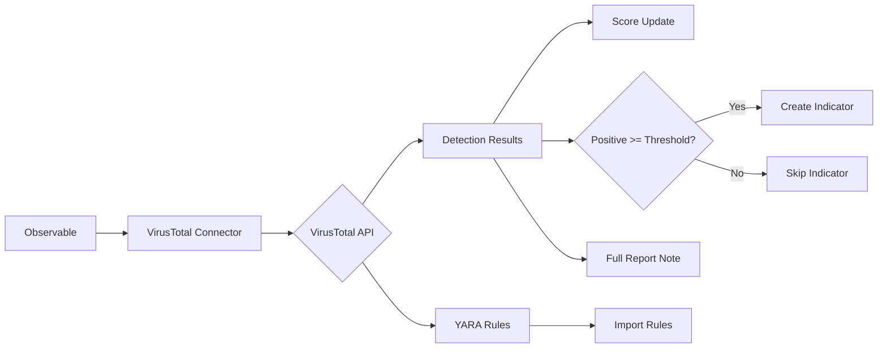

# OpenCTI VirusTotal Connector

| Status | Date | Comment |
|--------|------|---------|
| Filigran Verified | -    | -       |

## Table of Contents

- [Introduction](#introduction)
- [Installation](#installation)
  - [Requirements](#requirements)
- [Configuration](#configuration)
  - [OpenCTI Configuration](#opencti-configuration)
  - [Base Connector Configuration](#base-connector-configuration)
  - [VirusTotal Configuration](#virustotal-configuration)
- [Deployment](#deployment)
  - [Docker Deployment](#docker-deployment)
  - [Manual Deployment](#manual-deployment)
- [Usage](#usage)
- [Behavior](#behavior)
  - [Data Flow](#data-flow)
  - [Enrichment Mapping](#enrichment-mapping)
  - [Indicator Creation](#indicator-creation)
  - [Generated STIX Objects](#generated-stix-objects)
  - [IP Resolutions](#ip-resolutions)
- [Debugging](#debugging)
- [Additional Information](#additional-information)

---

## Introduction

VirusTotal is a service that analyzes files, URLs, domains, and IPs to detect malware and other breaches. This connector enriches observables by querying the VirusTotal API and importing threat intelligence.

Key features:
- Multi-engine malware detection
- File hash reputation
- IP, domain, and URL analysis
- YARA rule import
- Automatic indicator creation
- Sample import for artifacts

---

## Installation

### Requirements

- OpenCTI Platform >= 6.0.6
- VirusTotal API key
- Network access to VirusTotal API

---

## Configuration

### OpenCTI Configuration

| Parameter | Docker envvar | Mandatory | Description |
|-----------|---------------|-----------|-------------|
| `opencti_url` | `OPENCTI_URL` | Yes | The URL of the OpenCTI platform |
| `opencti_token` | `OPENCTI_TOKEN` | Yes | The default admin token configured in the OpenCTI platform |

### Base Connector Configuration

| Parameter | Docker envvar | Mandatory | Description |
|-----------|---------------|-----------|-------------|
| `connector_id` | `CONNECTOR_ID` | No | A valid arbitrary `UUIDv4` unique for this connector |
| `connector_name` | `CONNECTOR_NAME` | No | The name of the connector instance |
| `connector_scope` | `CONNECTOR_SCOPE` | No | Supported: `StixFile`, `Artifact`, `IPv4-Addr`, `Domain-Name`, `Url`, `Hostname` |
| `connector_auto` | `CONNECTOR_AUTO` | No | Enable/disable auto-enrichment |
| `connector_log_level` | `CONNECTOR_LOG_LEVEL` | No | Log level (`debug`, `info`, `warn`, `error`) |

### VirusTotal Configuration

| Parameter | Docker envvar | Mandatory | Description |
|-----------|---------------|-----------|-------------|
| `virustotal_token` | `VIRUSTOTAL_TOKEN` | Yes | VirusTotal API key |
| `virustotal_max_tlp` | `VIRUSTOTAL_MAX_TLP` | No | Maximum TLP for processing |
| `virustotal_replace_with_lower_score` | `VIRUSTOTAL_REPLACE_WITH_LOWER_SCORE` | No | Replace score even if lower (default: true) |
| `virustotal_file_create_note_full_report` | `VIRUSTOTAL_FILE_CREATE_NOTE_FULL_REPORT` | No | Include full report as Note |
| `virustotal_file_upload_unseen_artifacts` | `VIRUSTOTAL_FILE_UPLOAD_UNSEEN_ARTIFACTS` | No | Upload unknown artifacts (<32MB) |
| `virustotal_file_indicator_create_positives` | `VIRUSTOTAL_FILE_INDICATOR_CREATE_POSITIVES` | No | Create indicator threshold (default: 10) |
| `virustotal_file_indicator_valid_minutes` | `VIRUSTOTAL_FILE_INDICATOR_VALID_MINUTES` | No | Indicator validity in minutes |
| `virustotal_file_indicator_detect` | `VIRUSTOTAL_FILE_INDICATOR_DETECT` | No | Set detection flag on indicator |
| `virustotal_file_import_yara` | `VIRUSTOTAL_FILE_IMPORT_YARA` | No | Import YARA rules |
| `virustotal_ip_indicator_create_positives` | `VIRUSTOTAL_IP_INDICATOR_CREATE_POSITIVES` | No | IP indicator creation threshold |
| `virustotal_ip_add_relationships` | `VIRUSTOTAL_IP_ADD_RELATIONSHIPS` | No | Add ASN and location relationships |
| `virustotal_ip_add_resolutions` | `VIRUSTOTAL_IP_ADD_RESOLUTIONS` | No | Import the domains resolving to the IP (default: false). See [IP Resolutions](#ip-resolutions) |
| `virustotal_ip_resolutions_since` | `VIRUSTOTAL_IP_RESOLUTIONS_SINCE` | No | Date floor: `YYYY-MM-DD`, a number of days such as `90d` (resolved at each enrichment) or `none` (default: `90d`) |
| `virustotal_ip_resolutions_max_entries` | `VIRUSTOTAL_IP_RESOLUTIONS_MAX_ENTRIES` | No | Stop after this many resolutions fetched, counted before the keyword filter (default: unset, no entry cap) |
| `virustotal_ip_resolutions_max_pages` | `VIRUSTOTAL_IP_RESOLUTIONS_MAX_PAGES` | No | Maximum pages of 40 resolutions per enrichment, one API lookup each (default: 25) |
| `virustotal_ip_resolutions_keywords` | `VIRUSTOTAL_IP_RESOLUTIONS_KEYWORDS` | No | Case-insensitive regex a resolved domain must match to be imported (default: unset, all) |
| `virustotal_api_requests_per_minute` | `VIRUSTOTAL_API_REQUESTS_PER_MINUTE` | No | Spacing between resolutions pages; `0` disables the wait (default: 4) |
| `virustotal_domain_indicator_create_positives` | `VIRUSTOTAL_DOMAIN_INDICATOR_CREATE_POSITIVES` | No | Domain indicator creation threshold |
| `virustotal_domain_add_relationships` | `VIRUSTOTAL_DOMAIN_ADD_RELATIONSHIPS` | No | Add IP resolution relationships |
| `virustotal_url_upload_unseen` | `VIRUSTOTAL_URL_UPLOAD_UNSEEN` | No | Upload unknown URLs for analysis |
| `virustotal_url_indicator_create_positives` | `VIRUSTOTAL_URL_INDICATOR_CREATE_POSITIVES` | No | URL indicator creation threshold |

---

## Deployment

### Docker Deployment

Build a Docker Image using the provided `Dockerfile`.

Example `docker-compose.yml`:

```yaml
version: '3'
services:
  connector-virustotal:
    image: opencti/connector-virustotal:latest
    environment:
      - OPENCTI_URL=http://localhost
      - OPENCTI_TOKEN=ChangeMe
      - VIRUSTOTAL_TOKEN=ChangeMe
    restart: always
```

### Manual Deployment

1. Clone the repository
2. Copy `config.yml.sample` to `config.yml` and configure
3. Install dependencies: `pip install -r requirements.txt`
4. Run the connector

---

## Usage

The connector enriches observables by:
1. Querying the VirusTotal API for detection results
2. Creating notes with full analysis reports
3. Adjusting scores based on positive detections
4. Creating indicators when threshold is met
5. Importing YARA rules (for files)

Trigger enrichment:
- Manually via the OpenCTI UI
- Automatically if `CONNECTOR_AUTO=true`
- Via playbooks

---

## Behavior

### Data Flow


```mermaid
flowchart LR
    A[Observable] --> B[VirusTotal Connector]
    B --> C{VirusTotal API}
    C --> D[Detection Results]
    D --> E[Score Update]
    D --> F{Positive >= Threshold?}
    F -->|Yes| G[Create Indicator]
    F -->|No| H[Skip Indicator]
    D --> I[Full Report Note]
    C --> J[YARA Rules]
    J --> K[Import Rules]
```

### Enrichment Mapping

| Observable Type | Enrichment Data | Relationships |
|-----------------|-----------------|---------------|
| StixFile/Artifact | Hash, detections, YARA | Indicator based-on |
| IPv4-Addr | Detection count, ASN, resolutions (optional) | ASN, Location, resolving Domain-Names |
| Domain-Name | Detection count, resolution | Resolved IPs |
| URL | Detection count | Indicator based-on |
| Hostname | Detection count | Similar to domain |

### Indicator Creation

| Observable Type | Default Threshold | Detection Flag |
|-----------------|-------------------|----------------|
| File/Artifact | 10 positives | TRUE |
| IPv4-Addr | 10 positives | TRUE |
| Domain-Name | 10 positives | TRUE |
| URL | 10 positives | TRUE |

### Generated STIX Objects

| Object Type | Description |
|-------------|-------------|
| Note | Full analysis results table |
| Indicator | Created when positive threshold met |
| YARA Indicator | Crowdsourced YARA rules (for files) |
| Autonomous System | ASN for IP addresses |
| Location | Geolocation for IPs |
| Domain-Name | Domains resolving to an IP (when `VIRUSTOTAL_IP_ADD_RESOLUTIONS=true`), no score |
| Relationship | Various entity links |

### IP Resolutions

When `VIRUSTOTAL_IP_ADD_RESOLUTIONS=true`, enriching an IPv4-Addr observable also pages
`/ip_addresses/{ip}/resolutions` (40 per page, newest first) after the usual enrichment. Indicators are not concerned.

For each kept resolution, the connector creates a Domain-Name (author VirusTotal, no score, no label) and a
`Domain-Name resolves-to IPv4-Addr` relationship whose `start_time` is the VirusTotal **last seen** date of the
resolution. Re-enriching the same IP updates these objects instead of duplicating them.

Paging stops at the first of:

1. a resolution last seen before `VIRUSTOTAL_IP_RESOLUTIONS_SINCE`;
2. `VIRUSTOTAL_IP_RESOLUTIONS_MAX_ENTRIES` resolutions fetched (sent to VirusTotal as the page size when below 40, so `3` is one lookup returning the three most recent resolutions);
3. `VIRUSTOTAL_IP_RESOLUTIONS_MAX_PAGES` pages fetched;
4. the end of the list;
5. a failed page, including HTTP 429 after the client retries. What was already sent stays.

`VIRUSTOTAL_IP_RESOLUTIONS_KEYWORDS` filters which resolutions are imported; it does not reduce the lookups spent.
Each page is sent as its own bundle, so the first results appear before paging ends. In a playbook, all
resolutions are added to the enrichment bundle and sent once. The work message ends with
`resolutions: kept N of M fetched (P pages, stopped: date floor | entry cap | page cap | end of list | error)`.

#### Cost

One page is one API lookup. On top of the IP lookup itself, the worst case of one enrichment is
`MAX_PAGES` lookups when `MAX_ENTRIES` is unset, and the lower of `MAX_PAGES` and `ceil(MAX_ENTRIES / 40)`
lookups when it is set.

| API key | Settings | Worst case per enrichment |
|---------|----------|---------------------------|
| Free (4 lookups/min, 500/day) | `MAX_PAGES=25`, `API_REQUESTS_PER_MINUTE=4` | 25 of 500 daily lookups, about 6 minutes; usually far less once the date floor stops paging |
| Free | `MAX_ENTRIES=3` | 1 lookup |
| Premium | `MAX_PAGES=50`, `API_REQUESTS_PER_MINUTE=0` | 50 lookups of the group's daily quota, seconds |

---

## Debugging

Enable debug logging by setting `CONNECTOR_LOG_LEVEL=debug`.

Use logging with:
```python
self.helper.log_{LOG_LEVEL}("Message")
```

**Note**: Values returned by VirusTotal that are falsy will display as 'N/A' in notes.

---

## Additional Information

- [VirusTotal](https://www.virustotal.com/)
- [VirusTotal API Documentation](https://developers.virustotal.com/)
- [Get API Key](https://www.virustotal.com/gui/join-us)
