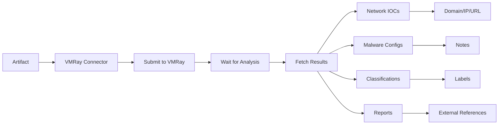

# OpenCTI VMRay Analyzer Connector

## Table of Contents

- [Introduction](#introduction)
- [Installation](#installation)
  - [Requirements](#requirements)
- [Configuration](#configuration)
  - [OpenCTI Configuration](#opencti-configuration)
  - [Base Connector Configuration](#base-connector-configuration)
  - [VMRay Analyzer Configuration](#vmray-analyzer-configuration)
- [Deployment](#deployment)
  - [Docker Deployment](#docker-deployment)
  - [Manual Deployment](#manual-deployment)
- [Usage](#usage)
- [Behavior](#behavior)
  - [Data Flow](#data-flow)
  - [Analysis Reports](#analysis-reports)
  - [Generated STIX Objects](#generated-stix-objects)
- [Debugging](#debugging)
- [Additional Information](#additional-information)

---

## Introduction

[VMRay Analyzer](https://www.vmray.com/) is an advanced malware analysis and detection platform that provides deep analysis of suspicious files. This connector submits file artifacts to VMRay for analysis and enriches OpenCTI with comprehensive threat intelligence.

Key features:
- Multi-platform malware analysis
- Network indicator extraction
- Malware configuration extraction
- Threat classification
- MITRE ATT&CK mapping
- Comprehensive report generation

---

## Installation

### Requirements

- OpenCTI Platform >= 6.0.0
- VMRay Analyzer API key
- Network access to VMRay Analyzer API

---

## Configuration

### OpenCTI Configuration

| Parameter | Docker envvar | Mandatory | Description |
|-----------|---------------|-----------|-------------|
| `opencti_url` | `OPENCTI_URL` | Yes | The URL of the OpenCTI platform |
| `opencti_token` | `OPENCTI_TOKEN` | Yes | The default admin token configured in the OpenCTI platform |

### Base Connector Configuration

| Parameter | Docker envvar | Mandatory | Description |
|-----------|---------------|-----------|-------------|
| `connector_id` | `CONNECTOR_ID` | Yes | A valid arbitrary `UUIDv4` unique for this connector |
| `connector_name` | `CONNECTOR_NAME` | Yes | The name of the connector instance |
| `connector_scope` | `CONNECTOR_SCOPE` | Yes | Must be `Artifact` |
| `connector_auto` | `CONNECTOR_AUTO` | Yes | Enable/disable auto-enrichment |
| `connector_confidence_level` | `CONNECTOR_CONFIDENCE_LEVEL` | Yes | Default confidence level (0-100) |
| `connector_log_level` | `CONNECTOR_LOG_LEVEL` | Yes | Log level (`debug`, `info`, `warn`, `error`) |

### VMRay Analyzer Configuration

| Parameter | Docker envvar | Mandatory | Description |
|-----------|---------------|-----------|-------------|
| `vmray_analyzer_server` | `VMRAY_ANALYZER_SERVER` | Yes | VMRay server URL |
| `vmray_analyzer_api_key` | `VMRAY_ANALYZER_API_KEY` | Yes | VMRay API key |
| `vmray_analyzer_shareable` | `VMRAY_ANALYZER_SHAREABLE` | No | Share samples publicly (default: false) |
| `vmray_analyzer_reanalyze` | `VMRAY_ANALYZER_REANALYZE` | No | Reanalyze if exists (default: true) |
| `vmray_analyzer_default_color` | `VMRAY_ANALYZER_DEFAULT_COLOR` | No | Default label color |
| `vmray_analyzer_classifications_color` | `VMRAY_ANALYZER_CLASSIFICATIONS_COLOR` | No | Color for classification labels |
| `vmray_analyzer_threat_names_color` | `VMRAY_ANALYZER_THREAT_NAMES_COLOR` | No | Color for threat name labels |
| `vmray_analyzer_default_tlp` | `VMRAY_ANALYZER_DEFAULT_TLP` | No | Default TLP for created objects |
| `vmray_analyzer_max_tlp` | `VMRAY_ANALYZER_MAX_TLP` | No | Maximum TLP for submission |

---

## Deployment

### Docker Deployment

Build a Docker Image using the provided `Dockerfile`.

Example `docker-compose.yml`:

```yaml
version: '3'
services:
  connector-vmray-analyzer:
    image: opencti/connector-vmray-analyzer:latest
    environment:
      - OPENCTI_URL=http://localhost
      - OPENCTI_TOKEN=ChangeMe
      - CONNECTOR_ID=VMRay_Analyzer
      - "CONNECTOR_NAME=VMRay Analyzer"
      - CONNECTOR_SCOPE=Artifact
      - CONNECTOR_AUTO=false
      - CONNECTOR_CONFIDENCE_LEVEL=50
      - CONNECTOR_LOG_LEVEL=error
      - VMRAY_ANALYZER_SERVER=https://us.cloud.vmray.com
      - VMRAY_ANALYZER_API_KEY=ChangeMe
      - VMRAY_ANALYZER_SHAREABLE=false
      - VMRAY_ANALYZER_REANALYZE=true
      - VMRAY_ANALYZER_DEFAULT_COLOR=#54483b
      - VMRAY_ANALYZER_CLASSIFICATIONS_COLOR=#54483b
      - VMRAY_ANALYZER_THREAT_NAMES_COLOR=#0059f7
      - VMRAY_ANALYZER_DEFAULT_TLP=TLP:CLEAR
      - VMRAY_ANALYZER_MAX_TLP=TLP:AMBER
    restart: always
```

### Manual Deployment

1. Clone the repository
2. Copy `config.yml.sample` to `config.yml` and configure
3. Install dependencies: `pip install -r requirements.txt`
4. Run the connector

---

## Usage

The connector enriches Artifact observables by:
1. Submitting files to VMRay for analysis
2. Waiting for analysis completion
3. Downloading analysis reports and artifacts
4. Creating relationships and enrichment data

Trigger enrichment:
- Manually via the OpenCTI UI on Artifact entities
- Automatically if `CONNECTOR_AUTO=true`
- Via playbooks

---

## Behavior

### Data Flow



### Analysis Reports

The connector imports various analysis artifacts:

| Report Type | Description |
|-------------|-------------|
| Memory dumps | Process memory dumps |
| Logs | Analysis logs |
| Report PDF | Full analysis report |
| Behaviors | Behavioral analysis |
| Malware Configurations | Extracted configs |
| STIX JSON | Threat intelligence in STIX format |

### Generated STIX Objects

| Object Type | Description |
|-------------|-------------|
| IPv4-Addr | Contacted IP addresses |
| Domain-Name | Contacted domains |
| URL | Contacted URLs |
| Labels | Threat and classification names |
| Note | Malware configuration data |
| External Reference | Analysis reports and files |
| Relationship | Links between artifact and IOCs |

---

## Debugging

Enable debug logging by setting `CONNECTOR_LOG_LEVEL=debug` to see:
- Sample submission status
- Analysis progress
- Report download details

Common issues:
- **Analysis timeout**: Complex samples may take longer
- **API errors**: Verify your VMRay API key and server URL
- **File size limits**: Check VMRay's file size restrictions

---

## Additional Information

- [VMRay](https://www.vmray.com/)
- [VMRay Cloud](https://cloud.vmray.com/)
- [VMRay API Documentation](https://docs.vmray.com/)

### Server URLs

- **US Cloud**: `https://us.cloud.vmray.com`
- **EU Cloud**: `https://eu.cloud.vmray.com`
- **On-Premise**: Use your VMRay server URL
