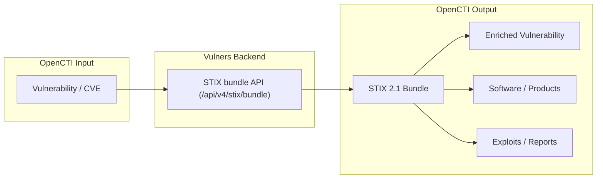

# OpenCTI Vulners Connector

| Status            | Date | Comment |
|-------------------|------|---------|
| Filigran Verified | -    | -       |

The Vulners connector enriches OpenCTI `Vulnerability` entities with intelligence from the
[Vulners](https://vulners.com) vulnerability-intelligence platform: CVSS (v2/v3/v4) scoring,
EPSS exploitation probability, CISA KEV (Known Exploited Vulnerabilities) status, links to
public exploits and proof-of-concept code, and references to affected software and products.

## Table of Contents

- [OpenCTI Vulners Connector](#opencti-vulners-connector)
  - [Table of Contents](#table-of-contents)
  - [Introduction](#introduction)
  - [Installation](#installation)
    - [Requirements](#requirements)
    - [Get a Vulners API key](#get-a-vulners-api-key)
  - [Configuration variables](#configuration-variables)
    - [OpenCTI environment variables](#opencti-environment-variables)
    - [Base connector environment variables](#base-connector-environment-variables)
    - [Connector extra parameters environment variables](#connector-extra-parameters-environment-variables)
  - [Deployment](#deployment)
    - [Docker Deployment](#docker-deployment)
    - [Manual Deployment](#manual-deployment)
  - [Usage](#usage)
  - [Behavior](#behavior)
    - [Data Flow](#data-flow)
    - [Enrichment Mapping](#enrichment-mapping)
    - [Generated STIX Objects](#generated-stix-objects)
  - [Debugging](#debugging)
  - [Additional information](#additional-information)

## Introduction

[Vulners](https://vulners.com) is a vulnerability-intelligence platform that aggregates data
from a wide range of public and proprietary sources. This connector enriches OpenCTI
`Vulnerability` entities with Vulners intelligence so security teams can prioritize
remediation based on real-world exploitation signals rather than severity alone.

The connector follows a **thin-client design**: it does **not** build STIX itself. The
complete STIX 2.1 bundle is built server-side by the Vulners backend
(`GET /api/v4/stix/bundle?id=<CVE>&opencti_id=<id>`). On an enrichment request the connector:

1. receives the `Vulnerability` entity from OpenCTI,
2. fetches the ready-made bundle through the Vulners SDK (authenticated with your API key), and
3. relays the bundle back to OpenCTI via the connector helper.

This keeps enrichment results consistent with the Vulners platform and minimizes client-side
processing.

## Installation

### Requirements

- OpenCTI Platform >= 6.8.12
- A Vulners API key (see below)

### Get a Vulners API key

The connector authenticates to Vulners with **your own API key** (sent as the `X-Api-Key`
header). Getting one takes a couple of minutes:

1. Sign in / register at Vulners.
2. Open your personal area and generate an API key.
3. Paste it into `VULNERS_API_KEY` (see the configuration tables below).

👉 **Get your key:** [vulners.com](https://vulners.com/?utm_source=opencti&utm_medium=plugin)

> Even without a paid plan the free tier returns real signals (CVSS, EPSS, CISA KEV).
> A paid key additionally returns the full set of affected software, exploits and reports.

## Configuration variables

There are a number of configuration options, which are set either in `docker-compose.yml`
(for Docker) or in `config.yml` (for manual deployment).

### OpenCTI environment variables

| Parameter     | config.yml | Docker environment variable | Mandatory | Description                                          |
|---------------|------------|-----------------------------|-----------|------------------------------------------------------|
| OpenCTI URL   | url        | `OPENCTI_URL`               | Yes       | The URL of the OpenCTI platform.                     |
| OpenCTI Token | token      | `OPENCTI_TOKEN`             | Yes       | The default admin token set in the OpenCTI platform. |

### Base connector environment variables

| Parameter       | config.yml | Docker environment variable | Default             | Mandatory | Description                                                                 |
|-----------------|------------|-----------------------------|---------------------|-----------|-----------------------------------------------------------------------------|
| Connector ID    | id         | `CONNECTOR_ID`              | /                   | Yes       | A unique `UUIDv4` identifier for this connector instance.                   |
| Connector Name  | name       | `CONNECTOR_NAME`            | Vulners             | No        | Name of the connector.                                                       |
| Connector Scope | scope      | `CONNECTOR_SCOPE`           | Vulnerability       | No        | Should be `Vulnerability` for this connector.                                |
| Connector Type  | type       | `CONNECTOR_TYPE`            | INTERNAL_ENRICHMENT | Yes       | Should always be `INTERNAL_ENRICHMENT` for this connector.                   |
| Log Level       | log_level  | `CONNECTOR_LOG_LEVEL`       | error               | No        | Determines the verbosity of the logs: `debug`, `info`, `warn`, or `error`.   |
| Auto Mode       | auto       | `CONNECTOR_AUTO`            | false               | No        | Enables or disables automatic enrichment of vulnerabilities.                 |

### Connector extra parameters environment variables

| Parameter     | config.yml            | Docker environment variable | Default             | Mandatory | Description                                                                     |
|---------------|-----------------------|-----------------------------|---------------------|-----------|---------------------------------------------------------------------------------|
| API Key       | vulners.api_key       | `VULNERS_API_KEY`           | /                   | Yes       | Your Vulners API key (see [Get a Vulners API key](#get-a-vulners-api-key)).      |
| API Base URL  | vulners.api_base_url  | `VULNERS_API_BASE_URL`      | https://vulners.com | No        | Vulners API base URL.                                                            |
| Max TLP Level | vulners.max_tlp_level | `VULNERS_MAX_TLP_LEVEL`     | TLP:AMBER           | No        | Maximum TLP level the connector is allowed to enrich (`TLP:CLEAR` … `TLP:RED`).  |

## Deployment

### Docker Deployment

Build the Docker image:

```bash
docker build -t opencti/connector-vulners:latest .
```

Configure the connector in `docker-compose.yml`:

```yaml
  connector-vulners:
    image: opencti/connector-vulners:latest
    environment:
      - OPENCTI_URL=http://localhost:8080
      - OPENCTI_TOKEN=ChangeMe
      - CONNECTOR_ID=ChangeMe            # a fresh UUIDv4
      - CONNECTOR_TYPE=INTERNAL_ENRICHMENT
      - CONNECTOR_NAME=Vulners
      - CONNECTOR_SCOPE=Vulnerability
      - CONNECTOR_AUTO=true
      - CONNECTOR_LOG_LEVEL=error
      - VULNERS_API_KEY=ChangeMe
      - VULNERS_API_BASE_URL=https://vulners.com
      - VULNERS_MAX_TLP_LEVEL=TLP:AMBER
    restart: always
```

Start the connector:

```bash
docker compose up -d
```

### Manual Deployment

1. Copy and configure `config.yml` from the provided `src/config.yml.sample`.

2. Install dependencies:

```bash
pip3 install -r src/requirements.txt
```

3. Start the connector from the `src` directory:

```bash
cd src && python3 main.py
```

## Usage

The connector enriches Vulnerability entities (CVEs) with Vulners intelligence.

**Arsenal → Vulnerabilities**

Select a Vulnerability (CVE), then click the enrichment button and choose Vulners. With
`CONNECTOR_AUTO=true`, vulnerabilities are also enriched automatically on creation or update.

## Behavior

On each enrichment request the connector checks the entity's TLP against `VULNERS_MAX_TLP_LEVEL`,
fetches the ready-made STIX 2.1 bundle for the CVE from the Vulners backend, and relays it to
OpenCTI. Because the bundle is built server-side, the exact set of generated objects always
matches the current Vulners platform output for that CVE.

### Data Flow



### Enrichment Mapping

| Vulners Data      | OpenCTI / STIX result                     | Description                                                |
|-------------------|-------------------------------------------|------------------------------------------------------------|
| CVE id            | Vulnerability `name`                      | Used as the lookup id against the Vulners STIX bundle API.  |
| CVSS (v2/v3/v4)   | Vulnerability scoring properties          | Base scores and vectors as provided by Vulners.            |
| EPSS              | Vulnerability EPSS score / percentile     | Probability of exploitation in the wild.                   |
| CISA KEV          | Known Exploited Vulnerability indication  | Whether the CVE is in CISA's KEV catalog.                  |
| Exploits / PoC    | Related objects + external references     | Links to public exploits and proof-of-concept code.        |
| Affected software | Software / product objects + relationships| Products and versions affected by the vulnerability.       |

> The connector does not construct these objects itself; they are produced server-side by the
> Vulners backend and relayed verbatim. The precise object set depends on your Vulners plan and
> on the data available for the requested CVE.

### Generated STIX Objects

The connector relays a complete, server-built STIX 2.1 **bundle**. Depending on the CVE and the
Vulners plan, the bundle may contain:

| STIX Object          | Description                                                         |
|----------------------|---------------------------------------------------------------------|
| `vulnerability`      | The enriched vulnerability (CVSS, EPSS, KEV and related metadata).  |
| `software`           | Affected software / products.                                       |
| `external-reference` | References to exploits, advisories and proof-of-concept code.       |
| `relationship`       | Links tying the above objects to the vulnerability.                 |

## Debugging

Enable verbose logging by setting:

```env
CONNECTOR_LOG_LEVEL=debug
```

Log output includes:
- The CVE being processed and the resolved `work_id`.
- TLP validation decisions (entities above `VULNERS_MAX_TLP_LEVEL` are skipped).
- Bundle retrieval and sending status.

A warning is logged (and the message skipped) when the Vulners backend returns an empty bundle
or when the entity's TLP exceeds the configured maximum.

## Additional information

- **Thin-client design**: all STIX is built server-side by Vulners; the connector only relays it.
- **Authentication**: requires a Vulners API key sent as the `X-Api-Key` header.
- **Free vs. paid**: the free tier returns CVSS, EPSS and CISA KEV; a paid key additionally
  returns the full set of affected software, exploits and reports.
- **Playbook Support**: this connector supports OpenCTI playbook automation (a STIX bundle is
  always returned).
- **Vulners platform**: https://vulners.com
