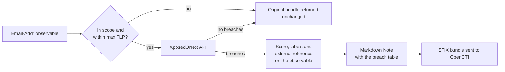

# OpenCTI XposedOrNot Connector

| Status    | Date | Comment |
|-----------|------|---------|
| Community | -    | -       |

Table of Contents

- [OpenCTI XposedOrNot Connector](#opencti-xposedornot-connector)
  - [Introduction](#introduction)
  - [Installation](#installation)
    - [Requirements](#requirements)
  - [Configuration variables](#configuration-variables)
    - [OpenCTI environment variables](#opencti-environment-variables)
    - [Base connector environment variables](#base-connector-environment-variables)
    - [Connector extra parameters environment variables](#connector-extra-parameters-environment-variables)
  - [Deployment](#deployment)
    - [Docker Deployment](#docker-deployment)
    - [Manual Deployment](#manual-deployment)
  - [Usage](#usage)
  - [Behavior](#behavior)
    - [Data Flow](#data-flow)
    - [Enrichment Mapping](#enrichment-mapping)
    - [Marking Propagation](#marking-propagation)
    - [Processing Details](#processing-details)
  - [Legal and privacy notice](#legal-and-privacy-notice)
  - [Debugging](#debugging)

## Introduction

[XposedOrNot](https://xposedornot.com) is an open, free data-breach search service tracking 760+ known breaches. Given an email address it returns the breaches the address appears in, with per-breach detail: breach date, records exposed, exposed data classes, affected domain, industry and password-storage risk, plus an overall risk score.

This internal-enrichment connector enriches `Email-Addr` observables with that exposure data. **No API key or registration is required** — the free community API is used by default. An optional commercial key ([console.xposedornot.com](https://console.xposedornot.com)) switches the connector to the Plus API with higher rate limits.

## Installation

### Requirements

- OpenCTI Platform >= 6.8.12
- No XposedOrNot account or API key needed (optional key for higher volume)

## Configuration variables

Configuration is set either in `docker-compose.yml` (for Docker), a `.env` file, or `config.yml` (for manual deployment). The exhaustive generated reference lives in [`__metadata__/CONNECTOR_CONFIG_DOC.md`](__metadata__/CONNECTOR_CONFIG_DOC.md).

### OpenCTI environment variables

| Parameter     | config.yml | Docker environment variable | Mandatory | Description                                          |
|---------------|------------|-----------------------------|-----------|------------------------------------------------------|
| OpenCTI URL   | url        | `OPENCTI_URL`               | Yes       | The URL of the OpenCTI platform.                     |
| OpenCTI Token | token      | `OPENCTI_TOKEN`             | Yes       | The default admin token set in the OpenCTI platform. |

### Base connector environment variables

| Parameter       | config.yml | Docker environment variable | Default                                | Mandatory | Description                                                                                                                                 |
|-----------------|------------|-----------------------------|----------------------------------------|-----------|---------------------------------------------------------------------------------------------------------------------------------------------|
| Connector ID    | id         | `CONNECTOR_ID`              | `c6b0f5f2-c47e-4d49-92a9-10371b40f5d8` | No        | A unique `UUIDv4` identifier for this connector instance. Set your own when running more than one.                                            |
| Connector Name  | name       | `CONNECTOR_NAME`            | `XposedOrNot`                          | No        | Name of the connector.                                                                                                                       |
| Connector Scope | scope      | `CONNECTOR_SCOPE`           | `Email-Addr`                           | No        | Observable types to enrich. Only `Email-Addr` is supported; anything else is rejected at startup.                                             |
| Connector Type  | type       | `CONNECTOR_TYPE`            | `INTERNAL_ENRICHMENT`                  | Yes       | Should always be `INTERNAL_ENRICHMENT` for this connector.                                                                                    |
| Log Level       | log_level  | `CONNECTOR_LOG_LEVEL`       | `error`                                | No        | Verbosity of the logs: `debug`, `info`, `warn` or `error`.                                                                                    |
| Auto Mode       | auto       | `CONNECTOR_AUTO`            | `false`                                | No        | Automatic enrichment of observables. The keyless API allows 2 requests/second and 25/hour per IP; keep manual, or configure an API key first. |

### Connector extra parameters environment variables

| Parameter         | config.yml                      | Docker environment variable       | Default                      | Mandatory | Description                                                                                                                                                                             |
|-------------------|---------------------------------|-----------------------------------|------------------------------|-----------|-------------------------------------------------------------------------------------------------------------------------------------------------------------------------------------|
| API key           | xposedornot.api_key             | `XPOSEDORNOT_API_KEY`             | *(empty)*                    | No        | Optional key from [console.xposedornot.com](https://console.xposedornot.com). Switches to the Plus API with higher limits. The connector is fully functional without it.                  |
| Base URL          | xposedornot.api_base_url        | `XPOSEDORNOT_API_BASE_URL`        | `https://api.xposedornot.com` | No       | Base URL of the free community API. Must be `https://`; plain `http://` is rejected at startup because the email address travels to this endpoint. No effect when an API key is set.      |
| Max TLP           | xposedornot.max_tlp             | `XPOSEDORNOT_MAX_TLP`             | `TLP:AMBER`                  | No        | Maximum TLP of an observable the connector may enrich. The email address is sent to the XposedOrNot API, so this gates what may leave the platform.                                       |
| TLP level         | xposedornot.tlp_level           | `XPOSEDORNOT_TLP_LEVEL`           | `amber`                      | No        | Minimum TLP applied to produced objects: `clear`, `white`, `green`, `amber`, `amber+strict` or `red`. `white` is the deprecated alias of `clear`.                                         |
| Max note breaches | xposedornot.max_note_breaches   | `XPOSEDORNOT_MAX_NOTE_BREACHES`   | `50`                         | No        | How many breaches the summary note tabulates, newest first; a line names how many more were found. `0` renders every breach.                                                              |

## Deployment

### Docker Deployment

Use the provided `docker-compose.yml` (or add the service to your OpenCTI stack):

```shell
docker compose up -d
```

### Manual Deployment

```shell
# From the connector root directory (internal-enrichment/xposedornot):
pip3 install -r src/requirements.txt
cp config.yml.sample config.yml   # then edit config.yml
python3 -m src
```

## Usage

On an `Email-Addr` observable, click the enrichment button and select the XposedOrNot connector (or set `CONNECTOR_AUTO=true` — mind the rate limits above). The connector is playbook-compatible: when nothing is found (or the observable is out of scope, above the maximum TLP, or the API call fails) the incoming bundle is handed back unchanged so the next playbook step still runs. One case is deliberately not handed back: if a marking on the observable cannot be resolved to a definition, nothing is published at all and the chain stops there. Forwarding would either strip that marking from the bundle or emit a reference to an object the platform cannot see, and neither is an acceptable way to pass on data whose restrictions are unknown.

## Behavior

For a breached email address, the connector enriches in place — no extra entities are created, keeping the graph clean:

- the observable's **score** is set from the XposedOrNot risk score (0–100). The community API returns this score; the Plus API does not, so with `XPOSEDORNOT_API_KEY` set the score and the risk line of the note are omitted;
- **labels** `data-breach` — and `plaintext-password-exposure` when at least one breach stored passwords in plaintext — are added to the observable;
- an **external reference** to xposedornot.com is attached;
- a markdown **Note** is attached with the breach table (the 50 most recent by default, with a footer naming how many more; see `XPOSEDORNOT_MAX_NOTE_BREACHES`): breach name, date, records exposed, affected domain, industry, exposed data classes, password-storage risk and verification status, plus first/latest exposure years and totals. Re-enriching the same observable updates that note in place instead of creating a second one.

A clean email (not found in any breach) completes with an explicit "no known breach exposure" message and modifies nothing. Rate limiting (HTTP 429) is retried with backoff honoring `Retry-After`; persistent rate limiting fails that single enrichment with a log message recommending the optional key — the connector itself keeps running.

### Data Flow



### Enrichment Mapping

| XposedOrNot field        | OpenCTI target                                        |
|--------------------------|-------------------------------------------------------|
| `risk_score`             | `x_opencti_score` on the Email-Addr (community API only) |
| any breach               | `data-breach` label on the Email-Addr                 |
| `password_risk` plaintext | `plaintext-password-exposure` label on the Email-Addr |
| per-breach detail        | rows of the markdown table in the attached Note       |
| service identity         | `XposedOrNot` external reference on the Email-Addr    |

No extra entities are created and no relationships are built; the observable is enriched in place to keep the graph clean.

### Marking Propagation

The Note carries the stricter of `XPOSEDORNOT_TLP_LEVEL` and the source observable's own TLP marking, plus every other marking the observable carries (PAP, statement, custom).

The TLP gate fails closed in both directions. A marking above `XPOSEDORNOT_MAX_TLP` skips the enrichment, and so does a TLP marking whose value the connector cannot read: treating an unreadable marking as "unmarked" would let an observable through on a field nobody could parse. A marking reference that can be resolved from neither the bundle nor the observable fails the enrichment rather than publishing derived data with a weaker restriction.

### Processing Details

- The Note's STIX id is derived from the source observable, so re-enriching updates the existing Note instead of creating a second one. Its `created` is anchored to the observable and `modified` advances on each run.
- Rate limiting (HTTP 429) is retried twice, three attempts in total, with backoff honouring `Retry-After` in both delta-seconds and HTTP-date form, with a one second floor and a sixty second cap.
- Redirects are refused: an `https` base URL cannot be downgraded to `http` mid-request.
- The email address and the API key are redacted from everything this connector emits: every log field and every status message it returns to the platform. Both are matched in raw, normalised and percent-encoded form, without regard to case, and a payload in which the value is still legible once decoded is dropped in full rather than logged. This covers error bodies, redirect `Location` headers, tracebacks, refusal reasons and the enrichment status shown against the work.

## Legal and privacy notice

The observable's email address is the only platform data that leaves OpenCTI, sent over TLS. It goes to the endpoint the deployment is configured for: `XPOSEDORNOT_API_BASE_URL` (default `https://api.xposedornot.com`) as a query parameter, or the fixed Plus endpoint `https://plus-api.xposedornot.com` as part of the request path when `XPOSEDORNOT_API_KEY` is set. That key is sent with the request as an `x-api-key` header. Nothing else about the observable, and no other entity in the bundle, is transmitted. Breach exposure tied to an email address is **personal information**: gate what may be enriched with `XPOSEDORNOT_MAX_TLP`, apply a restrictive `XPOSEDORNOT_TLP_LEVEL` to results, and use them only within lawful, authorised investigations (GDPR / legal basis / proper investigative framework). See the [XposedOrNot privacy policy](https://xposedornot.com/privacy).

## Debugging

Set `CONNECTOR_LOG_LEVEL=debug`. All API errors are logged through the connector logger with masked context; the API key never appears in logs. Typical messages:

- `XposedOrNot rate limited (keyless: 2/s, 25/hour); backing off.` — expected under keyless bursts; configure a key for volume.
- `XposedOrNot: still rate limited after retries.` — the three backoff attempts were exhausted; that single enrichment fails and the connector keeps running.
- `XposedOrNot: API key rejected by the Plus API` — check `XPOSEDORNOT_API_KEY`.
- `XposedOrNot: request rejected by the community API` — the keyless endpoint refused the request; retry later or configure a key.
- `XposedOrNot: redirect refused; the API must answer directly over https` — the base URL redirected; point `XPOSEDORNOT_API_BASE_URL` at the endpoint that answers directly.
- `XposedOrNot request failed` — network or TLS failure; the logged detail carries the exception class with the address redacted.
- `XposedOrNot: error response` / `XposedOrNot: invalid JSON in response.` / `XposedOrNot: unexpected JSON payload type` — the API answered with an error or a body this connector cannot read.
