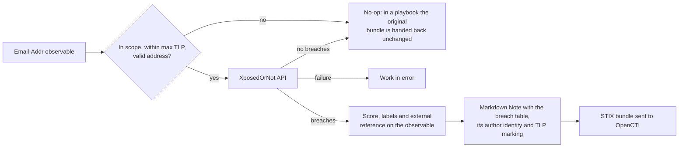

# OpenCTI XposedOrNot Connector

| Status    | Date | Comment |
|-----------|------|---------|
| Community | -    | -       |

Table of Contents

- [OpenCTI XposedOrNot Connector](#opencti-xposedornot-connector)
  - [Introduction](#introduction)
  - [Installation](#installation)
    - [Requirements](#requirements)
  - [Configuration variables](#configuration-variables)
    - [OpenCTI environment variables](#opencti-environment-variables)
    - [Base connector environment variables](#base-connector-environment-variables)
    - [Connector extra parameters environment variables](#connector-extra-parameters-environment-variables)
  - [Deployment](#deployment)
    - [Docker Deployment](#docker-deployment)
    - [Manual Deployment](#manual-deployment)
  - [Usage](#usage)
  - [Behavior](#behavior)
    - [Data Flow](#data-flow)
    - [Enrichment Mapping](#enrichment-mapping)
    - [Score semantics](#score-semantics)
    - [Markings](#markings)
    - [Processing Details](#processing-details)
  - [Legal and privacy notice](#legal-and-privacy-notice)
  - [Debugging](#debugging)

## Introduction

[XposedOrNot](https://xposedornot.com) is an open, free data-breach search service tracking 760+ known breaches. Given an email address it returns the breaches the address appears in, with per-breach detail: breach date, records exposed, exposed data classes, affected domain, industry, password-storage risk and a short description, plus an overall risk score.

This internal-enrichment connector enriches `Email-Addr` observables with that exposure data. **No API key or registration is required**: the free community API is used by default. An optional commercial key ([console.xposedornot.com](https://console.xposedornot.com)) switches the connector to the Plus API with higher rate limits.

## Installation

### Requirements

- OpenCTI Platform >= 7.261008.0
- No XposedOrNot account or API key needed (optional key for higher volume)

## Configuration variables

Configuration is set either in `docker-compose.yml` (for Docker), a `.env` file, or `config.yml` (for manual deployment). The generated reference lives in [`__metadata__/CONNECTOR_CONFIG_DOC.md`](__metadata__/CONNECTOR_CONFIG_DOC.md).

### OpenCTI environment variables

| Parameter     | config.yml | Docker environment variable | Mandatory | Description                                          |
|---------------|------------|-----------------------------|-----------|------------------------------------------------------|
| OpenCTI URL   | url        | `OPENCTI_URL`               | Yes       | The URL of the OpenCTI platform.                     |
| OpenCTI Token | token      | `OPENCTI_TOKEN`             | Yes       | The default admin token set in the OpenCTI platform. |

### Base connector environment variables

| Parameter       | config.yml | Docker environment variable | Default                                | Mandatory | Description                                                                                                                      |
|-----------------|------------|-----------------------------|----------------------------------------|-----------|----------------------------------------------------------------------------------------------------------------------------------|
| Connector ID    | id         | `CONNECTOR_ID`              | `c6b0f5f2-c47e-4d49-92a9-10371b40f5d8` | No        | A unique `UUIDv4` identifier for this connector instance. Set your own when running more than one.                               |
| Connector Name  | name       | `CONNECTOR_NAME`            | `XposedOrNot`                          | No        | Name of the connector.                                                                                                           |
| Connector Scope | scope      | `CONNECTOR_SCOPE`           | `Email-Addr`                           | No        | Observable types to enrich. Only `Email-Addr` is supported; anything else is rejected at startup.                                |
| Connector Type  | type       | `CONNECTOR_TYPE`            | `INTERNAL_ENRICHMENT`                  | Yes       | Should always be `INTERNAL_ENRICHMENT` for this connector.                                                                       |
| Log Level       | log_level  | `CONNECTOR_LOG_LEVEL`       | `error`                                | No        | Verbosity of the logs: `debug`, `info`, `warn` or `error`.                                                                       |
| Auto Mode       | auto       | `CONNECTOR_AUTO`            | `false`                                | No        | Automatic enrichment of observables. The keyless API allows 2 requests/second and 25/hour per IP; keep manual, or configure an API key first. |

### Connector extra parameters environment variables

| Parameter         | config.yml                    | Docker environment variable     | Default                       | Mandatory | Description                                                                                                                                                      |
|-------------------|-------------------------------|---------------------------------|-------------------------------|-----------|------------------------------------------------------------------------------------------------------------------------------------------------------------------|
| API key           | xposedornot.api_key           | `XPOSEDORNOT_API_KEY`           | *(empty)*                     | No        | Optional key from [console.xposedornot.com](https://console.xposedornot.com). Switches to the Plus API with higher limits. The connector is fully functional without it. |
| Base URL          | xposedornot.api_base_url      | `XPOSEDORNOT_API_BASE_URL`      | `https://api.xposedornot.com` | No        | Base URL of the free community API. Must be `https://`; plain `http://` is rejected at startup because the email address travels to this endpoint. No effect when an API key is set. |
| Max TLP           | xposedornot.max_tlp           | `XPOSEDORNOT_MAX_TLP`           | `TLP:AMBER`                   | No        | Maximum TLP of an observable the connector may enrich. The email address is sent to the XposedOrNot API, so this gates what may leave the platform.               |
| TLP level         | xposedornot.tlp_level         | `XPOSEDORNOT_TLP_LEVEL`         | `amber`                       | No        | TLP marking applied to the summary note: `clear`, `white`, `green`, `amber`, `amber+strict` or `red`. `white` is the deprecated alias of `clear`.               |
| Update score      | xposedornot.update_score      | `XPOSEDORNOT_UPDATE_SCORE`      | `true`                        | No        | Write the XposedOrNot risk score to the observable's score. See [Score semantics](#score-semantics). Set to `false` to keep only the note and the labels.         |
| Max note breaches | xposedornot.max_note_breaches | `XPOSEDORNOT_MAX_NOTE_BREACHES` | `50`                          | No        | How many breaches the summary note tabulates, newest first; a line names how many more were found. `0` renders every breach.                                     |

## Deployment

### Docker Deployment

Use the provided `docker-compose.yml` (or add the service to your OpenCTI stack):

```shell
docker compose up -d
```

### Manual Deployment

```shell
# From the connector root directory (internal-enrichment/xposedornot):
pip3 install -r src/requirements.txt
cp config.yml.sample config.yml   # then edit config.yml
python3 -m src
```

## Usage

On an `Email-Addr` observable, click the enrichment button and select the XposedOrNot connector (or set `CONNECTOR_AUTO=true`, minding the rate limits above). The connector is playbook-compatible: when there is nothing to add (no breach, observable out of scope, above the maximum TLP, or not an email address) the incoming bundle is handed back unchanged so the next playbook step still runs.

The keyless community API is meant for evaluation and low-volume manual use: 2 requests per second and 25 per hour per IP. For automatic enrichment or sustained volume, configure an API key.

## Behavior

For a breached email address, the connector enriches the observable in place and attaches one Note. Besides the Note, the only objects it publishes are the Note's author (an `XposedOrNot` Organization identity) and the Note's TLP marking definition; no relationships are built:

- the observable's **score** is set from the XposedOrNot risk score (0 to 100) when `XPOSEDORNOT_UPDATE_SCORE` is `true` and the API returned one. The community API returns it; the Plus API does not, so with `XPOSEDORNOT_API_KEY` set the observable's existing score is left untouched and the note carries no risk line;
- **labels** `data-breach`, and `plaintext-password-exposure` when at least one breach stored passwords in plaintext, are added to the observable. Both labels belong to the connector and are refreshed on every run; every other label is preserved;
- an **external reference** to xposedornot.com is attached. The connector's own earlier reference is replaced rather than duplicated; the observable's other references are kept;
- a markdown **Note** is attached with the breach table (the 50 most recent by default, with a footer naming how many more; see `XPOSEDORNOT_MAX_NOTE_BREACHES`): breach name, date, records exposed, affected domain, industry, exposed data classes, password-storage risk, verification status and a short description (truncated to 160 characters), plus first/latest exposure years and totals. Re-enriching the same observable updates that note in place instead of creating a second one.

A clean email (not found in any breach) completes with the status `No known breach exposure for this email address (XposedOrNot)` and modifies nothing. An API failure (network error, HTTP error, rate limit still hit after three attempts) raises, so the work is reported in error; inside a playbook the original bundle is still handed back.

### Data Flow


```mermaid
graph LR
    A[Email-Addr observable] --> B{In scope, within max TLP,<br/>valid address?}
    B -- no --> C[No-op: in a playbook the original<br/>bundle is handed back unchanged]
    B -- yes --> D[XposedOrNot API]
    D -- no breaches --> C
    D -- failure --> X[Work in error]
    D -- breaches --> E[Score, labels and external<br/>reference on the observable]
    E --> F[Markdown Note with the breach table,<br/>its author identity and TLP marking]
    F --> G[STIX bundle sent to OpenCTI]
```

### Enrichment Mapping

| XposedOrNot field         | OpenCTI target                                                             |
|---------------------------|----------------------------------------------------------------------------|
| `risk_score`              | `x_opencti_score` on the Email-Addr (community API only, optional)         |
| any breach                | `data-breach` label on the Email-Addr                                      |
| `password_risk` plaintext | `plaintext-password-exposure` label on the Email-Addr                      |
| per-breach detail         | rows of the markdown table in the attached Note, `details` as Description  |
| service identity          | `XposedOrNot` external reference on the Email-Addr                         |

### Score semantics

OpenCTI usually reads an observable's score as a level of threat. The XposedOrNot risk score measures something else: how exposed a **victim** address is across known breaches. A heavily breached address such as `test@example.com` scores 100 without being malicious in any way. Keep this in mind before routing scored Email-Addr observables into detection-oriented workflows or feeds. The score overwrites the observable's existing score. Teams that use the score for detection should set `XPOSEDORNOT_UPDATE_SCORE=false` and rely on the labels and the Note instead.

### Markings

The Note carries the TLP marking configured by `XPOSEDORNOT_TLP_LEVEL` and, in addition, every marking the source observable carries (TLP, PAP, statement or custom), so it is never readable by anyone who cannot read the source. The enriched observable keeps its own markings untouched.

The TLP gate evaluates every TLP marking of the observable, whether it arrives resolved, as a well-known TLP reference or as a TLP definition bundled with the entity: any marking above `XPOSEDORNOT_MAX_TLP`, or a TLP marking whose value cannot be read, skips the enrichment. A marking reference that resolves to nothing known also skips the enrichment. Outside a playbook, an unexpected failure is reported to the platform with the email address and the API key redacted, and errors are logged without the active traceback.

### Processing Details

- The Note's STIX id and `created` derive from the source observable, so re-enriching updates the existing Note instead of creating a second one; `modified` advances on each run.
- Rate limiting (HTTP 429) is retried twice, three attempts in total, with backoff honouring `Retry-After` in delta-seconds or HTTP-date form, floored at one second and capped at sixty.
- Redirects are refused: an `https` base URL cannot be downgraded to `http` mid-request.
- The email address and the API key are redacted from every log field and every status message the connector emits, in raw and percent-encoded form; a payload in which the value is still legible once decoded is dropped in full rather than logged.

## Legal and privacy notice

The observable's email address is the only platform data that leaves OpenCTI, sent over TLS. It goes to the endpoint the deployment is configured for: `XPOSEDORNOT_API_BASE_URL` (default `https://api.xposedornot.com`) as a query parameter, or the fixed Plus endpoint `https://plus-api.xposedornot.com` as part of the request path when `XPOSEDORNOT_API_KEY` is set. That key is sent with the request as an `x-api-key` header. Nothing else about the observable, and no other entity in the bundle, is transmitted. Breach exposure tied to an email address is **personal information**: gate what may be enriched with `XPOSEDORNOT_MAX_TLP`, apply a restrictive `XPOSEDORNOT_TLP_LEVEL` to results, and use them only within lawful, authorised investigations (GDPR / legal basis / proper investigative framework). See the [XposedOrNot privacy policy](https://xposedornot.com/privacy).

## Debugging

Set `CONNECTOR_LOG_LEVEL=debug`. All API errors are logged through the connector logger with redacted context; the API key never appears in logs. Typical messages:

- `XposedOrNot rate limited; backing off` with `keyless: true`: expected under keyless bursts; configure a key for volume.
- `XposedOrNot: still rate limited after retries`: the three attempts were exhausted; that single enrichment is in error and the connector keeps running.
- `XposedOrNot: request rejected (check the API key)`: the Plus API refused the key in `XPOSEDORNOT_API_KEY`.
- `XposedOrNot: request rejected`: the keyless endpoint refused the request; retry later or configure a key.
- `XposedOrNot: redirect refused`: the base URL redirected; point `XPOSEDORNOT_API_BASE_URL` at the endpoint that answers directly.
- `XposedOrNot request failed`: network or TLS failure; the logged detail carries the exception class with the address redacted.
- `XposedOrNot: error response` / `XposedOrNot: invalid or unexpected JSON payload`: the API answered with an error or a body this connector cannot read.
- `Error processing message`: any other failure; the redacted reason is in the log and the work is in error.
