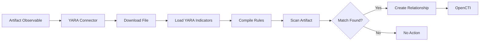

# OpenCTI YARA Connector

| Status | Date | Comment |
|--------|------|---------|
| Community | -    | -       |

## Table of Contents

- [Introduction](#introduction)
- [Installation](#installation)
  - [Requirements](#requirements)
- [Configuration](#configuration)
  - [OpenCTI Configuration](#opencti-configuration)
  - [Base Connector Configuration](#base-connector-configuration)
- [Deployment](#deployment)
  - [Docker Deployment](#docker-deployment)
  - [Manual Deployment](#manual-deployment)
- [Usage](#usage)
- [Behavior](#behavior)
  - [Data Flow](#data-flow)
  - [Processing Details](#processing-details)
  - [Generated STIX Objects](#generated-stix-objects)
- [Debugging](#debugging)
- [Additional Information](#additional-information)

---

## Introduction

[YARA](https://virustotal.github.io/yara/) is a tool for identifying and classifying malware samples. This connector enriches Artifact observables by scanning their contents against all YARA Indicators in OpenCTI.

When a YARA rule matches an artifact, the connector creates a relationship between the Artifact and the matching YARA Indicator.

---

## Installation

### Requirements

- OpenCTI Platform >= 7.260224.0
- YARA rules imported as Indicators in OpenCTI

---

## Configuration

### OpenCTI Configuration

| Parameter | Docker envvar | Mandatory | Description |
|-----------|---------------|-----------|-------------|
| `opencti_url` | `OPENCTI_URL` | Yes | The URL of the OpenCTI platform |
| `opencti_token` | `OPENCTI_TOKEN` | Yes | The default admin token configured in the OpenCTI platform |

### Base Connector Configuration

| Parameter | Docker envvar | Mandatory | Description |
|-----------|---------------|-----------|-------------|
| `connector_id` | `CONNECTOR_ID` | Yes | A valid arbitrary `UUIDv4` unique for this connector |
| `connector_name` | `CONNECTOR_NAME` | Yes | Set to "YARA" |
| `connector_scope` | `CONNECTOR_SCOPE` | Yes | Must be `Artifact` |
| `connector_auto` | `CONNECTOR_AUTO` | Yes | Enable/disable auto-enrichment |
| `connector_confidence_level` | `CONNECTOR_CONFIDENCE_LEVEL` | Yes | Default confidence level (0-100) |
| `connector_log_level` | `CONNECTOR_LOG_LEVEL` | Yes | Log level (`debug`, `info`, `warn`, `error`) |

---

## Deployment

### Docker Deployment

Build a Docker Image using the provided `Dockerfile`.

Example `docker-compose.yml`:

```yaml
version: '3'
services:
  connector-yara:
    image: opencti/connector-yara:latest
    environment:
      - OPENCTI_URL=http://localhost
      - OPENCTI_TOKEN=ChangeMe
      - CONNECTOR_ID=ChangeMe
      - CONNECTOR_NAME=YARA
      - CONNECTOR_SCOPE=Artifact
      - CONNECTOR_AUTO=true
      - CONNECTOR_CONFIDENCE_LEVEL=100
      - CONNECTOR_LOG_LEVEL=error
    restart: always
```

### Manual Deployment

1. Clone the repository
2. Copy `config.yml.sample` to `config.yml` and configure
3. Install dependencies: `pip install -r requirements.txt`
4. Run the connector

---

## Usage

The connector enriches Artifact observables by:
1. Downloading the artifact file from OpenCTI
2. Compiling all YARA Indicators in the platform
3. Scanning the artifact against all rules
4. Creating relationships for matching rules

Trigger enrichment:
- Manually via the OpenCTI UI on Artifact entities
- Automatically if `CONNECTOR_AUTO=true`
- Via playbooks

---

## Behavior

### Data Flow



### Processing Details

1. **Artifact Download**: The connector downloads the file content from OpenCTI
2. **YARA Loading**: All YARA Indicators in the platform are retrieved
3. **Rule Compilation**: YARA rules are compiled for scanning
4. **Scanning**: The artifact is scanned against all compiled rules
5. **Relationship Creation**: For each match, a relationship is created between the Artifact and the YARA Indicator

### Generated STIX Objects

| Object Type | Description |
|-------------|-------------|
| Relationship | Links Artifact to matching YARA Indicators |

The relationship type used is typically `indicates` or `based-on`, connecting:
- **Source**: Artifact Observable
- **Target**: YARA Indicator

---

## Debugging

Enable debug logging by setting `CONNECTOR_LOG_LEVEL=debug` to see:
- File download progress
- YARA rule compilation
- Scan results and matches

Common issues:
- **No YARA rules**: Ensure YARA Indicators exist in OpenCTI
- **File access errors**: Verify artifact has attached file
- **Rule compilation errors**: Check YARA rule syntax

---

## Additional Information

- [YARA Documentation](https://yara.readthedocs.io/)
- [YARA GitHub Repository](https://github.com/virustotal/yara)
- [Writing YARA Rules](https://yara.readthedocs.io/en/stable/writingrules.html)

### Prerequisites

For this connector to be useful, you need YARA rules imported as Indicators in OpenCTI. YARA rules can be imported from:
- VirusTotal connector (crowdsourced YARA)
- Manual import
- Other threat intelligence feeds
