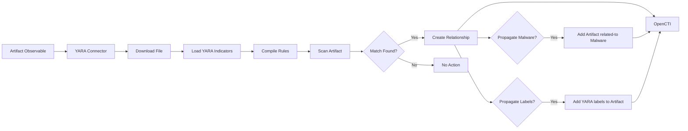

# OpenCTI YARA Connector

| Status   | Date       | Comment |
|----------|------------|---------|
| Verified | 2026-04-09 | -       |

## Table of Contents

- [Introduction](#introduction)
- [Installation](#installation)
  - [Requirements](#requirements)
- [Configuration](#configuration)
  - [OpenCTI Configuration](#opencti-configuration)
  - [Base Connector Configuration](#base-connector-configuration)
  - [YARA-specific Configuration](#yara-specific-configuration)
- [Deployment](#deployment)
  - [Docker Deployment](#docker-deployment)
  - [Manual Deployment](#manual-deployment)
- [Usage](#usage)
- [Behavior](#behavior)
  - [Data Flow](#data-flow)
  - [Processing Details](#processing-details)
  - [Generated STIX Objects](#generated-stix-objects)
- [Debugging](#debugging)
- [Additional Information](#additional-information)

---

## Introduction

[YARA](https://virustotal.github.io/yara/) is a tool for identifying and classifying malware samples. This connector enriches Artifact observables by scanning their contents against all YARA Indicators in OpenCTI.

When a YARA rule matches an artifact, the connector creates a relationship between the Artifact and the matching YARA Indicator. Optionally, it can also propagate the indicator's `indicates` Malware relationships and OpenCTI labels onto the enriched Artifact, so the artifact's knowledge graph directly shows the malware family the YARA rule was authored against.

---

## Installation

### Requirements

- OpenCTI Platform >= 7.260513.0
- YARA rules imported as Indicators in OpenCTI

---

## Configuration

### OpenCTI Configuration

| Parameter | Docker envvar | Mandatory | Description |
|-----------|---------------|-----------|-------------|
| `opencti_url` | `OPENCTI_URL` | Yes | The URL of the OpenCTI platform |
| `opencti_token` | `OPENCTI_TOKEN` | Yes | The default admin token configured in the OpenCTI platform |

### Base Connector Configuration

| Parameter | Docker envvar | Mandatory | Description |
|-----------|---------------|-----------|-------------|
| `connector_id` | `CONNECTOR_ID` | Yes | A valid arbitrary `UUIDv4` unique for this connector |
| `connector_name` | `CONNECTOR_NAME` | Yes | Set to "YARA" |
| `connector_scope` | `CONNECTOR_SCOPE` | Yes | Must be `Artifact` |
| `connector_auto` | `CONNECTOR_AUTO` | Yes | Enable/disable auto-enrichment |
| `connector_log_level` | `CONNECTOR_LOG_LEVEL` | Yes | Log level (`debug`, `info`, `warn`, `error`) |

### YARA-specific Configuration

| Parameter | Docker envvar | Mandatory | Default | Description |
|-----------|---------------|-----------|---------|-------------|
| `yara_tlp_level` | `YARA_TLP_LEVEL` | No | `clear` | Default TLP marking applied to created relationships when neither the artifact nor the indicator carry markings. One of `clear`, `white`, `green`, `amber`, `amber+strict`, `red`. |
| `yara_propagate_malware_relationship` | `YARA_PROPAGATE_MALWARE_RELATIONSHIP` | No | `false` | When `true`, for every YARA Indicator that matches the enriched Artifact, the connector follows the indicator's `indicates` STIX relationships to Malware entities and emits an additional `related-to` STIX relationship from the Artifact to each of those Malware entities. The same TLP markings as the Artifact -> Indicator relationship are reused. |
| `yara_propagate_labels` | `YARA_PROPAGATE_LABELS` | No | `false` | When `true`, every OpenCTI label carried by a YARA Indicator that matches the enriched Artifact is added to the Artifact (via the `stix_cyber_observable.add_label` mutation). |

---

## Deployment

### Docker Deployment

Build a Docker Image using the provided `Dockerfile`.

Example `docker-compose.yml`:

```yaml
version: '3'
services:
  connector-yara:
    image: opencti/connector-yara:latest
    environment:
      - OPENCTI_URL=http://localhost
      - OPENCTI_TOKEN=ChangeMe
      - CONNECTOR_ID=ChangeMe
      - CONNECTOR_NAME=YARA
      - CONNECTOR_SCOPE=Artifact
      - CONNECTOR_AUTO=true
      - CONNECTOR_LOG_LEVEL=error
      #- YARA_TLP_LEVEL=clear
      #- YARA_PROPAGATE_MALWARE_RELATIONSHIP=false
      #- YARA_PROPAGATE_LABELS=false
    restart: always
```

### Manual Deployment

1. Clone the repository
2. Copy `config.yml.sample` to `config.yml` and configure
3. Install dependencies: `pip install -r requirements.txt`
4. Run the connector

---

## Usage

The connector enriches Artifact observables by:
1. Downloading the artifact file from OpenCTI
2. Compiling all YARA Indicators in the platform
3. Scanning the artifact against all rules
4. Creating relationships for matching rules
5. Optionally propagating malware relationships and labels from the matching YARA Indicators (see [YARA-specific Configuration](#yara-specific-configuration))

Trigger enrichment:
- Manually via the OpenCTI UI on Artifact entities
- Automatically if `CONNECTOR_AUTO=true`
- Via playbooks

---

## Behavior

### Data Flow


```mermaid
flowchart LR
    A[Artifact Observable] --> B[YARA Connector]
    B --> C[Download File]
    C --> D[Load YARA Indicators]
    D --> E[Compile Rules]
    E --> F[Scan Artifact]
    F --> G{Match Found?}
    G -->|Yes| H[Create Relationship]
    G -->|No| I[No Action]
    H --> J{Propagate Malware?}
    H --> K{Propagate Labels?}
    J -->|Yes| L[Add Artifact related-to Malware]
    K -->|Yes| M[Add YARA labels to Artifact]
    H --> N[OpenCTI]
    L --> N
    M --> N
```

### Processing Details

1. **Artifact Download**: The connector downloads the file content from OpenCTI
2. **YARA Loading**: All YARA Indicators in the platform are retrieved (including their labels via `objectLabel`)
3. **Rule Compilation**: YARA rules are compiled for scanning
4. **Scanning**: The artifact is scanned against all compiled rules
5. **Relationship Creation**: For each match, a `related-to` STIX relationship is created from the Artifact to the matching YARA Indicator
6. **Optional Malware Propagation** (`YARA_PROPAGATE_MALWARE_RELATIONSHIP=true`): for each match, the connector follows the YARA Indicator's `indicates` relationships to Malware entities and emits a `related-to` relationship from the Artifact to each of those Malware entities
7. **Optional Label Propagation** (`YARA_PROPAGATE_LABELS=true`): for each match, the connector copies every label carried by the YARA Indicator onto the Artifact

### Generated STIX Objects

| Object Type | Description |
|-------------|-------------|
| Relationship | `related-to` from Artifact to matching YARA Indicator |
| Relationship | `related-to` from Artifact to each Malware the matched YARA Indicator `indicates` (only when `YARA_PROPAGATE_MALWARE_RELATIONSHIP=true`) |

---

## Debugging

Enable debug logging by setting `CONNECTOR_LOG_LEVEL=debug` to see:
- File download progress
- YARA rule compilation
- Scan results and matches
- Propagated Artifact -> Malware relationships (when enabled)

Common issues:
- **No YARA rules**: Ensure YARA Indicators exist in OpenCTI
- **File access errors**: Verify artifact has attached file
- **Rule compilation errors**: Check YARA rule syntax
- **Labels do not appear on the Artifact**: Make sure `YARA_PROPAGATE_LABELS=true` is set and that the matching YARA Indicator actually carries labels
- **Malware not linked**: The propagation only follows `indicates` relationships; check that the YARA Indicator has an `indicates` relationship to the Malware entity in OpenCTI

---

## Additional Information

- [YARA Documentation](https://yara.readthedocs.io/)
- [YARA GitHub Repository](https://github.com/virustotal/yara)
- [Writing YARA Rules](https://yara.readthedocs.io/en/stable/writingrules.html)

### Prerequisites

For this connector to be useful, you need YARA rules imported as Indicators in OpenCTI. YARA rules can be imported from:
- VirusTotal connector (crowdsourced YARA)
- Manual import
- Other threat intelligence feeds
