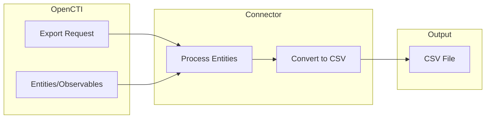

# OpenCTI Export File CSV Connector

| Status | Date | Comment |
|--------|------|---------|
| Filigran Verified | -    | -       |

The Export File CSV connector enables exporting OpenCTI entities and observables to CSV format files for integration with external tools and reporting.

## Table of Contents

- [OpenCTI Export File CSV Connector](#opencti-export-file-csv-connector)
  - [Table of Contents](#table-of-contents)
  - [Introduction](#introduction)
  - [Installation](#installation)
    - [Requirements](#requirements)
  - [Configuration variables](#configuration-variables)
    - [OpenCTI environment variables](#opencti-environment-variables)
    - [Base connector environment variables](#base-connector-environment-variables)
    - [Connector extra parameters environment variables](#connector-extra-parameters-environment-variables)
  - [Deployment](#deployment)
    - [Docker Deployment](#docker-deployment)
    - [Manual Deployment](#manual-deployment)
  - [Usage](#usage)
  - [Behavior](#behavior)
  - [Debugging](#debugging)
  - [Additional information](#additional-information)

## Introduction

The Export File CSV connector is an internal export connector that generates CSV (Comma-Separated Values) files from OpenCTI data. It supports exporting:

- Single entities with their contained objects (for containers like Reports, Cases)
- Selected entities from a list view
- Query-based exports with filters

The exported CSV files can be used for reporting, data analysis in spreadsheet applications, or integration with other security tools that accept CSV input.

## Installation

### Requirements

- OpenCTI Platform >= 5.6.1

## Configuration variables

There are a number of configuration options, which are set either in `docker-compose.yml` (for Docker) or in `config.yml` (for manual deployment).

### OpenCTI environment variables

| Parameter     | config.yml | Docker environment variable | Mandatory | Description                                          |
|---------------|------------|-----------------------------|-----------|------------------------------------------------------|
| OpenCTI URL   | url        | `OPENCTI_URL`               | Yes       | The URL of the OpenCTI platform.                     |
| OpenCTI Token | token      | `OPENCTI_TOKEN`             | Yes       | The default admin token set in the OpenCTI platform. |

### Base connector environment variables

| Parameter          | config.yml       | Docker environment variable   | Default          | Mandatory | Description                                                                 |
|--------------------|------------------|-------------------------------|------------------|-----------|-----------------------------------------------------------------------------|
| Connector ID       | id               | `CONNECTOR_ID`                |                  | Yes       | A unique `UUIDv4` identifier for this connector instance.                   |
| Connector Name     | name             | `CONNECTOR_NAME`              | ExportFileCsv    | No        | Name of the connector.                                                      |
| Connector Scope    | scope            | `CONNECTOR_SCOPE`             | text/csv         | Yes       | The MIME type for CSV export.                                               |
| Confidence Level   | confidence_level | `CONNECTOR_CONFIDENCE_LEVEL`  | 100              | No        | The confidence level for this connector.                                    |
| Log Level          | log_level        | `CONNECTOR_LOG_LEVEL`         | info             | No        | Determines the verbosity of the logs: `debug`, `info`, `warn`, or `error`.  |

### Connector extra parameters environment variables

| Parameter | config.yml             | Docker environment variable | Default | Mandatory | Description                                                    |
|-----------|------------------------|------------------------------|---------|-----------|----------------------------------------------------------------|
| Delimiter | export-file-csv.delimiter | `EXPORT_FILE_CSV_DELIMITER` | ;       | No        | CSV field delimiter character (`;`, `,`, `\t`, etc.).          |

## Deployment

### Docker Deployment

Build the Docker image:

```bash
docker build -t opencti/connector-export-file-csv:latest .
```

Configure the connector in `docker-compose.yml`:

```yaml
  connector-export-file-csv:
    image: opencti/connector-export-file-csv:latest
    environment:
      - OPENCTI_URL=http://localhost
      - OPENCTI_TOKEN=ChangeMe
      - CONNECTOR_ID=ChangeMe
      - CONNECTOR_NAME=ExportFileCsv
      - CONNECTOR_SCOPE=text/csv
      - CONNECTOR_CONFIDENCE_LEVEL=100
      - CONNECTOR_LOG_LEVEL=info
      - EXPORT_FILE_CSV_DELIMITER=;
    restart: always
```

Start the connector:

```bash
docker compose up -d
```

### Manual Deployment

1. Create `config.yml` based on `config.yml.sample`.

2. Install dependencies:

```bash
pip3 install -r requirements.txt
```

3. Start the connector from the `src` directory:

```bash
python3 export-file-csv.py
```

## Usage

The connector is triggered through the OpenCTI export functionality:

1. Navigate to any entity list or single entity view
2. Click the export button
3. Select "CSV" as the export format
4. The connector will generate a CSV file available for download

### Export Scopes

| Scope     | Description                                                    |
|-----------|----------------------------------------------------------------|
| single    | Export a single entity with its contained objects (containers) |
| selection | Export selected entities from a list view                      |
| query     | Export entities matching current filters/search                |

## Behavior

The connector converts OpenCTI entities to CSV format with dynamic column generation based on entity attributes.

### Data Flow



### CSV Format Details

| Feature              | Description                                                       |
|----------------------|-------------------------------------------------------------------|
| Headers              | Dynamically generated from entity attributes                      |
| Quoting              | All fields quoted with double quotes                              |
| Delimiter            | Configurable (default: semicolon `;`)                             |
| Hash Expansion       | File hashes expanded to separate columns (MD5, SHA-1, SHA-256, SHA-512, SSDEEP) |
| List Values          | Comma-separated within the field                                  |
| Nested Objects       | Name/value/definition extracted from nested structures            |

### Processing Details

1. **Single Export**: 
   - Reads the entity and all objects referenced via `objectsIds`
   - Combines entity with contained objects
   - Converts to CSV

2. **Selection Export**:
   - Retrieves all selected entities
   - Converts to CSV

3. **Query Export**:
   - Executes query with filters
   - Retrieves all matching entities
   - Converts to CSV

### Column Handling

| Data Type      | CSV Representation                          |
|----------------|---------------------------------------------|
| String         | Direct value                                |
| Integer/Float  | String representation                       |
| List (strings) | Comma-separated values                      |
| List (objects) | Comma-separated names/values/definitions    |
| Dict           | Name, value, or observable_value extracted  |
| Hashes         | Expanded to individual hash columns         |

## Debugging

Enable verbose logging by setting:

```env
CONNECTOR_LOG_LEVEL=debug
```

Log output includes:
- Export request details
- Entity processing progress
- Upload status
- Error details for problematic rows

### Common Issues

| Issue                | Solution                                        |
|----------------------|-------------------------------------------------|
| Missing columns      | Ensure entity has the expected attribute        |
| Encoding issues      | Check for special characters in entity values   |
| Large exports fail   | Increase memory/timeout settings                |

## Additional information

- **Permissions**: The connector requires admin permissions as it impersonates the user requesting the export
- **File Size**: Large exports may take time; consider using query filters to limit data
- **Delimiter Selection**: Use semicolon (`;`) for Excel compatibility in European locales, comma (`,`) for US locales
- **Hash Columns**: File observables automatically get expanded hash columns for MD5, SHA-1, SHA-256, SHA-512, and SSDEEP
- **Error Handling**: Rows that cannot be converted are skipped with warnings logged
