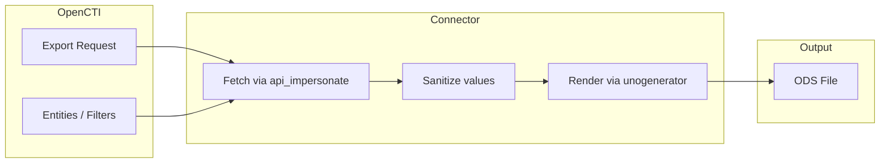

# OpenCTI Export File ODS Connector

| Status | Date | Comment |
|--------|------|---------|
| Community | -    | -       |

The Export File ODS connector renders OpenCTI search results to an OpenDocument
Spreadsheet (`.ods`) file by driving a headless LibreOffice instance through
the [`unogenerator`](https://pypi.org/project/unogenerator/) Python bridge.

## Table of Contents

- [OpenCTI Export File ODS Connector](#opencti-export-file-ods-connector)
  - [Table of Contents](#table-of-contents)
  - [Introduction](#introduction)
  - [Installation](#installation)
    - [Requirements](#requirements)
  - [Configuration variables](#configuration-variables)
    - [OpenCTI environment variables](#opencti-environment-variables)
    - [Base connector environment variables](#base-connector-environment-variables)
  - [Deployment](#deployment)
    - [Docker Deployment](#docker-deployment)
    - [Manual Deployment](#manual-deployment)
  - [Usage](#usage)
  - [Behavior](#behavior)
  - [Debugging](#debugging)
  - [Additional information](#additional-information)

## Introduction

The Export File ODS connector is an internal-export connector that produces a
spreadsheet (`.ods`) populated with every attribute of the selected
entities. It is meant for analysts who want a quick, tabular view of an
OpenCTI selection or query that can be opened in LibreOffice Calc, Microsoft
Excel, Google Sheets, etc.

The connector supports list exports (selection or query-based) and the two
levels of detail offered by OpenCTI:

- `simple`: only the selected entities are rendered.
- `full`: the selected entities plus their first-degree neighbours reached
  through STIX core relationships are rendered.

Single-entity exports and the `stix-sighting-relationship`,
`stix-core-relationship` and `Opinion` entity types are intentionally not
supported.

## Installation

### Requirements

- OpenCTI Platform >= 6.4.3
- A glibc-based Linux distribution able to run LibreOffice. The connector
  ships with a `debian:bookworm-slim` Dockerfile because the
  `python:3.12-alpine` image used by the other internal-export
  connectors (`export-file-csv`, `export-file-stix`, `export-file-txt`,
  `export-file-yara`, `export-report-pdf`) cannot install LibreOffice /
  `python3-uno` (LibreOffice is not packaged for `musl`), and Debian's
  `python3-uno` package only loads against the matching system Python
  (Python 3.11 on Bookworm) — not a second interpreter installed under
  `/usr/local`.

## Configuration variables

There are a number of configuration options, which are set either in
`docker-compose.yml` (for Docker) or in `config.yml` (for manual deployment).

### OpenCTI environment variables

| Parameter     | config.yml | Docker environment variable | Mandatory | Description                                          |
|---------------|------------|-----------------------------|-----------|------------------------------------------------------|
| OpenCTI URL   | url        | `OPENCTI_URL`               | Yes       | The URL of the OpenCTI platform.                     |
| OpenCTI Token | token      | `OPENCTI_TOKEN`             | Yes       | The default admin token set in the OpenCTI platform. |

### Base connector environment variables

| Parameter        | config.yml       | Docker environment variable  | Default                                              | Mandatory | Description                                                                                            |
|------------------|------------------|------------------------------|------------------------------------------------------|-----------|--------------------------------------------------------------------------------------------------------|
| Connector ID     | id               | `CONNECTOR_ID`               |                                                      | Yes       | A unique `UUIDv4` identifier for this connector instance.                                              |
| Connector Type   | type             | `CONNECTOR_TYPE`             | `INTERNAL_EXPORT_FILE`                               | Yes       | Must be `INTERNAL_EXPORT_FILE`.                                                                        |
| Connector Name   | name             | `CONNECTOR_NAME`             | `ExportFileODS`                                      | No        | Name of the connector as it appears in OpenCTI.                                                        |
| Connector Scope  | scope            | `CONNECTOR_SCOPE`            | `application/vnd.oasis.opendocument.spreadsheet`     | Yes       | MIME type advertised by the connector. The default value matches the OpenDocument Spreadsheet format.  |
| Confidence Level | confidence_level | `CONNECTOR_CONFIDENCE_LEVEL` | 100                                                  | No        | The default confidence level (a number between 0 and 100).                                             |
| Log Level        | log_level        | `CONNECTOR_LOG_LEVEL`        | `info`                                               | No        | Verbosity of the logs: `debug`, `info`, `warn`, or `error`.                                            |

## Deployment

### Docker Deployment

Build the Docker image:

```bash
docker build -t opencti/connector-export-file-ods:latest .
```

Configure the connector in `docker-compose.yml`:

```yaml
  connector-export-file-ods:
    image: opencti/connector-export-file-ods:latest
    environment:
      - OPENCTI_URL=http://localhost
      - OPENCTI_TOKEN=ChangeMe
      - CONNECTOR_ID=ChangeMe
      - CONNECTOR_NAME=ExportFileODS
      - CONNECTOR_SCOPE=application/vnd.oasis.opendocument.spreadsheet
      - CONNECTOR_CONFIDENCE_LEVEL=100
      - CONNECTOR_LOG_LEVEL=info
    restart: always
```

Start the connector:

```bash
docker compose up -d
```

### Manual Deployment

1. Install LibreOffice and the Python UNO bridge on the host (for example
   on Debian/Ubuntu):

   ```bash
   sudo apt-get install -y libreoffice libreoffice-script-provider-python python3-uno python3-venv
   ```

2. Create `src/config.yml` from `src/config.yml.sample` and fill in the
   `opencti.url` / `opencti.token` / `connector.id` values.

3. Create a virtual environment that can see the apt-installed UNO bridge
   and install the Python dependencies into it. `--system-site-packages`
   is required so the venv inherits the `uno` / `unohelper` / `pyuno`
   modules shipped by `python3-uno`; without it the venv runs under a
   second interpreter that cannot import `pyuno` (ABI mismatch). The
   flag also keeps PEP 668 happy on Debian Bookworm / recent Ubuntu
   releases where `pip3 install` directly into the system Python is
   blocked:

   ```bash
   python3 -m venv --system-site-packages /opt/opencti-connector-export-file-ods/venv
   /opt/opencti-connector-export-file-ods/venv/bin/pip install --no-cache-dir -r src/requirements.txt
   ```

4. Start the headless LibreOffice listener used by `unogenerator`:

   ```bash
   /opt/opencti-connector-export-file-ods/venv/bin/unogenerator_start
   ```

5. Start the connector with the same interpreter:

   ```bash
   /opt/opencti-connector-export-file-ods/venv/bin/python3 src/main.py
   ```

## Usage

The connector is triggered through the OpenCTI export functionality:

1. Navigate to any entity list view.
2. Select entities (`selection` export) or apply filters
   (`query` export).
3. Click the export button.
4. Pick `ODS` as the export format.
5. The connector will generate an `.ods` file available for download.

### Export Scopes

| Scope     | Supported | Description                                                |
|-----------|-----------|------------------------------------------------------------|
| single    | No        | Not supported — use CSV or STIX for single entity exports. |
| selection | Yes       | Export selected entities from a list view.                 |
| query     | Yes       | Export entities matching current filters/search.           |

### Export Types

| Type   | Description                                                                                                          |
|--------|----------------------------------------------------------------------------------------------------------------------|
| simple | Export only the selected/matching entities.                                                                          |
| full   | Export the selected/matching entities plus their first-degree neighbours reached through STIX core relationships.    |

## Behavior

The connector turns each selected entity into a row of the spreadsheet, with
one column per attribute discovered across the input set.

### Data Flow



### Cell sanitisation

To avoid spreadsheet / formula injection, the following transformations are
applied to every cell:

- Leading control characters (`\t`, `\r`, `\n`) are stripped.
- Leading `=`, `+`, `-`, `@` characters are escaped to `[<char>]…` so
  spreadsheet applications stop interpreting the cell as a formula.
- `None` and non-string values are coerced safely (the connector will not
  crash if a field is `null`).

### Object marking enforcement

The connector relies on the OpenCTI platform to enforce marking restrictions:

- Selected and matching entities are fetched through `api_impersonate`, so
  the user's own permissions and markings are applied.
- For the `full` export type, first-degree neighbours are fetched in a
  single call to `opencti_stix_object_or_stix_relationship.list` with the
  request's `access_filter` ANDed in, so a neighbour cannot bypass the
  marking restrictions that apply to the selected entities.

## Debugging

Enable verbose logging:

```env
CONNECTOR_LOG_LEVEL=debug
```

At `debug` level the connector logs:

- The raw export request payload.
- The export type (`simple` / `full`).
- Each level-1 selected entity id and, for `full` exports, the STIX core
  relationships read in either direction plus each level-2 neighbour id.
- The path of the temporary ODS file rendered before upload.

At `info` level the connector additionally logs the upload start
(`Uploading file as '<name>'`) and completion (`Export done: <type> to
<name>`). Failed cleanup of the temporary ODS file is logged at `warn`
level (`Could not remove temporary file: <path>`).

### Common Issues

| Issue                                | Solution                                                                                                                       |
|--------------------------------------|--------------------------------------------------------------------------------------------------------------------------------|
| `An error occurred, the list is empty` | The selection or query returned no entities — refine filters and retry.                                                       |
| `ODS export is not available for this entity type.` | The entity type is in the unsupported list; use the CSV or STIX export connectors instead.                                    |
| LibreOffice / UNO errors at startup  | Make sure `unogenerator_start` is reachable and `python3-uno` is installed for the same Python version that runs `main.py`.    |
| `Could not remove temporary file`    | The connector tried to delete a one-shot `.ods` rendering and failed (read-only mount, locked file). Inspect the `tmp/` folder. |

## Additional information

- **Output format**: ODS (OpenDocument Spreadsheet) with header row in blue,
  selected entities in dark grey, and first-degree neighbours (`full` export
  only) in light grey.
- **Hash columns**: `hashes.MD5`, `hashes.SHA-1`, `hashes.SHA-256`,
  `hashes.SHA-512` and `hashes.SSDEEP` are exposed as dedicated columns when
  the `hashes` attribute is present on at least one entity.
- **Pagination**: All API calls used to retrieve entities (`selection`,
  `query`, and the relationship lookups for the `full` export type) use
  `getAll=True`, so the spreadsheet is not truncated to a single page.
- **Permissions**: The connector impersonates the user requesting the
  export. Markings that the user is not allowed to see are filtered out
  before the spreadsheet is generated.
