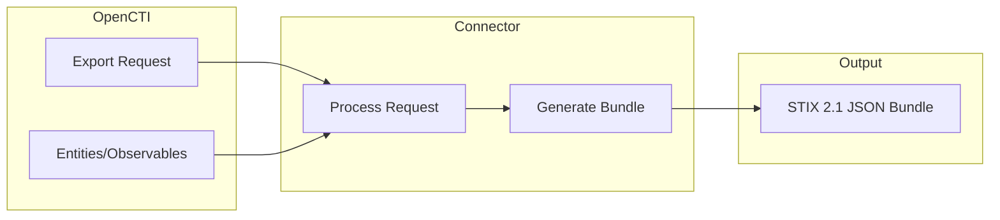

# OpenCTI Export File STIX Connector

| Status | Date | Comment |
|--------|------|---------|
| Filigran Verified | -    | -       |

The Export File STIX connector enables exporting OpenCTI entities and observables to STIX 2.1 JSON bundle format for sharing with other threat intelligence platforms.

## Table of Contents

- [OpenCTI Export File STIX Connector](#opencti-export-file-stix-connector)
  - [Table of Contents](#table-of-contents)
  - [Introduction](#introduction)
  - [Installation](#installation)
    - [Requirements](#requirements)
  - [Configuration variables](#configuration-variables)
    - [OpenCTI environment variables](#opencti-environment-variables)
    - [Base connector environment variables](#base-connector-environment-variables)
  - [Deployment](#deployment)
    - [Docker Deployment](#docker-deployment)
    - [Manual Deployment](#manual-deployment)
  - [Usage](#usage)
  - [Behavior](#behavior)
  - [Debugging](#debugging)
  - [Additional information](#additional-information)

## Introduction

The Export File STIX connector is an internal export connector that generates STIX 2.1 JSON bundle files from OpenCTI data. STIX (Structured Threat Information Expression) is an open standard for representing cyber threat intelligence.

This connector supports:
- Single entity exports with full relationship context
- Selected entities from list views
- Query-based exports with filters
- Both "Simple" and "Full" export modes

The exported STIX bundles can be imported into other STIX-compatible platforms or used for data exchange with partners.

## Installation

### Requirements

- OpenCTI Platform >= 5.6.1

## Configuration variables

There are a number of configuration options, which are set either in `docker-compose.yml` (for Docker) or in `config.yml` (for manual deployment).

### OpenCTI environment variables

| Parameter     | config.yml | Docker environment variable | Mandatory | Description                                          |
|---------------|------------|-----------------------------|-----------|------------------------------------------------------|
| OpenCTI URL   | url        | `OPENCTI_URL`               | Yes       | The URL of the OpenCTI platform.                     |
| OpenCTI Token | token      | `OPENCTI_TOKEN`             | Yes       | The default admin token set in the OpenCTI platform. |

### Base connector environment variables

| Parameter          | config.yml       | Docker environment variable   | Default                        | Mandatory | Description                                                                 |
|--------------------|------------------|-------------------------------|--------------------------------|-----------|-----------------------------------------------------------------------------|
| Connector ID       | id               | `CONNECTOR_ID`                |                                | Yes       | A unique `UUIDv4` identifier for this connector instance.                   |
| Connector Name     | name             | `CONNECTOR_NAME`              | ExportFileStix                 | No        | Name of the connector.                                                      |
| Connector Scope    | scope            | `CONNECTOR_SCOPE`             | application/vnd.oasis.stix+json | Yes      | The MIME type for STIX JSON export.                                         |
| Confidence Level   | confidence_level | `CONNECTOR_CONFIDENCE_LEVEL`  | 100                            | No        | The confidence level for this connector.                                    |
| Log Level          | log_level        | `CONNECTOR_LOG_LEVEL`         | info                           | No        | Determines the verbosity of the logs: `debug`, `info`, `warn`, or `error`.  |

## Deployment

### Docker Deployment

Build the Docker image:

```bash
docker build -t opencti/connector-export-file-stix:latest .
```

Configure the connector in `docker-compose.yml`:

```yaml
  connector-export-file-stix:
    image: opencti/connector-export-file-stix:latest
    environment:
      - OPENCTI_URL=http://localhost
      - OPENCTI_TOKEN=ChangeMe
      - CONNECTOR_ID=ChangeMe
      - CONNECTOR_NAME=ExportFileStix
      - CONNECTOR_SCOPE=application/vnd.oasis.stix+json
      - CONNECTOR_CONFIDENCE_LEVEL=100
      - CONNECTOR_LOG_LEVEL=info
    restart: always
```

Start the connector:

```bash
docker compose up -d
```

### Manual Deployment

1. Create `config.yml` based on `config.yml.sample`.

2. Install dependencies:

```bash
pip3 install -r requirements.txt
```

3. Start the connector from the `src` directory:

```bash
python3 export-file-stix.py
```

## Usage

The connector is triggered through the OpenCTI export functionality:

1. Navigate to any entity list or single entity view
2. Click the export button
3. Select "STIX 2.1" as the export format
4. Choose export type: "Simple" or "Full"
5. The connector will generate a STIX bundle file available for download

### Export Scopes

| Scope     | Description                                                    |
|-----------|----------------------------------------------------------------|
| single    | Export a single entity with its relationships and references   |
| selection | Export selected entities from a list view                      |
| query     | Export entities matching current filters/search                |

### Export Types

| Type   | Description                                                              |
|--------|--------------------------------------------------------------------------|
| Simple | Export only the selected entities without relationships                  |
| Full   | Export entities with all relationships and referenced objects            |

## Behavior

The connector generates STIX 2.1 compliant JSON bundles from OpenCTI entities.

### Data Flow



### STIX Bundle Structure

The exported STIX bundle follows this format:

```json
{
  "type": "bundle",
  "id": "bundle--<uuid>",
  "objects": [
    { "type": "indicator", ... },
    { "type": "malware", ... },
    { "type": "relationship", ... }
  ]
}
```

### Processing Details

1. **Single Export**:
   - Retrieves the entity with all related objects
   - Respects user's access markings
   - Generates complete STIX bundle with relationships

2. **Selection Export**:
   - Reads each selected entity
   - Generates combined STIX bundle
   - Includes relationships based on export type

3. **Query Export**:
   - Executes query with filters
   - Retrieves all matching entities
   - Generates STIX bundle for results

### Entity Type Support

| OpenCTI Type              | STIX Type              |
|---------------------------|------------------------|
| Stix-Domain-Object        | Various SDO types      |
| Stix-Cyber-Observable     | Various SCO types      |
| Stix-Core-Relationship    | relationship           |
| Stix-Core-Object          | Various types          |

## Debugging

Enable verbose logging by setting:

```env
CONNECTOR_LOG_LEVEL=debug
```

Log output includes:
- Export request details
- Entity retrieval progress
- Bundle generation status
- Upload confirmation

### Common Issues

| Issue                | Solution                                        |
|----------------------|-------------------------------------------------|
| Empty bundle         | Verify entities exist and user has access       |
| Missing relationships| Use "Full" export type                          |
| Large exports fail   | Increase memory/timeout settings                |

## Additional information

- **STIX 2.1 Compliance**: All exported data follows STIX 2.1 specification
- **Access Control**: Exports respect the user's marking access levels
- **Pretty Print**: JSON output is formatted with 4-space indentation for readability
- **Permissions**: The connector requires admin permissions as it impersonates the user requesting the export
- **Interoperability**: Exported bundles can be imported into any STIX 2.1 compatible platform
- **File Extension**: Exported files use `.json` extension with STIX MIME type
