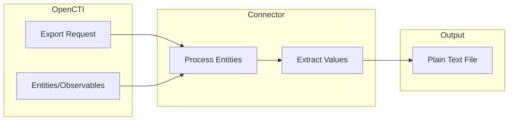

# OpenCTI Export File TXT Connector

| Status | Date | Comment |
|--------|------|---------|
| Filigran Verified | -    | -       |

The Export File TXT connector enables exporting OpenCTI entity names and observable values to plain text format, one value per line, for use with blocklists, detection rules, and other security tools.

## Table of Contents

- [OpenCTI Export File TXT Connector](#opencti-export-file-txt-connector)
  - [Table of Contents](#table-of-contents)
  - [Introduction](#introduction)
  - [Installation](#installation)
    - [Requirements](#requirements)
  - [Configuration variables](#configuration-variables)
    - [OpenCTI environment variables](#opencti-environment-variables)
    - [Base connector environment variables](#base-connector-environment-variables)
  - [Deployment](#deployment)
    - [Docker Deployment](#docker-deployment)
    - [Manual Deployment](#manual-deployment)
  - [Usage](#usage)
  - [Behavior](#behavior)
  - [Debugging](#debugging)
  - [Additional information](#additional-information)

## Introduction

The Export File TXT connector is an internal export connector that generates plain text files containing entity names or observable values, one per line. This format is ideal for:

- Creating blocklists for firewalls and security tools
- Feeding IOC values to SIEM systems
- Generating simple reports of entity names
- Integration with tools that accept newline-separated input

The connector supports list exports (selection or query-based) but does not support single entity exports.

## Installation

### Requirements

- OpenCTI Platform >= 5.6.1

## Configuration variables

There are a number of configuration options, which are set either in `docker-compose.yml` (for Docker) or in `config.yml` (for manual deployment).

### OpenCTI environment variables

| Parameter     | config.yml | Docker environment variable | Mandatory | Description                                          |
|---------------|------------|-----------------------------|-----------|------------------------------------------------------|
| OpenCTI URL   | url        | `OPENCTI_URL`               | Yes       | The URL of the OpenCTI platform.                     |
| OpenCTI Token | token      | `OPENCTI_TOKEN`             | Yes       | The default admin token set in the OpenCTI platform. |

### Base connector environment variables

| Parameter          | config.yml       | Docker environment variable   | Default      | Mandatory | Description                                                                 |
|--------------------|------------------|-------------------------------|--------------|-----------|-----------------------------------------------------------------------------|
| Connector ID       | id               | `CONNECTOR_ID`                |              | Yes       | A unique `UUIDv4` identifier for this connector instance.                   |
| Connector Name     | name             | `CONNECTOR_NAME`              | ExportFileTxt | No        | Name of the connector.                                                      |
| Connector Scope    | scope            | `CONNECTOR_SCOPE`             | text/plain   | Yes       | The MIME type for plain text export.                                        |
| Confidence Level   | confidence_level | `CONNECTOR_CONFIDENCE_LEVEL`  | 100          | No        | The confidence level for this connector.                                    |
| Log Level          | log_level        | `CONNECTOR_LOG_LEVEL`         | info         | No        | Determines the verbosity of the logs: `debug`, `info`, `warn`, or `error`.  |

## Deployment

### Docker Deployment

Build the Docker image:

```bash
docker build -t opencti/connector-export-file-txt:latest .
```

Configure the connector in `docker-compose.yml`:

```yaml
  connector-export-file-txt:
    image: opencti/connector-export-file-txt:latest
    environment:
      - OPENCTI_URL=http://localhost
      - OPENCTI_TOKEN=ChangeMe
      - CONNECTOR_ID=ChangeMe
      - CONNECTOR_NAME=ExportFileTxt
      - CONNECTOR_SCOPE=text/plain
      - CONNECTOR_CONFIDENCE_LEVEL=100
      - CONNECTOR_LOG_LEVEL=info
    restart: always
```

Start the connector:

```bash
docker compose up -d
```

### Manual Deployment

1. Create `config.yml` based on `config.yml.sample`.

2. Install dependencies:

```bash
pip3 install -r requirements.txt
```

3. Start the connector from the `src` directory:

```bash
python3 export-file-txt.py
```

## Usage

The connector is triggered through the OpenCTI export functionality:

1. Navigate to any entity list view
2. Select entities or apply filters
3. Click the export button
4. Select "TXT" as the export format
5. The connector will generate a plain text file available for download

### Export Scopes

| Scope     | Supported | Description                                       |
|-----------|-----------|---------------------------------------------------|
| single    | No        | Not supported - use CSV or STIX for single exports |
| selection | Yes       | Export selected entities from a list view         |
| query     | Yes       | Export entities matching current filters/search   |

### Supported Entity Types

| Entity Type            | Exported Value          |
|------------------------|-------------------------|
| Stix-Cyber-Observable  | `observable_value`      |
| Stix-Domain-Object     | `name`                  |
| Stix-Core-Object       | `name`                  |
| Malware-Analysis       | `result_name`           |

### Unsupported Entity Types

The following entity types cannot be exported to TXT format:

- `stix-sighting-relationship`
- `stix-core-relationship`
- `Observed-Data`
- `Artifact`
- `Note`
- `Opinion`

## Behavior

The connector extracts names or values from entities and outputs them as newline-separated plain text.

### Data Flow



### Output Format

The generated file contains one value per line:

```
192.168.1.1
10.0.0.1
malicious-domain.com
evil-file.exe
```

### Processing Details

1. **Selection Export**:
   - Retrieves all selected SDOs, SCOs, and relationships
   - Extracts `name` or `observable_value` from each entity
   - Outputs as newline-separated text

2. **Query Export**:
   - Executes query with user's filters
   - Applies access filter for marking restrictions
   - Extracts values from matching entities

### Value Extraction Logic

| Entity Category       | Field Extracted      |
|-----------------------|----------------------|
| Observables (SCO)     | `observable_value`   |
| Domain Objects (SDO)  | `name`               |
| Malware-Analysis      | `result_name`        |
| Relationships         | Not supported        |

## Debugging

Enable verbose logging by setting:

```env
CONNECTOR_LOG_LEVEL=debug
```

Log output includes:
- Export request details
- Entity retrieval progress
- Upload confirmation

### Common Issues

| Issue                    | Solution                                            |
|--------------------------|-----------------------------------------------------|
| "Only list exports"      | TXT export doesn't support single entity export     |
| "Not available for type" | Entity type is not supported for TXT export         |
| Empty file               | No entities matched the filter/selection            |
| Missing values           | Entity doesn't have `name` or `observable_value`    |

## Additional information

- **Use Cases**: Ideal for creating IOC feeds, blocklists, and simple value lists
- **Line Separator**: Uses newline (`\n`) as the line separator
- **No Headers**: Output contains only values, no column headers
- **Permissions**: The connector requires admin permissions as it impersonates the user requesting the export
- **Empty Values**: Entities without a name or observable_value are skipped
- **Encoding**: Output is UTF-8 encoded
