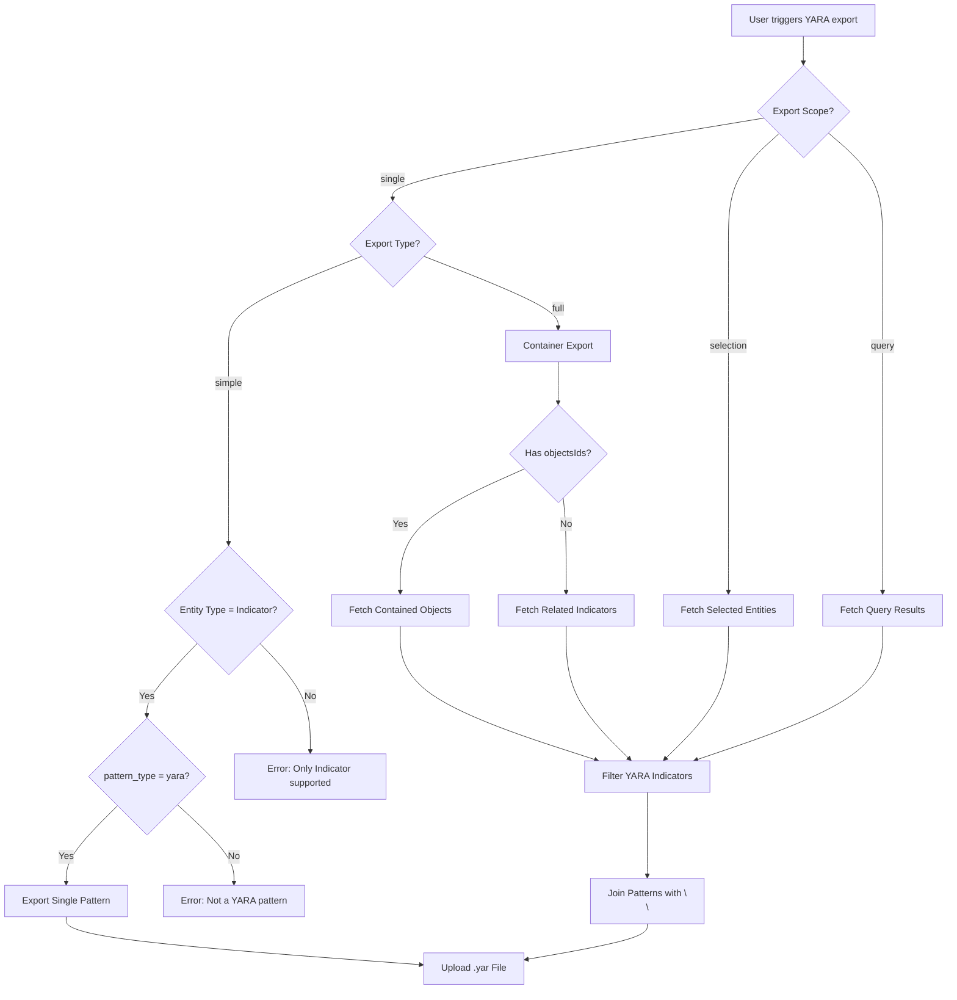
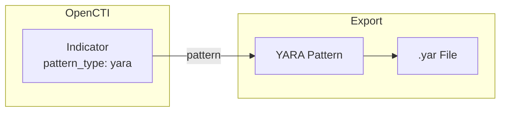
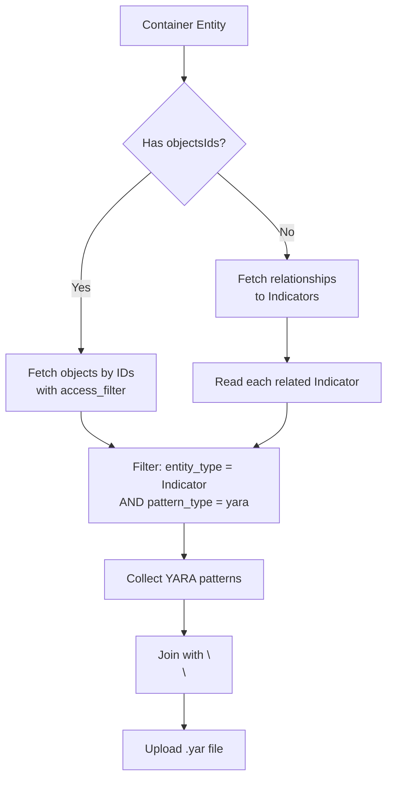

# OpenCTI Export File YARA Connector

| Status            | Date | Comment |
|-------------------|------|---------|
| Filigran Verified | -    | -       |

## Table of Contents

- [OpenCTI Export File YARA Connector](#opencti-export-file-yara-connector)
  - [Introduction](#introduction)
  - [Installation](#installation)
    - [Requirements](#requirements)
  - [Configuration variables](#configuration-variables)
    - [OpenCTI environment variables](#opencti-environment-variables)
    - [Base connector environment variables](#base-connector-environment-variables)
  - [Deployment](#deployment)
    - [Docker Deployment](#docker-deployment)
    - [Manual Deployment](#manual-deployment)
  - [Usage](#usage)
  - [Behavior](#behavior)
    - [Export modes](#export-modes)
    - [Export workflow](#export-workflow)
    - [Single export](#single-export)
    - [Selection export](#selection-export)
    - [Query export](#query-export)
    - [Container full export](#container-full-export)
    - [Output format](#output-format)
  - [Debugging](#debugging)
  - [Additional information](#additional-information)

## Introduction

The OpenCTI Export File YARA connector enables the export of YARA rules in `.yar` format. It allows exporting YARA indicators from OpenCTI for use in external security tools, threat detection systems, or for sharing with other organizations.

**Key features:**
- Export single YARA indicators
- Export multiple YARA indicators from a selection or query
- Export all YARA indicators contained within a container (Report, Case, etc.)
- Automatic filtering to only include indicators with YARA pattern type
- Error reporting for non-YARA indicators in batch exports

## Installation

### Requirements

- OpenCTI Platform >= 6.7.10

## Configuration variables

There are a number of configuration options, which are set either in `docker-compose.yml` (for Docker) or in `config.yml` (for manual deployment).

### OpenCTI environment variables

Below are the parameters you'll need to set for OpenCTI:

| Parameter     | config.yml `opencti` | Docker environment variable | Default | Mandatory | Description                                          |
|---------------|----------------------|-----------------------------|---------|-----------|------------------------------------------------------|
| OpenCTI URL   | `url`                | `OPENCTI_URL`               | /       | Yes       | The URL of the OpenCTI platform.                     |
| OpenCTI Token | `token`              | `OPENCTI_TOKEN`             | /       | Yes       | The default admin token set in the OpenCTI platform. |

### Base connector environment variables

Below are the parameters you'll need to set for running the connector properly:

| Parameter       | config.yml `connector` | Docker environment variable | Default          | Mandatory | Description                                                                            |
|-----------------|------------------------|-----------------------------|------------------|-----------|----------------------------------------------------------------------------------------|
| Connector ID    | `id`                   | `CONNECTOR_ID`              | /                | Yes       | A unique `UUIDv4` identifier for this connector instance.                              |
| Connector Name  | `name`                 | `CONNECTOR_NAME`            | ExportFileYARA   | No        | Name of the connector.                                                                 |
| Connector Scope | `scope`                | `CONNECTOR_SCOPE`           | text/yara+plain  | Yes       | The MIME type for YARA files.                                                          |
| Log Level       | `log_level`            | `CONNECTOR_LOG_LEVEL`       | info             | No        | Determines the verbosity of the logs. Options are `debug`, `info`, `warn`, or `error`. |

## Deployment

### Docker Deployment

Before building the Docker container, you need to set the version of pycti in `requirements.txt` equal to whatever version of OpenCTI you're running. Example, `pycti==6.7.10`. If you don't, it will take the latest version, but sometimes the OpenCTI SDK fails to initialize.

Build a Docker Image using the provided `Dockerfile`.

Example:

```shell
# Replace the IMAGE NAME with the appropriate value
docker build . -t [IMAGE NAME]:latest
```

Make sure to replace the environment variables in `docker-compose.yml` with the appropriate configurations for your environment. Then, start the docker container with the provided `docker-compose.yml`.

```shell
docker compose up -d
# -d for detached
```

### Manual Deployment

Create a file `config.yml` based on the provided `config.yml.sample`.

Replace the configuration variables (especially the "**ChangeMe**" variables) with the appropriate configurations for your environment.

Install the required python dependencies (preferably in a virtual environment):

```shell
pip3 install -r requirements.txt
```

Then, start the connector from the `src` directory:

```shell
python3 main.py
```

## Usage

This is an **Internal Export File** connector. It generates YARA rule files from Indicator entities in OpenCTI.

### Single indicator export

1. Navigate to an **Indicator** entity with `pattern_type: yara`
2. Click on **Generate Export** (or use the export button)
3. Select **`text/yara+plain`** as the export format
4. Choose **Simple** export type
5. Download the generated `.yar` file

### Container export (full)

1. Navigate to a **container** entity (Report, Case-Incident, Case-Rfi, Case-Rft, Grouping, etc.)
2. Click on **Generate Export**
3. Select **`text/yara+plain`** as the export format
4. Choose **Full** export type
5. Download the generated `.yar` file containing all YARA indicators from the container

### List export (selection or query)

1. Navigate to the **Indicators** list view
2. Either:
   - **Selection**: Select specific indicators using checkboxes
   - **Query**: Apply filters to narrow down the list
3. Click **Export** and select **`text/yara+plain`**
4. Download the generated `.yar` file containing all YARA indicators

## Behavior

### Export modes

The connector supports three export scopes:

| Export Scope | Export Type | Description |
|--------------|-------------|-------------|
| `single`     | `simple`    | Export a single YARA indicator |
| `single`     | `full`      | Export all YARA indicators from a container |
| `selection`  | -           | Export selected indicators from a list |
| `query`      | -           | Export indicators matching the current filters |

### Export workflow



### Single export

For single entity export with `simple` type:



| Check | Condition | Result |
|-------|-----------|--------|
| Entity Type | Must be `Indicator` | Error if not Indicator |
| Pattern Type | Must be `yara` | Error if not YARA |

### Selection export

For exporting selected indicators from a list:

1. Fetches all selected STIX Domain Objects using `main_filter`
2. Iterates through each entity
3. Checks if `pattern_type == "yara"`
4. Collects valid YARA patterns
5. Logs warning and reports error for non-YARA indicators
6. Joins all patterns and uploads the file

### Query export

For exporting indicators matching filters:

1. Combines `list_params.filters` with `access_filter`
2. Fetches all matching entities using `export_entities_list`
3. Filters for `pattern_type == "yara"`
4. Collects and joins YARA patterns
5. Uploads the combined file

### Container full export

When exporting from a container with `full` type:



**Supported container types:**
- Report
- Case-Incident
- Case-Rfi
- Case-Rft
- Grouping
- Any entity with `objectsIds` or relationships to Indicators

### Output format

The exported `.yar` file contains:

- **Single indicator**: The raw YARA pattern as stored in the indicator
- **Multiple indicators**: All YARA patterns joined with double newlines (`\n\n`)

**Example output (multiple rules):**

```yara
rule MalwareFamily_A {
    meta:
        description = "Detects Malware Family A"
    strings:
        $s1 = "malicious_string"
    condition:
        $s1
}

rule MalwareFamily_B {
    meta:
        description = "Detects Malware Family B"
    strings:
        $s1 = { 48 65 6C 6C 6F }
    condition:
        $s1
}
```

## Debugging

The connector can be debugged by setting the appropriate log level. Set `CONNECTOR_LOG_LEVEL=debug` for verbose logging.

Log messages include:
- Export start with entity details
- Warnings for non-YARA indicators encountered during batch exports
- Export completion status
- Error messages for unsupported entity types or patterns

**Error reporting:**
- Non-YARA indicators in batch exports are logged as warnings
- Errors are reported back to the OpenCTI work queue for visibility in the UI
- Single export of non-YARA indicator reports an error message

## Additional information

- **File extension**: The connector automatically corrects `.unknown` file extensions to `.yar`
- **Access control**: The connector uses impersonation to respect the user's access rights when fetching entities
- **MIME type**: The export uses `text/yara+plain` MIME type
- **Pattern storage**: YARA rules are stored in the `pattern` field of Indicator entities with `pattern_type: yara`
- **Connector permissions**: Export file connectors should have admin permissions as they impersonate the user requesting the export

### Indicator requirements

For an indicator to be exported as YARA:
- `entity_type` must be `Indicator`
- `pattern_type` must be `yara`
- `pattern` field must contain a valid YARA rule

*Reference: [YARA Documentation](https://yara.readthedocs.io/)*
