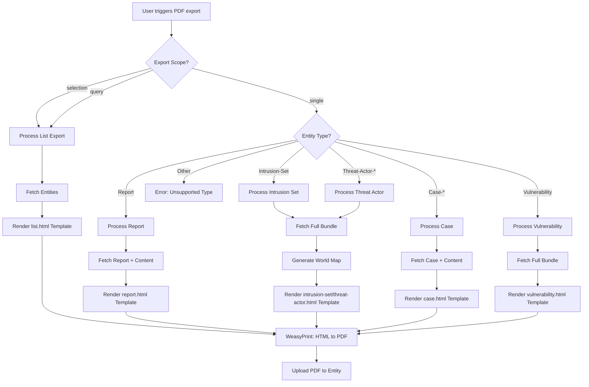
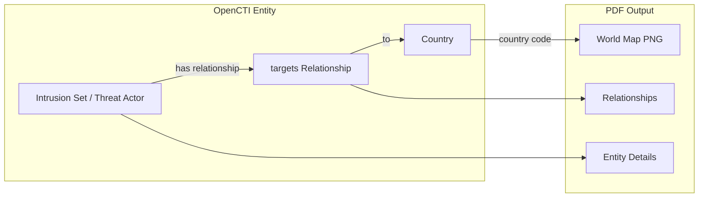

# OpenCTI Export Report PDF Connector

| Status            | Date | Comment |
|-------------------|------|---------|
| Filigran Verified | -    | -       |

## Table of Contents

- [OpenCTI Export Report PDF Connector](#opencti-export-report-pdf-connector)
  - [Introduction](#introduction)
  - [Installation](#installation)
    - [Requirements](#requirements)
  - [Configuration variables](#configuration-variables)
    - [OpenCTI environment variables](#opencti-environment-variables)
    - [Base connector environment variables](#base-connector-environment-variables)
    - [Connector specific environment variables](#connector-specific-environment-variables)
  - [Deployment](#deployment)
    - [Docker Deployment](#docker-deployment)
    - [Manual Deployment](#manual-deployment)
  - [Usage](#usage)
  - [Behavior](#behavior)
    - [Supported entity types](#supported-entity-types)
    - [Export workflow](#export-workflow)
    - [Report export](#report-export)
    - [Intrusion Set and Threat Actor export](#intrusion-set-and-threat-actor-export)
    - [Case export](#case-export)
    - [Vulnerability export](#vulnerability-export)
    - [List export](#list-export)
  - [Debugging](#debugging)
  - [Known issues](#known-issues)
  - [Additional information](#additional-information)

## Introduction

The OpenCTI Export Report PDF connector allows exporting professional, branded PDF documents from various OpenCTI entity types. The generated PDFs are suitable for sharing threat intelligence with external stakeholders in a well-formatted, presentable format.

**Key features:**
- Professional PDF generation with customizable branding (colors, company information)
- Support for multiple entity types (Reports, Intrusion Sets, Threat Actors, Cases, Vulnerabilities)
- List/batch export capability for query results or selected items
- World map visualization for targeted countries
- Markdown content rendering
- URL defanging for safe sharing
- Optional filtering to include only indicator observables

## Installation

### Requirements

- OpenCTI Platform >= 5.6.1
- **For Windows**: GTK Runtime Environment (see [Known issues](#known-issues))

## Configuration variables

There are a number of configuration options, which are set either in `docker-compose.yml` (for Docker) or in `config.yml` (for manual deployment).

### OpenCTI environment variables

Below are the parameters you'll need to set for OpenCTI:

| Parameter     | config.yml `opencti` | Docker environment variable | Default | Mandatory | Description                                          |
|---------------|----------------------|-----------------------------|---------|-----------|------------------------------------------------------|
| OpenCTI URL   | `url`                | `OPENCTI_URL`               | /       | Yes       | The URL of the OpenCTI platform.                     |
| OpenCTI Token | `token`              | `OPENCTI_TOKEN`             | /       | Yes       | The default admin token set in the OpenCTI platform. |

### Base connector environment variables

Below are the parameters you'll need to set for running the connector properly:

| Parameter      | config.yml `connector` | Docker environment variable | Default         | Mandatory | Description                                                                            |
|----------------|------------------------|-----------------------------|-----------------|-----------|----------------------------------------------------------------------------------------|
| Connector ID   | `id`                   | `CONNECTOR_ID`              | /               | Yes       | A unique `UUIDv4` identifier for this connector instance.                              |
| Connector Name | `name`                 | `CONNECTOR_NAME`            | ExportReportPdf | No        | Name of the connector.                                                                 |
| Connector Scope| `scope`                | `CONNECTOR_SCOPE`           | application/pdf | Yes       | The MIME type for PDF files.                                                           |
| Log Level      | `log_level`            | `CONNECTOR_LOG_LEVEL`       | info            | No        | Determines the verbosity of the logs. Options are `debug`, `info`, `warn`, or `error`. |

### Connector specific environment variables

Below are the parameters specific to the Export Report PDF connector:

| Parameter             | config.yml `export_report_pdf` | Docker environment variable             | Default | Mandatory | Description                                                     |
|-----------------------|--------------------------------|-----------------------------------------|---------|-----------|-----------------------------------------------------------------|
| Primary Color         | `primary_color`                | `EXPORT_REPORT_PDF_PRIMARY_COLOR`       | /       | No        | Primary color for the PDF (hex format, e.g., `#ff8c00`).        |
| Secondary Color       | `secondary_color`              | `EXPORT_REPORT_PDF_SECONDARY_COLOR`     | /       | No        | Secondary color for the PDF (hex format, e.g., `#000000`).      |
| Company Address Line 1| `company_address_line_1`       | `EXPORT_REPORT_PDF_COMPANY_ADDRESS_LINE_1` | /    | No        | First line of company address (e.g., company name).             |
| Company Address Line 2| `company_address_line_2`       | `EXPORT_REPORT_PDF_COMPANY_ADDRESS_LINE_2` | /    | No        | Second line of company address (e.g., street address).          |
| Company Address Line 3| `company_address_line_3`       | `EXPORT_REPORT_PDF_COMPANY_ADDRESS_LINE_3` | /    | No        | Third line of company address (e.g., city, state, country).     |
| Company Phone Number  | `company_phone_number`         | `EXPORT_REPORT_PDF_COMPANY_PHONE_NUMBER`| /       | No        | Company phone number for the PDF footer.                        |
| Company Email         | `company_email`                | `EXPORT_REPORT_PDF_COMPANY_EMAIL`       | /       | No        | Company email for the PDF footer.                               |
| Company Website       | `company_website`              | `EXPORT_REPORT_PDF_COMPANY_WEBSITE`     | /       | No        | Company website URL for the PDF footer.                         |
| Indicators Only       | `indicators_only`              | `EXPORT_REPORT_PDF_INDICATORS_ONLY`     | false   | No        | If `true`, only include observables that have indicator status. |
| Defang URLs           | `defang_urls`                  | `EXPORT_REPORT_PDF_DEFANG_URLS`         | true    | No        | If `true`, replace `http` with `hxxp` in URL observables.       |

## Deployment

### Docker Deployment

Before building the Docker container, you need to set the version of pycti in `requirements.txt` equal to whatever version of OpenCTI you're running. Example, `pycti==5.12.10`. If you don't, it will take the latest version, but sometimes the OpenCTI SDK fails to initialize.

Build a Docker Image using the provided `Dockerfile`.

Example:

```shell
# Replace the IMAGE NAME with the appropriate value
docker build . -t [IMAGE NAME]:latest
```

Make sure to replace the environment variables in `docker-compose.yml` with the appropriate configurations for your environment. Then, start the docker container with the provided `docker-compose.yml`.

```shell
docker compose up -d
# -d for detached
```

### Manual Deployment

Create a file `config.yml` based on the provided `config.yml.sample`.

Replace the configuration variables (especially the "**ChangeMe**" variables) with the appropriate configurations for your environment.

Install the required python dependencies (preferably in a virtual environment):

```shell
pip3 install -r requirements.txt
```

Then, start the connector from the `src` directory:

```shell
python3 main.py
```

## Usage

This is an **Internal Export File** connector. It generates PDF export files from entities in OpenCTI.

To use this connector:

1. Navigate to any supported entity in OpenCTI (see [Supported entity types](#supported-entity-types))
2. Click on **Generate Export** (or use the export button)
3. Select **`application/pdf`** as the export format
4. Wait for the export to complete
5. Download the generated `.pdf` file

**For list exports:**
1. Navigate to any entity list view (e.g., Threat Actors, Reports)
2. Optionally select specific items or apply filters
3. Click **Export** and select **`application/pdf`**
4. The PDF will contain all matching entities grouped by type

## Behavior

### Supported entity types

The connector supports exporting the following entity types:

| Entity Type              | Export Mode | Template Used       | Special Features                           |
|--------------------------|-------------|---------------------|-------------------------------------------|
| Report                   | Single      | `report.html`       | Full content, contained entities          |
| Intrusion-Set            | Single      | `intrusion-set.html`| World map of targeted countries           |
| Threat-Actor-Group       | Single      | `threat-actor.html` | World map of targeted countries           |
| Threat-Actor-Individual  | Single      | `threat-actor.html` | World map of targeted countries           |
| Case-Incident            | Single      | `case.html`         | Tasks, priority, severity                 |
| Case-Rfi                 | Single      | `case.html`         | Tasks, priority, severity                 |
| Case-Rft                 | Single      | `case.html`         | Tasks, priority, severity                 |
| Vulnerability            | Single      | `vulnerability.html`| Impacted/resolved software, CoAs          |
| Any STIX Object          | List        | `list.html`         | Grouped by entity type                    |

### Export workflow



### Report export

When exporting a **Report** entity, the PDF includes:

| Section | Source | Description |
|---------|--------|-------------|
| Report Name | `name` | Title of the report |
| TLP Marking | `objectMarking` | Classification level |
| Confidence | `confidence` | Confidence score |
| Description | `description` | Markdown-rendered description |
| Content | `content` | Full report content (rich text) |
| External References | `externalReferences` | List of URLs |
| Contained Entities | `objects` | STIX Domain Objects grouped by type |
| Contained Observables | `objects` | STIX Cyber Observables grouped by type |

### Intrusion Set and Threat Actor export

When exporting **Intrusion Set** or **Threat Actor** entities, the PDF includes:

| Section | Source | Description |
|---------|--------|-------------|
| Entity Details | Entity data | Name, description, aliases, etc. |
| Targeted Countries Map | `targets` relationships | World map visualization |
| Related Entities | Full bundle | Attack Patterns, Malware, Tools, etc. |
| Relationships | Full bundle | All relationships to/from the entity |

**World Map Generation:**
- Extracts all `targets` relationships to `Country` entities
- Validates country codes against `pygal_maps_world`
- Renders SVG map and converts to PNG for PDF embedding



### Case export

When exporting **Case** entities (Incident, RFI, RFT), the PDF includes:

| Section | Source | Description |
|---------|--------|-------------|
| Case Name | `name` | Title of the case |
| Case Type | `entity_type` | Case-Incident, Case-Rfi, Case-Rft |
| Priority | `priority` | Case priority level |
| Severity | `severity` | Case severity level |
| TLP Marking | `objectMarking` | Classification level |
| Confidence | `confidence` | Confidence score |
| Description | `description` | Markdown-rendered description |
| Content | `content` | Full case content |
| Tasks | `tasks` | Associated tasks |
| External References | `externalReferences` | List of URLs |
| Contained Entities | `objects` | STIX Domain Objects |
| Contained Observables | `objects` | STIX Cyber Observables |

### Vulnerability export

When exporting a **Vulnerability** entity, the PDF includes:

| Section | Source | Description |
|---------|--------|-------------|
| Vulnerability Details | Entity data | CVE ID, description, CVSS scores |
| TLP Marking | `object_marking_refs` | Classification levels |
| Impacted Software | `has` relationship from Software | Software affected by the vulnerability |
| Resolved Software | `remediates` relationship from Software | Software versions that fix the vulnerability |
| Courses of Action | `remediates` relationship from Course-of-Action | Remediation actions |
| Infrastructures | `has` relationship from Infrastructure | Related infrastructure |

### List export

When exporting a **list** (query or selection), the PDF includes:

| Section | Source | Description |
|---------|--------|-------------|
| Export Title | Entity type | "Export of {Entity Type}" |
| Search Keyword | `list_params.search` | Applied search term |
| Filters | `main_filter` | Applied filter criteria |
| TLP Marking | `file_markings` | Export marking |
| Report Date | Current date | Date of export generation |
| Entities | Query results | STIX Domain Objects grouped by type |
| Observables | Query results | STIX Cyber Observables grouped by type |

## Debugging

The connector can be debugged by setting the appropriate log level. Set `CONNECTOR_LOG_LEVEL=debug` for verbose logging.

Log messages include:
- Export processing start
- Upload progress
- Entity type processing
- Error messages for unsupported types or missing reader functions

## Known issues

### Windows limitation

If you're having trouble starting the connector with an error saying a library of type "cairo" or similar is missing, you need to download and install the GTK Runtime Environment:

**Solution:**
1. Download and install [GTK for Windows Runtime](https://github.com/tschoonj/GTK-for-Windows-Runtime-Environment-Installer/releases/tag/2022-01-04)
2. Restart your IDE after installation
3. If still not working, install Visual Studio Community and enable C++ development tools

### Country code validation

- Country codes in `targets` relationships must match the ISO 3166-1 alpha-2 format (lowercase)
- Invalid country codes are logged as warnings and skipped in the world map

## Additional information

- **PDF Generation**: Uses [WeasyPrint](https://weasyprint.org/) for HTML to PDF conversion
- **Templating**: Uses [Jinja2](https://jinja.palletsprojects.com/) for HTML template rendering
- **World Maps**: Uses [pygal_maps_world](https://www.pygal.org/en/stable/documentation/types/maps/pygal_maps_world.html) for generating world maps, with [CairoSVG](https://cairosvg.org/) for SVG to PNG conversion
- **Markdown Rendering**: Uses [cmarkgfm](https://github.com/theacodes/cmarkgfm) with GitHub Flavored Markdown support including footnotes and tables
- **Font**: Fira Sans font family included for consistent rendering
- **Customization**: CSS templates (`.css.template` files) use placeholders for primary/secondary colors

### Template files

The connector includes the following HTML/CSS templates in `src/resources/`:

| Template | Entity Type |
|----------|-------------|
| `report.html` / `report.css` | Report |
| `intrusion-set.html` / `intrusion-set.css` | Intrusion Set |
| `threat-actor.html` / `threat-actor.css` | Threat Actor (Group & Individual) |
| `case.html` / `case.css` | Case (Incident, RFI, RFT) |
| `vulnerability.html` / `vulnerability.css` | Vulnerability |
| `list.html` / `list.css` | List exports (query/selection) |

*Advanced users can customize these templates to modify the PDF output format.*
