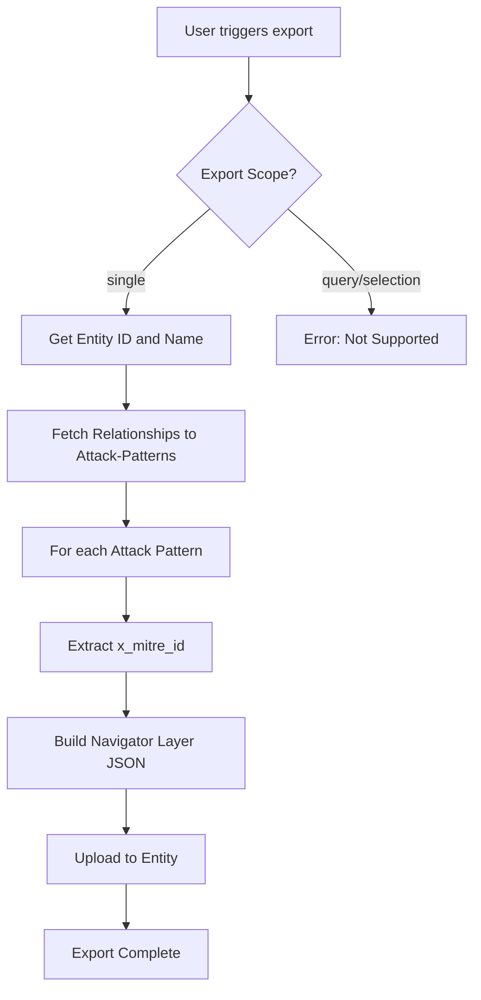
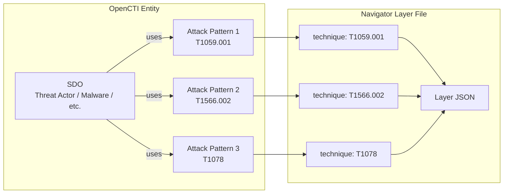

# OpenCTI Export ATT&CK Navigator TTPs Connector

| Status    | Date | Comment |
|-----------|------|---------|
| Community | -    | -       |

## Table of Contents

- [OpenCTI Export ATT&CK Navigator TTPs Connector](#opencti-export-attck-navigator-ttps-connector)
  - [Introduction](#introduction)
  - [Installation](#installation)
    - [Requirements](#requirements)
  - [Configuration variables](#configuration-variables)
    - [OpenCTI environment variables](#opencti-environment-variables)
    - [Base connector environment variables](#base-connector-environment-variables)
  - [Deployment](#deployment)
    - [Docker Deployment](#docker-deployment)
    - [Manual Deployment](#manual-deployment)
  - [Usage](#usage)
  - [Behavior](#behavior)
    - [Export workflow](#export-workflow)
    - [Layer file format](#layer-file-format)
  - [Current limitations](#current-limitations)
  - [Debugging](#debugging)
  - [Additional information](#additional-information)

## Introduction

This connector allows exporting **TTPs (Attack Patterns)** associated with any STIX Domain Object (SDO) in OpenCTI to the **MITRE ATT&CK® Navigator layer format**.

The [ATT&CK Navigator](https://mitre-attack.github.io/attack-navigator/) is a web-based tool for visualizing and annotating tactics and techniques from the MITRE ATT&CK® framework. The exported layer files can be opened directly in the Navigator tool to visualize which techniques are associated with a specific threat actor, intrusion set, malware, campaign, or other entity in OpenCTI.

This connector exports files according to **version 4.5** of the MITRE ATT&CK® layer model. See: [Layer Format v4.5](https://github.com/mitre-attack/attack-navigator/blob/master/layers/LAYERFORMATv4_5.md)

## Installation

### Requirements

- OpenCTI Platform >= 5.12.10

## Configuration variables

There are a number of configuration options, which are set either in `docker-compose.yml` (for Docker) or in `config.yml` (for manual deployment).

### OpenCTI environment variables

Below are the parameters you'll need to set for OpenCTI:

| Parameter     | config.yml `opencti` | Docker environment variable | Default | Mandatory | Description                                          |
|---------------|----------------------|-----------------------------|---------|-----------|------------------------------------------------------|
| OpenCTI URL   | `url`                | `OPENCTI_URL`               | /       | Yes       | The URL of the OpenCTI platform.                     |
| OpenCTI Token | `token`              | `OPENCTI_TOKEN`             | /       | Yes       | The default admin token set in the OpenCTI platform. |

### Base connector environment variables

Below are the parameters you'll need to set for running the connector properly:

| Parameter        | config.yml `connector` | Docker environment variable | Default                               | Mandatory | Description                                                                            |
|------------------|------------------------|-----------------------------|---------------------------------------|-----------|----------------------------------------------------------------------------------------|
| Connector ID     | `id`                   | `CONNECTOR_ID`              | /                                     | Yes       | A unique `UUIDv4` identifier for this connector instance.                              |
| Connector Name   | `name`                 | `CONNECTOR_NAME`            | ExportTTPsFileNavigator               | No        | Name of the connector.                                                                 |
| Connector Scope  | `scope`                | `CONNECTOR_SCOPE`           | application/vnd.mitre.navigator+json  | Yes       | The MIME type for Navigator layer files.                                               |
| Confidence Level | `confidence_level`     | `CONNECTOR_CONFIDENCE_LEVEL`| 100                                   | No        | Confidence level for the connector (0-100).                                            |
| Log Level        | `log_level`            | `CONNECTOR_LOG_LEVEL`       | info                                  | No        | Determines the verbosity of the logs. Options are `debug`, `info`, `warn`, or `error`. |

## Deployment

### Docker Deployment

Before building the Docker container, you need to set the version of pycti in `requirements.txt` equal to whatever version of OpenCTI you're running. Example, `pycti==5.12.10`. If you don't, it will take the latest version, but sometimes the OpenCTI SDK fails to initialize.

Build a Docker Image using the provided `Dockerfile`.

Example:

```shell
# Replace the IMAGE NAME with the appropriate value
docker build . -t [IMAGE NAME]:latest
```

Make sure to replace the environment variables in `docker-compose.yml` with the appropriate configurations for your environment. Then, start the docker container with the provided `docker-compose.yml`.

```shell
docker compose up -d
# -d for detached
```

### Manual Deployment

Create a file `config.yml` based on the provided `config.yml.sample`.

Replace the configuration variables (especially the "**ChangeMe**" variables) with the appropriate configurations for your environment.

Install the required python dependencies (preferably in a virtual environment):

```shell
pip3 install -r requirements.txt
```

Then, start the connector from the `src` directory:

```shell
python3 export-ttps-file-navigator.py
```

## Usage

This is an **Internal Export File** connector. It generates export files from entities in OpenCTI.

To use this connector:

1. Navigate to any **STIX Domain Object** (SDO) in OpenCTI that has associated Attack Patterns
   - Examples: Threat Actor, Intrusion Set, Malware, Campaign, Incident, etc.
2. Click on **Generate Export** (or use the export button)
3. Select **`application/vnd.mitre.navigator+json`** as the export format
4. Wait for the export to complete
5. Download the generated `.json` file
6. Open the file in the [ATT&CK Navigator](https://mitre-attack.github.io/attack-navigator/) web tool

The Navigator will display all techniques associated with the entity, highlighted in red.

## Behavior

### Export workflow



### Layer file format

The connector generates a JSON file following the ATT&CK Navigator layer format v4.5:



#### Layer JSON structure

| Field | Value | Description |
|-------|-------|-------------|
| `name` | Entity name | Name of the exported entity |
| `versions.attack` | "14" | ATT&CK version |
| `versions.navigator` | "4.9.1" | Navigator version |
| `versions.layer` | "4.5" | Layer format version |
| `domain` | "enterprise-attack" | ATT&CK domain (currently hardcoded) |
| `techniques` | Array | List of techniques with their properties |

#### Technique object structure

| Field | Value | Description |
|-------|-------|-------------|
| `techniqueID` | e.g., "T1059.001" | MITRE ATT&CK technique ID |
| `color` | "#e60d0d" | Red color for highlighting |
| `comment` | "" | Empty comment |
| `enabled` | true | Technique is enabled |
| `metadata` | [] | Empty metadata array |
| `links` | [] | Empty links array |
| `showSubtechniques` | false | Don't expand sub-techniques |

### Example output

```json
{
    "name": "APT29",
    "versions": {
        "attack": "14",
        "navigator": "4.9.1",
        "layer": "4.5"
    },
    "domain": "enterprise-attack",
    "description": "",
    "sorting": 0,
    "techniques": [
        {
            "techniqueID": "T1059.001",
            "color": "#e60d0d",
            "comment": "",
            "enabled": true,
            "metadata": [],
            "links": [],
            "showSubtechniques": false
        },
        {
            "techniqueID": "T1566.002",
            "color": "#e60d0d",
            "comment": "",
            "enabled": true,
            "metadata": [],
            "links": [],
            "showSubtechniques": false
        }
    ]
}
```

## Current limitations

- **Enterprise Matrix only**: The connector currently only exports TTPs from the Enterprise Matrix (`domain: enterprise-attack`). Mobile and ICS matrices are not supported yet.
- **Single entity export only**: List exports (query or selection) are not supported. You can only export from a single entity at a time.
- **Outgoing relationships only**: The connector only fetches relationships **from** the entity **to** Attack Patterns. Relationships where the entity is the target are not included.

## Debugging

The connector can be debugged by setting the appropriate log level. Set `CONNECTOR_LOG_LEVEL=debug` for verbose logging.

Log messages include:
- Export start with entity ID and export type
- Upload progress
- Export completion status

## Additional information

- **Relationship type**: The connector fetches all relationships from the source entity to Attack Patterns, regardless of the relationship type (uses, delivers, etc.).
- **Color coding**: All exported techniques are highlighted in red (`#e60d0d`) in the Navigator.
- **MITRE ATT&CK prerequisite**: For best results, ensure the MITRE ATT&CK dataset is imported in OpenCTI (via the MITRE connector) so that Attack Patterns have proper `x_mitre_id` values.
- **Navigator compatibility**: The exported layer files are compatible with ATT&CK Navigator v4.9.1 and later.

*Reference: [ATT&CK Navigator](https://mitre-attack.github.io/attack-navigator/) | [Layer Format v4.5](https://github.com/mitre-attack/attack-navigator/blob/master/layers/LAYERFORMATv4_5.md)*
