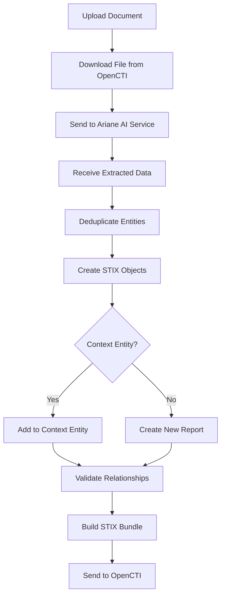

# OpenCTI Import Document AI Connector (Powered by Ariane)

| Status            | Date       | Comment |
|-------------------|------------|---------|
| Filigran Verified | -          | -       |

## Table of Contents

- [OpenCTI Import Document AI Connector](#opencti-import-document-ai-connector-powered-by-ariane)
  - [Introduction](#introduction)
  - [Installation](#installation)
    - [Requirements](#requirements)
  - [Configuration variables](#configuration-variables)
    - [OpenCTI environment variables](#opencti-environment-variables)
    - [Base connector environment variables](#base-connector-environment-variables)
    - [Connector extra parameters environment variables](#connector-extra-parameters-environment-variables)
  - [Deployment](#deployment)
    - [Docker Deployment](#docker-deployment)
    - [Manual Deployment](#manual-deployment)
  - [Usage](#usage)
  - [Behavior](#behavior)
    - [Processing workflow](#processing-workflow)
    - [Mapping to OpenCTI entities](#mapping-to-opencti-entities)
    - [Contextual import relationships](#contextual-import-relationships)
    - [Extractable entities](#extractable-entities)
    - [Extractable observables](#extractable-observables)
    - [Extractable relationships](#extractable-relationships)
  - [Supported formats](#supported-formats)
  - [Debugging](#debugging)
  - [Development](#development)
  - [Additional information](#additional-information)

## Introduction

This connector allows **Enterprise Edition** organizations to extract threat intelligence from documents using **AI-powered extraction** via Filigran's Ariane ML service. It offers significantly enhanced extraction capabilities compared to the standard Import Document connector.

**Key advantages over Import Document connector:**
- AI/ML-based entity recognition (not regex-based)
- Automatic relationship prediction between extracted entities
- Enhanced entity type extraction (Malware, Intrusion Set, Countries, Individuals, Organizations, Sectors, Channels)
- Better context understanding and accuracy

> ⚠️ **Enterprise Edition Required**: This connector requires a valid Filigran Enterprise Edition license certificate (`licence_key_pem`).

## Installation

### Requirements

- OpenCTI Platform >= 6.6.0
- Filigran Enterprise Edition license certificate (PEM format)
- Network access to the Ariane web service (`https://importdoc.ariane.filigran.io`)

## Configuration variables

There are a number of configuration options, which are set either in `docker-compose.yml` (for Docker) or in `config.yml` (for manual deployment).

### OpenCTI environment variables

Below are the parameters you'll need to set for OpenCTI:

| Parameter     | config.yml `opencti` | Docker environment variable | Default | Mandatory | Description                                          |
|---------------|----------------------|-----------------------------|---------|-----------|------------------------------------------------------|
| OpenCTI URL   | `url`                | `OPENCTI_URL`               | /       | Yes       | The URL of the OpenCTI platform.                     |
| OpenCTI Token | `token`              | `OPENCTI_TOKEN`             | /       | Yes       | The default admin token set in the OpenCTI platform. |

| Parameter                        | Docker envvar                           | Default                                | Mandatory | Description                                                                                   |
|----------------------------------|-----------------------------------------|----------------------------------------|-----------|-----------------------------------------------------------------------------------------------|
| `opencti.url`                    | `OPENCTI_URL`                           |                                        | Yes       | The URL of the OpenCTI platform.                                                              |
| `opencti.token`                  | `OPENCTI_TOKEN`                         |                                        | Yes       | The default admin token configured in the OpenCTI platform parameters file.                   |
| `connector.id`                   | `CONNECTOR_ID`                          |                                        | Yes       | A valid arbitrary `UUIDv4` that must be unique for this connector.                            |
| `connector.name`                 | `CONNECTOR_NAME`                        |                                        | Yes       | Option `ImportDocumentAI`                                                                     |
| `connector.auto`                 | `CONNECTOR_AUTO`                        | `false`                                | No        | Enable/disable auto import of report file                                                     |
| `connector.scope`                | `CONNECTOR_SCOPE`                       |                                        | Yes       | Supported file types: `'application/pdf','text/plain','text/html','text/markdown'`            |
| `connector.log_level`            | `CONNECTOR_LOG_LEVEL`                   | error                                  | No        | The log level for this connector, could be `debug`, `info`, `warn` or `error` (less verbose). |
| `import_document_ai_create_indicator` | `IMPORT_DOCUMENT_AI_CREATE_INDICATOR`      | `false`                                | No        | Create an indicator for each extracted observable                                             |
| `import_document_ai.api_base_url`      | `IMPORT_DOCUMENT_AI_API_BASE_URL`             | `https://importdoc.ariane.filigran.io` | No        | The URL of the extraction service running the AI model                                      |
| `import_document_ai.api_key`      | `IMPORT_DOCUMENT_AI_API_KEY`             |                                        | Yes       | The license certificate in a PEM format (provided by Filigran to Enterprise Edition users)    |
| `import_document_ai.include_relationships` | `IMPORT_DOCUMENT_AI_INCLUDE_RELATIONSHIPS` | `true` | No | Whether to include relationships in the imported bundle. If set to `false`, relationships will be removed from the bundle and any references to them in container objects will also be removed. |

Below are the parameters you'll need to set for running the connector properly:

| Parameter                | config.yml `connector`   | Docker environment variable        | Default                                        | Mandatory | Description                                                                              |
|--------------------------|--------------------------|------------------------------------|------------------------------------------------|-----------|------------------------------------------------------------------------------------------|
| Connector ID             | `id`                     | `CONNECTOR_ID`                     | /                                              | Yes       | A unique `UUIDv4` identifier for this connector instance.                                |
| Connector Name           | `name`                   | `CONNECTOR_NAME`                   | ImportDocumentAI                               | No        | Name of the connector.                                                                   |
| Connector Scope          | `scope`                  | `CONNECTOR_SCOPE`                  | application/pdf,text/plain,text/html,text/markdown | Yes   | Comma-separated list of supported MIME types.                                            |
| Connector Auto           | `auto`                   | `CONNECTOR_AUTO`                   | false                                          | No        | Enable/disable automatic import of files matching the scope.                             |
| Validate Before Import   | `validate_before_import` | `CONNECTOR_VALIDATE_BEFORE_IMPORT` | false                                          | No        | If enabled, bundles are sent for validation before import.                               |
| Log Level                | `log_level`              | `CONNECTOR_LOG_LEVEL`              | info                                           | No        | Determines the verbosity of the logs. Options are `debug`, `info`, `warn`, or `error`.   |
| Web Service URL          | `web_service_url`        | `CONNECTOR_WEB_SERVICE_URL`        | https://importdoc.ariane.filigran.io           | No        | The URL of the Ariane extraction service running the AI model.                           |
| License Key PEM          | `licence_key_pem`        | `CONNECTOR_LICENCE_KEY_PEM`        | /                                              | Yes       | The Enterprise Edition license certificate in PEM format (provided by Filigran).         |

### Connector extra parameters environment variables

Below are the parameters you'll need to set for the Import Document AI connector:

| Parameter              | config.yml `import_document` | Docker environment variable             | Default | Mandatory | Description                                                                                |
|------------------------|------------------------------|-----------------------------------------|---------|-----------|--------------------------------------------------------------------------------------------|
| Create Indicator       | `create_indicator`           | `IMPORT_DOCUMENT_CREATE_INDICATOR`      | false   | No        | If `true`, creates an Indicator for each extracted observable.                             |
| Include Relationships  | `include_relationships`      | `IMPORT_DOCUMENT_INCLUDE_RELATIONSHIPS` | true    | No        | If `false`, removes all ML-predicted relationships from the imported bundle.               |

## Deployment

### Docker Deployment

Before building the Docker container, you need to set the version of pycti in `requirements.txt` equal to whatever version of OpenCTI you're running. Example, `pycti==6.6.0`. If you don't, it will take the latest version, but sometimes the OpenCTI SDK fails to initialize.

Build a Docker Image using the provided `Dockerfile`.

Example:

```shell
# Replace the IMAGE NAME with the appropriate value
docker build . -t [IMAGE NAME]:latest
```

Make sure to replace the environment variables in `docker-compose.yml` with the appropriate configurations for your environment. Then, start the docker container with the provided `docker-compose.yml`.

```shell
docker compose up -d
# -d for detached
```

### Manual Deployment

Create a file `config.yml` based on the provided `config.yml.sample`.

Replace the configuration variables (especially the "**ChangeMe**" variables) with the appropriate configurations for your environment.

Install the required python dependencies (preferably in a virtual environment):

```shell
pip3 install -r requirements.txt
```

Then, start the connector from the `src` directory:

```shell
python3 main.py
```

## Usage

This is an **Internal Import File** connector. It processes files uploaded to OpenCTI rather than fetching data from external sources.

To use this connector:

1. Navigate to **Data** → **Import** in the OpenCTI platform
2. Upload a document file (PDF, TXT, HTML, or MD)
3. Select this connector to process the file
4. Optionally, select an entity to associate the extracted data with (contextual import)

The connector will:
- Send the document to the Ariane AI service for extraction
- Receive extracted entities, observables, and predicted relationships
- Validate relationships against OpenCTI's schema
- Create a STIX bundle and import it into OpenCTI

## Behavior

### Processing workflow



### Mapping to OpenCTI entities

```mermaid
graph LR
    subgraph "Document"
        direction TB
        Document[PDF / TXT / HTML / MD]
    end

    subgraph "Ariane AI Service"
        direction TB
        MLModel[ML Extraction Model]
        EntityExtractor[Entity Extractor]
        RelationPredictor[Relationship Predictor]
    end

    subgraph OpenCTI
        direction TB
        subgraph "STIX Domain Objects"
            OpenCTIReport[Report]
            OpenCTIMalware[Malware]
            OpenCTIIntrusionSet[Intrusion Set]
            OpenCTILocation[Country / Region]
            OpenCTIIdentity[Individual / Organization / Sector]
            OpenCTIAttackPattern[Attack Pattern]
            OpenCTIVulnerability[Vulnerability]
            OpenCTIChannel[Channel]
        end
        subgraph "STIX Cyber Observables"
            OpenCTIObservable[IP / Domain / URL / Hash / etc.]
        end
        subgraph "Relationships"
            OpenCTIRelationship[uses / targets / exploits / etc.]
        end
    end

    Document --> MLModel
    MLModel --> EntityExtractor & RelationPredictor
    EntityExtractor ==> OpenCTIMalware & OpenCTIIntrusionSet & OpenCTILocation & OpenCTIIdentity & OpenCTIAttackPattern & OpenCTIVulnerability & OpenCTIChannel & OpenCTIObservable
    RelationPredictor ==> OpenCTIRelationship
    OpenCTIReport -.->|"object_refs"| OpenCTIMalware & OpenCTIIntrusionSet & OpenCTIObservable
```

### Contextual import relationships

When importing into an existing entity, the connector creates different relationships based on the entity type:

| Context Entity Type | Extracted Element | Action |
|---------------------|-------------------|--------|
| **Containers** (Report, Grouping, Case-Incident, Case-RFI, Case-RFT, Note, Opinion) | All | Added to `object_refs` |
| **Observed Data** | Observables only | Added to `object_refs` |
| **Incident** | Intrusion Set | `attributed-to` relationship |
| **Incident** | Vulnerability | `targets` relationship |
| **Incident** | Attack Pattern | `uses` relationship |
| **Incident** | Observables | `related-to` relationship |
| **Threat Actor** | Vulnerability | `targets` relationship |
| **Threat Actor** | Attack Pattern | `uses` relationship |
| **Other entities** | Observables | `related-to` relationship |
| **No entity selected** | All | Creates new Report containing all extracted data |

### Extractable entities

The AI model can extract the following entity types:

| Entity Type | Example | STIX Type | Notes |
|-------------|---------|-----------|-------|
| Attack Pattern | T1234.001 | `attack-pattern` | MITRE ATT&CK techniques; existing ones are reused |
| Country | France | `location` | x_opencti_location_type = "Country" |
| Region | Europe | `location` | x_opencti_location_type = "Region" |
| Individual | John Doe | `identity` | identity_class = "individual" |
| Organization | Microsoft | `identity` | identity_class = "organization" |
| Sector | Financial Services | `identity` | identity_class = "class" |
| Intrusion Set | APT29 | `intrusion-set` | |
| Malware | BadPatch | `malware` | |
| Vulnerability | CVE-2020-0688 | `vulnerability` | |
| Channel | Twitter | `x-opencti-channel` | Custom Filigran entity |
| Tool | cmd.exe | `tool` | |

### Extractable observables

| Observable Type | STIX Field | Supported | Notes |
|-----------------|------------|-----------|-------|
| Autonomous System | `AutonomousSystem.number` | ✅ | |
| Domain Name | `DomainName.value` | ✅ | |
| Email Address | `EmailAddress.value` | ✅ | |
| File (name) | `File.name` | ⚠️ | Partial |
| File (MD5) | `File.hashes.MD5` | ✅ | |
| File (SHA-1) | `File.hashes.SHA-1` | ✅ | |
| File (SHA-256) | `File.hashes.SHA-256` | ✅ | |
| IPv4 Address | `IPv4Address.value` | ✅ | |
| IPv6 Address | `IPv6Address.value` | ✅ | |
| MAC Address | `MACAddress.value` | ✅ | |
| URL | `URL.value` | ✅ | |
| Windows Registry Key | `WindowsRegistryKey.key` | ⚠️ | Partial |

✅ = Fully implemented | ⚠️ = Partially implemented

### Extractable relationships

The AI model predicts relationships between extracted entities. These are validated against OpenCTI's relationship schema before import.

<details>
<summary><strong>Uses</strong></summary>

- Attack-Pattern → Malware
- Malware → Attack-Pattern
- Intrusion-Set → Malware
- Intrusion-Set → Attack-Pattern
- Channel → Malware
- Channel → Intrusion-Set
- Channel → Attack-Pattern

</details>

<details>
<summary><strong>Targets</strong></summary>

- Attack-Pattern → Country, Region, Individual, Organization, Sector, Vulnerability
- Channel → Country, Region, Individual, Organization, Sector, Vulnerability
- Malware → Organization, Country, Region, Sector, Individual
- Intrusion-Set → Organization, Country, Region, Sector, Individual, Vulnerability

</details>

<details>
<summary><strong>Exploits</strong></summary>

- Malware → Vulnerability

</details>

<details>
<summary><strong>Originates-from</strong></summary>

- Intrusion-Set → Country, Region
- Malware → Country, Region

</details>

<details>
<summary><strong>Located-at</strong></summary>

- Sector → Country, Region
- Individual → Country, Region
- Organization → Country, Region
- IPv4-Addr → Country, Region
- IPv6-Addr → Country, Region

</details>

> **Note**: When `include_relationships` is set to `false`, all ML-predicted relationships are removed from the bundle before import.

## Supported formats

| File Type | MIME Type | Supported |
|-----------|-----------|-----------|
| PDF | `application/pdf` | ✅ |
| Plain Text | `text/plain` | ✅ |
| HTML | `text/html` | ✅ |
| Markdown | `text/markdown` | ✅ |

## Debugging

The connector can be debugged by setting the appropriate log level. Set `CONNECTOR_LOG_LEVEL=debug` for verbose logging.

<details>
<summary>Example debug output</summary>

```json
{"timestamp": "2025-02-21T15:37:26.999378Z", "level": "INFO", "name": "ImportDocumentAI", "message": "Processing new message"}
{"timestamp": "2025-02-21T15:37:32.028339Z", "level": "DEBUG", "name": "ImportDocumentAI", "message": "Results: [{'type': 'entity', 'category': 'Intrusion-Set', 'original_start': 4405, 'original_end': 4413, 'range': [4405, 4413], 'match': 'Andariel'}, {'type': 'entity', 'category': 'Malware', 'original_start': 4421, 'original_end': 4431, 'range': [4421, 4431], 'match': 'SmallTiger'}, {'type': 'observable', 'category': 'IPv4-Addr.value', 'original_start': 3044, 'original_end': 3056, 'range': [3044, 3056], 'match': '20.20.100.32'}]"}
{"timestamp": "2025-02-21T15:37:32.192447Z", "level": "INFO", "name": "ImportDocumentAI", "message": "Message processed, thread terminated", "attributes": {"tag": 1}}
```

</details>

## Development

A dedicated development environment is available in the [dev directory](./dev/README.md) for testing with a fake REST server.

## Additional information

- **Enterprise Edition**: This connector requires a valid Filigran Enterprise Edition license certificate.
- **Deduplication**: The connector automatically deduplicates extracted entities by (label, text, type) - first occurrence wins.
- **Relationship validation**: All ML-predicted relationships are validated against OpenCTI's `schemaRelationsTypesMapping` before import. Invalid relationships are logged and skipped.
- **Attack Pattern reuse**: Existing Attack Patterns are reused when found by `x_mitre_id` or `name`; new ones are created only if not found.
- **Global imports**: When importing via `import/global`, the original file is attached to the created Report as `x_opencti_files`.
- **Deterministic IDs**: STIX objects use deterministic ID generation (e.g., `Malware.generate_id(name)`) to ensure idempotent imports.

*Reference: [STIX 2.1 Specification](https://docs.oasis-open.org/cti/stix/v2.1/cs01/stix-v2.1-cs01.html)*
