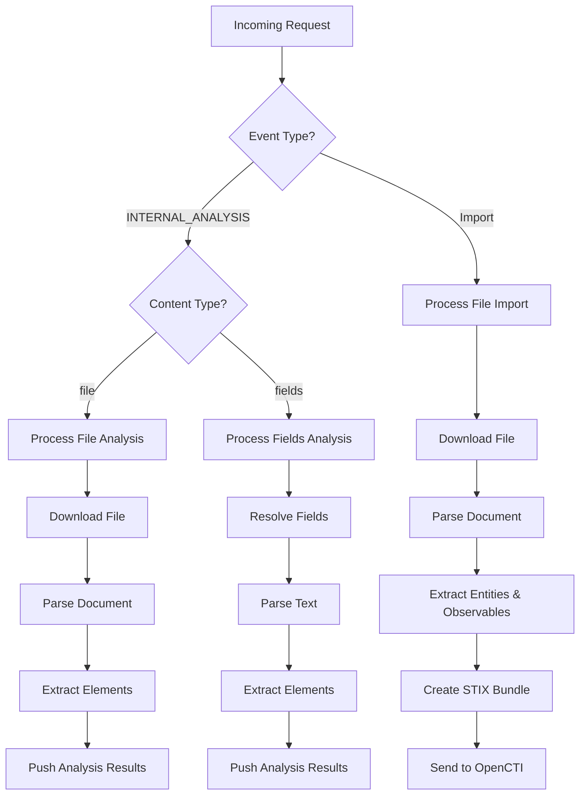

# OpenCTI Import Document Connector

| Status            | Date | Comment |
|-------------------|------|---------|
| Filigran Verified | -    | -       |

## Table of Contents

- [OpenCTI Import Document Connector](#opencti-import-document-connector)
  - [Introduction](#introduction)
  - [Installation](#installation)
    - [Requirements](#requirements)
  - [Configuration variables](#configuration-variables)
    - [OpenCTI environment variables](#opencti-environment-variables)
    - [Base connector environment variables](#base-connector-environment-variables)
    - [Connector extra parameters environment variables](#connector-extra-parameters-environment-variables)
  - [Deployment](#deployment)
    - [Docker Deployment](#docker-deployment)
    - [Manual Deployment](#manual-deployment)
  - [Usage](#usage)
  - [Behavior](#behavior)
    - [Processing modes](#processing-modes)
    - [Mapping to OpenCTI entities](#mapping-to-opencti-entities)
    - [Contextual import relationships](#contextual-import-relationships)
    - [Extractable entities](#extractable-entities)
    - [Extractable observables](#extractable-observables)
  - [Supported formats](#supported-formats)
  - [Advanced configuration](#advanced-configuration)
    - [Observable configuration](#observable-configuration)
    - [Entity configuration](#entity-configuration)
  - [Debugging](#debugging)
  - [Known issues](#known-issues)
  - [Additional information](#additional-information)

## Introduction

This connector allows organizations to **extract threat intelligence from documents** and feed it into OpenCTI. It parses document files (PDF, TXT, HTML, Markdown, CSV) and extracts:

- **Entities**: Matches text against existing entities in the OpenCTI knowledge base (threat actors, malware, campaigns, etc.)
- **Observables**: Extracts IOCs using regex patterns and the `ioc_finder` library (IP addresses, domains, URLs, hashes, etc.)

The connector can operate in two modes:
1. **File Import**: Parse uploaded files and create/update entities
2. **Internal Analysis**: Analyze files or entity fields and return structured analysis results

## Installation

### Requirements

- OpenCTI Platform >= 5.6.1

## Configuration variables

There are a number of configuration options, which are set either in `docker-compose.yml` (for Docker) or in `config.yml` (for manual deployment).

### OpenCTI environment variables

Below are the parameters you'll need to set for OpenCTI:

| Parameter     | config.yml `opencti` | Docker environment variable | Default | Mandatory | Description                                          |
|---------------|----------------------|-----------------------------|---------|-----------|------------------------------------------------------|
| OpenCTI URL   | `url`                | `OPENCTI_URL`               | /       | Yes       | The URL of the OpenCTI platform.                     |
| OpenCTI Token | `token`              | `OPENCTI_TOKEN`             | /       | Yes       | The default admin token set in the OpenCTI platform. |

### Base connector environment variables

Below are the parameters you'll need to set for running the connector properly:

| Parameter                | config.yml `connector`   | Docker environment variable        | Default                                             | Mandatory | Description                                                                              |
|--------------------------|--------------------------|------------------------------------|-----------------------------------------------------|-----------|------------------------------------------------------------------------------------------|
| Connector ID             | `id`                     | `CONNECTOR_ID`                     | /                                                   | Yes       | A unique `UUIDv4` identifier for this connector instance.                                |
| Connector Name           | `name`                   | `CONNECTOR_NAME`                   | ImportDocument                                      | No        | Name of the connector.                                                                   |
| Connector Scope          | `scope`                  | `CONNECTOR_SCOPE`                  | application/pdf,text/plain,text/html,text/markdown  | Yes       | Comma-separated list of supported MIME types.                                            |
| Connector Auto           | `auto`                   | `CONNECTOR_AUTO`                   | false                                               | No        | Enable/disable automatic import of files matching the scope.                             |
| Connector Only Contextual| `only_contextual`        | `CONNECTOR_ONLY_CONTEXTUAL`        | false                                               | No        | If `true`, only extract data when an entity context is provided.                         |
| Validate Before Import   | `validate_before_import` | `CONNECTOR_VALIDATE_BEFORE_IMPORT` | false                                               | No        | If enabled, bundles are sent for validation before import.                               |
| Log Level                | `log_level`              | `CONNECTOR_LOG_LEVEL`              | info                                                | No        | Determines the verbosity of the logs. Options are `debug`, `info`, `warn`, or `error`.   |

### Connector extra parameters environment variables

Below are the parameters you'll need to set for the Import Document connector:

| Parameter        | config.yml `import_document` | Docker environment variable       | Default | Mandatory | Description                                                    |
|------------------|------------------------------|-----------------------------------|---------|-----------|----------------------------------------------------------------|
| Create Indicator | `create_indicator`           | `IMPORT_DOCUMENT_CREATE_INDICATOR`| false   | No        | If `true`, creates an Indicator for each extracted observable. |

## Deployment

### Docker Deployment

Before building the Docker container, you need to set the version of pycti in `requirements.txt` equal to whatever version of OpenCTI you're running. Example, `pycti==5.6.1`. If you don't, it will take the latest version, but sometimes the OpenCTI SDK fails to initialize.

Build a Docker Image using the provided `Dockerfile`.

Example:

```shell
# Replace the IMAGE NAME with the appropriate value
docker build . -t [IMAGE NAME]:latest
```

Make sure to replace the environment variables in `docker-compose.yml` with the appropriate configurations for your environment. Then, start the docker container with the provided `docker-compose.yml`.

```shell
docker compose up -d
# -d for detached
```

### Manual Deployment

Create a file `config.yml` based on the provided `config.yml.sample`.

Replace the configuration variables (especially the "**ChangeMe**" variables) with the appropriate configurations for your environment.

Install the required python dependencies (preferably in a virtual environment):

```shell
pip3 install -r requirements.txt
```

Then, start the connector from the `src` directory:

```shell
python3 main.py
```

## Usage

This is an **Internal Import File** connector. It processes files uploaded to OpenCTI rather than fetching data from external sources.

To use this connector:

1. Navigate to **Data** → **Import** in the OpenCTI platform
2. Upload a document file (PDF, TXT, HTML, MD, or CSV)
3. Select this connector to process the file
4. Optionally, select an entity to associate the extracted data with (contextual import)

The connector will parse the document, extract entities and observables, and import them into OpenCTI.

## Behavior

### Processing modes

The connector supports two processing modes:



### Mapping to OpenCTI entities

```mermaid
graph LR
    subgraph "Document"
        direction TB
        Document[PDF / TXT / HTML / MD / CSV]
        TextContent[Text Content]
    end

    subgraph "Extraction"
        direction TB
        EntityMatcher[Entity Matcher<br/>OpenCTI Knowledge Base]
        ObservableMatcher[Observable Matcher<br/>Regex + ioc_finder]
    end

    subgraph OpenCTI
        direction TB
        subgraph "STIX Domain Objects"
            OpenCTIReport[Report]
            OpenCTIEntity[Matched Entities<br/>Threat Actor, Malware, etc.]
        end
        subgraph "STIX Cyber Observables"
            OpenCTIObservable[Observables<br/>IP, Domain, URL, Hash, etc.]
        end
        subgraph "Relationships"
            OpenCTIRelationship[Relationships]
        end
    end

    Document --> TextContent
    TextContent --> EntityMatcher & ObservableMatcher
    EntityMatcher ==> OpenCTIEntity
    ObservableMatcher ==> OpenCTIObservable
    OpenCTIReport -.->|"object_refs"| OpenCTIEntity & OpenCTIObservable
    OpenCTIRelationship -.-> OpenCTIEntity & OpenCTIObservable
```

### Contextual import relationships

When importing into an existing entity, the connector creates different relationships based on the entity type:

| Context Entity Type | Extracted Element | Relationship Type | Direction |
|---------------------|-------------------|-------------------|-----------|
| **Containers** (Report, Grouping, Case-Incident, Case-RFI, Case-RFT, Note, Opinion) | All | Added to `object_refs` | - |
| **Observed Data** | Observables only | Added to `object_refs` | - |
| **Incident** | Threat Actor, Intrusion Set, Campaign | `attributed-to` | Incident → Threat |
| **Incident** | Vulnerability | `targets` | Incident → Vulnerability |
| **Incident** | Attack Pattern | `uses` | Incident → Attack Pattern |
| **Incident** | Observables | `related-to` | Observable → Incident |
| **Threat Actor** | Vulnerability | `targets` | Threat Actor → Vulnerability |
| **Threat Actor** | Attack Pattern | `uses` | Threat Actor → Attack Pattern |
| **Threat Actor** | Observables | `related-to` | Observable → Threat Actor |
| **Other entities** | Observables | `related-to` | Observable → Entity |
| **No entity selected** | All | Creates new Report | Report contains all |

### Extractable entities

Entities are matched against the OpenCTI knowledge base using name and aliases:

| Entity Type | Matching Fields | Example | Notes |
|-------------|-----------------|---------|-------|
| Attack Pattern | `x_mitre_id` | T1234.001 | Requires MITRE connector |
| Campaign | `name`, `aliases` | Solarwinds Campaign | Based on OpenCTI entries |
| Country | `name`, `aliases` | France | Based on OpenCTI entries |
| Incident | `name`, `aliases` | - | Based on OpenCTI entries |
| Intrusion Set | `name`, `aliases` | APT29 | Based on OpenCTI entries |
| Malware | `name`, `aliases` | BadPatch | Based on OpenCTI entries |
| Organization | `name`, `aliases` | Microsoft | Based on OpenCTI entries |
| Threat Actor | `name`, `aliases` | GRU | Based on OpenCTI entries |
| Tool | `name`, `aliases` | cmd.exe | Linux tool `at` excluded (false positives) |
| Vulnerability | `name` | CVE-2020-0688 | Requires CVE connector |

### Extractable observables

Observables are extracted using regex patterns and the `ioc_finder` library:

| Observable Type | STIX Field | Supported | Notes   |
|-----------------|------------|-----------|---------|
| Autonomous System | `AutonomousSystem.number` | ✅ |         |
| Domain Name | `DomainName.value` | ✅ |         |
| Email Address | `Email-Addr.value` | ✅ |         |
| Phone Number | Phone-Number.value | ✅ |         |
| IMEI | IMEI.value | ✅ |         |
| ICCID | ICCID.value | ✅ |         |
| IMSI | IMSI.value | ✅ |         |
| File (name) | `File.name` | ⚠️ | Partial |
| File (MD5) | `File.hashes.MD5` | ✅ |         |
| File (SHA-1) | `File.hashes.SHA-1` | ✅ |         |
| File (SHA-256) | `File.hashes.SHA-256` | ✅ |         |
| IPv4 Address | `IPv4-Addr.value` | ✅ |         |
| IPv6 Address | `IPv6-Addr.value` | ✅ |         |
| MAC Address | `Mac-Addr.value` | ✅ |         |
| URL | `Url.value` | ✅ |         |
| Windows Registry Key | `WindowsRegistryKey.key` | ⚠️ | Partial |

✅ = Fully implemented | ⚠️ = Partially implemented

## Supported formats

| File Type | MIME Type | Parser |
|-----------|-----------|--------|
| PDF | `application/pdf` | pdfminer |
| Plain Text | `text/plain` | Direct text |
| HTML | `text/html` | BeautifulSoup |
| Markdown | `text/markdown` | Direct text |
| CSV | `text/csv` | Direct text |

## Advanced configuration

The connector uses INI configuration files located in `src/reportimporter/config/` for customizing extraction behavior.

### Observable configuration

File: `observable_config.ini`

```ini
[Observable_Name]
# Detection method: 'library' (uses ioc_finder) or 'custom_regex'
detection_option = library

# If 'custom_regex', define patterns:
regex_patterns =
  \bpattern1\b
  \bpattern2\b

# If 'library', define ioc_finder function:
iocfinder_function = parse_urls

# STIX target field for the extracted value
stix_target = Url.value

# (Optional) Filter list files from 'filter_list' directory
filter_config =
    filter_list_Domain
```

### Entity configuration

File: `entity_config.ini`

```ini
[Entity_Name]
# OpenCTI API class for querying
stix_class = location

# (Optional) Filter for API queries
filter = {"key": "entity_type", "values": ["Country"]}

# Fields to use for text matching
fields =
    name
    aliases

# (Optional) Skip entity match if found within these observable types
# Prevents false positives like matching "Microsoft" in a phishing domain
omit_match_in =
    Domain-Name.value
```

## Debugging

The connector can be debugged by setting the appropriate log level. Set `CONNECTOR_LOG_LEVEL=debug` for verbose logging.

Example debug output:

```
INFO:root:Parsing report Test.pdf application/pdf
DEBUG:root:Observable match: 1322
DEBUG:root:Observable match: T1011.001
DEBUG:root:Text: 'This group used T1011.001...' -> extracts {1322: {'type': 'observable', 'category': 'Autonomous-System.number', 'match': 1322, 'range': (145, 149)}, ...}
DEBUG:root:Entity match: 'cmd.exe' of regex: '[...]'
DEBUG:root:Value cmd.exe is also matched by entity tool
```

## Known issues

### Saved webpage as PDF

The connector can have issues parsing a PDF created from a webpage using "Microsoft Print to PDF". Please use the "Save as PDF" action instead to mitigate parsing issues.


### Pre-requisites for entity matching

- **Attack Patterns**: Requires the MITRE connector to be activated for matching ATT&CK technique IDs
- **Vulnerabilities**: Requires the CVE connector to be activated for matching CVE identifiers

## Additional information

- The connector uses the `ioc_finder` library for intelligent IOC extraction with built-in defanging support
- Text is automatically defanged using `ioc_finder.prepare_text()` before parsing
- Entity matching takes priority over observable matching when the same text matches both
- The `omit_match_in` configuration prevents false positive entity matches within URLs/domains
- When no context entity is selected, a new Report is automatically created containing all extracted data
- Global imports (via `import/global`) will attach the original file to the created Report

*Reference: [STIX 2.1 Specification](https://docs.oasis-open.org/cti/stix/v2.1/cs01/stix-v2.1-cs01.html)*
