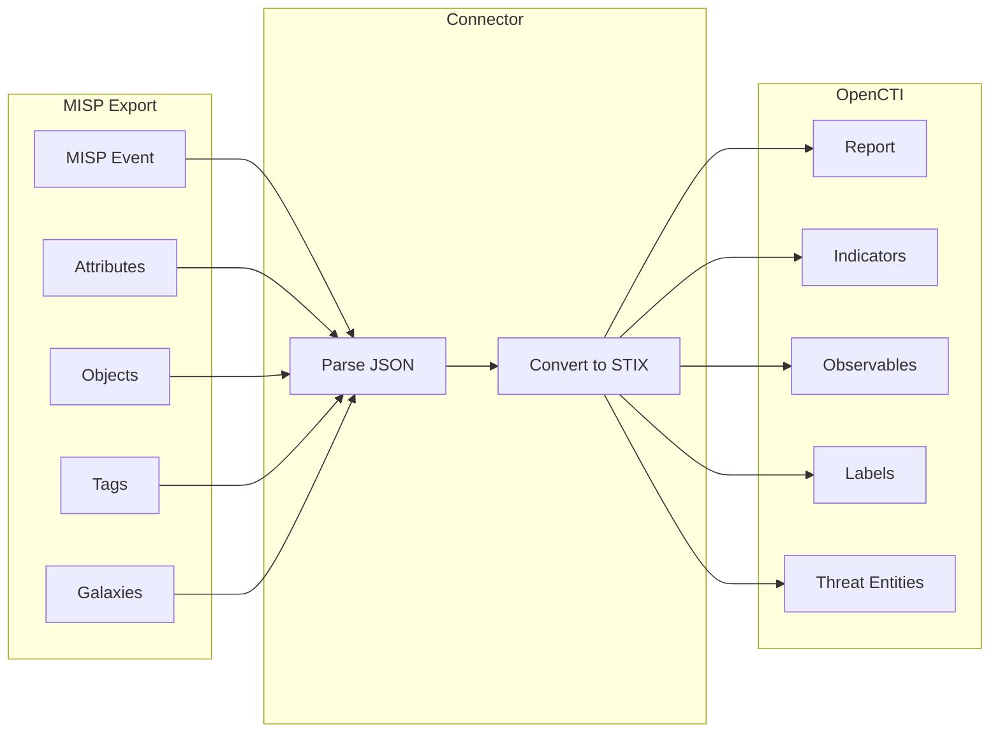

# OpenCTI Import File MISP Connector

The Import File MISP connector enables importing MISP JSON event files into OpenCTI, converting MISP events, attributes, and objects to STIX 2.1 entities.

| Status            | Date | Comment |
|-------------------|------|---------|
| Filigran Verified | -    | -       |

## Table of Contents

- [OpenCTI Import File MISP Connector](#opencti-import-file-misp-connector)
  - [Table of Contents](#table-of-contents)
  - [Introduction](#introduction)
  - [Installation](#installation)
    - [Requirements](#requirements)
  - [Configuration variables](#configuration-variables)
    - [OpenCTI environment variables](#opencti-environment-variables)
    - [Base connector environment variables](#base-connector-environment-variables)
    - [Connector extra parameters environment variables](#connector-extra-parameters-environment-variables)
  - [Deployment](#deployment)
    - [Docker Deployment](#docker-deployment)
    - [Manual Deployment](#manual-deployment)
  - [Usage](#usage)
  - [Behavior](#behavior)
  - [Debugging](#debugging)
  - [Additional information](#additional-information)

## Introduction

The Import File MISP connector is an internal import connector that parses MISP (Malware Information Sharing Platform) JSON export files and converts them to STIX 2.1 entities for import into OpenCTI. The connector supports:

- Converting MISP events to OpenCTI Reports
- Creating Indicators and Observables from MISP attributes
- Mapping MISP objects to STIX observables
- Preserving MISP tags as labels
- Threat guessing from MISP tags (when enabled)
- Galaxy cluster mapping to STIX entities

This connector enables organizations to import threat intelligence from MISP instances without requiring a direct connection.

## Installation

### Requirements

- OpenCTI Platform >= 6.3.0

## Configuration variables

There are a number of configuration options, which are set either in `docker-compose.yml` (for Docker) or in `config.yml` (for manual deployment).

### OpenCTI environment variables

| Parameter     | config.yml | Docker environment variable | Mandatory | Description                                          |
|---------------|------------|-----------------------------|-----------|------------------------------------------------------|
| OpenCTI URL   | url        | `OPENCTI_URL`               | Yes       | The URL of the OpenCTI platform.                     |
| OpenCTI Token | token      | `OPENCTI_TOKEN`             | Yes       | The default admin token set in the OpenCTI platform. |

### Base connector environment variables

| Parameter        | config.yml | Docker environment variable | Default          | Mandatory | Description                                                                 |
|------------------|------------|-----------------------------|------------------|-----------|-----------------------------------------------------------------------------|
| Connector ID     | id         | `CONNECTOR_ID`              |                  | Yes       | A unique `UUIDv4` identifier for this connector instance.                   |
| Connector Name   | name       | `CONNECTOR_NAME`            | ImportFileMISP   | No        | Name of the connector.                                                      |
| Connector Scope  | scope      | `CONNECTOR_SCOPE`           | application/json | Yes       | Supported MIME type (JSON for MISP exports).                                |
| Log Level        | log_level  | `CONNECTOR_LOG_LEVEL`       | info             | No        | Determines the verbosity of the logs: `debug`, `info`, `warn`, or `error`.  |

### Connector extra parameters environment variables

| Parameter                                   | config.yml                                         | Docker environment variable                              | Default    | Mandatory | Description                                                                     |
|---------------------------------------------|---------------------------------------------------|----------------------------------------------------------|------------|-----------|---------------------------------------------------------------------------------|
| Create Reports                              | misp_import_file.create_reports                   | `MISP_IMPORT_FILE_CREATE_REPORTS`                        | true       | No        | Create a Report entity for each MISP event.                                     |
| Report Type                                 | misp_import_file.report_type                      | `MISP_IMPORT_FILE_REPORT_TYPE`                           | misp-event | No        | Report type to use for imported events.                                         |
| Create Indicators                           | misp_import_file.create_indicators                | `MISP_IMPORT_FILE_CREATE_INDICATORS`                     | true       | No        | Create Indicator entities from MISP attributes.                                 |
| Create Observables                          | misp_import_file.create_observables               | `MISP_IMPORT_FILE_CREATE_OBSERVABLES`                    | true       | No        | Create Observable entities from MISP attributes.                                |
| Create Object Observables                   | misp_import_file.create_object_observables        | `MISP_IMPORT_FILE_CREATE_OBJECT_OBSERVABLES`             | true       | No        | Create observables from MISP objects.                                           |
| Create Tags as Labels                       | misp_import_file.create_tags_as_labels            | `MISP_IMPORT_FILE_CREATE_TAGS_AS_LABELS`                 | true       | No        | Convert MISP tags to OpenCTI labels.                                            |
| Guess Threats from Tags                     | misp_import_file.guess_threats_from_tags          | `MISP_IMPORT_FILE_GUESS_THREATS_FROM_TAGS`               | false      | No        | Attempt to identify threats (malware, intrusion sets, etc.) from MISP tags.     |
| Author from Tags                            | misp_import_file.author_from_tags                 | `MISP_IMPORT_FILE_AUTHOR_FROM_TAGS`                      | false      | No        | Map creator:XX=YY tags to set report author.                                    |
| Import to_ids=no Score                      | misp_import_file.import_to_ids_no_score           | `MISP_IMPORT_FILE_IMPORT_TO_IDS_NO_SCORE`                | 40         | No        | Score to assign when attribute `to_ids` is false.                               |
| Import Unsupported as Text                  | misp_import_file.import_unsupported_observables_as_text | `MISP_IMPORT_FILE_IMPORT_UNSUPPORTED_OBSERVABLES_AS_TEXT` | false  | No        | Import unsupported observable types as Text observables.                        |
| Import Unsupported as Text Transparent      | misp_import_file.import_unsupported_observables_as_text_transparent | `MISP_IMPORT_FILE_IMPORT_UNSUPPORTED_OBSERVABLES_AS_TEXT_TRANSPARENT` | true | No | Use only the value for unsupported observables imported as text.                |
| Import with Attachments                     | misp_import_file.import_with_attachments          | `MISP_IMPORT_FILE_IMPORT_WITH_ATTACHMENTS`               | false      | No        | Import PDF attachments from MISP attributes.                                    |

## Deployment

### Docker Deployment

Build the Docker image:

```bash
docker build -t opencti/connector-import-file-misp:latest .
```

Configure the connector in `docker-compose.yml`:

```yaml
  connector-import-file-misp:
    image: opencti/connector-import-file-misp:latest
    environment:
      - OPENCTI_URL=http://localhost
      - OPENCTI_TOKEN=ChangeMe
      - CONNECTOR_ID=ChangeMe
      - CONNECTOR_NAME=ImportFileMISP
      - CONNECTOR_SCOPE=application/json
      - CONNECTOR_LOG_LEVEL=info
      - MISP_IMPORT_FILE_CREATE_REPORTS=true
      - MISP_IMPORT_FILE_REPORT_TYPE=misp-event
      - MISP_IMPORT_FILE_CREATE_INDICATORS=true
      - MISP_IMPORT_FILE_CREATE_OBSERVABLES=true
      - MISP_IMPORT_FILE_CREATE_OBJECT_OBSERVABLES=true
      - MISP_IMPORT_FILE_CREATE_TAGS_AS_LABELS=true
      - MISP_IMPORT_FILE_GUESS_THREATS_FROM_TAGS=false
      - MISP_IMPORT_FILE_AUTHOR_FROM_TAGS=false
      - MISP_IMPORT_FILE_IMPORT_TO_IDS_NO_SCORE=40
      - MISP_IMPORT_FILE_IMPORT_UNSUPPORTED_OBSERVABLES_AS_TEXT=false
      - MISP_IMPORT_FILE_IMPORT_UNSUPPORTED_OBSERVABLES_AS_TEXT_TRANSPARENT=true
      - MISP_IMPORT_FILE_IMPORT_WITH_ATTACHMENTS=false
    restart: always
```

Start the connector:

```bash
docker compose up -d
```

### Manual Deployment

1. Create `config.yml` based on `config.yml.sample`.

2. Install dependencies:

```bash
pip3 install -r requirements.txt
```

3. Start the connector from the `src` directory:

```bash
python3 import-file-misp.py
```

## Usage

The connector is triggered through the OpenCTI file import functionality:

1. Export an event from your MISP instance as JSON
2. Navigate to **Data Management → Data Sharing → Data import**
3. Upload the MISP JSON file
4. The connector will process and import the event

## Behavior

The connector parses MISP JSON exports and creates corresponding STIX 2.1 entities in OpenCTI.

### Data Flow



### Entity Mapping

| MISP Element        | OpenCTI Entity        | Description                                      |
|---------------------|-----------------------|--------------------------------------------------|
| Event               | Report                | MISP event becomes a Report (if enabled)         |
| Attribute (to_ids)  | Indicator             | IDS-flagged attributes become Indicators         |
| Attribute           | Observable            | Attributes become Observables (if enabled)       |
| MISP Object         | Observable            | Objects converted to structured Observables      |
| Tag                 | Label                 | MISP tags become Labels (if enabled)             |
| Galaxy Cluster      | Various               | Mapped to threat entities (Malware, Intrusion Set, etc.) |

### Observable Type Mapping

| MISP Type              | OpenCTI Observable Type |
|------------------------|-------------------------|
| ip-src, ip-dst         | IPv4-Addr / IPv6-Addr   |
| domain                 | Domain-Name             |
| hostname               | Hostname                |
| url, link              | Url                     |
| email-src, email-dst   | Email-Addr              |
| email-subject          | Email-Message           |
| md5, sha1, sha256      | File (hashes)           |
| filename               | File (name)             |
| mutex                  | Mutex                   |
| regkey                 | Windows-Registry-Key    |
| AS                     | Autonomous-System       |
| mac-address            | Mac-Addr                |
| user-agent             | User-Agent              |
| phone-number           | Phone-Number            |

### Processing Details

1. **Event Parsing**: Reads MISP event metadata (info, date, uuid, etc.)
2. **Author Resolution**: Identifies event author (from org or tags)
3. **Report Creation** (if enabled): Creates Report from event
4. **Attribute Processing**:
   - Creates Indicators for `to_ids=true` attributes
   - Creates Observables (if enabled)
   - Handles composite attributes (e.g., `ip|port`)
5. **Object Processing**: Converts MISP objects to structured Observables
6. **Tag Processing**: Converts tags to Labels
7. **Galaxy Processing**: Maps galaxy clusters to threat entities
8. **Relationship Creation**: Links all entities appropriately

### Pattern Types Supported

| Type     | Description                |
|----------|----------------------------|
| yara     | YARA rules                 |
| sigma    | Sigma rules                |
| pcre     | PCRE patterns              |
| snort    | Snort rules                |
| suricata | Suricata rules             |

## Debugging

Enable verbose logging by setting:

```env
CONNECTOR_LOG_LEVEL=debug
```

Log output includes:
- File parsing progress
- Attribute conversion details
- Object processing status
- Entity creation results

### Common Issues

| Issue                    | Solution                                              |
|--------------------------|-------------------------------------------------------|
| Invalid JSON             | Verify MISP export is well-formed JSON                |
| Missing attributes       | Check if attribute types are supported                |
| Tags not imported        | Enable `CREATE_TAGS_AS_LABELS`                        |
| Threats not linked       | Enable `GUESS_THREATS_FROM_TAGS`                      |

## Additional information

- **MISP Export Format**: Use MISP's native JSON export feature
- **Single Event**: Each file should contain one MISP event
- **Event Collections**: For multiple events, import each JSON file separately
- **Galaxy Support**: Galaxy clusters are mapped to corresponding STIX types
- **Composite Attributes**: Handled appropriately (e.g., `filename|md5` creates linked File observable)
- **to_ids Flag**: Determines whether an Indicator is created
- **Scoring**: Attributes with `to_ids=false` receive configurable lower score

