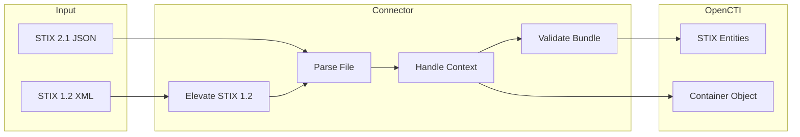

# OpenCTI Import File STIX Connector

The Import File STIX connector enables importing STIX 1.2 and STIX 2.1 JSON files into OpenCTI, supporting contextual imports into containers.

| Status            | Date | Comment |
|-------------------|------|---------|
| Filigran Verified | -    | -       |

## Table of Contents

- [OpenCTI Import File STIX Connector](#opencti-import-file-stix-connector)
  - [Table of Contents](#table-of-contents)
  - [Introduction](#introduction)
  - [Installation](#installation)
    - [Requirements](#requirements)
  - [Configuration variables](#configuration-variables)
    - [OpenCTI environment variables](#opencti-environment-variables)
    - [Base connector environment variables](#base-connector-environment-variables)
  - [Deployment](#deployment)
    - [Docker Deployment](#docker-deployment)
    - [Manual Deployment](#manual-deployment)
  - [Usage](#usage)
  - [Behavior](#behavior)
  - [Debugging](#debugging)
  - [Additional information](#additional-information)

## Introduction

The Import File STIX connector is an internal import connector that parses STIX (Structured Threat Information Expression) files and imports them into OpenCTI. It supports:

- **STIX 2.1 JSON**: Native import of STIX 2.1 bundles
- **STIX 1.2 XML**: Automatic conversion to STIX 2.1 using the stix2-elevator library
- **Contextual import**: Import STIX content directly into containers (Reports, Cases, etc.)
- **Validation**: Optional bundle validation before import

This connector is essential for ingesting threat intelligence from external sources that provide STIX-formatted data.

## Installation

### Requirements

- OpenCTI Platform >= 5.6.1

## Configuration variables

There are a number of configuration options, which are set either in `docker-compose.yml` (for Docker) or in `config.yml` (for manual deployment).

### OpenCTI environment variables

| Parameter     | config.yml | Docker environment variable | Mandatory | Description                                          |
|---------------|------------|-----------------------------|-----------|------------------------------------------------------|
| OpenCTI URL   | url        | `OPENCTI_URL`               | Yes       | The URL of the OpenCTI platform.                     |
| OpenCTI Token | token      | `OPENCTI_TOKEN`             | Yes       | The default admin token set in the OpenCTI platform. |

### Base connector environment variables

| Parameter                | config.yml            | Docker environment variable      | Default                     | Mandatory | Description                                                                  |
|--------------------------|-----------------------|----------------------------------|-----------------------------|-----------|------------------------------------------------------------------------------|
| Connector ID             | id                    | `CONNECTOR_ID`                   |                             | Yes       | A unique `UUIDv4` identifier for this connector instance.                    |
| Connector Name           | name                  | `CONNECTOR_NAME`                 | ImportFileStix              | No        | Name of the connector.                                                       |
| Connector Scope          | scope                 | `CONNECTOR_SCOPE`                | application/json,text/xml   | Yes       | Supported MIME types (JSON for STIX 2.1, XML for STIX 1.2).                  |
| Validate Before Import   | validate_before_import| `CONNECTOR_VALIDATE_BEFORE_IMPORT` | true                     | No        | Validate STIX bundles before importing.                                      |
| Auto Import              | auto                  | `CONNECTOR_AUTO`                 | false                       | No        | Enable automatic import of uploaded STIX files.                              |
| Confidence Level         | confidence_level      | `CONNECTOR_CONFIDENCE_LEVEL`     | 15                          | No        | Default confidence level for imported entities.                              |
| Log Level                | log_level             | `CONNECTOR_LOG_LEVEL`            | info                        | No        | Determines the verbosity of the logs: `debug`, `info`, `warn`, or `error`.   |

## Deployment

### Docker Deployment

Build the Docker image:

```bash
docker build -t opencti/connector-import-file-stix:latest .
```

Configure the connector in `docker-compose.yml`:

```yaml
  connector-import-file-stix:
    image: opencti/connector-import-file-stix:latest
    environment:
      - OPENCTI_URL=http://localhost
      - OPENCTI_TOKEN=ChangeMe
      - CONNECTOR_ID=ChangeMe
      - CONNECTOR_NAME=ImportFileStix
      - CONNECTOR_SCOPE=application/json,text/xml
      - CONNECTOR_VALIDATE_BEFORE_IMPORT=true
      - CONNECTOR_AUTO=false
      - CONNECTOR_CONFIDENCE_LEVEL=15
      - CONNECTOR_LOG_LEVEL=info
    restart: always
```

Start the connector:

```bash
docker compose up -d
```

### Manual Deployment

1. Create `config.yml` based on `config.yml.sample`.

2. Install dependencies:

```bash
pip3 install -r requirements.txt
```

3. Start the connector from the `src` directory:

```bash
python3 import-file-stix.py
```

## Usage

The connector is triggered through the OpenCTI file import functionality:

1. Navigate to **Data Management → Data Sharing → Data import** or to any container entity
2. Upload a STIX file (`.json` for STIX 2.1, `.xml` for STIX 1.2)
3. The connector will process and import the STIX objects

### Import Modes

| Mode       | Description                                                    |
|------------|----------------------------------------------------------------|
| Global     | Import STIX objects into the platform                          |
| Contextual | Import into a specific container (Report, Case, etc.)          |

## Behavior

The connector parses STIX files and creates corresponding entities in OpenCTI.

### Data Flow



### Supported File Types

| MIME Type         | Format     | Description                           |
|-------------------|------------|---------------------------------------|
| application/json  | STIX 2.1   | Native STIX 2.1 JSON bundle           |
| text/xml          | STIX 1.2   | Legacy STIX 1.2 XML (auto-converted)  |

### Processing Details

1. **File Fetch**: Downloads the uploaded file from OpenCTI
2. **Format Detection**: Identifies STIX 1.2 XML vs STIX 2.1 JSON
3. **Elevation** (STIX 1.2 only): Converts STIX 1.2 to STIX 2.1 using stix2-elevator
4. **Contextual Import** (if entity_id provided):
   - Reads the target container
   - Adds imported objects to container's `object_refs`
   - Handles nested containers in the imported file
5. **Validation** (if enabled): Validates bundle before import
6. **Bundle Send**: Sends STIX bundle to OpenCTI for processing

### Container Types Supported for Contextual Import

| Container Type           | STIX Type                    |
|--------------------------|------------------------------|
| Report                   | report                       |
| Grouping                 | grouping                     |
| Observed Data            | observed-data                |
| Case Incident            | x-opencti-case-incident      |
| Case RFI                 | x-opencti-case-rfi           |
| Case RFT                 | x-opencti-case-rft           |
| Task                     | x-opencti-task               |
| Feedback                 | x-opencti-feedback           |

### Contextual Import Logic

- If imported file contains containers: References to those containers are added to the target container
- If imported file has no containers: All objects are added to target container's `object_refs`

## Debugging

Enable verbose logging by setting:

```env
CONNECTOR_LOG_LEVEL=debug
```

Log output includes:
- File fetch details
- STIX version detection
- Elevation status (STIX 1.2)
- Contextual import handling
- Bundle validation results
- Import statistics

### Common Issues

| Issue                    | Solution                                              |
|--------------------------|-------------------------------------------------------|
| Invalid STIX bundle      | Verify JSON/XML is well-formed and STIX-compliant     |
| STIX 1.2 elevation fails | Check stix2-elevator logs for conversion errors       |
| Missing references       | Ensure referenced objects exist in the bundle         |
| Validation errors        | Set `bypass_validation=true` or fix bundle issues     |

## Additional information

- **STIX 2.1 Specification**: https://docs.oasis-open.org/cti/stix/v2.1/stix-v2.1.html
- **STIX 1.2 Support**: Uses stix2-elevator library for automatic conversion
- **File Markings**: Uploaded file markings are applied to imported entities
- **Duplicate Handling**: OpenCTI handles duplicates based on STIX IDs
- **Validation**: Enable validation to catch malformed bundles before import
- **Auto Import**: When enabled, automatically processes uploaded STIX files

