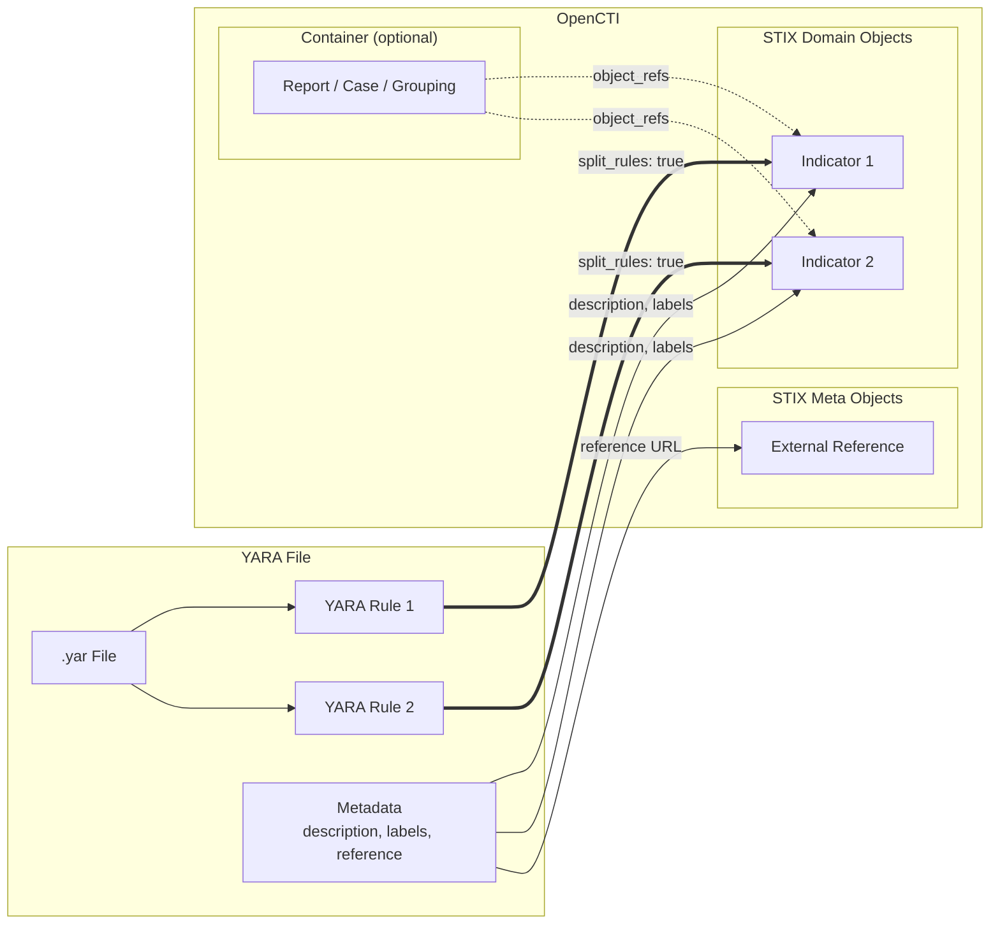
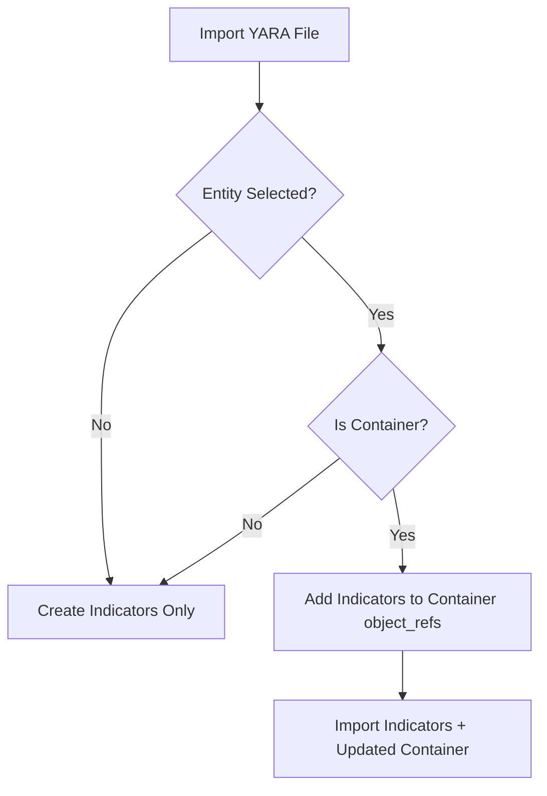

# OpenCTI Import File YARA Connector

| Status    | Date | Comment |
|-----------|------|---------|
| Community | -    | -       |

## Table of Contents

- [OpenCTI Import File YARA Connector](#opencti-import-file-yara-connector)
  - [Introduction](#introduction)
  - [Installation](#installation)
    - [Requirements](#requirements)
  - [Configuration variables](#configuration-variables)
    - [OpenCTI environment variables](#opencti-environment-variables)
    - [Base connector environment variables](#base-connector-environment-variables)
    - [Connector extra parameters environment variables](#connector-extra-parameters-environment-variables)
  - [Deployment](#deployment)
    - [Docker Deployment](#docker-deployment)
    - [Manual Deployment](#manual-deployment)
  - [Usage](#usage)
  - [Behavior](#behavior)
    - [Mapping to OpenCTI entities](#mapping-to-opencti-entities)
    - [YARA metadata extraction](#yara-metadata-extraction)
    - [Contextual import](#contextual-import)
  - [Supported formats](#supported-formats)
  - [Debugging](#debugging)
  - [Additional information](#additional-information)

## Introduction

This connector ingests **YARA rules** into OpenCTI, converting them into STIX Indicators.

[YARA](https://virustotal.github.io/yara/) is a tool used to identify and classify malware samples based on textual or binary patterns. YARA rules are widely used in threat intelligence and incident response to detect malicious files.

As YARA files can contain one or multiple YARA rules, the connector can operate in two modes:

1. **Split Indicator Mode** (`split_rules: true`): Creates individual STIX Indicators for each YARA rule contained in the file. Each rule becomes a separate indicator with its own name and metadata.
2. **Single Indicator Mode** (`split_rules: false`): Combines all YARA rules contained in the file into one STIX Indicator, using the filename as the indicator name.

## Installation

### Requirements

- OpenCTI Platform >= 6.5.0

## Configuration variables

There are a number of configuration options, which are set either in `docker-compose.yml` (for Docker) or in `config.yml` (for manual deployment).

### OpenCTI environment variables

Below are the parameters you'll need to set for OpenCTI:

| Parameter     | config.yml `opencti` | Docker environment variable | Default | Mandatory | Description                                          |
|---------------|----------------------|-----------------------------|---------|-----------|------------------------------------------------------|
| OpenCTI URL   | `url`                | `OPENCTI_URL`               | /       | Yes       | The URL of the OpenCTI platform.                     |
| OpenCTI Token | `token`              | `OPENCTI_TOKEN`             | /       | Yes       | The default admin token set in the OpenCTI platform. |

### Base connector environment variables

Below are the parameters you'll need to set for running the connector properly:

| Parameter                | config.yml `connector`   | Docker environment variable        | Default         | Mandatory | Description                                                                                |
|--------------------------|--------------------------|------------------------------------|-----------------|-----------|--------------------------------------------------------------------------------------------|
| Connector ID             | `id`                     | `CONNECTOR_ID`                     | /               | Yes       | A unique `UUIDv4` identifier for this connector instance.                                  |
| Connector Name           | `name`                   | `CONNECTOR_NAME`                   | ImportFileYARA  | No        | Name of the connector.                                                                     |
| Connector Scope          | `scope`                  | `CONNECTOR_SCOPE`                  | text/yara+plain | Yes       | The MIME type of files this connector handles. Must be `text/yara+plain`.                  |
| Connector Auto           | `auto`                   | `CONNECTOR_AUTO`                   | false           | No        | Enable/disable automatic import of files matching the scope.                               |
| Validate Before Import   | `validate_before_import` | `CONNECTOR_VALIDATE_BEFORE_IMPORT` | true            | No        | If enabled, bundles are sent for validation before import.                                 |
| Confidence Level         | `confidence_level`       | `CONNECTOR_CONFIDENCE_LEVEL`       | 15              | No        | Default confidence level for created indicators (0-100).                                   |
| Log Level                | `log_level`              | `CONNECTOR_LOG_LEVEL`              | info            | No        | Determines the verbosity of the logs. Options are `debug`, `info`, `warn`, or `error`.     |

### Connector extra parameters environment variables

Below are the parameters you'll need to set for the YARA connector:

| Parameter   | config.yml `yara_import_file` | Docker environment variable    | Default | Mandatory | Description                                                                                            |
|-------------|-------------------------------|--------------------------------|---------|-----------|--------------------------------------------------------------------------------------------------------|
| Split Rules | `split_rules`                 | `YARA_IMPORT_FILE_SPLIT_RULES` | true    | No        | If `true`, each YARA rule becomes a separate indicator. If `false`, all rules become one indicator.    |

## Deployment

### Docker Deployment

Before building the Docker container, you need to set the version of pycti in `requirements.txt` equal to whatever version of OpenCTI you're running. Example, `pycti==6.5.0`. If you don't, it will take the latest version, but sometimes the OpenCTI SDK fails to initialize.

Build a Docker Image using the provided `Dockerfile`.

Example:

```shell
# Replace the IMAGE NAME with the appropriate value
docker build . -t [IMAGE NAME]:latest
```

Make sure to replace the environment variables in `docker-compose.yml` with the appropriate configurations for your environment. Then, start the docker container with the provided `docker-compose.yml`.

```shell
docker compose up -d
# -d for detached
```

### Manual Deployment

Create a file `config.yml` based on the provided `config.yml.sample`.

Replace the configuration variables (especially the "**ChangeMe**" variables) with the appropriate configurations for your environment.

Install the required python dependencies (preferably in a virtual environment):

```shell
pip3 install -r requirements.txt
```

Then, start the connector from the `src` directory:

```shell
python3 import-file-yara.py
```

## Usage

This is an **Internal Import File** connector. It processes files uploaded to OpenCTI rather than fetching data from external sources.

To use this connector:

1. Navigate to **Data** → **Import** in the OpenCTI platform
2. Upload a YARA file (`.yar` extension)
3. Select this connector to process the file
4. Optionally, select a container entity (Report, Case, etc.) to associate the imported indicators with

The connector will parse the YARA file and create Indicator entities for each rule (or a single indicator for the entire file, depending on the `split_rules` configuration).

## Behavior

The connector parses YARA files using the `plyara` library and converts each rule (or the entire file) into STIX Indicators.

### Mapping to OpenCTI entities



#### YARA Rule to Indicator mapping

| YARA Element | OpenCTI Indicator Field | Description |
|--------------|-------------------------|-------------|
| Rule content | `pattern` | The complete YARA rule as the indicator pattern |
| Rule name | `name` | Name of the indicator (or filename if `split_rules: false`) |
| `description` metadata | `description` | Description of the indicator |
| `labels` or `tags` metadata | `labels` | Labels applied to the indicator |
| `reference` metadata | `external_references[].url` | External reference URL |
| - | `pattern_type` | Always set to `yara` |
| - | `x_opencti_main_observable_type` | Always set to `StixFile` |
| - | `x_opencti_score` | Always set to `100` |
| - | `confidence` | Set from `CONNECTOR_CONFIDENCE_LEVEL` config |

### YARA metadata extraction

The connector extracts metadata from YARA rules and maps them to indicator properties:

```yara
rule example_rule {
    meta:
        description = "Detects example malware"
        labels = "malware,trojan"
        reference = "https://example.com/analysis"
    strings:
        $a = "malicious_string"
    condition:
        $a
}
```

| Metadata Key | Case Sensitivity | Maps To |
|--------------|------------------|---------|
| `description` | Case-insensitive | Indicator description |
| `labels` | Case-insensitive | Indicator labels (comma-separated) |
| `tags` | Case-insensitive | Indicator labels (alias for `labels`) |
| `reference` | Case-insensitive | External reference URL |

### Contextual import

When importing into a container entity, the connector adds the created indicators to the container's `object_refs`:

| Container Type | STIX Type | Supported |
|----------------|-----------|-----------|
| Report | `report` | Yes |
| Grouping | `grouping` | Yes |
| Observed Data | `observed-data` | Yes |
| Case Incident | `x-opencti-case-incident` | Yes |
| Case RFI | `x-opencti-case-rfi` | Yes |
| Case RFT | `x-opencti-case-rft` | Yes |
| Task | `x-opencti-task` | Yes |
| Feedback | `x-opencti-feedback` | Yes |



## Supported formats

The connector supports **YARA files** with the `.yar` extension (MIME type: `text/yara+plain`).

**Important**: Ensure your files have the `.yar` extension so that they are recognized by the connector.

### Example YARA file

```yara
rule Malware_Example_1 {
    meta:
        description = "Detects Example Malware variant 1"
        labels = "malware,backdoor"
        reference = "https://example.com/report1"
    strings:
        $s1 = "malicious_payload" ascii
        $s2 = { 4D 5A 90 00 }
    condition:
        any of them
}

rule Malware_Example_2 {
    meta:
        description = "Detects Example Malware variant 2"
    strings:
        $hex = { 48 65 6C 6C 6F }
    condition:
        $hex
}
```

With `split_rules: true`, this file would create two indicators: "Malware_Example_1" and "Malware_Example_2".

With `split_rules: false`, this file would create one indicator with the filename as the name.

## Debugging

The connector can be debugged by setting the appropriate log level. Set `CONNECTOR_LOG_LEVEL=debug` for verbose logging.

Note that logging messages can be added using `self.helper.log_debug("Sample message")` or `self.helper.log_info("Sample message")`.

Debug logs will show:
- Number of YARA rules found in the file
- Processing status for each rule name
- Bundle creation and submission status

## Additional information

- The connector uses the **plyara** library to parse and extract YARA rules. This library handles complex YARA syntax including imports, includes, and various string types.
- Each indicator is assigned a deterministic ID using `Indicator.generate_id(pattern)` based on the YARA pattern content, ensuring idempotent imports.
- The `x_opencti_main_observable_type` is always set to `StixFile` since YARA rules are primarily used for file detection.
- The `x_opencti_score` is set to `100` by default, indicating high confidence in the detection capability.
- File markings provided during import are applied to the generated STIX bundle.
- If `validate_before_import` is enabled, the bundle will be sent for validation before being imported.
